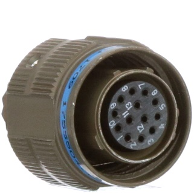

###Z1 - Motor cable and Hiperface DSL (304) {#Z1}
{: style="width:100%;" }   
 
###Z2 - Motor cable and Hiperface DSL (283) {#Z2}
{: style="width:100%;" }   
 
###Z3 - Motor cable and Hiperface DSL CSTA 8p (305) {#Z3}
{: style="width:100%;" }   
 
###Z4 - Motor cable and Hiperface DSL (306) {#Z4}
{: style="width:100%;" }   
 
###Z5 - Motor cable TGZ (226) {#Z5}
{: style="width:100%;" }   
 
###Z6 - Motor cable TGZ (Z6) {#Z6}
{: style="width:100%;" }   
 
###Z7 - Motor cable TGZ CSTA 8p (84) {#Z7}
{: style="width:100%;" }   
 
###Z8 - Motor cable TGZ (21) {#Z8}
{: style="width:100%;" }   
 
###Z9 - Cable ENDAT 2.2 (293) {#Z9}
{: style="width:100%;" }   
 
###Z10 - Cable ENDAT 2.2 ITEC (343) {#Z10}
{: style="width:100%;" }   
 
###Z11 - Cable ENDAT 2.2 (319) {#Z11}
{: style="width:100%;" }   
 
###Z12 - Connection Renishaw (Tonic) - TGZ {#Z12}
{: style="width:100%;" }   
 
###Z13 - Thermistor connection - TGZ {#Z13}
{: style="width:100%;" }   
 
###Z14 - Cable SSI/BISS 5V {#Z14}
{: style="width:100%;" }   
 
###Z15 - Cable SSI/BISS 12V {#Z15}
{: style="width:100%;" }   
 
###Z16 - Cable - free leads SSI/BISS 5V (395) {#Z16}
{: style="width:100%;" }   
 
###Z17 - Motor cable TGZ Boost {#Z17}
{: style="width:100%;" }   
 
###Z18 - External IRC cable {#Z18}
{: style="width:100%;" }    
 
###Z19 - Motor cable TGZ-S-48-50/100-UNI {#Z19}
{: style="width:100%;" }    
 
###Z20 - Feedback cable TGZ-S-48-50/100-UNI {#Z20}
{: style="width:100%;" }    
 

###Z21 - TGZ-S-48-50/100 RI connection with iTEC {#Z21}
{: style="width:100%;" }   

INTERCONTEC 09P_Y    

-   Cable type connector view

    ---
	
	{: style="width:50%;" }

-   Motor type connector view

	---

	{: style="width:50%;" }

	

###Z22 - TGZ-S-48-50/100 RI connection with straight connector / S1 / S2 / S3 / S4 (08p) {#Z22}
{: style="width:100%;" }   

INTERCONTEC BSTA 08p     

-   Cable type connector view

    ---
	
	{: style="width:50%;" }

-   Motor type connector view

	---

	{: style="width:50%;" }

###Z23 - TGZ-S-48-50/100 RI connection with straight connector 1.5 / S4 vel. 1.5 (CSTA 8p) {#Z23}
{: style="width:100%;" }   

INTERCONTEC CSTA 8p     

-   Cable type connector view

    ---
	
	{: style="width:50%;" }

-   Motor type connector view

	---

	{: style="width:50%;" }

###Z24 - TGZ-S-48-50/100 RI connection with Amp TVP00RW-15-05P acc. MIL-DTL-38999 III {#Z24}
{: style="width:100%;" }   

Amphenol TVP00RW-15-05P   

-   Cable type connector view

    ---
	
	{: style="width:50%;" }

-   Motor type connector view

	---

	{: style="width:50%;" }

###Z25 - TGZ-S-48-50/100 RI connection with ITT-Cannon 24-11 {#Z25}
{: style="width:100%;" }   

ITT-Cannon 24-11   

-   Cable type connector view

    ---
	
	{: style="width:50%;" }

-   Motor type connector view

	---

	{: style="width:50%;" }

###Z26 - TGZ-S-48-50/100 RI with BISS {#Z26}
Wiring diagrams for other types of sensors used are available on request directly from the device manufacturer.
Below you can find the wiring diagram for the BISS interface.
The first line of the connector name on the servo amplifier side is assigned to the TGZ-S-48-100/250 and TGZ-S-48-100/300.
The second line of the connector name is assigned to the TGZ-S-48-50/100.   

{: style="width:100%;" }   

TVP00RW-17-06P     

-   Cable type connector view

    ---
	
	{: style="width:50%;" }

-   Motor type connector view

	---

	{: style="width:50%;" }
	

TVP00RW-11-35P      

-   Cable type connector view

    ---
	
	{: style="width:50%;" }

-   Motor type connector view

	---

	{: style="width:50%;" }
	

###Z27 - TGZ-S-48-50/100 RI connection with iTEC {#Z27}
{: style="width:100%;" }   

INTERCONTEC 09P_Y    

-   Cable type connector view

    ---
	
	{: style="width:50%;" }

-   Motor type connector view

	---

	{: style="width:50%;" }
	

###Z28 - TGZ-S-48-50/100 RI connection with straight connector / S1 / S2 / S3 / S4 (08p) {#Z28}
{: style="width:100%;" }   

INTERCONTEC BSTA 08p     

-   Cable type connector view

    ---
	
	{: style="width:50%;" }

-   Motor type connector view

	---

	{: style="width:50%;" }

###Z29 - TGZ-S-48-50/100 RI connection with straight connector 1.5 / S4 vel. 1.5 (CSTA 8p) {#Z29}
{: style="width:100%;" }   

INTERCONTEC CSTA 8p     

-   Cable type connector view

    ---
	
	{: style="width:50%;" }

-   Motor type connector view

	---

	{: style="width:50%;" }

###Z30 - TGZ-S-48-50/100 RI connection with Amp TVP00RW-15-05P according to MIL-DTL-38999 III {#Z30}
{: style="width:100%;" }   

Amphenol TVP00RW-15-05P   

-   Cable connector

    ---
	
	{: style="width:50%;" }

-   Motor type connector view

	---

	{: style="width:50%;" }

###Z31 - TGZ-S-48-50/100 RI connection with ITT-Cannon 24-11 connector {#Z31}
{: style="width:100%;" }   

ITT-Cannon 24-11   

-   Cable connector

    ---
	
	{: style="width:50%;" }

-   Motor type connector view

	---

	{: style="width:50%;" }

###Z32 - TGZ-S-48-50/100 RI with two-cable BISS {#Z32}
Wiring diagrams for other types of sensors used are available upon request directly from the device manufacturer.
Below you will find the wiring diagram for the two-cable interface for BISS.
The first row of the connector name on the servo amplifier side is assigned to TGZ-S-48-100/250 and TGZ-S-48-100/300.
The second row of the connector name is assigned for TGZ-S-48-50/100.   

{: style="width:100%;" }   

TVP00RW-17-06P     

-   Cable connector

    ---
	
	{: style="width:50%;" }

-   Motor type connector view

	---

	{: style="width:50%;" }
	

TVP00RW-11-35P      

-   Cable connector

    ---
	
	{: style="width:50%;" }

-   Motor type connector view

	---

	{: style="width:50%;" }
	

