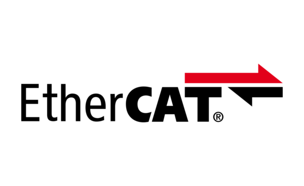
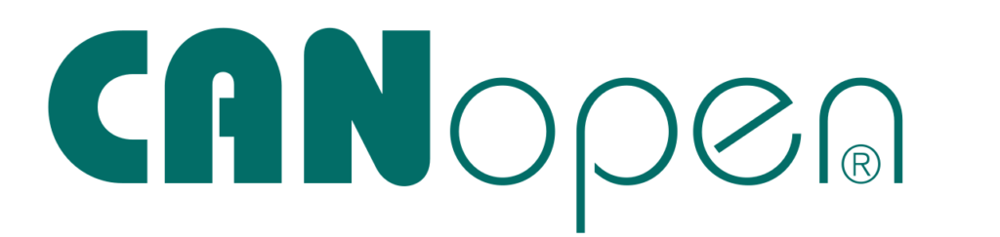

{: style="width:30%;" }
{: style="width:30%;" }   

EtherCAT is a registered trademark and patented technology, licensed by Beckhoff Automation GmbH.   

CANopen and CiA are registered community trademarks of CAN in Automation.   

CODESYS is copyrighted by CODESYS Development GmbH.   

This manual describes the setup of the TGZ drive in the EtherCAT or CANopen network. The TGZ drives must be programmed with the corresponding firmware.
The [TGZ HW user's manual](../../../../CZ/TGZ/TGZ-D-48-13_26/md/mark.md) must be thoroughly read and used before the drive can be used in the EtherCAT or CANopen environment.

The knowledge of the following documents is essential to TGZ programming:

- CANopen application layer and communication profile (CiA 301)
- Device Profile Drives and Motion Control (CiA 402)
- Implementation Directive for CiA402 Drive Profile (ETG.6010)
- EtherCAT Slave Controller – Technology
- EtherCAT Slave Controller – Register Description

TGZ servo drive can be controlled by several field buses and protocols.
This manual describes the servo control by CAN bus using CANopen standard as well as by Ethernet connection using EtherCAT standard with CAN application protocol over EtherCAT (CoE).
The standard drive profile CiA DSP402 is implemented.

!!! note "Note"
	Technical changes that improve the properties of the device may be made without prior notice!