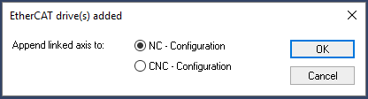
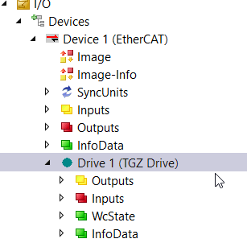
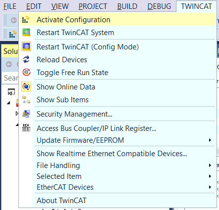
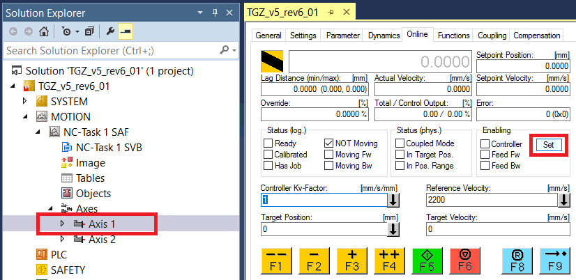
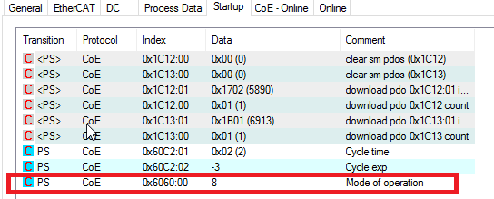

- Use the newest EtherCAT XML file for TGZ and copy it to the TwinCAT folder (`TwinCAT\3.1\Config\Io\EtherCAT`).
- Create a new project\
- Connect TGZ to the EtherCAT network
- Set the D-Mode register of the TGZ servo amplifier to 3 (position mode).
  Do this for the first or both axes (TGZ-D drive version).
  Save the settings if necessary.
- Use the **Scan** command in the context menu of `I/O | Devices`

{: style="width:35%;" }

- Append the drive to the **NC-Configuration**

{: style="width:35%;" }

- Double-click on the **TGZ Drive** entry in the device tree to open the properties window.

{: style="width:35%;" }

- PDOs can be observed and changed in the **Process Data** tab. The image below displays the settings for CST mode.

{: style="width:60%;" }

- When the setup is complete, activate the configuration.

{: style="width:35%;" }

- Use the tree item `MOTION | NC-Task 1 SAF | Axes | Axis 1` to display all axis properties. Select the **Online** tab and then click on the **Set** button.

{: style="width:60%;" }

- Enable all checkboxes by clicking on the **All** button.

{: style="width:25%;" }

- The axis should now be enabled and ready for movement in cyclic synchronous positioning mode (CST). If needed, use the red **F6** button to reset the error and/or the blue **F8** button to reference the axis.
- As described in the chapter [PDO mapping and TGZ drive variants](objects.md#PDO_TGZ), the PDO values are the same for the single and double axis TGZ versions. Therefore, when using the TGZ-S variant in TwinCAT, Axis 2 will not be usable and must be ignored.

##Cyclic Synchronous Velocity (CSV) Mode Setup

- Use the TwinCAT configuration mode
- Activate the **Process Data** tab of the TGZ drive and select the **Cyclic synchronous velocity mode (CSV)** item in the combo box.

{: style="width:60%;" }

- Reconnect the axis data by clicking **Yes** in the following dialog box.

{: style="width:25%;" }

- Activate the **Startup** tab and change the value of the object `0x6060:00` (Mode of operation). Double-click on this item.

{: style="width:50%;" }

- In the following dialog box, change the `Data` value to `09` and click **OK**.

{: style="width:50%;" }

- If necessary, do the same for the second axis (`0x6860:00`).
- Remember to set the appropriate TGZ drive mode (D-Mode register) as described in the chapter [Modes of Operation 0x6060](objects.md#0x6060).
- Activate the configuration and switch to **Run** mode.
  TwinCAT will now use the speed regulator to perform motion.
  Properly setting the regulator parameters is essential for achieving smooth positioning.