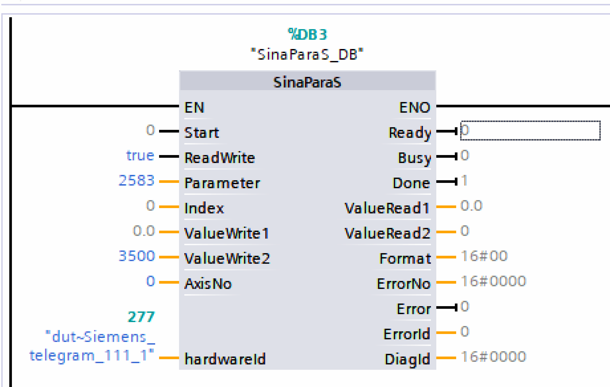

## Telegram assignment

The TGZ drive supports the following telegrams for PROFIdrive communication:

| Telegram number | Description |
|-----------------|-------------|
| 1               | Speed control mode (16-bit) |
| 3               | Speed control mode with actual position (32-bit)  (standard firmware only)|
| 7               | Position control mode (tasks only)|
| 9               | Position control mode (tasks and direct MDI control) |
| 102             | Speed control mode with extended features (PROFIsafe firmware only) |
| 111             | Position control mode with extended features (MDI control)|
| 352             | Speed control mode with extended features |

!!! warning "Warning"
    **The telegrams must be selected using the TGZ_GUI application. After the telegram selection is changed, the TGZ must be restarted. Before restarting the TGZ, make sure that the PLC project already contains the correct telegram selection and that the PLC is running. Otherwise, the drive will not be able to establish communication with the PLC and will not work. This behavior is relevant only when the telegram selection is changed; otherwise, the power-up order of the PLC and TGZ does not matter.**

## Homing modes

The drive must be in the operational state with positioning mode selected (telegram `7`, `9`, or `111`). No task may be active and the drive must be at standstill. The mode is selected by the `Homing_Mode` parameter in the TGZ_GUI application. To initiate a homing procedure, set control word `STW1` bit `11` to one. While the homing procedure is running, status word `ZSW1` bits `10`, `11`, and `13` are set to zero. After successful homing, bits `10`, `11`, and `13` are set to one. If an error occurs during homing, only bit `13` is set. The homing procedure can be aborted by setting `STW1` bit `11` to zero. A successfully completed homing procedure must also be finished by setting `STW1` bit `11` to zero. Only then does the drive return to the basic operational state.

The following homing modes are available:

| Mode no. | Mode description |
|-----|-------|
| 0   | Set the actual position to zero. The actual position is used as the home point reference. |
| 1   | Find limit input. Movement starts in the positive or negative direction until the limit switch is detected. The drive then moves in the reverse direction until the limit switch is no longer active. The actual position is used as the home point. The `Homing_NegLimSwitchMask` and `Homing_PosLimitSwitchMask` parameters are used to select the digital input bit of the limit switch. The sign of the `Homing_Velocity_Direction` parameter determines the homing direction. |
| 2   | Find limit input, then zero angle. Similar to mode 1, but after the home position is set, the motor moves to the zero angle of the feedback. |
| 4   | Find home input. This mode is similar to mode 1, but uses the homing switch as the input (parameter `Homing_ReferenceSwitchMask`). The initial direction is determined by the sign of the `Homing_Velocity_Direction` parameter. The positive and negative switches are also taken into account in the algorithm. |
| 5   | Find home input, then zero angle. Similar to mode 4, after the home position is set, the drive goes to the zero angle of the feedback. |
| 8   | Move to mechanical stop. The drive moves until it encounters a hard stop, causing the position error to be exceeded. The movement then stops and the home position is set. |
| 9   | Move to mechanical stop, then zero angle. Similar to mode 8, but after the home position is set, the motor moves to the zero angle of the feedback. |

## Tasks

The TGZ amplifier allows up to ten tasks to be used in positioning mode. The task numbers are set by the `SATZANW` signal in telegrams `7, 9` or `111`. The task parameters can be set using TGZ_GUI. The target position is always 64 bits (in TGZ units) to allow full value precision. The task mode is either `0` (relative positioning) or `1` (absolute target value). No action is performed for invalid task numbers. Valid values are `0` to `9` (`PD_Task1` to `PD_Task10`). For a detailed description of the task and direct **Manual Data Input (MDI)** mode, see the **PROFIdrive Profile** documentation.

## Jog

The jogging function is supported in both position (telegrams `7, 9, 111`) and speed mode (telegrams `1, 3, 352`). All the jog parameters can be set by the TGZ_GUI application. Two jog setpoints are available by using the control word `STW1` bits `8 and 9`. If both bits are set, the drive either stops in speed mode or does nothing in positioning mode.

When jog is active, the drive operates in speed mode, i.e., the axis moves continuously at the selected jog speed until it is stopped.

The functionality is implemented according to the standard described in the PROFIdrive Profile documentation.

## Fault buffer

TGZ follows the standard PROFIdrive fault buffer mechanism. Since a standard fault buffer
entry is 16 bits wide, but TGZ uses 32-bit fault numbers, each error situation occupies two
consecutive entries in the buffer (PNU 947). The buffer can store up to eight error
situations, forming a 16-entry array (each entry being 2 bytes long).
The parameter index is used to read an error situation. Since each error spans two 16-bit
values, two reads are necessary:

- Even index → lower 16 bits of the error
- Odd index → upper 16 bits of the error

Typically, indexes 0 and 1 are used to retrieve the most recent error.

### Reading faults

PROFIdrive supports multi-register reads, allowing efficient fault retrieval. The SinaPara
function block can be used as follows:

- Set `sxParameter[0].siParaNo = 947` and `sxParameter[1].siParaNo = 947`
(PNU number).
- Set `sxParameter[0].siIndex = 0` and `sxParameter[1].siIndex = 1`.
- Set `ParaNo = 2` (to read two parameters).
- TGZ automatically sets the read format to 16#42 (42h means 16-bit word value).

Alternatively, the SinaParaS function block can be used for a simpler implementation.

### Fault counters

- PNU 944 (Fault Message Counter): Incremented by 2 for each new error situation.
- PNU 952 (Fault Situation Counter): Incremented by 1 per new error.

### Acknowledging Errors

When an error is acknowledged via bit `7` of the control word, the fault buffer shifts down and removes the most recent error.
The fault buffer can be completely cleared by writing zero to parameter `PNU 952`.
For more details, refer to the PROFIdrive Profile Manual.

## Error codes

The error code is copied to the fault buffer when any drive error occurs. The standard PROFIdrive fault buffer mechanism is used. Because the standard PROFIdrive error code is only 16 bits wide and TGZ uses 32-bit errors, each TGZ error is represented by two fault messages containing the full 32-bit error word. Therefore, parameter `947` is organized as 8 fault situations, each containing 2 fault messages. The message with index `0` contains the low 16 bits of the error code and the message with index `1` contains the high 16 bits.

The fault buffer can be completely cleared by writing zero to the parameter `952`.

Telegram `111` contains space for the last active error code, where the `WARN code` field (PZD11) contains the low 16 bits and the `FAULT code` field (PZD10) contains the high 16 bits of the TGZ error code. Similarly, telegram `352` has fields for `WARN (PZD5)` and `FAULT (PZD6)`. These fields are coded in the same way. The TGZ error codes are bit-oriented, i.e., up to 32 error bits are possible, and they are cumulative, i.e., several bits can be set at the same time.

| Bit | Description |
|-----|-------|
| 2  | reserved (internal error) |
| 3  | DC-link overvoltage |
| 4  | DC-link undervoltage |
| 5  | STO diagnostics or safety error |
| 6  | Holding brake error |
| 9  | Motor temperature |
| 11 | Drive temperature |
| 12 | Feedback   |
| 14 | Over speed |
| 15 | Position error (contouring)  |
| 17 | Fieldbus (loss of communication) |
| 19 | Current regulator error |
| 20 | Emergency stop |
| 21 | Driver saturation |
| 22 | Regen power |
| 27 | Invalid parameter |

## Relationship between TGZ coordinates and PROFIdrive values

The TGZ drive uses 64-bit values for position. This value consists of the number of revolutions in the upper 32 bits and the number of increments within one turn in the lower 32 bits.
The PROFIdrive standard uses only 32-bit position values. For this reason, scaling between TGZ and PROFIdrive position values is necessary.
The commanded position value from the PROFIdrive telegram is expanded to 64 bits and then shifted left by 32 minus the number of bits specified in the TGZ settings – Profile generator (PG) value `BitsPerRevol`.
If `BitsPerRevol=20`, the PROFIdrive value is shifted left by 12 bits. This shift has the same effect as multiplying the value by 2^12 (i.e., 4096).
The inverse scaling is performed when sending the actual position value from TGZ to the PROFIdrive controller: the 64-bit TGZ position is shifted right by `32 - BitsPerRevol` (which is the same operation as dividing by 232-BitsPerRevol) and the resulting lower 32 bits are sent in the PROFIdrive telegram.

Velocity values are not scaled because both TGZ and PROFIdrive telegrams use 32-bit values. Therefore, the meaning of the velocity value is the same as in the Profile Generator.
Acceleration and deceleration must be set directly in the TGZ using the TGZ_GUI service program in the PROFIdrive section and can be changed by PROFIdrive telegrams only by using override (percentage) values contained in the respective telegrams.

## Backlash compensation

Firmware from August 2023 or newer implements backlash compensation. The standard parameter `PNU 2583` is used for the backlash value.
The value is stored as a signed 32-bit integer and has the same physical meaning as the commanded or actual position in telegrams `9` or `111`.
To use the backlash compensation, a successful homing procedure must be performed first.

The positive movement direction is defined as movement in which the actual position increments. Likewise, the negative movement direction is defined as movement in which the actual position decrements.
The compensation itself depends on the sign of the backlash value:

- Positive backlash value: when the commanded position moves in the positive direction, the backlash value is added to the commanded position. For negative movement, no value is added to the commanded position.
- Negative backlash value: during negative movement, the backlash value is subtracted from the commanded position, making the result more negative. For positive movement, no value is added to the final commanded position.

The use of positive or negative backlash depends on the chosen homing procedure and its final movement. If homing finishes with negative movement, use the positive backlash, because the mechanical play has already been taken up on the left side. Likewise, choose the negative backlash value when the last homing movement goes in the positive direction.

The backlash value can be set by the PLC only through parameter `PNU 2583`; there is no equivalent parameter in the TGZ register area.
The `SinaParaS` function block can be used in TIA Portal for setting the `PNU 2583`.

{: style="width:50%;" }

The `hardwareId` input is set to the same value as the `HWIDSTW` input of the `SinaPos` block, i.e., the telegram identifier of the TGZ. `AxisNo` can be `0` for the first axis or `1` for the second one.
Because the backlash value is of type `DINT` (signed 32-bit integer), the required backlash value must be written to the `ValueWrite2` input.
The write operation is performed by toggling `Start` from `False` to `True`.

## Speed control mode and normalized values

Telegrams `1`, `3` and `352` are used for speed control mode. These telegrams use normalized speed values in the `N2` or `N4` format.
The setpoint and actual speed are expressed as a percentage of the reference value. The TGZ amplifier uses the nominal speed register named `M-Nn` for this purpose – it must be non-zero; otherwise, speed control mode will not work.
Normalized `N2` or `N4` values in the telegram are in the range from `-200 %` to `200 %` of the reference `M-Nn` value.

The `M-Nn` register can be read by the standard `PNU` parameter `60 000` **Velocity reference value**.
Complete read/write access is possible through direct TGZ parameter access, register numbers are `0x211B` for axis `1` and `0x221B` for axis `2`.
See also the chapter [TGZ registers](#tgz-registers).

!!! note "Note"
    Note that `PNU 60 000` is read as a floating-point value, while direct access to TGZ registers always uses 32-bit integer values.

The internal speed profile generator uses register `PD_Dec` (`0x355F` / `0x365F`) as the acceleration value when changing speed.

## PROFIdrive parameters

The TGZ servo drive supports parameter access through slots 1 and 2 (slot 2 for the variant with two axes only). Three record data object indices can be used to access TGZ parameters:

- `47` – legacy record data. The axis is specified directly in the request header.
- `0xB02E` – local base parameter access. The axis is specified by the slot through which the access is performed.
- `0xB02F` – global base parameter access. The axis is specified directly in the request header.

## Supported standard PROFIdrive PNUs

The TGZ servo drive supports the following standard and mandatory PROFIdrive parameters (PNUs):

| Number | Description | Data type |
|--------|-------------|-----------|
| 922    | Telegram selection | Unsigned16 |
| 930    | Operating mode | Unsigned16 |
| 944    | Fault message counter | Unsigned16 |
| 947    | Fault number | Array of Unsigned16 |
| 964    | Drive unit identification | Structure |
| 965    | Profile identification | Structure |
| 975    | Drive object identification | Structure |

## Reference value PNUs

| Number | Description | Data type | TGZ register name | TGZ register number |
|--------|-------------|-----------|-------------------|---------------------|
| 2000   | Reference speed | Float32 | M-Nn | 0x2118, 0x2218 |
| 2001   | Reference voltage | Float32 | M-Un | 0x2117, 0x2217 |
| 2002   | Reference current | Float32 | M-In | 0x211B, 0x221B |
| 2003   | Reference torque | Float32 | M-Mn | 0x2119, 0x2219 |
| 2007   | Reference acceleration | Float32 | PG-PD_Acc | 0x395E, 0x3A5E |

## Additional PROFIdrive parameters

| Number | Description | Data type |
|--------|-------------|-----------|
| 2583   | Backlash compensation | Signed32 |

Parameter numbers from `2010` to `8191` are reserved for future firmware extensions. PNU 2583 is used for backlash compensation and is unique for each axis.

## TGZ registers

All TGZ registers are accessible as manufacturer-specific PROFIdrive registers, starting from number `0x2000` (`8192` decimal). The list of usable registers can be downloaded from the TG Drives website. Parameters are grouped into categories such as common, motor, drive, profile generator, etc. Groups and parameters within groups are numbered starting from zero. For example, parameter number `0x2119` belongs to group `1` (Motor) with index `25` (`0x19` = `25` decimal).

## PROFINET-related parameters

TGZ parameter names and their corresponding PROFINET names and descriptions:

| TGZ parameter name | PROFINET name | Description | Number for axis 1 | Number for axis 2 |
|--------------------|---------------|-------------|-------------------|-------------------|
| PD_TelegramNumber  | Telegram selection (PNU922) | Selects telegram | 0x2321 | 0x2421 |
| PD_DisplayInfo     | -             | Displays debugging messages on TGZ GUI output | 0x2323 | N/A |
| PD_SetDataCounter  | -             | Counts cyclic PROFINET messages from the I/O controller | 0x2324 | 0x2424 |
| PD_StatusWord_ZSW1 | Status word 1 (ZSW1) | Copy of PROFIdrive status word sent to I/O controller | 0x3500 | 0x3600 |
| PD_ControlWord_STW1| Control word 1 (STW1) | - | 0x3501 | 0x3601 |
| PD_SATZANW         | SATZANW       | Selects traversing block | 0x3503 | 0x3603 |
| PD_AKTSATZ         | AKTSATZ       | Actual traversing block | 0x3504 | 0x3604 |
| PD_State           | State diagram mode | State diagram mode | 0x3505 | 0x3605 |

TGZ supports up to 10 independently usable traversing blocks. Each block includes mode, acceleration, deceleration, velocity, and target position.

## PD_Task1

Parameters for `PD_Task1`:

| Name         | Description              | Number for axis 1 | Number for axis 2 |
|--------------|--------------------------|-------------------|-------------------|
| mod          | Mode (0 – relative, 1 – absolute) | 0x3922 | 0x3A22 |
| acc          | Acceleration             | 0x3923            | 0x3A23            |
| dec          | Deceleration             | 0x3924            | 0x3A24            |
| velocity     | Speed                    | 0x3925            | 0x3A25            |
| tarPosAngle  | Target position – angle  | 0x3926            | 0x3A26            |
| tarPosRevol  | Target position – revolutions | 0x3927         | 0x3A27            |

## PD_Task2 to PD_Task10

Parameters for `PD_Task2` to `PD_Task10` follow similar numbering patterns for axes 1 and 2.
