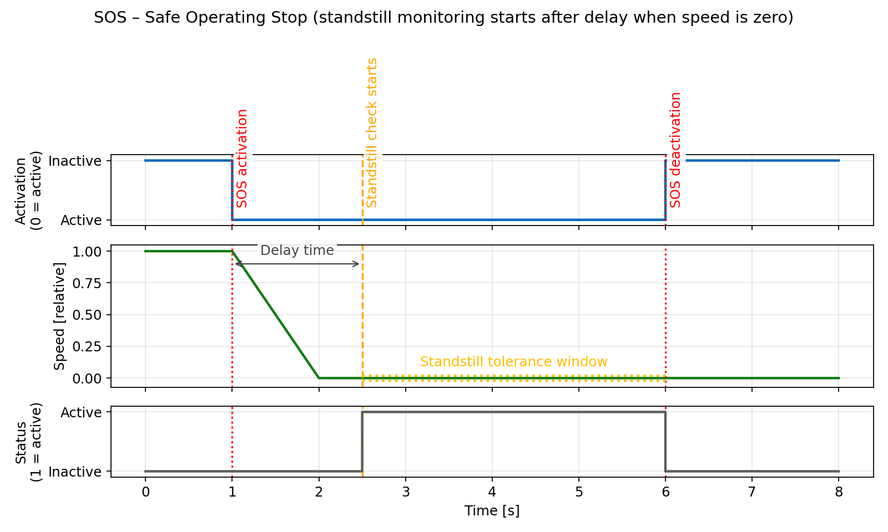
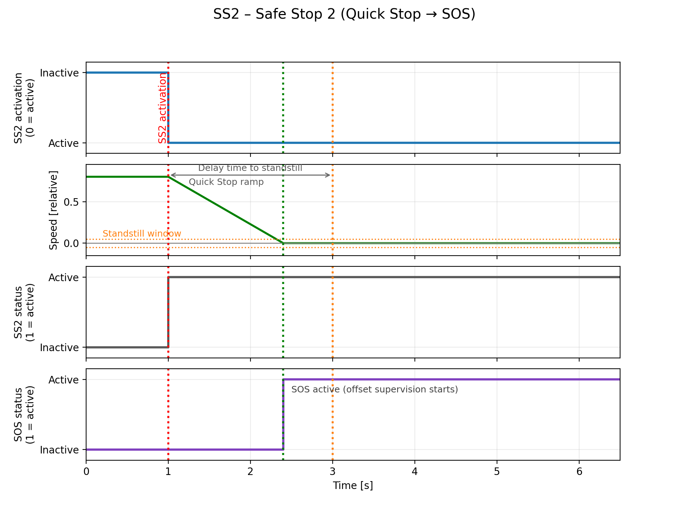
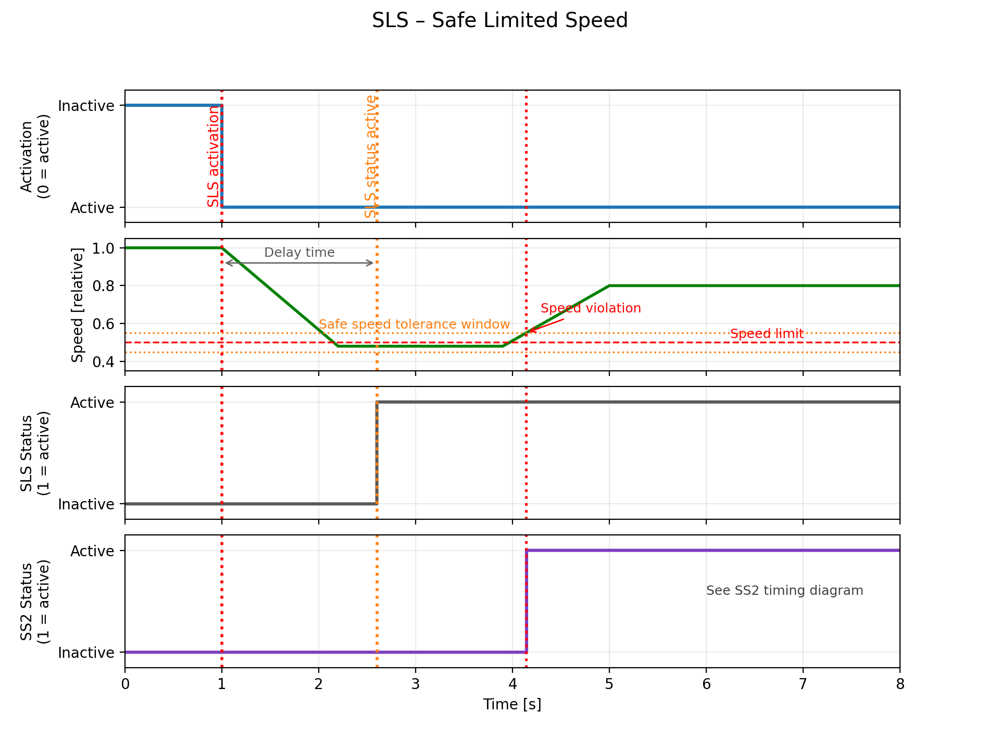
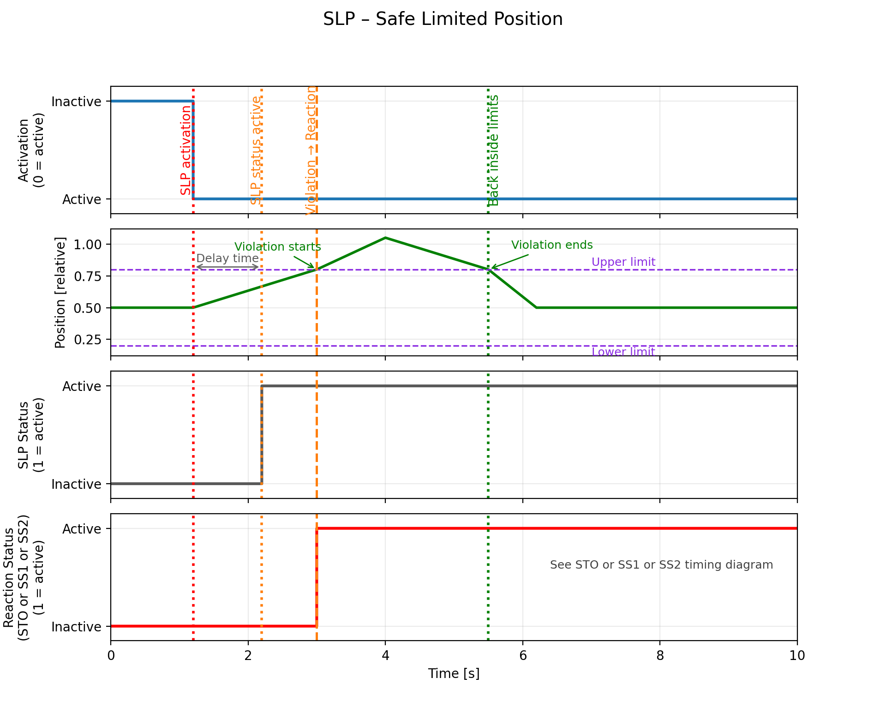

## Available safety functions

|       | Function                              | Category      | PROFIsafe | DI  | Permanent
|-------|---------------------------------------|---------------|-----------|-----|----------
| STO   | Safe torque off                       | Safe stop     | Yes       | Yes | No
| SS1   | Safe stop 1 (time based)              | Safe stop     | Yes       | Yes | No
| SOS   | Safe operating stop                   | Safe stop     | Yes       | Yes | No
| SS2   | Safe stop 2 (deceleration monitoring) | Safe stop     | Yes       | Yes | No
| SLS   | Safe limit speed                      | Safe speed    | Yes       | Yes | Yes
| SLP   | Safe limit position                   | Safe position | Yes       | Yes | Yes

Each safety function can be activated by PROFIsafe, digital inputs (DI) or both. SLS and SLP can be also activated permanently by using the safety parameters.

!!! warning "Warning"
    **The function SLP is fully functional only with a multiturn absolute encoder.**

### PROFIsafe

One or more of the safety functions can be activated. The standard PROFIsafe telegram 902 is used. There is a standard library LdrvSafe_SinaTlg902 available. The telegram 902 allows detailed control of each safety function with additional parameters and also returns a safe axis position together with the time stamp for velocity calculation.

### Digital inputs

Each axis can use two dedicated digital inputs pins for a safety function invoke. Only ONE function can be activated in a time. The selection is done via the safety parameters independently for each axis. The first axis uses digital inputs pins DI 5 and DI 7, the second axis uses DI6 and DI8 pins. Function is active by setting the mentioned pins low. Both inputs (DI5 & 7 or DI6 & 8) must be changed simultaneously within 10 ms. If this time is violated, the safety function is activated forever till restart of the TGZ.

### Permanent safety function selection

Two of the safety functions can be also selected permanently via the safety parameters: Safe limit speed (SLS) and safe limit position (SLP). The SLS can work simultaneously with the PROFIsafe control – fine selection of the limited speed percent value is possible by telegram 902. On the other hand, the permanent SLP uses always the safety position 1 only.

### Active safety function signaling by digital outputs

Digital output pins 3&5 for the first axis or 4&6 can be selected for signaling a selected safety function. Only ONE function can be selected for signaling. The normal digital outputs function is not available in that case. Active safety function is signaled by setting both the outputs low.

## Principle of operation

All safety functions assume that the PLC controller invokes the desired action. The TGZ monitors the speed and/or position and invokes the appropriate safety reaction in the case the conditions are not met. Additionally, when a safety function is selected, the TGZ also activates the wanted action internally (i.e. stops the motion, sets internal position limits, limits the speed, etc.).  
The safety functions monitoring is done in a safety manner by using two independent processors.  
Disabling the power motor output is done in a safety manner by using two independent FPGA circuit breakers connected in a sequence.

## Safe torque off – STO

In addition to already available hardware STO safety function, which has its dedicated input pins, additional STO is available. STO turns off the drive output that powers the motor.

### STO activation

STO can be activated by any of the following inputs or events:

- PROFIsafe STO bit in control word set to zero
- SS1
- SS2 in case of deceleration or standstill speed monitor fail
- SOS in case of standstill speed monitor fail
- SLS in case of speed threshold violation
- SLP in case of position range overflow/underflow and when the SLP’s stop function is set to STO
- Digital inputs (5&7 – axis 1, 6&8 – axis 2) set to low if mapped by the safety parameters

### STO signaling

STO active status can be evaluated by:

- PROFIsafe status bit STO set to logical one
- Digital outputs (3&5 – axis 1, 4&6 – axis 2) set to low if mapped by the safety parameters

### STO sequence

When the STO is activated the following actions are done simultaneously:

- Output driver power stage is set to zero
- The axis is disabled (software disable) and its PROFIdrive state goes to S1 – Switching On Inhibited.
- The motor velocity goes to zero and the motor cannot be started accidentally.

!!! warning "Warning"
    **After the energy feed has been disconnected (STO active) the motor can undesirably move (e.g. the motor can coast down), therefore presenting risk to persons.**

### STO restart (deactivation)

- Deselect the function by PROFIsafe control word bit STO to logical 1 and/or by settings both mapped digital inputs to high level.
- Enable the axis by PROFIdrive control word (i.e. traverse through PROFIdrive state diagram from S1 to S4).

### STO timing

{: style="width:100%;" }

## SS1 – time based safe stop

Definition according to EN 61800-5-2:

> "The function SS1 brakes the motor and trips the function STO after a delay time."

In other words the drive decelerates once SS1 has been selected, and goes into the STO state once the delay time has expired. The STO state is always selected after the timeout regardless the axis is still moving or not.

### SS1 activation

The SS1 function can be activated by any of the following events:

- PROFIsafe SS1 bit in the control word set to zero
- SLP in case of position range overflow/underflow and when the SLP’s stop function is set to SS1
- Digital inputs (5&7 – axis 1, 6&8 – axis 2) set to low if mapped by the safety parameters

### SS1 signaling

STO active status can be evaluated by:

- PROFIsafe status bit SS1 set to logical one
- Digital outputs (3&5 – axis 1, 4&6 – axis 2) set to low if mapped by the safety parameters

### SS1 sequence

1. The SS1 is selected either by bit SS1 to low in PROFIsafe control word or by digital inputs (if mapped) to low level.
2. The TGZ stops the movement with the deceleration specified in the safety parameters.
3. After fixed time (also specified in the safety parameters) the STO is activated, even if the axis is still moving.

!!! warning "Warning"
    **After the energy feed has been disconnected (STO active) the motor can undesirably move (e.g. the motor can coast down), therefore presenting risk to persons.**

### SS1 restart (deactivation)

- Deselect the function by PROFIsafe control word bit SS1 to logical 1 and/or by settings both mapped digital inputs to high level.
- Enable the axis by PROFIdrive control word (i.e. traverse through PROFIdrive state diagram from S1 to S4).

### SS1 timing

{: style="width:100%;" }

## SOS – safe operating stop

Definition according to EN 61800-5-2:

> "This SOS function is used for safe monitoring of the standstill position of a drive."

!!! note "Note"
    Contrary to SS1 and SS2, SOS does not automatically brake the drive. It only monitors the standstill position. This means that the PLC must ensure that the drive is stopped before activating the SOS function.

The motor remains under power and the drive is in the enabled state. The SOS function is activated when the motor is not in the standstill position after the timeout has elapsed. The standstill check is done by the **standstill tolerance window safe parameter**.

### SOS activation

The SOS function can be activated by any of the following events:

- PROFIsafe SOS bit in the control word set to zero
- SLP in case of position range overflow/underflow and when the SLP’s stop function is set to SOS
- Digital inputs (5&7 – axis 1, 6&8 – axis 2) set to low if mapped by the safety parameters

### SOS signaling

STO active status can be evaluated by:

- PROFIsafe status bit SOS set to logical one
- Digital outputs (3&5 – axis 1, 4&6 – axis 2) set to low if mapped by the safety parameters

### SOS sequence

1. The SOS is selected either by bit SOS to low in PROFIsafe control word or by digital inputs (if mapped) to low level.
2. The TGZ waits for the timeout to elapse. During this time the motor must be stopped by the PLC.
3. After the timeout, the TGZ checks if the motor is in standstill. If not, the **STO** function is activated.

### SOS restart (deactivation)

- Deselect the function by PROFIsafe control word bit SOS to logical 1 and/or by settings both mapped digital inputs to high level.
- If the STO function is activated, the axis must be enabled by PROFIdrive control word (i.e. traverse through PROFIdrive state diagram from S1 to S4).

### SOS timing

{: style="width:100%;" }

## SS2 – safe stop with deceleration monitoring

Definition according to EN 61800-5-2:

> "The function SS2 brakes the motor, monitors the magnitude of the motor deceleration, and after a delay time, initiates the SOS function."

In other words the drive decelerates once SS2 has been selected, and goes into the SOS state if the deceleration monitoring has failed. After the timeout the SS2 function checks if the motor is in standstill. If not, the SOS function is activated. The standstill check is done by the **standstill tolerance window safe parameter**.

### SS2 activation

The SS2 function can be activated by any of the following events:

- PROFIsafe SS2 bit in the control word set to zero
- SLP in case of position range overflow/underflow and when the SLP’s stop function is set to SS2
- Digital inputs (5&7 – axis 1, 6&8 – axis 2) set to low if mapped by the safety parameters

### SS2 signaling

STO active status can be evaluated by:

- PROFIsafe status bit SS2 set to logical one
- Digital outputs (3&5 – axis 1, 4&6 – axis 2) set to low if mapped by the safety parameters

### SS2 sequence

1. The SS2 is selected either by bit SS2 to low in PROFIsafe control word or by digital inputs (if mapped) to low level.
2. The TGZ stops the movement with the deceleration specified in the safety parameters.
3. When the timeout elapses or the motor is in standstill, continuous check of the the zero speed is activated (SOS function).
4. If the motor is not in standstill, the **STO** function is activated.

### SS2 restart (deactivation)

- Deselect the function by PROFIsafe control word bit SS2 to logical 1 and/or by settings both mapped digital inputs to high level.
- If the STO function is activated, the axis must be enabled by PROFIdrive control word (i.e. traverse through PROFIdrive state diagram from S1 to S4).

### SS2 timing

{: style="width:100%;" }

{: style="width:100%;" }

## SLS – Safe Limited Speed

Definition according to EN 61800-5-2:

> "The SLS function prevents the motor from exceeding the specified speed limit."

### SLS activation

The SLS function can be activated by any of the following events:

- PROFIsafe SLS bit in the control word set to zero
- Digital inputs (5&7 – axis 1, 6&8 – axis 2) set to low if mapped by the safety parameters
- Permanent activation via safety parameters

### SLS signaling

SLS active status can be evaluated by:

- PROFIsafe status bit SLS set to logical one
- Digital outputs (3&5 – axis 1, 4&6 – axis 2) set to low if mapped by the safety parameters

### SLS sequence

1. The SLS is selected either by PROFIsafe control word or by digital inputs (if mapped) or permanently via safety parameters.
2. The TGZ monitors the motor speed.
3. If the speed exceeds the base limit speed (defined in pg_inc/s), the TGZ initiates a safety reaction.
4. The reaction depends on the configuration and may activate STO.
5. PROFIsafe telegram 902 allows selection of second and third speed levels (as % of base speed), which must be lower than 100%.

**Used safety parameters:**

- Delay time [ms]
- Base limit speed [pg_inc/s]
- Deceleration [pg_inc²/s]
- Second, third and fourth speed level [% of base] (via PROFIsafe only)

### SLS restart (deactivation)

- Deselect the function by PROFIsafe control word bit SLS to logical 1 and/or by setting both mapped digital inputs to high level.
- If STO was activated, enable the axis by PROFIdrive control word (i.e. traverse through PROFIdrive state diagram from S1 to S4).

### SLS timing

{: style="width:100%;" }

## SLP – Safe Limited Position

Definition according to EN 61800-5-2:

> "The SLP function prevents the motor from exceeding the specified position limits."

### SLP activation

The SLP function can be activated by any of the following events:

- PROFIsafe SLP bit in the control word set to zero
- Digital inputs (5&7 – axis 1, 6&8 – axis 2) set to low if mapped by the safety parameters
- Permanent activation via safety parameters

### SLP signaling

SLP active status can be evaluated by:

- PROFIsafe status bit SLP set to logical one
- Digital outputs (3&5 – axis 1, 4&6 – axis 2) set to low if mapped by the safety parameters

### SLP sequence

1. The SLP is selected either by PROFIsafe control word or by digital inputs (if mapped) or permanently via safety parameters.
2. The TGZ monitors the motor position.
3. If the position exceeds the configured limits, the selected safety reaction is triggered.
4. The reaction can be configured to activate STO, SS1, or SS2.

**Used safety parameters:**

- Upper and lower limits for safety position 1 [pg_inc]
- Upper and lower limits for safety position 2 [pg_inc]
- Stop function selection: STO, SS1, or SS2

### SLP restart (deactivation)

- Deselect the function by PROFIsafe control word bit SLP to logical 1 and/or by setting both mapped digital inputs to high level.
- If STO was activated, enable the axis by PROFIdrive control word (i.e. traverse through PROFIdrive state diagram from S1 to S4).

### SLP timing

{: style="width:100%;" }
