## Available safety functions

|       | Function            | Category      | PROFIsafe | DI  | Permanent
|-------|---------------------|---------------|-----------|-----|----------
| STO   | Safe torque off     | Safe stop     | Yes       | Yes | No
| SS1   | Safe stop 1         | Safe stop     | Yes       | Yes | No
| SOS   | Safe operating stop | Safe stop     | Yes       | Yes | No
| SS2   | Safe stop 2         | Safe stop     | Yes       | Yes | No
| SLS   | Safe limit speed    | Safe speed    | Yes       | Yes | Yes
| SLP   | Safe limit position | Safe position | Yes       | Yes | Yes
| SDI   | Safe direction      | Safe speed    | Yes       | No  | No
| SSM   | Safe speed monitor  | Safe speed    | Yes       | No  | Yes

Some of the safety functions can be activated by PROFIsafe, digital inputs (DI) or both (see the table). SLS and SLP can be also activated permanently by using the safety parameters.

!!! warning "Warning"
    **The function SLP is fully functional only with a multiturn absolute encoder.**

!!! warning "Warning"
    **All the safety functions are enabled by default. It means that no motion can be established unless the safety functions are properly configured and the F-Host is connected and working.**

### PROFIsafe

One or more of the safety functions can be activated. The standard PROFIsafe telegram 31 is used. There is a standard library LdrvSafe_SinaTlg31 available. The telegram 31 allows detailed control of each safety function with additional parameters and returns a safety status of actually active functions.

### Digital inputs

Each axis can use two dedicated digital inputs pins for a safety function invoke. Only ONE function can be activated in a time. The selection is done via the safety parameters independently for each axis. The first axis uses digital inputs pins DI 5 and DI 7, the second axis uses DI6 and DI8 pins. Function is active by setting the mentioned pins low. Both inputs (DI5 & 7 or DI6 & 8) must be changed simultaneously within 10 ms. If this time is violated, the safety function is activated forever till restart of the TGZ.

### Permanent safety function selection

Two of the safety functions can be also selected permanently via the safety parameters: Safe limit speed (SLS) and safe limit position (SLP). The SLS can work simultaneously with the PROFIsafe control – selection of up to four different limited speed percent values is possible by telegram 31. On the other hand, the permanent SLP activated by DI uses always the safety position 1 only.

### Active safety function signaling by digital outputs

Digital output pins 3&5 for the first axis or 4&6 can be selected for signaling a selected safety function. Only ONE function can be selected for signaling. The normal digital outputs function is not available in that case. Active safety function is signaled by setting both the outputs low.

## Principle of operation

All safety functions assume that the PLC controller invokes the desired action. The TGZ monitors the speed and/or position and invokes the appropriate safety reaction in the case the conditions are not met. Additionally, when a safety function is selected, the TGZ also activates the wanted stop action internally. Additionally the TGZ can activate speed and/or position limit, but this functionality is out of the safety scope.
The safety functions monitoring is done in a safety manner by using two independent processors.  
Disabling the power motor output is done in a safety manner by using two independent FPGA circuit breakers connected in a sequence.

> Any safety event is signaled by INTERNAL_EVENT bit in the PROFIsafe status word. The specific event is signaled by the PROFIsafe status bits and/or digital outputs (if mapped). The safety event must be acknowledged by toggling INTERNAL_EVENT_ACK bit in the control word to logical 1 and then back to logical 0.

## Safe torque off – STO

In addition to already available hardware STO safety function, which has its dedicated input pins, additional STO is available. STO turns off the drive output that powers the motor.

### STO activation

STO can be activated by any of the following inputs or events:

- PROFIsafe STO bit in control word set to zero
- SS1
- SS2 in case of standstill speed monitor fail
- SOS in case of standstill speed monitor fail
- SLS in case of speed threshold violation
- SLP in case of position range overflow/underflow and when the SLP’s stop function is set to STO
- SDI in case of direction violation
- Digital inputs (5&7 – axis 1, 6&8 – axis 2) set to low if mapped by the safety parameters

### STO signaling

STO active status can be evaluated by:

- PROFIsafe status bit STO set to logical one
- Digital outputs (3&5 – axis 1, 4&6 – axis 2) set to low if mapped by the safety parameters

### STO sequence

When the STO is activated the following actions are done simultaneously:

- Output driver power stage is set to zero
- The axis is disabled (software disable) and its PROFIdrive state goes to S1 – Switching On Inhibited.
- The motor velocity goes to zero and the motor cannot be started accidentally.

!!! warning "Warning"
    **After the energy feed has been disconnected (STO active) the motor can undesirably move (e.g. the motor can coast down), therefore presenting risk to persons.**

### STO restart (deactivation)

- Deselect the function by PROFIsafe control word bit STO to logical 1 and/or by settings both mapped digital inputs to high level.
- Acknowledge the safety event by toggling INTERNAL_EVENT_ACK bit in the PROFIsafe control word to logical 1 and then back to logical 0.
- Enable the axis by PROFIdrive control word (i.e. traverse through PROFIdrive state diagram from S1 to S4).

### STO timing

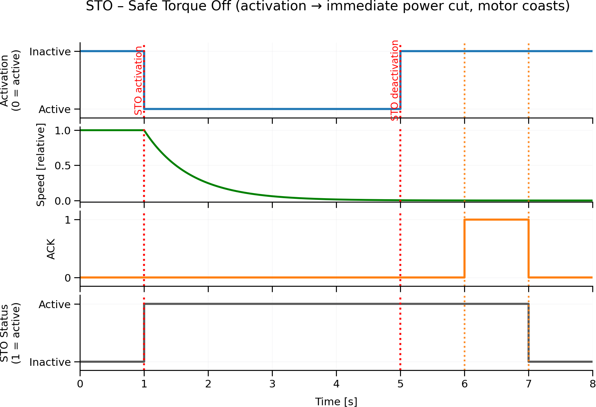{: style="width:100%;" }

## SS1 – time based safe stop

Definition according to EN 61800-5-2:

> "The function SS1 brakes the motor and trips the function STO after a delay time."

In other words the drive decelerates once SS1 has been selected, and goes into the STO state once the delay time has expired. The STO state is always selected after the timeout regardless the axis is still moving or not.

### SS1 activation

The SS1 function can be activated by any of the following events:

- PROFIsafe SS1 bit in the control word set to zero
- SLP in case of position range overflow/underflow and when the SLP’s stop function is set to SS1
- Digital inputs (5&7 – axis 1, 6&8 – axis 2) set to low if mapped by the safety parameters

### SS1 signaling

STO active status can be evaluated by:

- PROFIsafe status bit SS1 set to logical one
- Digital outputs (3&5 – axis 1, 4&6 – axis 2) set to low if mapped by the safety parameters

### SS1 sequence

1. The SS1 is selected either by bit SS1 to low in PROFIsafe control word or by digital inputs (if mapped) to low level.
2. The TGZ stops the movement with the deceleration specified in the safety parameters.
3. After fixed time (also specified in the safety parameters) the STO is activated, even if the axis is still moving.

!!! warning "Warning"
    **After the energy feed has been disconnected (STO active) the motor can undesirably move (e.g. the motor can coast down), therefore presenting risk to persons.**

### SS1 restart (deactivation)

- Deselect the function by PROFIsafe control word bit SS1 to logical 1 and/or by settings both mapped digital inputs to high level.
- Acknowledge the safety event by toggling INTERNAL_EVENT_ACK bit in the PROFIsafe control word to logical 1 and then back to logical 0.
- Enable the axis by PROFIdrive control word (i.e. traverse through PROFIdrive state diagram from S1 to S4).

### SS1 timing

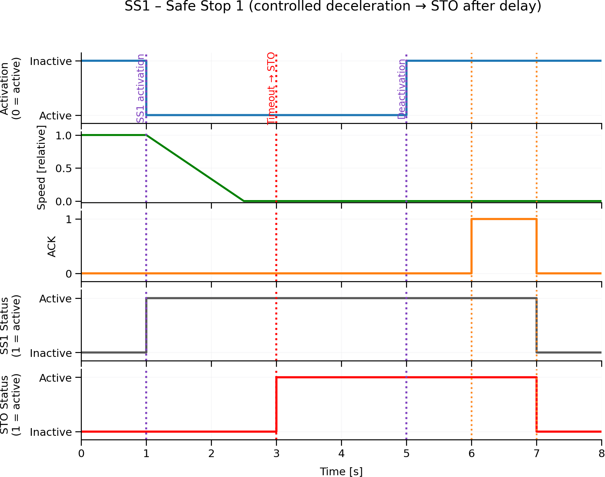{: style="width:100%;" }

## SOS – safe operating stop

Definition according to EN 61800-5-2:

> "The SOS function is used for safe monitoring of the standstill position of a drive."

!!! note "Note"
    Contrary to SS1 and SS2, SOS does not automatically brake the drive. It only monitors the standstill position. This means that the PLC must ensure that the drive is stopped before activating the SOS function.

The motor remains under power and the drive is in the enabled state. The SOS function is activated when the motor is not in the standstill position after the timeout has elapsed. The standstill check is done by the **standstill tolerance window safe parameter**.

### SOS activation

The SOS function can be activated by any of the following events:

- PROFIsafe SOS bit in the control word set to zero
- SLP in case of position range overflow/underflow and when the SLP’s stop function is set to SOS
- Digital inputs (5&7 – axis 1, 6&8 – axis 2) set to low if mapped by the safety parameters

### SOS signaling

STO active status can be evaluated by:

- PROFIsafe status bit SOS set to logical one
- Digital outputs (3&5 – axis 1, 4&6 – axis 2) set to low if mapped by the safety parameters

### SOS sequence

1. The SOS is selected either by bit SOS to low in PROFIsafe control word or by digital inputs (if mapped) to low level.
2. The TGZ waits for the timeout to elapse. During this time the motor must be stopped by the PLC.
3. After the timeout, the TGZ checks if the motor is in standstill. If not, the **STO** function is activated.

### SOS restart (deactivation)

- Deselect the function by PROFIsafe control word bit SOS to logical 1 and/or by settings both mapped digital inputs to high level.
- Acknowledge the safety event by toggling INTERNAL_EVENT_ACK bit in the PROFIsafe control word to logical 1 and then back to logical 0.
- If the STO function is activated, the axis must be enabled by PROFIdrive control word (i.e. traverse through PROFIdrive state diagram from S1 to S4).

### SOS timing

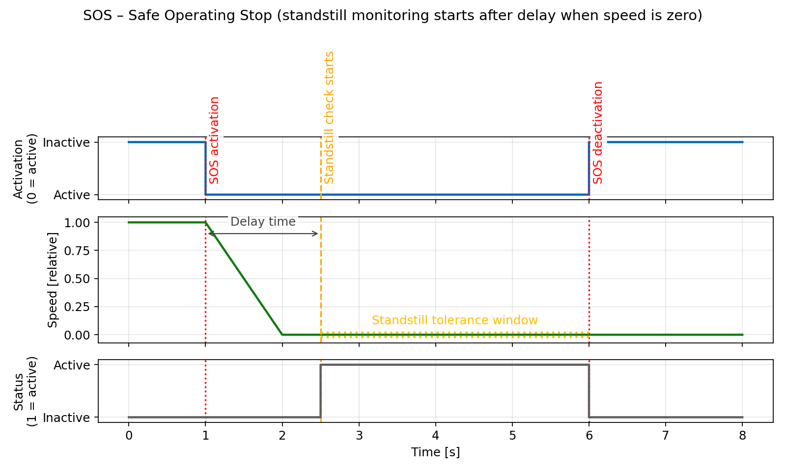{: style="width:100%;" }

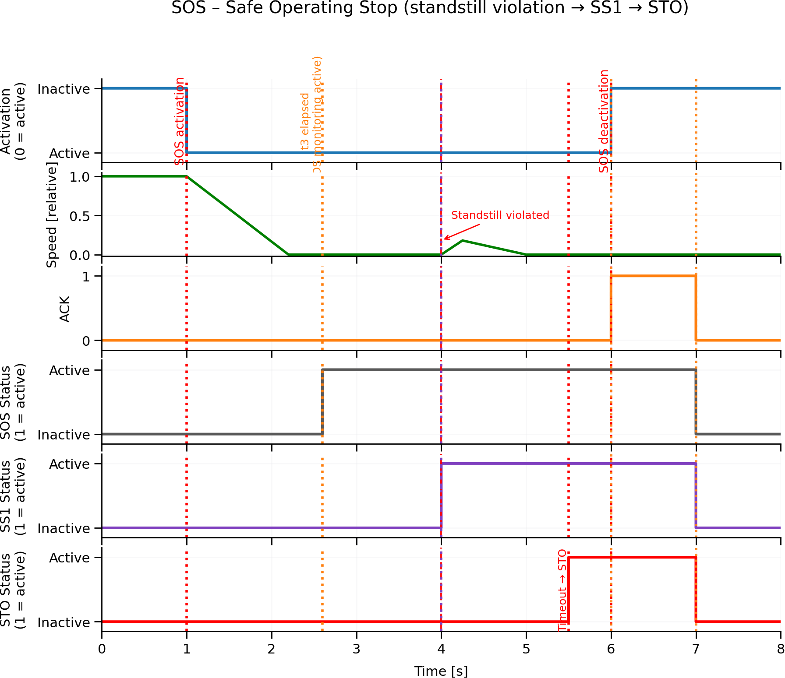{: style="width:100%;" }

## SS2 – safe stop 2

Definition according to EN 61800-5-2:

> "The function SS2 brakes the motor and after a delay time, initiates the SOS function."

In other words the drive decelerates once SS2 has been selected and after the timeout checks if the motor is in standstill (SOS).

### SS2 activation

The SS2 function can be activated by any of the following events:

- PROFIsafe SS2 bit in the control word set to zero
- SLP in case of position range overflow/underflow and when the SLP’s stop function is set to SS2
- Digital inputs (5&7 – axis 1, 6&8 – axis 2) set to low if mapped by the safety parameters

### SS2 signaling

STO active status can be evaluated by:

- PROFIsafe status bit SS2 set to logical one
- Digital outputs (3&5 – axis 1, 4&6 – axis 2) set to low if mapped by the safety parameters

### SS2 sequence

1. The SS2 is selected either by bit SS2 to low in PROFIsafe control word or by digital inputs (if mapped) to low level.
2. The TGZ stops the movement with the deceleration specified in the safety parameters.
3. When the timeout elapses or the motor is in standstill, continuous check of the the zero speed is activated (SOS function).
4. If the motor is not in standstill, the **STO** function is activated.

### SS2 restart (deactivation)

- Deselect the function by PROFIsafe control word bit SS2 to logical 1 and/or by settings both mapped digital inputs to high level.
- Acknowledge the safety event by toggling INTERNAL_EVENT_ACK bit in the PROFIsafe control word to logical 1 and then back to logical 0.
- If the STO function is activated, the axis must be enabled by PROFIdrive control word (i.e. traverse through PROFIdrive state diagram from S1 to S4).

### SS2 timing

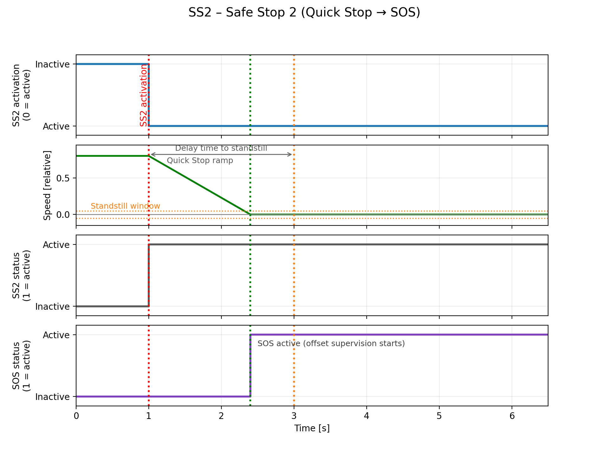{: style="width:100%;" }

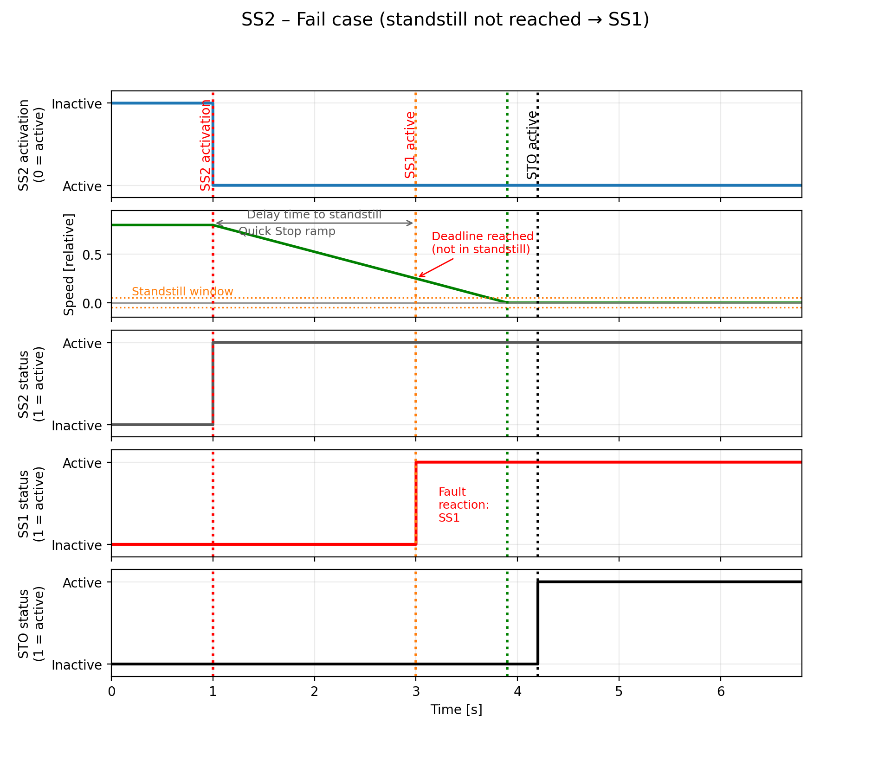{: style="width:100%;" }

## SLS – Safe Limited Speed

Definition according to EN 61800-5-2:

> "The SLS function prevents the motor from exceeding the specified speed limit."

### SLS activation

The SLS function can be activated by any of the following events:

- PROFIsafe SLS bit in the control word set to zero
- Digital inputs (5&7 – axis 1, 6&8 – axis 2) set to low if mapped by the safety parameters
- Permanent activation via safety parameters

### SLS signaling

SLS active status can be evaluated by:

- PROFIsafe status bit SLS set to logical one
- Digital outputs (3&5 – axis 1, 4&6 – axis 2) set to low if mapped by the safety parameters

### SLS sequence

1. The SLS is selected either by PROFIsafe control word or by digital inputs (if mapped) or permanently via safety parameters.
2. The TGZ monitors the motor speed after a specified time delay.
3. If the speed exceeds the base limit speed (defined in pd_inc/s), the TGZ initiates a safety reaction.
4. The reaction is sequence of **SS2**, **SS1**, **STO**.
5. PROFIsafe telegram 31 allows selection of second and third speed levels (as % of base speed), which must be lower than 100%.
6. If the lower speed limit is selected, another time delay is applied before the speed check.
7. If the higher speed limit is selected, the check is done immediately without any delay.

**Used safety parameters:**

- Delay time [ms]
- Base limit speed [pd_inc/s]
- Deceleration [pd_inc²/s]
- Second, third and fourth speed level (selection via PROFIsafe only)

### SLS restart (deactivation)

- Deselect the function by PROFIsafe control word bit SLS to logical 1 and/or by setting both mapped digital inputs to high level.
- Acknowledge the safety event by toggling INTERNAL_EVENT_ACK bit in the PROFIsafe control word to logical 1 and then back to logical 0.
- If STO was activated, enable the axis by PROFIdrive control word (i.e. traverse through PROFIdrive state diagram from S1 to S4).

### SLS timing

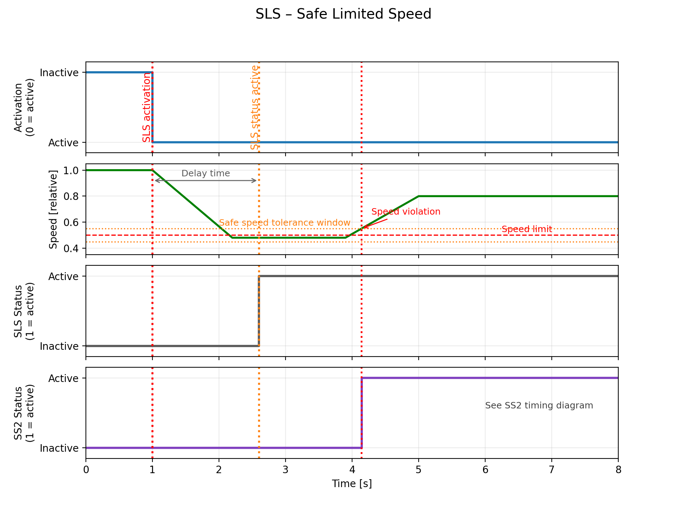{: style="width:100%;" }

## SLP – Safe Limited Position

Definition according to EN 61800-5-2:

> "The SLP function prevents the motor from exceeding the specified position limits."

### SLP activation

The SLP function can be activated by any of the following events:

- PROFIsafe SLP bit in the control word set to zero
- Digital inputs (5&7 – axis 1, 6&8 – axis 2) set to low if mapped by the safety parameters
- Permanent activation via safety parameters

### SLP signaling

SLP active status can be evaluated by:

- PROFIsafe status bit SLP set to logical one
- Digital outputs (3&5 – axis 1, 4&6 – axis 2) set to low if mapped by the safety parameters

### SLP sequence

1. The SLP is selected either by PROFIsafe control word or by digital inputs (if mapped) or permanently via safety parameters.
2. The TGZ monitors the motor position.
3. If the position exceeds the configured limits, the selected safety reaction is triggered.
4. The reaction sequence is defined by the safety parameters and can be either **SS1** or **STO**.

**Used safety parameters:**

- Delay time [ms]
- Upper and lower limits for safety position 1 [pd_inc]
- Upper and lower limits for safety position 2 [pd_inc]
- Stop function selection: STO or SS1

### SLP restart (deactivation)

- Deselect the function by PROFIsafe control word bit SLP to logical 1 and/or by setting both mapped digital inputs to high level.
- Acknowledge the safety event by toggling INTERNAL_EVENT_ACK bit in the PROFIsafe control word to logical 1 and then back to logical 0.
- If STO was activated, enable the axis by PROFIdrive control word (i.e. traverse through PROFIdrive state diagram from S1 to S4).

### SLP timing

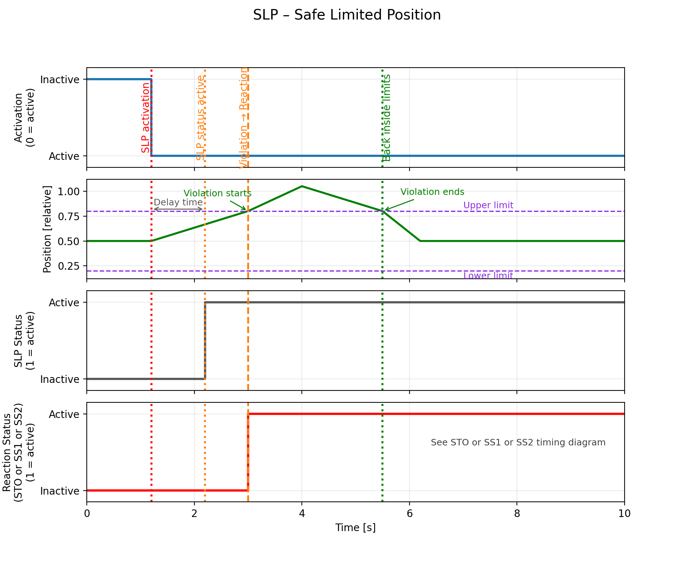{: style="width:100%;" }

> **SS2** reaction is not yet implemented

## SDI – Safe Direction

> "The SDI function monitors the direction of rotation of the motor and prevents it from rotating in the forbidden direction."

### SDI activation

The SDI function can be activated by PROFIsafe control word only. There are two options for the direction monitoring: SDI+ and SDI-. If SDI+ is selected, the allowed direction is positive and the forbidden direction is negative. If SDI- is selected, the allowed direction is negative and the forbidden direction is positive.

### SDI signaling

SDI active status can be evaluated by PROFIsafe status bit SDI+ / SDI- set to logical one. Digital outputs cannot be used for SDI signaling.

### SDI sequence

1. The SDI is selected by PROFIsafe control word bit SDI+ or SDI- to low.
2. The TGZ monitors the motor direction after a specified time delay. Direction is evaluated from the sign of the safe speed value; small fluctuations around zero are tolerated within the standstill window (see timing diagram).
3. If the motor rotates in the forbidden direction, the TGZ initiates a safety reaction **SS2**.
4. Only one direction monitoring (SDI+ or SDI-) can be active at the same time. SDI+ has higher priority than SDI-.

**Used safety parameters:**

- Delay time [ms]

### SDI restart (deactivation)

- Deselect the function by PROFIsafe control word bit SDI+ or SDI- to logical 1.
- Acknowledge the safety event by toggling INTERNAL_EVENT_ACK bit in the PROFIsafe control word to logical 1 and then back to logical 0.
- If STO (as result of SS2) was activated, enable the axis by PROFIdrive control word (i.e. traverse through PROFIdrive state diagram from S1 to S4).

### SDI timing

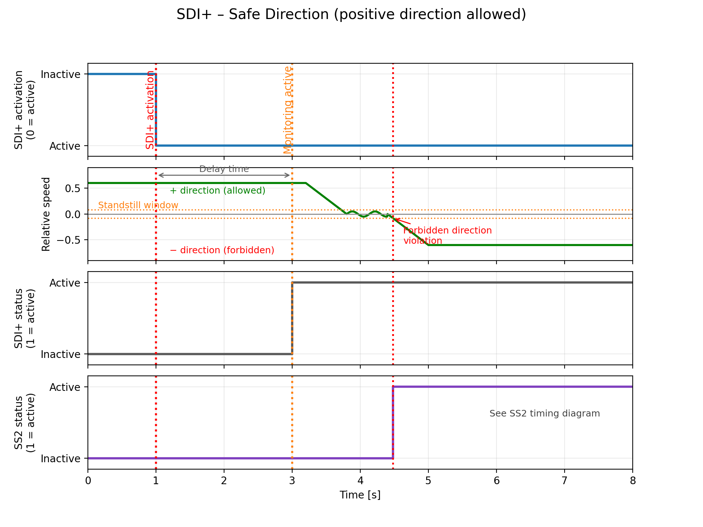{: style="width:100%;" }

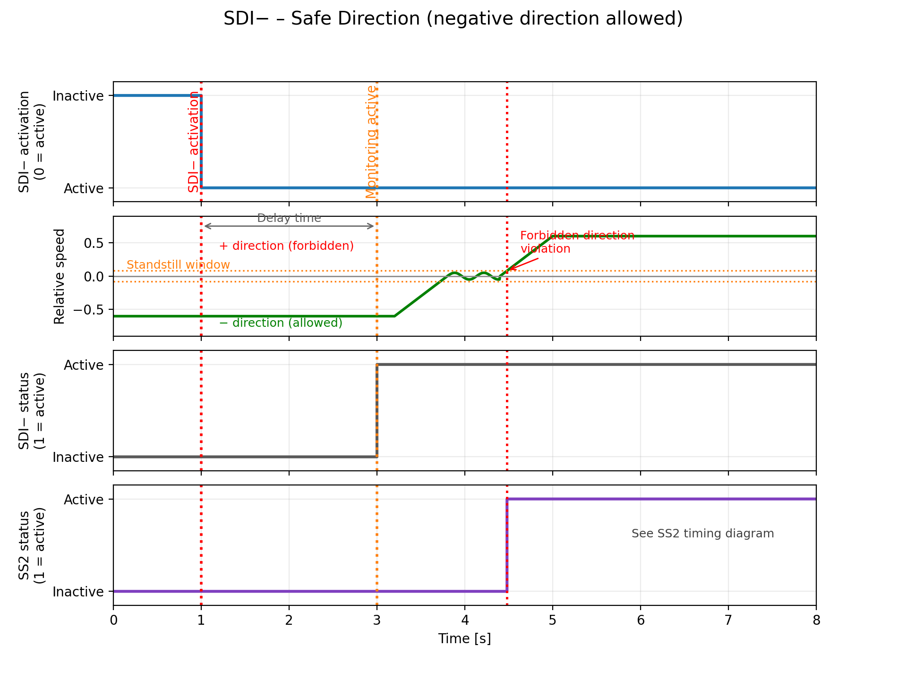{: style="width:100%;" }

## SSM – Safe Speed Monitor

> "The SSM function monitors the speed of the motor and signals if it is out of the specified speed range."

It means that SSM is a pure monitoring function without any automatic safety reaction. The PLC must ensure that the speed is reduced below the limit if the SSM function signals a violation.

### SSM activation

The SSM function can be activated by PROFIsafe control word bit SSM set to zero. Digital inputs cannot be used for SSM activation. Permanent activation via safety parameters is possible.

### SSM signaling

SSM active status can be evaluated by PROFIsafe status bit SSM set to logical one. Digital outputs cannot be used for SSM signaling.

### SSM sequence

1. The SSM is selected by PROFIsafe control word bit SSM to low or permanently via safety parameters.
2. The TGZ monitors the motor speed immediately without any delay.
3. SSM status = **1** if speed is **below** the configured low limit
4. SSM status = **0** if speed is **above** the configured high limit

**Used safety parameters:**

- High speed limit [rpm]
- Low speed limit [rpm]

Low speed limit must be lower or equal to high limit.

### SSM restart (deactivation)

- Deselect the function by PROFIsafe control word bit SSM to logical 1.
- There is no need to acknowledge the safety event, because SSM is a pure monitoring function without any safety reaction. No safety event is triggered when the speed is out of range, only the SSM status bit is set to zero.

### SSM timing

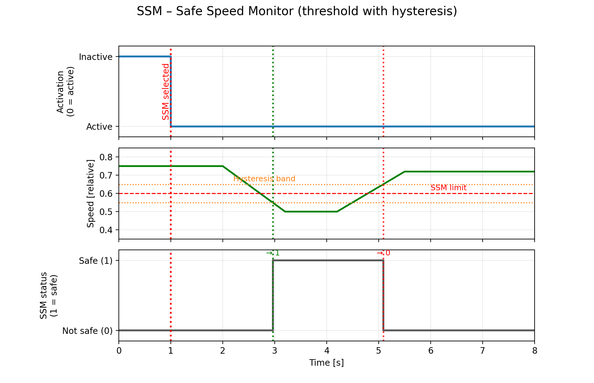{: style="width:100%;" }

## Safety parameters

All the safety parameters can be set using the TGZ GUI II service program.

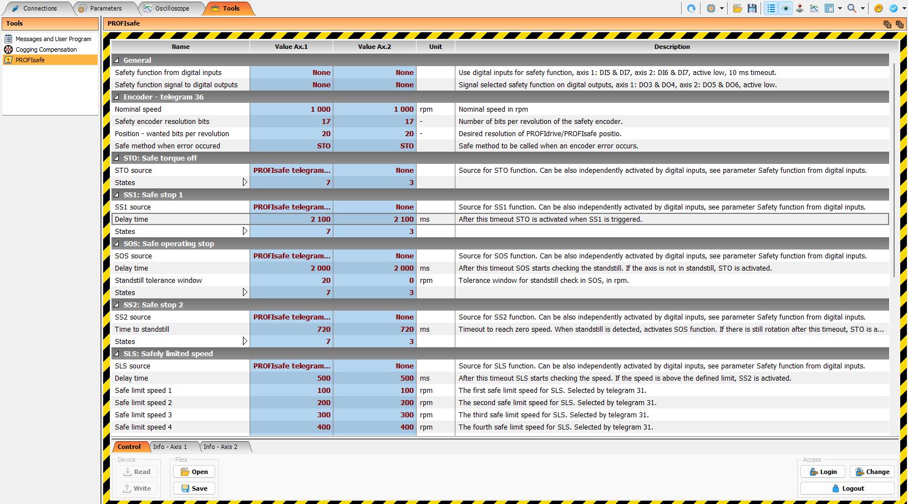{: style="width:100%;" }
