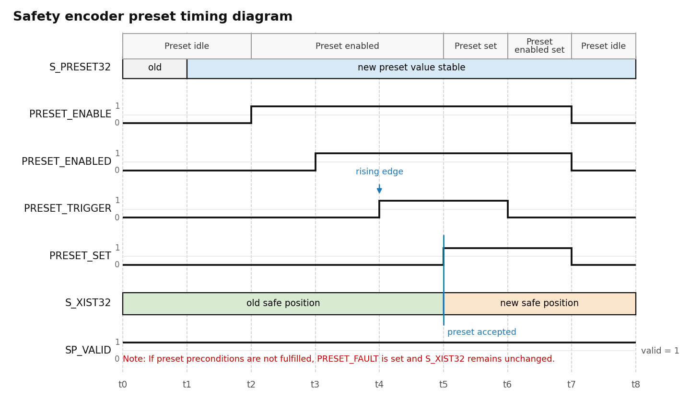

## General information

Theere is a PROFIsafe firmware option available for the TGZ. It allows to use the PROFIsafe protocol for safety communication between the TGZ and the PLC controller. The PROFIsafe protocol is used to activate the safety functions of the TGZ and to monitor their status. The safety functions are implemented in a safety manner by using two independent processors and two independent FPGA circuit breakers connected in a sequence. The safety functions can be activated by PROFIsafe, digital inputs or permanently by using the safety parameters. The safety functions are defined according to the EN 61800-5-2 standard.

The PROFIsafe firmware is available for all TGZD variants (double axis) and for the new TGZ single axis variant. There is only one firmware file labeled **TGZU5_yymmdd_DSL_PSAFE_hh-mm.tgzfw**, where the letter U stands for universal, which means that the same firmware file is used for both single and double axis variants. The yymmdd is the date of the firmware release and hh-mm is the time of the firmware release. The firmware file can be downloaded from the TGZ website. The firmware update is done by using the TGZ GUI II service program.
The TGZ single axis variant has the same safety functions available as the double axis variant, because it contains two safety encoder inputs. There is also only one GSDML file, **GSDML-V2.44-TGDrives-TGZ-F-yyyymmdd.xml**, used for both single and double axis variants, where yyyymmdd is the date of the GSDML release. The GSDML file can be downloaded from the TGZ website and must be imported to the PLC programming environment to be able to use the PROFIsafe functions.

!!! warning "Warning"
    **The TGZ provides safety functions and safety-related data, but the final safety concept of the machine must be evaluated and validated by the machine manufacturer. The PLC safety program, wiring, parameterization, encoder selection, mechanical system, and stopping distances must be considered as part of the complete safety function.**

!!! warning "Warning"
    **The safety functions need safety encoder feedback to work properly.**

!!! warning "Warning"
    **Non-safety encoder feedback can be used, but safety functions are not guaranteed to work in safety manner. It is the user responsibility to use the correct encoder and to set the correct safety parameters.**

!!! warning "Warning"
    **The safety functions are only active when the correct safety parameters are set. The safety parameters must be set according to the specific application requirements and the selected safety functions. It is recommended to start with conservative values and then adjust them based on testing and validation.**

### Limitations

The PROFIsafe firmware does not support the external IRC encoder (connector X5) and does not implement CAN bus (connector X10).

### Telegram assignment

The PROFIsafe firmware supports the following telegrams for PROFIdrive communication:

| Telegram number | Description                                                |
|-----------------|------------------------------------------------------------|
| 1               | Speed control mode (16-bit)                                |
| 7               | Position control mode (tasks only)                         |
| 9               | Position control mode (tasks and direct MDI control)       |
| 102             | Speed control mode with extended features                  |
| 111             | Position control mode with extended features (MDI control) |
| 352             | Speed control mode with extended features                  |

!!! warning "Warning"
    **The PROFIdrive telegrams must be selected using TGZ_GUI application. When changed, the TGZ must be restarted. It is important that the PLC has already the right telegrams selected in the project and it is running before the TGZ is restarted, otherwise the drive will not be able to establish communication with the PLC and will not work. This behaviour is important only when the telegrams are changed, otherwise the power up order of PLC and TGZ does not matter.**

The PROFIsafe firmware supports the following telegrams for PROFIsafe communication:

| Telegram number | Description                        |
|-----------------|------------------------------------|
| 31              | Safety control and status telegram |
| 36              | Safety encoder telegram            |

PROFIsafe telegrams have their subslots reserved for safety functions control and status, therefore they cannot be used for other purposes. The telegram 31 is used for controlling the safety functions and monitoring their status. The telegram 36 is used for monitoring the safety encoder values, which are used for the safe speed and position monitoring functions.

> Both versions V2.4 and V2.6 of PROFIsafe are supported. The version is automatically detected by the TGZ and the communication is established accordingly.

!!! warning "Warning"
    **Do not mix PROFIsafe versions in the same system.**

!!! warning "Warning"
    **When the PROFIsafe version is changed, the TGZ must be restarted.**

#### Reset and restart rules

Some changes require a TGZ restart before they become active:

| Change                        | Restart required | Comment |
|-------------------------------|------------------|---------|
| PROFIdrive telegram selection | Yes              | controller must be already configured with the correct telegrams and running before the TGZ is restarted |
| PROFIsafe version change      | Yes              | controller must be already configured with the correct PROFIsafe version and running before the TGZ is restarted |
| Firmware update               | Yes              |         |
| Safety parameter change       | Yes              |         |
| Safety event acknowledge      | No               |         |

### Which PROFIsafe telegram should be used?

| Requirement                                     | Telegram 31 | Telegram 36 |
|-------------------------------------------------|-------------|-------------|
| Activate STO, SS1, SS2, SOS, SLS, SLP, SDI, SSM | Yes         | No          |
| Monitor active safety functions                 | Yes         | No          |
| Read safe actual position                       | No          | Yes         |
| Read safe actual speed                          | No          | Yes         |
| Set safe encoder position preset                | No          | Yes         |
| Acknowledge encoder safety event                | No          | Yes         |

!!! note "Note"
    Telegrams 31 and 36 can be used simultaneously. 

## PROFIsafe commissioning checklist

1. Install the correct TGZ PROFIsafe firmware.
2. Import the correct GSDML file into the PLC engineering system.
3. Select the required PROFIdrive telegram.
4. Select PROFIsafe telegram 31 and/or telegram 36.
5. Set the F-address and verify that it matches the PLC project.
6. Configure safety parameters in TGZ GUI II. This is important, without proper safety parameters configuration the safety functions will not work as expected and may cause unexpected behavior or TGZ will not work at all. The safety parameters must be set according to the specific application requirements and the selected safety functions. It is recommended to start with conservative values and then adjust them based on testing and validation.
7. Verify encoder configuration and direction.
8. Test STO before enabling motion.
9. Test each configured safety function.
10. Save and document the final safety parameter set.

!!! warning "Warning"
    **All the safety functions are enabled by default. It means that no motion can be established unless the safety functions are properly configured and the F-Host is connected and working.**

### Recommended validation tests

After commissioning, the following tests should be performed:

- Verify STO activation from PROFIsafe.
- Verify STO activation from digital inputs, if used.
- Verify SS1 stop time.
- Verify SOS standstill monitoring.
- Verify SLS speed violation reaction.
- Verify SLP limit violation reaction.
- Verify SDI+ and SDI- direction monitoring.
- Verify SSM status behavior.
- Verify telegram 36 safe position validity.
- Verify telegram 36 safe speed validity.
- Verify safe preset sequence.
- Verify safety event acknowledge behavior.

## Safety functions overview

| Function | Monitoring target     | Reaction if violated                      |
|----------|-----------------------|-------------------------------------------|
| STO      | Output torque         | Power stage disabled                      |
| SS1      | Time-based stop       | STO after configured delay                |
| SOS      | Standstill position   | STO if standstill is violated             |
| SS2      | Controlled stop + SOS | STO if standstill is violated             |
| SLS      | Speed limit           | SS2, SS1, STO sequence                    |
| SLP      | Position limits       | STO or SS1 according to safety parameters |
| SDI      | Direction             | SS2                                       |
| SSM      | Speed range           | Monitoring only, no automatic reaction    |

!!! warning "Warning"
    **The function SLP is fully functional only with a multiturn absolute encoder or after a successfull homing or encoder value preset.**

### Safety function activation methods

Some of the safety functions can be activated by PROFIsafe, digital inputs (DI) or both (see the table). SLS and SLP can be also activated permanently by using the safety parameters.

|       | Function            | Category      | PROFIsafe | DI  | Permanent |
|-------|---------------------|---------------|-----------|-----|-----------|
| STO   | Safe torque off     | Safe stop     | Yes       | Yes | No        |
| SS1   | Safe stop 1         | Safe stop     | Yes       | Yes | No        |
| SOS   | Safe operating stop | Safe stop     | Yes       | Yes | No        |
| SS2   | Safe stop 2         | Safe stop     | Yes       | Yes | No        |
| SLS   | Safe limit speed    | Safe speed    | Yes       | Yes | Yes       |
| SLP   | Safe limit position | Safe position | Yes       | Yes | Yes       |
| SDI   | Safe direction      | Safe speed    | Yes       | No  | No        |
| SSM   | Safe speed monitor  | Safe speed    | Yes       | No  | Yes       |

#### Activation by PROFIsafe

One or more of the safety functions can be activated. The standard PROFIsafe telegram 31 is used. There is a standard library LdrvSafe_SinaTlg31 available. The telegram 31 allows detailed control of each safety function with additional parameters and returns a safety status of actually active functions.

#### Activation by digital inputs

Each axis can use two dedicated digital inputs pins for a safety function invoke. Only ONE function can be activated in a time. The selection is done via the safety parameters independently for each axis. The first axis uses digital inputs pins DI 5 and DI 7, the second axis uses DI6 and DI8 pins. Function is active by setting the mentioned pins low. Both inputs (DI5 & 7 or DI6 & 8) must be changed simultaneously within 10 ms. If this time is violated, the safety function is activated forever till restart of the TGZ.

#### Permanent safety function selection

Two of the safety functions can be also selected permanently via the safety parameters: Safe limit speed (SLS) and safe limit position (SLP). The SLS can work simultaneously with the PROFIsafe control – selection of up to four different limited speed percent values is possible by telegram 31. On the other hand, the permanent SLP activated by DI uses always the safety position 1 only.

#### Active safety function signaling by digital outputs

Digital output pins 3&5 for the first axis or 4&6 can be selected for signaling a selected safety function. Only ONE function can be selected for signaling. The normal digital outputs function is not available in that case. Active safety function is signaled by setting both the outputs low.

### Principle of operation

All safety functions assume that the PLC controller invokes the desired action. The TGZ monitors the speed and/or position and invokes the appropriate safety reaction in the case the conditions are not met. Additionally, when a safety function is selected, the TGZ also activates the wanted stop action internally. Additionally the TGZ can activate speed and/or position limit, but this functionality is out of the safety scope.
The safety functions monitoring is done in a safety manner by using two independent processors.  
Disabling the power motor output is done in a safety manner by using two independent FPGA circuit breakers connected in a sequence.

> Any safety event is signaled by INTERNAL_EVENT bit in the PROFIsafe status word. The specific event is signaled by the PROFIsafe status bits and/or digital outputs (if mapped). The safety event must be acknowledged by toggling INTERNAL_EVENT_ACK bit in the control word to logical 1 and then back to logical 0.

### Signal polarity

Many safety function request bits are active-low. This means that the safety function is selected when the corresponding PROFIsafe control bit is set to logical 0.

This behavior is intentional and follows the fail-safe principle: if communication is lost or the safe output data becomes invalid, the drive enters a safe state.

## Safe torque off – STO

In addition to already available hardware STO safety function, which has its dedicated input pins, additional STO is available. STO turns off the drive output that powers the motor.

### STO activation

STO can be activated by any of the following inputs or events:

- PROFIsafe STO bit in control word set to zero
- SS1
- SS2 in case of standstill speed monitor fail
- SOS in case of standstill speed monitor fail
- SLS in case of speed threshold violation
- SLP in case of position range overflow/underflow and when the SLP’s stop function is set to STO
- SDI in case of direction violation
- Digital inputs (5&7 – axis 1, 6&8 – axis 2) set to low if mapped by the safety parameters

### STO signaling

STO active status can be evaluated by:

- PROFIsafe status bit STO set to logical one
- Digital outputs (3&5 – axis 1, 4&6 – axis 2) set to low if mapped by the safety parameters

### STO sequence

When the STO is activated the following actions are done simultaneously:

- Output driver power stage is set to zero
- The axis is disabled (software disable) and its PROFIdrive state goes to S1 – Switching On Inhibited.
- The motor velocity goes to zero and the motor cannot be started accidentally.

!!! warning "Warning"
    **After the energy feed has been disconnected (STO active) the motor can undesirably move (e.g. the motor can coast down), therefore presenting risk to persons.**

### STO restart (deactivation)

- Deselect the function by PROFIsafe control word bit STO to logical 1 and/or by settings both mapped digital inputs to high level.
- Acknowledge the safety event by toggling INTERNAL_EVENT_ACK bit in the PROFIsafe control word to logical 1 and then back to logical 0.
- Enable the axis by PROFIdrive control word (i.e. traverse through PROFIdrive state diagram from S1 to S4).

### STO timing

{: style="width:100%;" }

## SS1 – time based safe stop

Definition according to EN 61800-5-2:

> "The function SS1 brakes the motor and trips the function STO after a delay time."

In other words the drive decelerates once SS1 has been selected, and goes into the STO state once the delay time has expired. The STO state is always selected after the timeout regardless the axis is still moving or not. The deceleration is specified in D-EmerDecRamp TGZ register.

### SS1 activation

The SS1 function can be activated by any of the following events:

- PROFIsafe SS1 bit in the control word set to zero
- SLP in case of position range overflow/underflow and when the SLP’s stop function is set to SS1
- Digital inputs (5&7 – axis 1, 6&8 – axis 2) set to low if mapped by the safety parameters

### SS1 signaling

SS1 active status can be evaluated by:

- PROFIsafe status bit SS1 set to logical one
- Digital outputs (3&5 – axis 1, 4&6 – axis 2) set to low if mapped by the safety parameters

### SS1 sequence

1. The SS1 is selected either by bit SS1 to low in PROFIsafe control word or by digital inputs (if mapped) to low level.
2. The TGZ stops the movement with the deceleration specified in the safety parameters.
3. After fixed time (also specified in the safety parameters) the STO is activated, even if the axis is still moving.

!!! warning "Warning"
    **After the energy feed has been disconnected (STO active) the motor can undesirably move (e.g. the motor can coast down), therefore presenting risk to persons.**

### SS1 restart (deactivation)

- Deselect the function by PROFIsafe control word bit SS1 to logical 1 and/or by settings both mapped digital inputs to high level.
- Acknowledge the safety event by toggling INTERNAL_EVENT_ACK bit in the PROFIsafe control word to logical 1 and then back to logical 0.
- Enable the axis by PROFIdrive control word (i.e. traverse through PROFIdrive state diagram from S1 to S4).

### SS1 timing

{: style="width:100%;" }

## SOS – safe operating stop

Definition according to EN 61800-5-2:

> "The SOS function is used for safe monitoring of the standstill position of a drive."

!!! note "Note"
    Contrary to SS1 and SS2, SOS does not automatically brake the drive. It only monitors the standstill position. This means that the PLC must ensure that the drive is stopped before activating the SOS function.

The motor remains under power and the drive is in the enabled state. The SOS function is activated when the motor is not in the standstill position after the timeout has elapsed. The standstill check is done by the **standstill tolerance window safe parameter**.

### SOS activation

The SOS function can be activated by any of the following events:

- PROFIsafe SOS bit in the control word set to zero
- SLP in case of position range overflow/underflow and when the SLP’s stop function is set to SOS
- Digital inputs (5&7 – axis 1, 6&8 – axis 2) set to low if mapped by the safety parameters

### SOS signaling

SOS active status can be evaluated by:

- PROFIsafe status bit SOS set to logical one
- Digital outputs (3&5 – axis 1, 4&6 – axis 2) set to low if mapped by the safety parameters

### SOS sequence

1. The SOS is selected either by bit SOS to low in PROFIsafe control word or by digital inputs (if mapped) to low level.
2. The TGZ waits for the timeout to elapse. During this time the motor must be stopped by the PLC.
3. After the timeout, the TGZ checks if the motor is in standstill. If not, the **STO** function is activated.

### SOS restart (deactivation)

- Deselect the function by PROFIsafe control word bit SOS to logical 1 and/or by settings both mapped digital inputs to high level.
- Acknowledge the safety event by toggling INTERNAL_EVENT_ACK bit in the PROFIsafe control word to logical 1 and then back to logical 0.
- If the STO function is activated, the axis must be enabled by PROFIdrive control word (i.e. traverse through PROFIdrive state diagram from S1 to S4).

### SOS timing

{: style="width:100%;" }

{: style="width:100%;" }

## SS2 – safe stop 2

Definition according to EN 61800-5-2:

> "The function SS2 brakes the motor and after a delay time, initiates the SOS function."

In other words the drive decelerates once SS2 has been selected and after the timeout checks if the motor is in standstill (SOS). The deceleration is specified in D-EmerDecRamp TGZ register.

### SS2 activation

The SS2 function can be activated by any of the following events:

- PROFIsafe SS2 bit in the control word set to zero
- SLP in case of position range overflow/underflow and when the SLP’s stop function is set to SS2
- Digital inputs (5&7 – axis 1, 6&8 – axis 2) set to low if mapped by the safety parameters

### SS2 signaling

SS2 active status can be evaluated by:

- PROFIsafe status bit SS2 set to logical one
- Digital outputs (3&5 – axis 1, 4&6 – axis 2) set to low if mapped by the safety parameters

### SS2 sequence

1. The SS2 is selected either by bit SS2 to low in PROFIsafe control word or by digital inputs (if mapped) to low level.
2. The TGZ stops the movement with the deceleration specified in the safety parameters.
3. When the timeout elapses or the motor is in standstill, continuous check of the the zero speed is activated (SOS function).
4. If the motor is not in standstill, the **STO** function is activated.

### SS2 restart (deactivation)

- Deselect the function by PROFIsafe control word bit SS2 to logical 1 and/or by settings both mapped digital inputs to high level.
- Acknowledge the safety event by toggling INTERNAL_EVENT_ACK bit in the PROFIsafe control word to logical 1 and then back to logical 0.
- If the STO function is activated, the axis must be enabled by PROFIdrive control word (i.e. traverse through PROFIdrive state diagram from S1 to S4).

### SS2 timing

{: style="width:100%;" }

{: style="width:100%;" }

## SLS – Safe Limited Speed

Definition according to EN 61800-5-2:

> "The SLS function prevents the motor from exceeding the specified speed limit."

### SLS activation

The SLS function can be activated by any of the following events:

- PROFIsafe SLS bit in the control word set to zero
- Digital inputs (5&7 – axis 1, 6&8 – axis 2) set to low if mapped by the safety parameters
- Permanent activation via safety parameters

### SLS signaling

SLS active status can be evaluated by:

- PROFIsafe status bit SLS set to logical one
- Digital outputs (3&5 – axis 1, 4&6 – axis 2) set to low if mapped by the safety parameters

### SLS sequence

1. The SLS is selected either by PROFIsafe control word or by digital inputs (if mapped) or permanently via safety parameters.
2. The TGZ monitors the motor speed after a specified time delay.
3. If the speed exceeds the base limit speed (defined in pd_inc/s), the TGZ initiates a safety reaction.
4. The reaction is sequence of **SS2**, **SS1**, **STO**.
5. PROFIsafe telegram 31 allows selection of the second, third or fourth speed levels.
6. If the lower speed limit is selected, another time delay is applied before the speed check.
7. If the higher speed limit is selected, the check is done immediately without any delay.

**Used safety parameters:**

- Delay time [ms]
- Base limit speed [pd_inc/s]
- Deceleration [pd_inc²/s]
- Second, third and fourth speed level (selection via PROFIsafe only)

### SLS restart (deactivation)

- Deselect the function by PROFIsafe control word bit SLS to logical 1 and/or by setting both mapped digital inputs to high level.
- Acknowledge the safety event by toggling INTERNAL_EVENT_ACK bit in the PROFIsafe control word to logical 1 and then back to logical 0.
- If STO was activated, enable the axis by PROFIdrive control word (i.e. traverse through PROFIdrive state diagram from S1 to S4).

### SLS timing

{: style="width:100%;" }

## SLP – Safe Limited Position

Definition according to EN 61800-5-2:

> "The SLP function prevents the motor from exceeding the specified position limits."

### SLP activation

The SLP function can be activated by any of the following events:

- PROFIsafe SLP bit in the control word set to zero
- Digital inputs (5&7 – axis 1, 6&8 – axis 2) set to low if mapped by the safety parameters
- Permanent activation via safety parameters

### SLP signaling

SLP active status can be evaluated by:

- PROFIsafe status bit SLP set to logical one
- Digital outputs (3&5 – axis 1, 4&6 – axis 2) set to low if mapped by the safety parameters

### SLP sequence

1. The SLP is selected either by PROFIsafe control word or by digital inputs (if mapped) or permanently via safety parameters.
2. The TGZ monitors the motor position.
3. If the position exceeds the configured limits, the selected safety reaction is triggered.
4. The reaction sequence is defined by the safety parameters and can be either **SS1** or **STO**.

**Used safety parameters:**

- Delay time [ms]
- Upper and lower limits for safety position 1 [pd_inc]
- Upper and lower limits for safety position 2 [pd_inc]
- Stop function selection: STO or SS1

### SLP restart (deactivation)

- Deselect the function by PROFIsafe control word bit SLP to logical 1 and/or by setting both mapped digital inputs to high level.
- Acknowledge the safety event by toggling INTERNAL_EVENT_ACK bit in the PROFIsafe control word to logical 1 and then back to logical 0.
- If STO was activated, enable the axis by PROFIdrive control word (i.e. traverse through PROFIdrive state diagram from S1 to S4).

### SLP timing

{: style="width:100%;" }

> **SS2** reaction is not yet implemented

## SDI – Safe Direction

> "The SDI function monitors the direction of rotation of the motor and prevents it from rotating in the forbidden direction."

### SDI activation

The SDI function can be activated by PROFIsafe control word only. There are two options for the direction monitoring: SDI+ and SDI-. If SDI+ is selected, the allowed direction is positive and the forbidden direction is negative. If SDI- is selected, the allowed direction is negative and the forbidden direction is positive.

### SDI signaling

SDI active status can be evaluated by PROFIsafe status bit SDI+ / SDI- set to logical one. Digital outputs cannot be used for SDI signaling.

### SDI sequence

1. The SDI is selected by PROFIsafe control word bit SDI+ or SDI- to low.
2. The TGZ monitors the motor direction after a specified time delay. Direction is evaluated from the sign of the safe speed value; small fluctuations around zero are tolerated within the standstill window (see timing diagram).
3. If the motor rotates in the forbidden direction, the TGZ initiates a safety reaction **SS2**.
4. Only one direction monitoring (SDI+ or SDI-) can be active at the same time. If both are selected, it is considered as an error and **STO** is activated immediately.

**Used safety parameters:**

- Delay time [ms]

### SDI restart (deactivation)

- Deselect the function by PROFIsafe control word bit SDI+ or SDI- to logical 1.
- Acknowledge the safety event by toggling INTERNAL_EVENT_ACK bit in the PROFIsafe control word to logical 1 and then back to logical 0.
- If STO (as result of SS2) was activated, enable the axis by PROFIdrive control word (i.e. traverse through PROFIdrive state diagram from S1 to S4).

### SDI timing

{: style="width:100%;" }

{: style="width:100%;" }

## SSM – Safe Speed Monitor

> "The SSM function monitors the speed of the motor and signals if it is out of the specified speed range."

It means that SSM is a pure monitoring function without any automatic safety reaction. The PLC must ensure that the speed is reduced below the limit if the SSM function signals a violation.

### SSM activation

The SSM function can be activated by PROFIsafe control word bit SSM set to zero. Digital inputs cannot be used for SSM activation. Permanent activation via safety parameters is possible.

### SSM signaling

SSM active status can be evaluated by PROFIsafe status bit SSM set to logical one. Digital outputs cannot be used for SSM signaling.

### SSM sequence

1. The SSM is selected by PROFIsafe control word bit SSM to low or permanently via safety parameters.
2. The TGZ monitors the motor speed immediately without any delay.
3. SSM status = **1** if speed is **below** the configured low limit
4. SSM status = **0** if speed is **above** the configured high limit

**Used safety parameters:**

- High speed limit [rpm]
- Low speed limit [rpm]

Low speed limit must be lower or equal to high limit.

### SSM restart (deactivation)

- Deselect the function by PROFIsafe control word bit SSM to logical 1.
- There is no need to acknowledge the safety event, because SSM is a pure monitoring function without any safety reaction. No safety event is triggered when the speed is out of range, only the SSM status bit is set to zero.

### SSM timing

{: style="width:100%;" }


## Safety parameters

All the safety parameters can be set using the TGZ GUI II service program.

{: style="width:100%;" }

Before setting the safety parameters, it is necessary to log in to the servo drive with a password (tab **Tools**, item **PROFIsafe**, **Login** button on the bottom right). The default password is **tgzsafe** and it can be changed by the user. It is important to remember the password when changed, because without it the safety parameters cannot be accessed and the safety functions cannot be properly configured.

!!! warning "Warning"
    **If the password is lost, the TGZ must be returned to the factory for a password reset, which involves additional costs and time. It is not possible to reset the password locally.**

## Safety encoders (telegram 36)

Telegram 36 is used for exchanging safety encoder data via PROFIsafe. It provides the safe actual position, the safe actual speed, the encoder safety status word, and the encoder safety control word. It also allows the PLC to set a new safe actual position value by using the safety preset mechanism.

!!! note "Note"
    There is currently no standard Siemens TIA Portal library block for telegram 36. Therefore, the F-PLC programmer must map and evaluate the telegram 36 data directly in the safety program.

### Telegram 36 structure

Telegram 36 contains the following safety encoder signals:

| Direction | Signal     | Size   | Description                 |
|-----------|------------|--------|-----------------------------|
| PLC → TGZ | S_STW1_ENC | 16 bit | Safety encoder control word |
| PLC → TGZ | S_PRESET32 | 32 bit | Safe position preset value  |
| TGZ → PLC | S_ZSW1_ENC | 16 bit | Safety encoder status word  |
| TGZ → PLC | S_XIST32   | 32 bit | Safe actual position value  |
| TGZ → PLC | S_NIST16   | 16 bit | Safe actual speed value     |

The total PROFIsafe process data size of telegram 36 is:

| Direction | User data size | Content                          |
|-----------|----------------|----------------------------------|
| PLC → TGZ | 6 bytes        | S_STW1_ENC + S_PRESET32          |
| TGZ → PLC | 8 bytes        | S_ZSW1_ENC + S_XIST32 + S_NIST16 |

#### Safety encoder control word – S_STW1_ENC

The safety encoder control word is sent from the F-PLC to the TGZ. It is used mainly for controlling the safe preset function and for acknowledging encoder safety events.

| Bit    | Name               | Description                                                                                 |
|--------|--------------------|---------------------------------------------------------------------------------------------|
| 0      | PRESET_ENABLE      | Enables the safe preset function. The preset trigger is accepted only when this bit is set. |
| 1..5   | Reserved           | Reserved for future profile use. Set to 0.                                                  |
| 6      | PRESET_TRIGGER     | Rising edge triggers setting of the new safe actual position from S_PRESET32.               |
| 7      | INTERNAL_EVENT_ACK | Acknowledges encoder safety events. The acknowledge is evaluated on the falling edge.       |
| 8..11  | Reserved           | Reserved for future profile use. Set to 0.                                                  |
| 12..15 | Device specific    | Reserved for TGZ-specific extensions.                                                       |

!!! note "Note"
    Reserved bits should always be written as 0 by the PLC safety program.

#### Safety encoder status word – S_ZSW1_ENC

The safety encoder status word is sent from the TGZ to the F-PLC. It indicates whether the safe position and speed values are valid, whether the preset logic is active, and whether an encoder safety event is present.

| Bit    | Name            | Description                                                                                                        |
|--------|-----------------|--------------------------------------------------------------------------------------------------------------------|
| 0      | SP_VALID        | Safe position value S_XIST32 is valid.                                                                             |
| 1      | SS_VALID        | Safe speed value S_NIST16 is valid.                                                                                |
| 2      | PRESET_ENABLED  | Handshake bit confirming that the preset logic is enabled.                                                         |
| 3..4   | Reserved        | Reserved for future profile use.                                                                                   |
| 5      | PRESET_FAULT    | Preset request was rejected, for example because the speed was too high or the preset value was invalid.           |
| 6      | PRESET_SET      | Handshake bit. A rising edge indicates that the preset value was accepted and set as the new safe actual position. |
| 7      | INTERNAL_EVENT  | Encoder safety event is present and must be acknowledged. Set if SP_VALID or SS_VALID is 0.                        |
| 8..11  | Reserved        | Reserved for future profile use.                                                                                   |
| 12..15 | Device specific | Reserved for TGZ-specific extensions.                                                                              |

!!! note "Note"
    Additional encoder status information is available in the TGZ GUI II service program, which can be used for diagnostics and troubleshooting. Use **PD-F_Dbg_Pos_1_Status** and **PD-F_Dbg_Pos_2_Status** registers for this purpose. Additional encoder status information is also available in the **PD-F_ENC_ST0**, **PD-F_ENC_ST1**, **PD-F_ENC_ST2**, **PD-F_ENC_ST3** registers.

### Encoder safety event and PROFIsafe reaction

Falling edge of INTERNAL_EVENT_ACK bit executes clearing of the encoder event (error). If the event is still present, the INTERNAL_EVENT bit will be set again immediately after the acknowledge. If the event is cleared, the INTERNAL_EVENT bit is reset until a new event occurs.

It is possible to assign a safety function to the encoder safety event (INTERNAL_EVENT bit) by using the TGZ GUI II service program. In that case, when an encoder safety event (error) occurs, the assigned safety function (e.g. STO) is automatically activated. The PLC can acknowledge the event of the encoder by falling edge of INTERNAL_EVENT_ACK bit in the control word, but the safety function itself must be acknowledged by the PLC separately by using telegram 31 (see above).

Available safety functions for encoder events are: **None**, **STO**, **SS1**, **SS2**, **SLS**.

#### Safe actual position – S_XIST32

S_XIST32 contains the safe actual position value. The value is transferred as a signed 32-bit integer.

The scaling of S_XIST32 is the same as PROFIsafe actual position value. PROFIsafe actual position value is defined by the encoder resolution and by the safety parameters.

The value is valid only when bit SP_VALID in S_ZSW1_ENC is set to logical 1.

!!! warning "Warning"
    The PLC safety program must not use S_XIST32 for safety evaluation when SP_VALID is 0.

!!! note "Note"
    The safe actual position is returned by safety encoder even in the case of an error event, so the PLC can use it for diagnostic purposes.

#### Safe actual speed – S_NIST16

S_NIST16 contains the safe actual speed value. The value is transferred as a signed 16-bit integer.

The value of S_NIST16 is expressed as a percentage of the nominal motor speed value, TGZ register M-Nn (motor nominal speed in rpm). The allowed range is from -32768 to 32767, where 16384 represents 100% of the nominal speed in the positive direction and -16384 represents 100% of the nominal speed in the negative direction.

The scaling of S_NIST16 is fixed and cannot be changed by safety parameters. The TGZ converts the actual rpm value to a percentage of the nominal speed and sends it to the PLC as S_NIST16. Therefore, changing the nominal speed M-Nn directly affects the value returned in S_NIST16.

For example, if the actual speed is 500 rpm and the nominal speed M-Nn is 1000 rpm, S_NIST16 will be 8192, which represents 50% of the nominal speed. If the nominal speed M-Nn is changed to 2000 rpm, S_NIST16 will be 4096, which represents 25% of the nominal speed for the same actual speed of 500 rpm.

The TGZ uses the following scaling:

```text
S_NIST16 = actual_speed_rpm / nominal_speed_rpm * 16384    
```

For converting S_NIST16 back to actual speed in rpm in the PLC, the following formula can be used:

```text
actual_speed_rpm = S_NIST16 / 16384 * nominal_speed_rpm
```

The value is valid only when bit SS_VALID in S_ZSW1_ENC is set to logical 1.

!!! warning "Warning"
    The PLC safety program must not use S_NIST16 for safety evaluation when SS_VALID is 0.

#### Safe position preset

Telegram 36 allows the F-PLC to set a new safe actual position value. This is done by writing the desired position to S_PRESET32 and by using the preset enable/trigger handshake in S_STW1_ENC and S_ZSW1_ENC.

S_PRESET32 has the same scaling as S_XIST32.

!!! warning "Warning"
    The safe preset function should be executed only when the axis is at standstill. Otherwise, correct execution of the preset function cannot be guaranteed. The PLC safety program must ensure that the axis is at standstill before executing the preset sequence.

#### Safe preset sequence

The recommended PLC sequence is:

1. Write the required new safe position value to S_PRESET32.
2. Set PRESET_ENABLE in S_STW1_ENC to logical 1.
3. Wait until PRESET_ENABLED in S_ZSW1_ENC becomes logical 1.
4. Generate a rising edge on PRESET_TRIGGER in S_STW1_ENC.
5. Wait for a rising edge on PRESET_SET in S_ZSW1_ENC.
6. Reset PRESET_TRIGGER to logical 0.
7. Reset PRESET_ENABLE to logical 0.
8. Check that PRESET_ENABLED returns to logical 0.
9. Check that the new value is visible in S_XIST32 and that SP_VALID is logical 1.

If PRESET_FAULT is set, the preset was not accepted. The PLC must reset PRESET_ENABLE and PRESET_TRIGGER, remove the reason of the fault, and repeat the preset sequence.

!!! note "Note"
    There is a possibility to zero actual position for diagnostics or commissioning purposes. This is done in a non-safe way and should not be used for normal operation. Use the TGZ GUI II service program and set the **PD-DebugFunctions** to 2 (the first axis) or 3 (the second axis) to execute the zero preset.

{: style="width:100%;" }

#### Encoder safety event acknowledge

Encoder safety events are signaled by the INTERNAL_EVENT bit in S_ZSW1_ENC.

If INTERNAL_EVENT is logical 1, the F-PLC should:

1. Evaluate the diagnostic information.
2. Remove the cause of the safety event.
3. Acknowledge the event by toggling INTERNAL_EVENT_ACK in S_STW1_ENC.

The acknowledge is evaluated on the falling edge of INTERNAL_EVENT_ACK.

Recommended acknowledge sequence:

1. Set INTERNAL_EVENT_ACK to logical 1.
2. Keep it set for at least one PROFIsafe cycle.
3. Set INTERNAL_EVENT_ACK back to logical 0.
4. Check whether INTERNAL_EVENT has been cleared.

If the cause of the event is still present, the INTERNAL_EVENT bit remains set or becomes set again.

!!! note "Note"
    INTERNAL_EVENT_ACK acknowledges encoder safety events reported by telegram 36. Non-safety encoder errors can also be handled in this way. However, it is still necessary to reset the TGZ servo error by using the standard PROFIdrive error acknowledge.

#### Telegram 36 PLC mapping example

The exact tag names depend on the PLC programming environment and on the imported GSDML file. In the F-program, telegram 36 can be represented for example as the following structure.

PLC to TGZ:

| Offset | Signal     | Data type |
|--------|------------|-----------|
| 0      | S_STW1_ENC | WORD      |
| 2      | S_PRESET32 | DINT      |

TGZ to PLC:

| Offset | Signal     | Data type |
|--------|------------|-----------|
| 0      | S_ZSW1_ENC | WORD      |
| 2      | S_XIST32   | DINT      |
| 6      | S_NIST16   | INT       |

Example bit evaluation:

```text
SafePositionValid := S_ZSW1_ENC.bit0
SafeSpeedValid    := S_ZSW1_ENC.bit1
PresetEnabled     := S_ZSW1_ENC.bit2
PresetFault       := S_ZSW1_ENC.bit5
PresetSet         := S_ZSW1_ENC.bit6
InternalEvent     := S_ZSW1_ENC.bit7
```

Example control bits:

```text
S_STW1_ENC.bit0 := PresetEnable
S_STW1_ENC.bit6 := PresetTrigger
S_STW1_ENC.bit7 := InternalEventAck
```

## Troubleshooting

| Symptom | Possible cause | Recommended action |
|---------|----------------|--------------------|
| PROFIsafe communication does not start | Wrong F-address, wrong GSDML, wrong PROFIsafe version | Check PLC hardware configuration and TGZ settings, restart TGZ if necessary. Use ACK_GL block in safety PLC to reset PROFIsafe communication. |
| Drive cannot be enabled | Safety functions are active by default | Check telegram 31 status and F-Host connection |
| STO remains active | STO request still active or event not acknowledged | Check telegram 31 control bits and acknowledge event |
| S_XIST32 is invalid | Encoder safety position not valid | Check S_ZSW1_ENC.SP_VALID and encoder diagnostics |
| S_NIST16 is invalid | Encoder safety speed not valid | Check S_ZSW1_ENC.SS_VALID and encoder diagnostics |
| S_NIST16 is zero | Motor nominal speed M-Nn is zero | Check motor parameters |
| Preset does not work | Axis not at standstill or preset sequence incorrect | Check PRESET_FAULT and repeat the preset sequence |
| S_NIST16 value changed after parameter update | Motor nominal speed M-Nn changed | Recalculate scaling against nominal speed |

!!! Note "Note"
    For more detailed troubleshooting, use the TGZ GUI II service program to monitor the safety parameters, safety status bits, and encoder diagnostics. Check also the Messages output window (int the Tools tab) for any PROFIsafe related messages or errors. The verbosity of output messages can be set byt the **PD-AuxiliarySettings** register.
