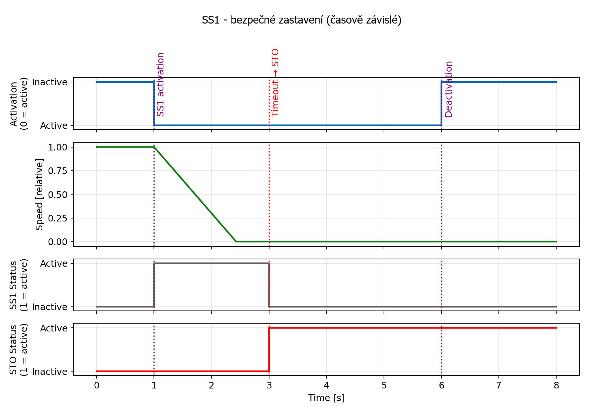
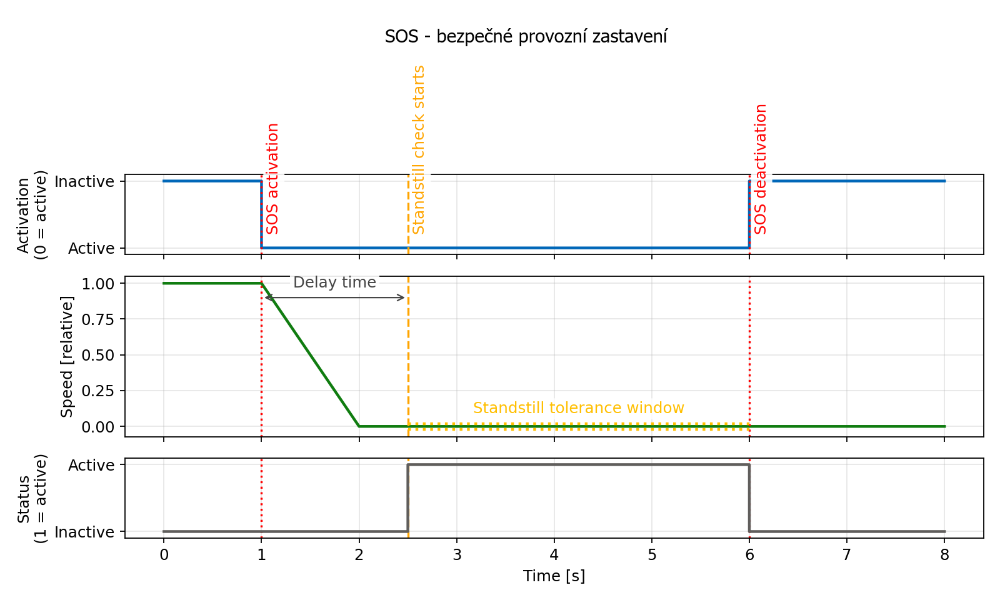
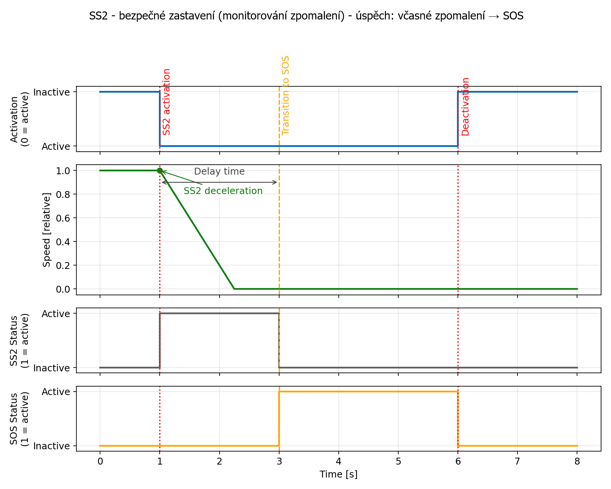
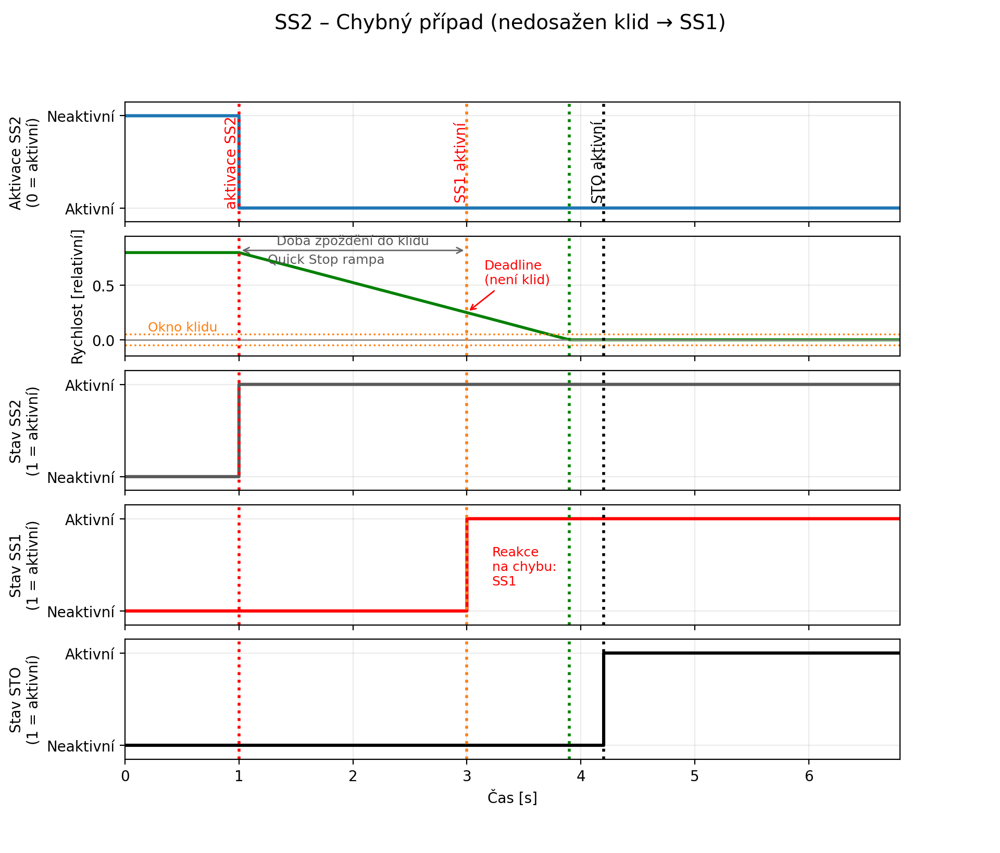
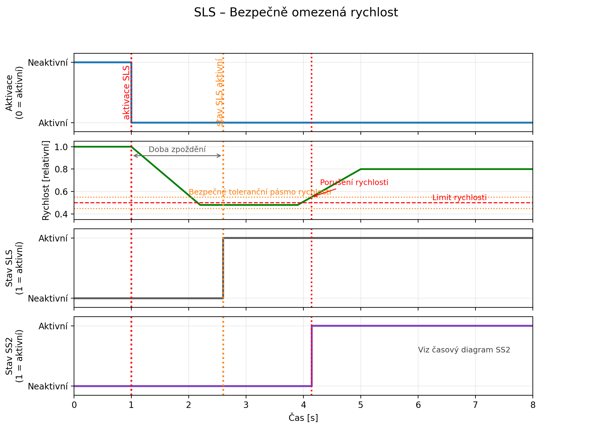
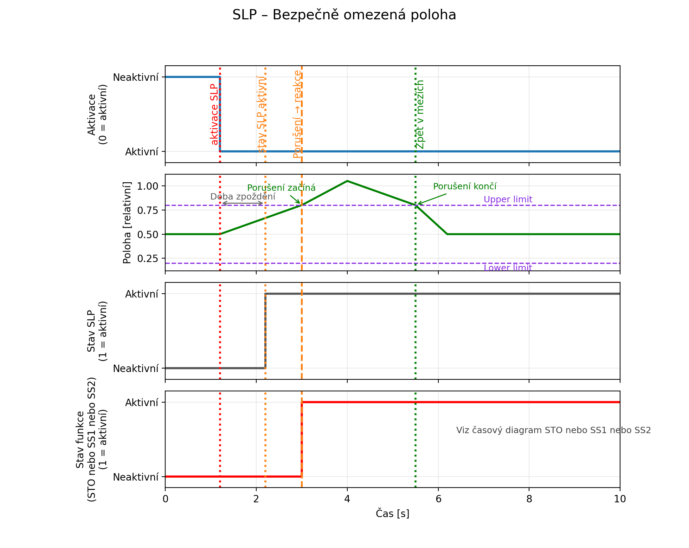

## Dostupné bezpečnostní funkce

|       | Funkce                                  | Kategorie      | PROFIsafe | DI  | Trvalá
|-------|-----------------------------------------|---------------|-----------|-----|----------
| STO   | Bezpečné vypnutí točivého momentu       | Bezpečné zastavení | Ano       | Ano | Ne
| SS1   | Bezpečné zastavení 1 (časově závislé)   | Bezpečné zastavení | Ano       | Ano | Ne
| SOS   | Bezpečné provozní zastavení            | Bezpečné zastavení | Ano       | Ano | Ne
| SS2   | Bezpečné zastavení 2 (monitorování zpomalení) | Bezpečné zastavení | Ano       | Ano | Ne
| SLS   | Bezpečná omezená rychlost               | Bezpečná rychlost  | Ano       | Ano | Ano
| SLP   | Bezpečná omezená poloha                 | Bezpečná poloha  | Ano       | Ano | Ano

Každá bezpečnostní funkce může být aktivována pomocí PROFIsafe, digitálních vstupů (DI) nebo obojího.
Funkce SLS a SLP mohou být také trvale aktivovány pomocí bezpečnostních parametrů.

!!! warning "Varování"
    **Funkce SLP je plně funkční pouze s víceotáčkovým absolutním snímačem.**

### PROFIsafe

Může být aktivována jedna nebo více bezpečnostních funkcí.
Používá se standardní telegram PROFIsafe 902.
K dispozici je standardní knihovna ``LdrvSafe_SinaTlg902``.
Telegram 902 umožňuje detailní řízení každé bezpečnostní funkce s dodatečnými parametry a také vrací bezpečnou polohu osy spolu s časovým razítkem pro výpočet rychlosti.

### Digitální vstupy

Každá osa může pro vyvolání bezpečnostní funkce využívat dva vyhrazené piny digitálních vstupů.
V daném okamžiku může být aktivována pouze JEDNA funkce.
Výběr se provádí pomocí bezpečnostních parametrů nezávisle pro každou osu.
První osa používá piny digitálních vstupů DI 5 a DI 7, druhá osa používá piny DI 6 a DI 8.
Funkce je aktivní nastavením zmíněných pinů do nízkého stavu.
Oba vstupy (DI5 a 7 nebo DI6 a 8) musí být změněny současně během 10 ms.
Pokud je tento čas překročen, bezpečnostní funkce se aktivuje trvale až do restartu TGZ.

### Trvalý výběr bezpečnostní funkce

Dvě z bezpečnostních funkcí lze také trvale vybrat pomocí bezpečnostních parametrů: Bezpečná omezená rychlost (SLS) a bezpečná omezená poloha (SLP).
Funkce SLS může pracovat současně s řízením PROFIsafe – jemné nastavení procentuální hodnoty omezené rychlosti je možné pomocí telegramu 902.
Na druhou stranu, trvalá funkce SLP vždy používá pouze bezpečnostní polohu 1.

### Signalizace aktivní bezpečnostní funkce pomocí digitálních výstupů

Pro signalizaci vybrané bezpečnostní funkce lze vybrat piny digitálních výstupů 3 a 5 pro první osu nebo 4 a 6.
Pro signalizaci lze vybrat pouze JEDNU funkci.
V tomto případě není k dispozici normální funkce digitálních výstupů.
Aktivní bezpečnostní funkce je signalizována nastavením obou výstupů do nízkého stavu.

## Princip činnosti

Všechny bezpečnostní funkce předpokládají, že PLC řídicí jednotka vyvolá požadovanou akci.
TGZ monitoruje rychlost a/nebo polohu a v případě, že nejsou splněny podmínky, vyvolá příslušnou bezpečnostní reakci.
Navíc, když je vybrána bezpečnostní funkce, TGZ také interně aktivuje požadovanou akci (tj.
zastaví pohyb, nastaví interní limity polohy, omezí rychlost atd.).
Monitorování bezpečnostních funkcí probíhá bezpečným způsobem pomocí dvou nezávislých procesorů.
Bezpečné vypnutí napájení motoru se provádí bezpečným způsobem pomocí dvou nezávislých jističů FPGA zapojených do série.

## Bezpečné vypnutí točivého momentu – STO

Kromě již dostupné hardwarové bezpečnostní funkce STO, která má vyhrazené vstupní piny, je k dispozici dodatečná funkce STO.
STO vypne výstup pohonu, který napájí motor.

### Aktivace STO

STO může být aktivováno kterýmkoli z následujících vstupů nebo událostí:

- Bit STO v řídicím slově PROFIsafe nastaven na nulu
- SS1
- SS2 v případě selhání monitorování zpomalení nebo rychlosti zastavení
- SOS v případě selhání monitorování rychlosti zastavení
- SLS v případě překročení prahové hodnoty rychlosti
- SLP v případě překročení/podkročení rozsahu polohy a když je funkce zastavení SLP nastavena na STO
- Digitální vstupy (5 a 7 – osa 1, 6 a 8 – osa 2) nastavené do nízkého stavu, pokud jsou mapovány bezpečnostními parametry

### Signalizace STO

Aktivní stav STO lze vyhodnotit pomocí:

- Stavový bit STO v PROFIsafe nastaven na logickou jedničku
- Digitální výstupy (3 a 5 – osa 1, 4 a 6 – osa 2) nastavené do nízkého stavu, pokud jsou mapovány bezpečnostními parametry

### Sekvence STO

Při aktivaci STO se současně provádějí následující akce:

- Výkonový stupeň budiče výstupu je nastaven na nulu
- Osa je deaktivována (softwarové vypnutí) a její stav PROFIdrive přechází do S1 – Blokování zapnutí.
- Rychlost motoru klesne na nulu a motor nelze náhodně spustit.

!!! warning "Varování"
    **Po odpojení napájení (STO aktivní) se motor může nežádoucím způsobem pohybovat (např. motor může doběhnout), a proto představuje riziko pro osoby.**

### Deaktivace STO

- Zrušte výběr funkce nastavením bitu STO v řídicím slově PROFIsafe na logickou jedničku a/nebo nastavením obou mapovaných digitálních vstupů na vysokou úroveň.
- Povolte osu pomocí řídicího slova PROFIdrive (tj. projděte stavovým diagramem PROFIdrive z S1 do S4).

### Časový diagram STO

{: style="width:100%;" }

## SS1 – časově závislé bezpečné zastavení

Definice podle EN 61800-5-2:

> "Funkce SS1 brzdí motor a po uplynutí zpoždění vypne funkci STO."

Jinými slovy, pohon po výběru SS1 zpomalí a po uplynutí doby zpoždění přejde do stavu STO.
Stav STO je vždy vybrán po uplynutí časového limitu bez ohledu na to, zda se osa stále pohybuje nebo ne.

### Aktivace SS1

Funkce SS1 může být aktivována kteroukoli z následujících událostí:

- Bit SS1 v řídicím slově PROFIsafe nastaven na nulu
- SLP v případě překročení/podkročení rozsahu polohy a když je funkce zastavení SLP nastavena na SS1
- Digitální vstupy (5 a 7 – osa 1, 6 a 8 – osa 2) nastavené do nízkého stavu, pokud jsou mapovány bezpečnostními parametry

### Signalizace SS1

Aktivní stav STO lze vyhodnotit pomocí:

- Stavový bit SS1 v PROFIsafe nastaven na logickou jedničku
- Digitální výstupy (3 a 5 – osa 1, 4 a 6 – osa 2) nastavené do nízkého stavu, pokud jsou mapovány bezpečnostními parametry

### Sekvence SS1

1. Funkce SS1 je vybrána buď nastavením bitu SS1 na nízkou úroveň v řídicím slově PROFIsafe, nebo nastavením digitálních vstupů (pokud jsou mapovány) na nízkou úroveň.
2. TGZ zastaví pohyb se zpomalením specifikovaným v bezpečnostních parametrech.
3. Po uplynutí pevně stanovené doby (také specifikované v bezpečnostních parametrech) se aktivuje funkce STO, i když se osa stále pohybuje.

!!! warning "Varování"
    **Po odpojení napájení (STO aktivní) se motor může nežádoucím způsobem pohybovat (např. motor může doběhnout), a proto představuje riziko pro osoby.**

### Deaktivace SS1

- Zrušte výběr funkce nastavením bitu SS1 v řídicím slově PROFIsafe na logickou jedničku a/nebo nastavením obou mapovaných digitálních vstupů na vysokou úroveň.
- Povolte osu pomocí řídicího slova PROFIdrive (tj. projděte stavovým diagramem PROFIdrive z S1 do S4).

### Časový diagram SS1

{: style="width:100%;" }

## SOS – bezpečné provozní zastavení (Safe Operating Stop)

Definice podle EN 61800-5-2:

> "Tato funkce SOS se používá pro bezpečné monitorování klidové polohy pohonu."

!!! note "Poznámka"
    Na rozdíl od SS1 a SS2 funkce SOS automaticky nebrzdí pohon, pouze monitoruje klidovou polohu. To znamená, že PLC musí zajistit, aby byl pohon zastaven před aktivací funkce SOS.

Motor zůstává pod napětím a pohon je v povoleném stavu.
Funkce SOS se aktivuje, když motor není v klidové poloze po uplynutí časového limitu.
Kontrola klidového stavu se provádí pomocí **bezpečnostního parametru tolerance klidového stavu**.

### Aktivace SOS

Funkce SOS může být aktivována kteroukoli z následujících událostí:

- Bit SOS v řídicím slově PROFIsafe nastaven na nulu
- SLP v případě překročení/podkročení rozsahu polohy a když je funkce zastavení SLP nastavena na SOS
- Digitální vstupy (5 a 7 – osa 1, 6 a 8 – osa 2) nastavené do nízkého stavu, pokud jsou mapovány bezpečnostními parametry

### Signalizace SOS

Aktivní stav STO lze vyhodnotit pomocí:

- Stavový bit SOS v PROFIsafe nastaven na logickou jedničku
- Digitální výstupy (3 a 5 – osa 1, 4 a 6 – osa 2) nastavené do nízkého stavu, pokud jsou mapovány bezpečnostními parametry

### Sekvence SOS

1. Funkce SOS je vybrána buď nastavením bitu SOS na nízkou úroveň v řídicím slově PROFIsafe, nebo nastavením digitálních vstupů (pokud jsou mapovány) na nízkou úroveň.
2. TGZ čeká na uplynutí časového limitu. Během této doby musí být motor zastaven PLC.
3. Po uplynutí časového limitu TGZ zkontroluje, zda je motor v klidovém stavu. Pokud ne, aktivuje se funkce **STO**.

### Deaktivace SOS

- Zrušte výběr funkce nastavením bitu SOS v řídicím slově PROFIsafe na logickou jedničku a/nebo nastavením obou mapovaných digitálních vstupů na vysokou úroveň.
- Pokud je aktivována funkce STO, musí být osa povolena pomocí řídicího slova PROFIdrive (tj. projděte stavovým diagramem PROFIdrive z S1 do S4).

### Časový diagram SOS

{: style="width:100%;" }

## SS2 – bezpečné zastavení s monitorováním zpomalení

Definice podle EN 61800-5-2:

> "Funkce SS2 brzdí motor, monitoruje velikost zpomalení motoru a po uplynutí zpoždění iniciuje funkci SOS."

Jinými slovy, pohon po výběru SS2 zpomalí a pokud monitorování zpomalení selže, přejde do stavu SOS.
Po uplynutí časového limitu funkce SS2 zkontroluje, zda je motor v klidovém stavu.
Pokud ne, aktivuje se funkce SOS.
Kontrola klidového stavu se provádí pomocí **bezpečnostního parametru tolerance klidového stavu**.

### Aktivace SS2

Funkce SS2 může být aktivována kteroukoli z následujících událostí:

- Bit SS2 v řídicím slově PROFIsafe nastaven na nulu
- SLP v případě překročení/podkročení rozsahu polohy a když je funkce zastavení SLP nastavena na SS2
- Digitální vstupy (5 a 7 – osa 1, 6 a 8 – osa 2) nastavené do nízkého stavu, pokud jsou mapovány bezpečnostními parametry

### Signalizace SS2

Aktivní stav STO lze vyhodnotit pomocí:

- Stavový bit SS2 v PROFIsafe nastaven na logickou jedničku
- Digitální výstupy (3 a 5 – osa 1, 4 a 6 – osa 2) nastavené do nízkého stavu, pokud jsou mapovány bezpečnostními parametry

### Sekvence SS2

1. Funkce SS2 je vybrána buď nastavením bitu SS2 na nízkou úroveň v řídicím slově PROFIsafe, nebo nastavením digitálních vstupů (pokud jsou mapovány) na nízkou úroveň.
2. TGZ zastaví pohyb se zpomalením specifikovaným v bezpečnostních parametrech.
3. Po uplynutí časového limitu nebo když je motor v klidovém stavu, se aktivuje nepřetržitá kontrola nulové rychlosti (funkce SOS).
4. Pokud motor není v klidovém stavu, aktivuje se funkce **STO**.

### Deaktivace SS2

- Zrušte výběr funkce nastavením bitu SS2 v řídicím slově PROFIsafe na logickou jedničku a/nebo nastavením obou mapovaných digitálních vstupů na vysokou úroveň.
- Pokud je aktivována funkce STO, musí být osa povolena pomocí řídicího slova PROFIdrive (tj. projděte stavovým diagramem PROFIdrive z S1 do S4).

### Časový diagram SS2

{: style="width:100%;" }

{: style="width:100%;" }

## SLS – Bezpečná omezená rychlost

Definice podle EN 61800-5-2:

> "Funkce SLS zabraňuje překročení specifikovaného rychlostního limitu motorem."

### Aktivace SLS

Funkci SLS lze aktivovat kteroukoli z následujících událostí:

- Bit PROFIsafe SLS v řídicím slově nastaven na nulu
- Digitální vstupy (5 a 7 – osa 1, 6 a 8 – osa 2) nastaveny na nízkou úroveň, pokud jsou mapovány bezpečnostními parametry
- Trvalá aktivace prostřednictvím bezpečnostních parametrů

### Signalizace SLS

Aktivní stav SLS lze vyhodnotit podle:

- Bit stavu PROFIsafe SLS nastaven na logickou jedničku
- Digitální výstupy (3&5 – osa 1, 4&6 – osa 2) nastaveny na nízkou úroveň, pokud jsou mapovány bezpečnostními parametry

### Sekvence SLS

1. SLS se volí buď řídicím slovem PROFIsafe, nebo digitálními vstupy (pokud jsou mapovány), nebo trvale prostřednictvím bezpečnostních parametrů.
2. TGZ monitoruje otáčky motoru.
3. Pokud otáčky překročí základní mezní otáčky (definované v pg_inc/s), TGZ iniciuje bezpečnostní reakci.
4. Reakce závisí na konfiguraci a může aktivovat STO.
5. Telegram PROFIsafe 902 umožňuje výběr druhé a třetí úrovně otáček (jako % základních otáček), které musí být nižší než 100 %.

**Použité bezpečnostní parametry:**

- Zpoždění (delay time) [ms]
- Základní mezní rychlost (base limit speed) [pg_inc/s]
- Zpomalení (deceleration) [pg_inc²/s]
- Druhé, třetí a čtvrté procentuální snížení rychlosti [% základu] (pouze přes PROFIsafe)

### Restart SLS (deaktivace)

- Zrušte výběr funkce pomocí bitu řídicího slova PROFIsafe SLS na logickou 1 a/nebo nastavením obou mapovaných digitálních vstupů na vysokou úroveň.
- Pokud byla aktivována funkce STO, povolte osu pomocí řídicího slova PROFIdrive (tj. přejděte ve stavovém diagramu PROFIdrive z S1 do S4).

### Časový dagram SLS

{: style="width:100%;" }

## SLP – Bezpečná omezená poloha

Definice podle normy EN 61800-5-2:

> "Funkce SLP zabraňuje motoru překročit stanovené mezní polohy.“

### Aktivace SLP

Funkci SLP lze aktivovat kteroukoli z následujících událostí:

- Bit PROFIsafe SLP v řídicím slově nastaven na nulu
- Digitální vstupy (5 a 7 – osa 1, 6 a 8 – osa 2) nastaveny na nízkou úroveň, pokud jsou namapovány bezpečnostními parametry
- Trvalá aktivace prostřednictvím bezpečnostních parametrů

### Signalizace SLP

Aktivní stav SLP lze vyhodnotit pomocí:

- Bitu stavu PROFIsafe SLP nastaveného na logickou jedničku
- Digitálních výstupů (3&5 – osa 1, 4&6 – osa 2) nastavených na nízkou úroveň, pokud jsou mapovány bezpečnostními parametry

### Sekvence SLP

1. SLP se volí buď řídicím slovem PROFIsafe, nebo digitálními vstupy (pokud jsou namapovány), nebo trvale prostřednictvím bezpečnostních parametrů.
2. TGZ monitoruje polohu motoru.
3. Pokud poloha překročí nakonfigurované limity, spustí se zvolená bezpečnostní reakce.
4. Reakci lze nakonfigurovat tak, aby aktivovala STO, SS1 nebo SS2.

**Použité bezpečnostní parametry:**

- Horní a dolní mez pro bezpečnostní polohu 1 [pg_inc]
- Horní a dolní mez pro bezpečnostní polohu 2 [pg_inc]
- Výběr funkce zastavení: STO, SS1 nebo SS2

### Restart SLP (deaktivace)

- Zrušte výběr funkce pomocí bitu řídicího slova PROFIsafe SLP na logickou hodnotu 1 a/nebo nastavením obou namapovaných digitálních vstupů na vysokou úroveň.
- Pokud byla aktivována funkce STO, povolte osu pomocí řídicího slova PROFIdrive (tj. přejděte ve stavovém diagramu PROFIdrive z S1 do S4).

### Časový diagram SLP

{: style="width:100%;" }
