## Dostupné bezpečnostní funkce

|        | Funkce                            | Kategorie          | PROFIsafe | DI  | Trvale |
|--------|-----------------------------------|--------------------|-----------|-----|--------|
| STO    | Bezpečné vypnutí točivého momentu | Bezpečné zastavení | Ano       | Ano | Ne     |
| SS1    | Bezpečné zastavení 1              | Bezpečné zastavení | Ano       | Ano | Ne     |
| SOS    | Bezpečné zastavení provozu        | Bezpečné zastavení | Ano       | Ano | Ne     |
| SS2    | Bezpečné zastavení 2              | Bezpečné zastavení | Ano       | Ano | Ne     |
| SLS    | Bezpečně omezená rychlost         | Bezpečná rychlost  | Ano       | Ano | Ano    |
| SLP    | Bezpečně omezená poloha           | Bezpečná poloha    | Ano       | Ano | Ano    |
| SDI    | Bezpečný směr                     | Bezpečná rychlost  | Ano       | Ne  | Ne     |
| SSM    | Bezpečné monitorování rychlosti   | Bezpečná rychlost  | Ano       | Ne  | Ano    |

Některé bezpečnostní funkce lze aktivovat pomocí PROFIsafe, digitálních vstupů (DI) nebo oběma způsoby (viz tabulka). Funkce SLS a SLP lze také aktivovat trvale pomocí bezpečnostních parametrů.

!!! warning "Varování"
    **Funkce SLP je plně funkční pouze s absolutním víceotáčkovým enkodérem.**

!!! warning "Varování"
    **Všechny bezpečnostní funkce jsou ve výchozím stavu povoleny. To znamená, že není možné navázat žádný pohyb, dokud nejsou bezpečnostní funkce správně nakonfigurovány a F-Host není připojen a nepracuje správně.**

### PROFIsafe

Lze aktivovat jednu nebo více bezpečnostních funkcí. Používá se standardní PROFIsafe telegram 31. K dispozici je standardní knihovna `LdrvSafe_SinaTlg31`. Telegram 31 umožňuje detailní řízení jednotlivých bezpečnostních funkcí pomocí doplňkových parametrů a vrací bezpečnostní stav aktuálně aktivních funkcí.

### Digitální vstupy

Každá osa může používat dva vyhrazené piny digitálních vstupů pro vyvolání bezpečnostní funkce. V jeden okamžik může být pomocí DI aktivována pouze **jedna** funkce. Výběr se provádí pomocí bezpečnostních parametrů nezávisle pro každou osu. První osa používá piny digitálních vstupů DI5 a DI7, druhá osa používá DI6 a DI8. Funkce je aktivní při nastavení uvedených pinů do logické nuly. Oba vstupy (DI5 a DI7 nebo DI6 a DI8) se musí změnit současně do 10 ms. Pokud je tento čas překročen, bezpečnostní funkce zůstane aktivována trvale až do restartu TGZ.

### Trvalý výběr bezpečnostní funkce

Dvě bezpečnostní funkce lze zvolit také trvale pomocí bezpečnostních parametrů: Bezpečně omezená rychlost (SLS) a Bezpečně omezená poloha (SLP). Funkce SLS může pracovat současně s řízením přes PROFIsafe – pomocí telegramu 31 lze vybírat až čtyři různé procentní hodnoty omezené rychlosti. Naproti tomu trvale aktivovaná SLP vyvolaná přes DI vždy používá pouze bezpečnou polohu 1.

### Signalizace aktivní bezpečnostní funkce pomocí digitálních výstupů

Piny digitálních výstupů 3 a 5 pro první osu nebo 4 a 6 pro druhou osu lze zvolit pro signalizaci vybrané bezpečnostní funkce. Pro signalizaci lze zvolit pouze **jednu** funkci. Funkce běžných digitálních výstupů pak není k dispozici. Aktivní bezpečnostní funkce je signalizována nastavením obou výstupů do logické nuly.

## Princip činnosti

Všechny bezpečnostní funkce předpokládají, že řídicí PLC vyvolá požadovanou akci. TGZ sleduje rychlost a/nebo polohu a v případě nesplnění podmínek vyvolá příslušnou bezpečnostní reakci. Kromě toho při zvolení bezpečnostní funkce TGZ interně aktivuje i požadovanou stop akci. TGZ může navíc aktivovat omezení rychlosti a/nebo polohy, tato funkčnost však nespadá do bezpečnostního rozsahu.

Monitorování bezpečnostních funkcí se provádí bezpečným způsobem pomocí dvou nezávislých procesorů.

Odpojení výkonového výstupu motoru se provádí bezpečným způsobem pomocí dvou nezávislých signálů v hradlovém poli FPGA zapojených do série.

> Jakákoli bezpečnostní událost je signalizována bitem `INTERNAL_EVENT` ve stavovém slově PROFIsafe. Konkrétní událost je signalizována stavovými bity PROFIsafe a/nebo digitálními výstupy (pokud jsou namapovány). Bezpečnostní událost musí být potvrzena přepnutím bitu `INTERNAL_EVENT_ACK` v řídicím slově do logické 1 a poté zpět do logické 0.

## Bezpečné vypnutí točivého momentu – STO

Kromě již dostupné hardwarové bezpečnostní funkce STO, která má své vyhrazené vstupní piny, je k dispozici další STO. Funkce STO odpojí výkonový výstup pohonu, který napájí motor.

### Aktivace STO

Funkci STO lze aktivovat kterýmkoli z následujících vstupů nebo událostí:

- bit STO v řídicím slově PROFIsafe nastavený na logickou nulu
- SS1
- SS2 v případě selhání sledování nulové rychlosti
- SOS v případě selhání sledování nulové rychlosti
- SLS v případě překročení prahové rychlosti
- SLP v případě překročení horní/dolní meze polohy a pokud je stop funkce SLP nastavena na STO
- SDI v případě porušení směru
- digitální vstupy (5 a 7 – osa 1, 6 a 8 – osa 2) nastavené na logickou nulu, pokud jsou tak namapovány v bezpečnostních parametrech

### Signalizace STO

Aktivní stav STO lze vyhodnotit pomocí:

- stavového bitu PROFIsafe STO nastaveného na logickou jedničku
- digitálních výstupů (3 a 5 – osa 1, 4 a 6 – osa 2) nastavených na logickou nulu, pokud jsou tak namapovány v bezpečnostních parametrech

### Sekvence STO

Při aktivaci STO se současně provedou následující akce:

- výstupní výkonový stupeň je nastaven na nulu
- osa je zakázána (software disable) a její stav PROFIdrive přejde do S1 – **Switching On Inhibited**
- rychlost motoru klesne na nulu a motor nelze náhodně spustit

!!! warning "Varování"
    **Po odpojení energetického přívodu (STO aktivní) se může motor nežádoucím způsobem pohybovat (např. doběhnout setrvačností), a tím představovat riziko pro osoby.**

### Restart STO (deaktivace)

- Zrušte volbu funkce nastavením bitu STO v řídicím slově PROFIsafe do logické 1 a/nebo nastavením obou namapovaných digitálních vstupů do logické 1.
- Potvrďte bezpečnostní událost přepnutím bitu `INTERNAL_EVENT_ACK` v řídicím slově PROFIsafe do logické 1 a poté zpět do logické 0.
- Povolte osu pomocí řídicího slova PROFIdrive (tj. projděte stavový diagram PROFIdrive ze stavu S1 do S4).

### Časový diagram STO

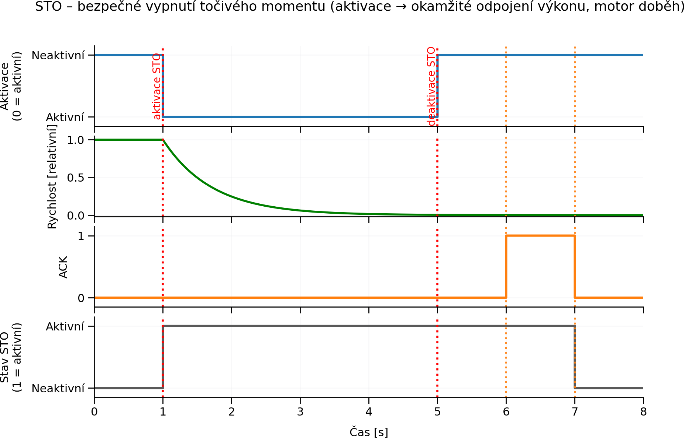{: style="width:100%;" }

## SS1 – bezpečné zastavení 1

Definice podle EN 61800-5-2:

> "Funkce SS1 zabrzdí motor a po uplynutí doby zpoždění aktivuje funkci STO."

Jinými slovy, pohon po zvolení SS1 začne zpomalovat a po uplynutí zpoždění přejde do stavu STO. Stav STO je zvolen vždy po uplynutí časového limitu bez ohledu na to, zda se osa ještě pohybuje, nebo ne.

### Aktivace SS1

Funkci SS1 lze aktivovat kteroukoli z následujících událostí:

- bit SS1 v řídicím slově PROFIsafe nastavený na logickou nulu
- SLP v případě překročení horní/dolní meze polohy a pokud je stop funkce SLP nastavena na SS1
- digitální vstupy (5 a 7 – osa 1, 6 a 8 – osa 2) nastavené na logickou nulu, pokud jsou tak namapovány v bezpečnostních parametrech

### Signalizace SS1

Aktivní stav SS1 lze vyhodnotit pomocí:

- stavového bitu PROFIsafe SS1 nastaveného na logickou jedničku
- digitálních výstupů (3 a 5 – osa 1, 4 a 6 – osa 2) nastavených na logickou nulu, pokud jsou tak namapovány v bezpečnostních parametrech

### Sekvence SS1

1. Funkce SS1 je zvolena buď nastavením bitu SS1 v řídicím slově PROFIsafe do logické nuly, nebo nastavením digitálních vstupů (jsou-li namapovány) do logické nuly.
2. TGZ zastaví pohyb se zpomalením zadaným v bezpečnostních parametrech.
3. Po uplynutí pevně daného času (rovněž zadaného v bezpečnostních parametrech) se aktivuje STO, i když se osa stále pohybuje.

!!! warning "Varování"
    **Po odpojení energetického přívodu (STO aktivní) se může motor nežádoucím způsobem pohybovat (např. doběhnout setrvačností), a tím představovat riziko pro osoby.**

### Restart SS1 (deaktivace)

- Zrušte volbu funkce nastavením bitu SS1 v řídicím slově PROFIsafe do logické 1 a/nebo nastavením obou namapovaných digitálních vstupů do logické 1.
- Potvrďte bezpečnostní událost přepnutím bitu `INTERNAL_EVENT_ACK` v řídicím slově PROFIsafe do logické 1 a poté zpět do logické 0.
- Povolte osu pomocí řídicího slova PROFIdrive (tj. projděte stavový diagram PROFIdrive ze stavu S1 do S4).

### Časový diagram SS1

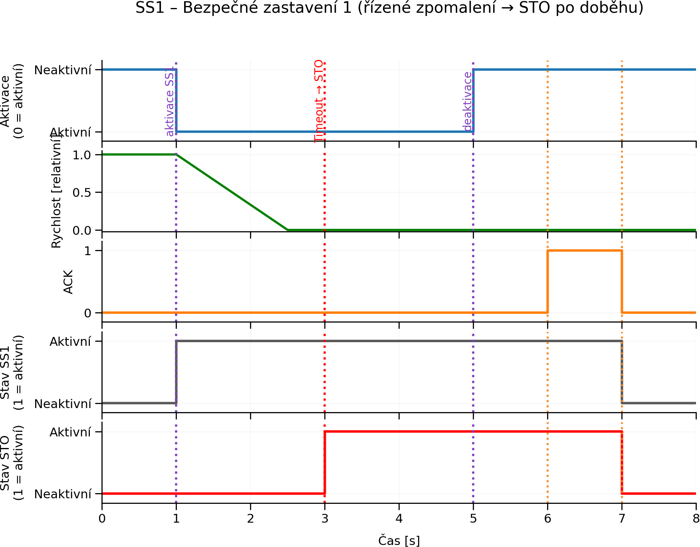{: style="width:100%;" }

## SOS – bezpečné zastavení provozu

Definice podle EN 61800-5-2:

> "Funkce SOS slouží k bezpečnému sledování polohy pohonu v klidu."

!!! note "Poznámka"
    Na rozdíl od funkcí SS1 a SS2 pohon funkce SOS automaticky nebrzdí. Pouze monitoruje polohu v klidu. To znamená, že PLC musí před aktivací funkce SOS zajistit zastavení pohonu.

Motor zůstává napájený a pohon je ve stavu povoleno. Funkce SOS vyvolá reakci, pokud motor po uplynutí časového limitu není v klidu. Kontrola klidu se provádí pomocí **bezpečnostního parametru okno tolerance klidu**.

### Aktivace SOS

Funkci SOS lze aktivovat kteroukoli z následujících událostí:

- bit SOS v řídicím slově PROFIsafe nastavený na logickou nulu
- SLP v případě překročení horní/dolní meze polohy a pokud je stop funkce SLP nastavena na SOS
- digitální vstupy (5 a 7 – osa 1, 6 a 8 – osa 2) nastavené na logickou nulu, pokud jsou tak namapovány v bezpečnostních parametrech

### Signalizace SOS

Aktivní stav SOS lze vyhodnotit pomocí:

- stavového bitu PROFIsafe SOS nastaveného na logickou jedničku
- digitálních výstupů (3 a 5 – osa 1, 4 a 6 – osa 2) nastavených na logickou nulu, pokud jsou tak namapovány v bezpečnostních parametrech

### Sekvence SOS

1. Funkce SOS je zvolena buď nastavením bitu SOS v řídicím slově PROFIsafe do logické nuly, nebo nastavením digitálních vstupů (jsou-li namapovány) do logické nuly.
2. TGZ čeká na uplynutí nastaveného časového limitu. Během této doby musí PLC motor zastavit.
3. Po uplynutí časového limitu TGZ zkontroluje, zda je motor v klidu. Pokud ne, aktivuje se funkce **STO**.

### Restart SOS (deaktivace)

- Zrušte volbu funkce nastavením bitu SOS v řídicím slově PROFIsafe do logické 1 a/nebo nastavením obou namapovaných digitálních vstupů do logické 1.
- Potvrďte bezpečnostní událost přepnutím bitu `INTERNAL_EVENT_ACK` v řídicím slově PROFIsafe do logické 1 a poté zpět do logické 0.
- Pokud byla aktivována funkce STO, musí být osa znovu povolena pomocí řídicího slova PROFIdrive (tj. projděte stavový diagram PROFIdrive ze stavu S1 do S4).

### Časový diagram SOS

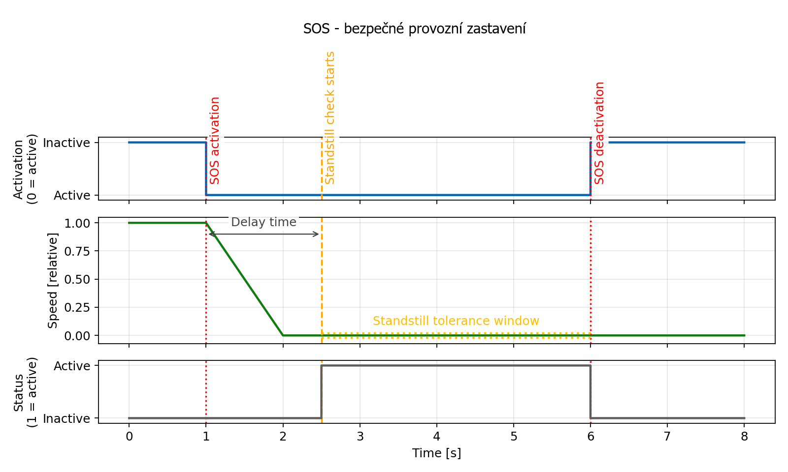{: style="width:100%;" }

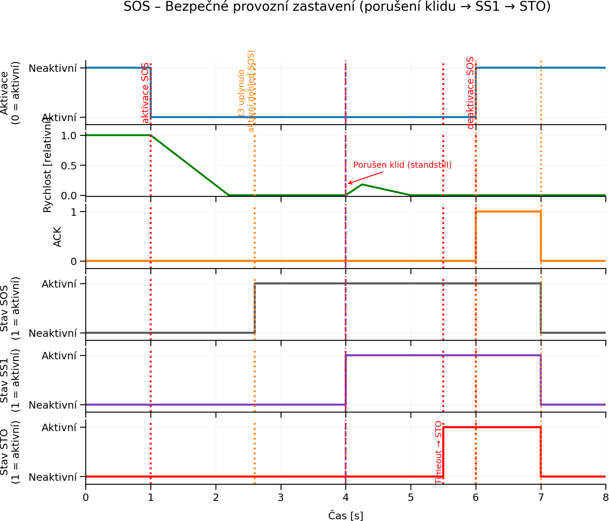{: style="width:100%;" }

## SS2 – bezpečné zastavení 2

Definice podle EN 61800-5-2:

> "Funkce SS2 zabrzdí motor a po uplynutí doby zpoždění aktivuje funkci SOS."

Jinými slovy, pohon po zvolení SS2 začne zpomalovat a po dosažení klidu přejde do stavu SOS. Pokud se nepodaří dosáhnout klidu v požadovaném čase, TGZ vyvolá bezpečnostní reakci **SS1**.

### Aktivace SS2

Funkci SS2 lze aktivovat kteroukoli z následujících událostí:

- bit SS2 v řídicím slově PROFIsafe nastavený na logickou nulu
- SLP v případě překročení horní/dolní meze polohy a pokud je stop funkce SLP nastavena na SS2
- digitální vstupy (5 a 7 – osa 1, 6 a 8 – osa 2) nastavené na logickou nulu, pokud jsou tak namapovány v bezpečnostních parametrech

### Signalizace SS2

Aktivní stav SS2 lze vyhodnotit pomocí:

- stavového bitu PROFIsafe SS2 nastaveného na logickou jedničku
- digitálních výstupů (3 a 5 – osa 1, 4 a 6 – osa 2) nastavených na logickou nulu, pokud jsou tak namapovány v bezpečnostních parametrech

### Sekvence SS2

1. Funkce SS2 je zvolena buď nastavením bitu SS2 v řídicím slově PROFIsafe do logické nuly, nebo nastavením digitálních vstupů (jsou-li namapovány) do logické nuly.
2. TGZ zastaví pohyb se zpomalením zadaným v bezpečnostních parametrech.
3. Pokud je dosažen klid v nastaveném čase, aktivuje se funkce **SOS**.
4. Pokud není klidu dosaženo v nastaveném čase, TGZ vyvolá bezpečnostní reakci **SS1**.

### Restart SS2 (deaktivace)

- Zrušte volbu funkce nastavením bitu SS2 v řídicím slově PROFIsafe do logické 1 a/nebo nastavením obou namapovaných digitálních vstupů do logické 1.
- Potvrďte bezpečnostní událost přepnutím bitu `INTERNAL_EVENT_ACK` v řídicím slově PROFIsafe do logické 1 a poté zpět do logické 0.
- Pokud byla aktivována funkce STO jako následek SS1, musí být osa znovu povolena pomocí řídicího slova PROFIdrive (tj. projděte stavový diagram PROFIdrive ze stavu S1 do S4).

### Časový diagram SS2

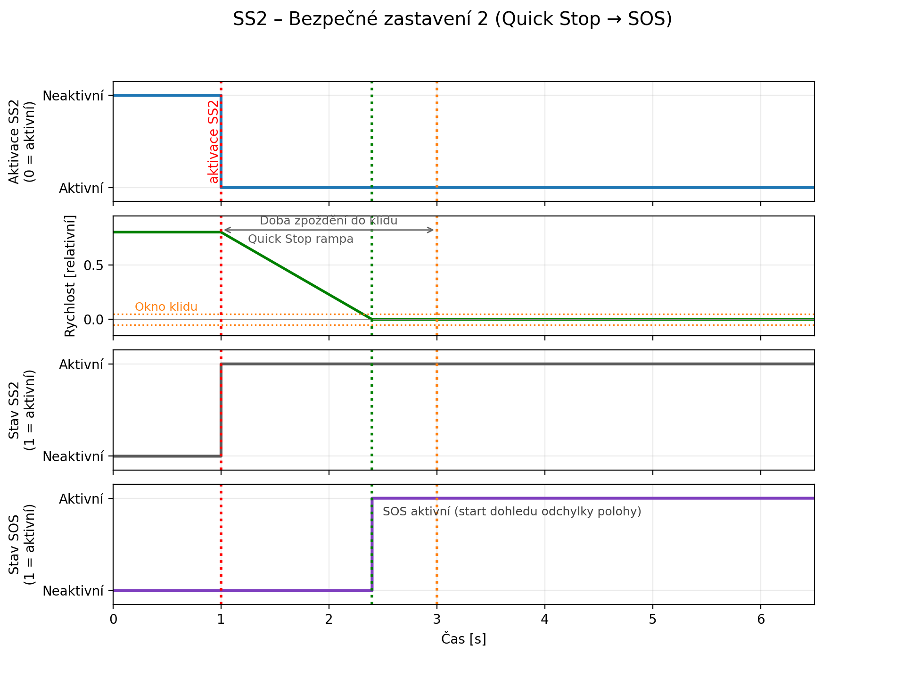{: style="width:100%;" }

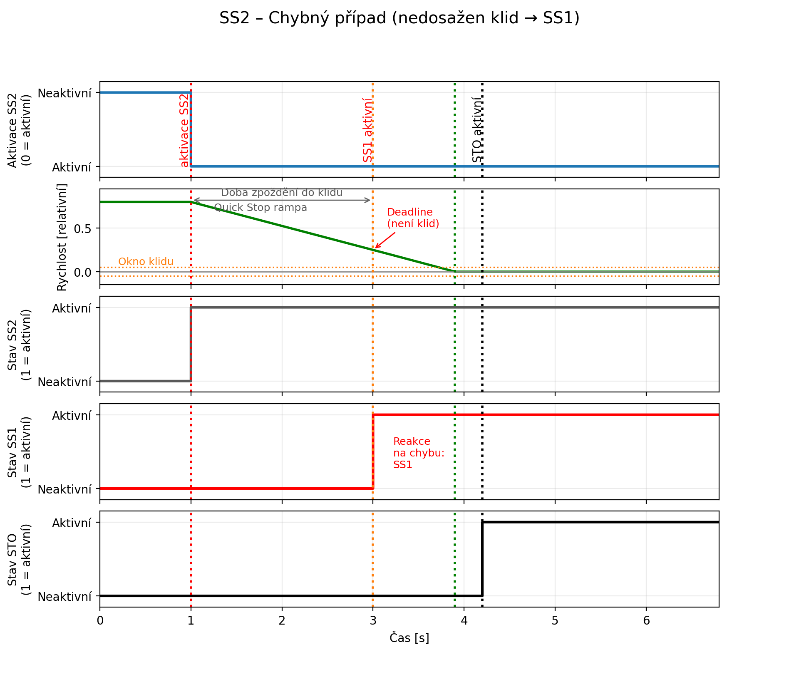{: style="width:100%;" }

## SLS – Bezpečně omezená rychlost

Definice podle EN 61800-5-2:

> "Funkce SLS zabrání tomu, aby motor překročil stanovenou mez rychlosti."

### Aktivace SLS

Funkci SLS lze aktivovat kteroukoli z následujících událostí:

- bit SLS v řídicím slově PROFIsafe nastavený na logickou nulu
- digitální vstupy (5 a 7 – osa 1, 6 a 8 – osa 2) nastavené na logickou nulu, pokud jsou tak namapovány v bezpečnostních parametrech
- trvalá aktivace pomocí bezpečnostních parametrů

### Signalizace SLS

Aktivní stav SLS lze vyhodnotit pomocí:

- stavového bitu PROFIsafe SLS nastaveného na logickou jedničku
- digitálních výstupů (3 a 5 – osa 1, 4 a 6 – osa 2) nastavených na logickou nulu, pokud jsou tak namapovány v bezpečnostních parametrech

### Sekvence SLS

1. Funkce SLS je zvolena buď řídicím slovem PROFIsafe, nebo digitálními vstupy (jsou-li namapovány), případně trvale pomocí bezpečnostních parametrů.
2. TGZ sleduje rychlost motoru po uplynutí definované doby zpoždění.
3. Pokud rychlost překročí základní mezní rychlost (definovanou v `pd_inc/s`), TGZ zahájí bezpečnostní reakci.
4. Reakční posloupnost je **SS2**, **SS1**, **STO**.
5. PROFIsafe telegram 31 umožňuje výběr druhé a třetí úrovně rychlosti (v % základní rychlosti), které musí být nižší než 100 %.
6. Pokud je zvolena nižší úroveň rychlosti, použije se před kontrolou rychlosti další doba zpoždění.
7. Pokud je zvolena vyšší úroveň rychlosti, kontrola se provede okamžitě bez dalšího zpoždění.

**Použité bezpečnostní parametry:**

- Doba zpoždění [ms]
- Základní mezní rychlost [pd_inc/s]
- Zpomalení [pd_inc²/s]
- Druhá, třetí a čtvrtá úroveň rychlosti (výběr pouze přes PROFIsafe)

### Restart SLS (deaktivace)

- Zrušte volbu funkce nastavením bitu SLS v řídicím slově PROFIsafe do logické 1 a/nebo nastavením obou namapovaných digitálních vstupů do logické 1.
- Potvrďte bezpečnostní událost přepnutím bitu `INTERNAL_EVENT_ACK` v řídicím slově PROFIsafe do logické 1 a poté zpět do logické 0.
- Pokud bylo aktivováno STO, povolte osu pomocí řídicího slova PROFIdrive (tj. projděte stavový diagram PROFIdrive ze stavu S1 do S4).

### Časový diagram SLS

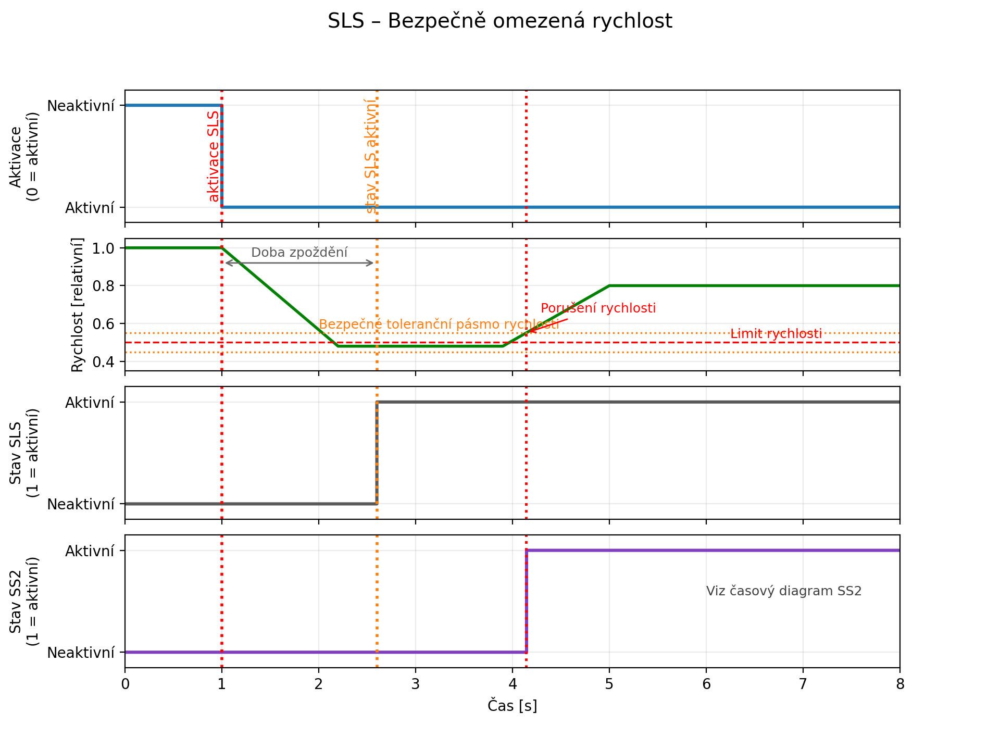{: style="width:100%;" }

## SLP – Bezpečně omezená poloha

Definice podle EN 61800-5-2:

> "Funkce SLP zabrání tomu, aby motor překročil stanovené meze polohy."

### Aktivace SLP

Funkci SLP lze aktivovat kteroukoli z následujících událostí:

- bit SLP v řídicím slově PROFIsafe nastavený na logickou nulu
- digitální vstupy (5 a 7 – osa 1, 6 a 8 – osa 2) nastavené na logickou nulu, pokud jsou tak namapovány v bezpečnostních parametrech
- trvalá aktivace pomocí bezpečnostních parametrů

### Signalizace SLP

Aktivní stav SLP lze vyhodnotit pomocí:

- stavového bitu PROFIsafe SLP nastaveného na logickou jedničku
- digitálních výstupů (3 a 5 – osa 1, 4 a 6 – osa 2) nastavených na logickou nulu, pokud jsou tak namapovány v bezpečnostních parametrech

### Sekvence SLP

1. Funkce SLP je zvolena buď řídicím slovem PROFIsafe, nebo digitálními vstupy (jsou-li namapovány), případně trvale pomocí bezpečnostních parametrů.
2. TGZ sleduje polohu motoru.
3. Pokud poloha překročí nakonfigurované meze, je vyvolána zvolená bezpečnostní reakce.
4. Posloupnost reakce je definována bezpečnostními parametry a může být buď **SS1**, nebo **STO**.

**Použité bezpečnostní parametry:**

- Doba zpoždění [ms]
- Horní a dolní meze pro bezpečnou polohu 1 [pd_inc]
- Horní a dolní meze pro bezpečnou polohu 2 [pd_inc]
- Volba stop funkce: STO nebo SS1

### Restart SLP (deaktivace)

- Zrušte volbu funkce nastavením bitu SLP v řídicím slově PROFIsafe do logické 1 a/nebo nastavením obou namapovaných digitálních vstupů do logické 1.
- Potvrďte bezpečnostní událost přepnutím bitu `INTERNAL_EVENT_ACK` v řídicím slově PROFIsafe do logické 1 a poté zpět do logické 0.
- Pokud bylo aktivováno STO, povolte osu pomocí řídicího slova PROFIdrive (tj. projděte stavový diagram PROFIdrive ze stavu S1 do S4).

### Časový diagram SLP

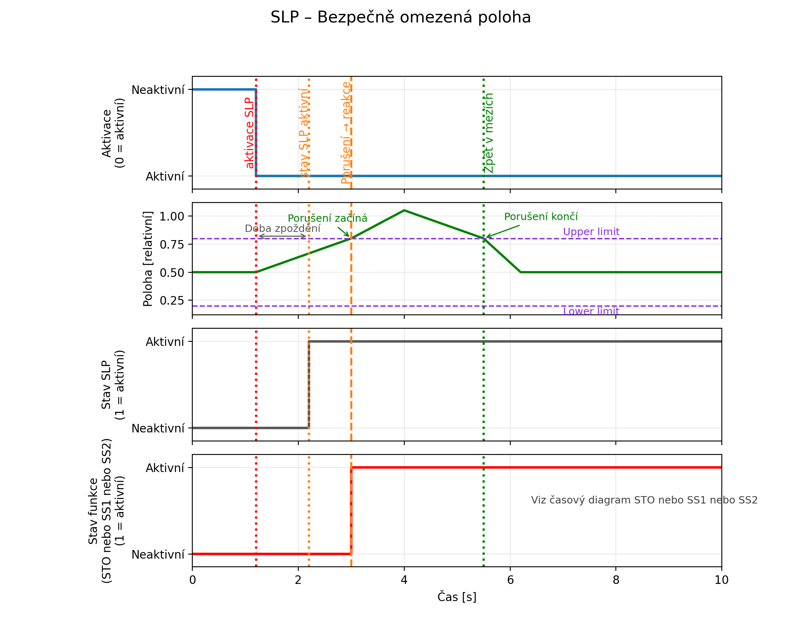{: style="width:100%;" }

> **Reakce SS2 zatím není implementována**

## SDI – Bezpečný směr

> "Funkce SDI sleduje směr otáčení motoru a zabraňuje jeho otáčení v zakázaném směru."

### Aktivace SDI

Funkci SDI lze aktivovat pouze pomocí řídicího slova PROFIsafe. Existují dvě možnosti sledování směru: SDI+ a SDI−. Pokud je zvoleno SDI+, je povolen kladný směr a zakázán záporný směr. Pokud je zvoleno SDI−, je povolen záporný směr a zakázán kladný směr.

### Signalizace SDI

Aktivní stav SDI lze vyhodnotit pomocí stavového bitu PROFIsafe SDI+ / SDI− nastaveného na logickou jedničku. Digitální výstupy nelze pro signalizaci SDI použít.

### Sekvence SDI

1. Funkce SDI je zvolena nastavením bitu SDI+ nebo SDI− v řídicím slově PROFIsafe do logické nuly.
2. TGZ sleduje směr motoru po uplynutí definované doby zpoždění. Směr je vyhodnocován ze znaménka bezpečně zjištěné rychlosti; malé odchylky kolem nuly jsou tolerovány v rámci okna klidu (viz časový diagram).
3. Pokud se motor otáčí v zakázaném směru, TGZ zahájí bezpečnostní reakci **SS2**.
4. V jeden okamžik může být aktivní pouze jedno sledování směru (SDI+ nebo SDI−). Pokud jsou požadovány obě funkce současně, TGZ vyhlásí bezpečnostní chybu.

**Použité bezpečnostní parametry:**

- Doba zpoždění [ms]

### Restart SDI (deaktivace)

- Zrušte volbu funkce nastavením bitu SDI+ nebo SDI− v řídicím slově PROFIsafe do logické 1.
- Potvrďte bezpečnostní událost přepnutím bitu `INTERNAL_EVENT_ACK` v řídicím slově PROFIsafe do logické 1 a poté zpět do logické 0.
- Pokud bylo aktivováno STO (v důsledku SS2/SS1), povolte osu pomocí řídicího slova PROFIdrive (tj. projděte stavový diagram PROFIdrive ze stavu S1 do S4).

### Časový diagram SDI

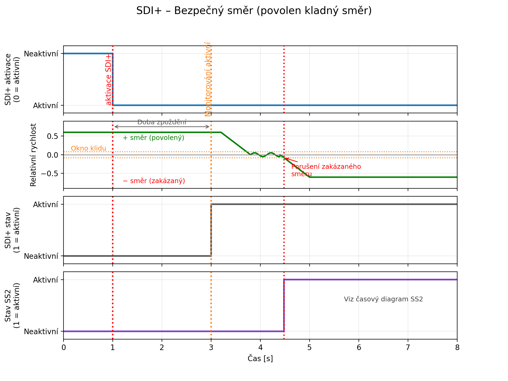{: style="width:100%;" }

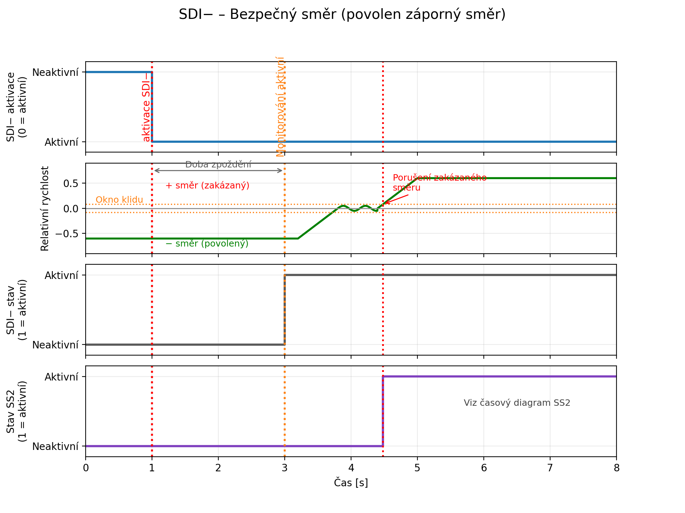{: style="width:100%;" }

## SSM – Bezpečné monitorování rychlosti

> "Funkce SSM sleduje rychlost motoru a signalizuje, zda je mimo stanovený rozsah rychlosti."

To znamená, že SSM je čistě monitorovací funkce bez jakékoli automatické bezpečnostní reakce. Pokud funkce SSM signalizuje porušení limitu, musí PLC zajistit snížení rychlosti pod nastavenou mez.

### Aktivace SSM

Funkci SSM lze aktivovat nastavením bitu SSM v řídicím slově PROFIsafe do logické nuly. Digitální vstupy nelze pro aktivaci SSM použít. Je možná také trvalá aktivace pomocí bezpečnostních parametrů.

### Signalizace SSM

Aktivní stav SSM lze vyhodnotit pomocí stavového bitu PROFIsafe SSM nastaveného na logickou jedničku. Digitální výstupy nelze pro signalizaci SSM použít.

### Sekvence SSM

1. Funkce SSM je zvolena nastavením bitu SSM v řídicím slově PROFIsafe do logické nuly nebo trvale pomocí bezpečnostních parametrů.
2. TGZ sleduje rychlost motoru okamžitě bez jakékoli doby zpoždění.
3. Stav SSM = **1**, pokud je rychlost **nižší** než nakonfigurovaný dolní limit.
4. Stav SSM = **0**, pokud je rychlost **vyšší** než nakonfigurovaný horní limit.

**Použité bezpečnostní parametry:**

- Horní mezní rychlost [rpm]
- Dolní mezní rychlost [rpm]

Dolní limit musí být menší nebo roven hornímu limitu.

### Restart SSM (deaktivace)

- Zrušte volbu funkce nastavením bitu SSM v řídicím slově PROFIsafe do logické 1.
- Není nutné potvrzovat bezpečnostní událost, protože SSM je čistě monitorovací funkce bez bezpečnostní reakce. Při překročení rozsahu rychlosti se nespouští žádná bezpečnostní událost; pouze je stavový bit SSM nastaven na nulu.

### Časový diagram SSM

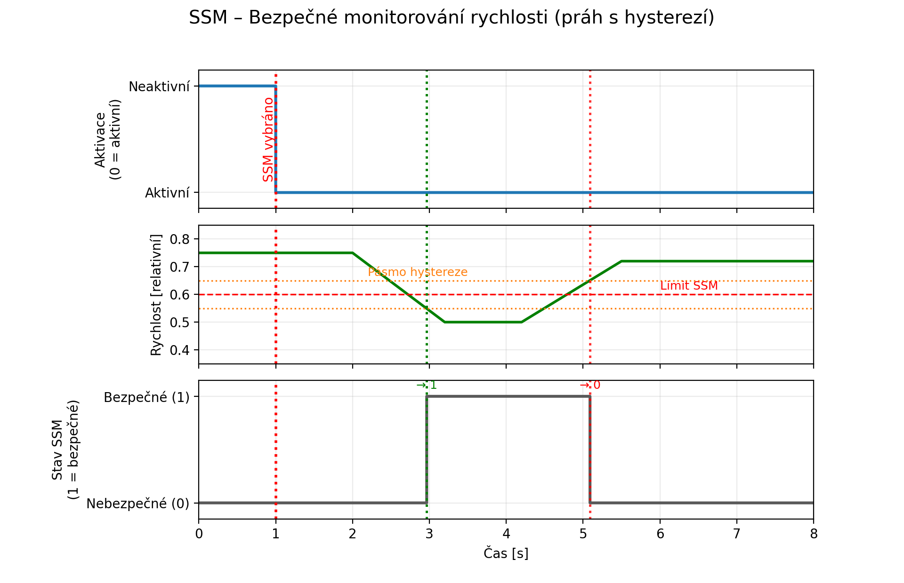{: style="width:100%;" }

## Bezpečnostní parametry

Všechny bezpečnostní parametry lze nastavit pomocí servisního programu TGZ GUI II.

{: style="width:100%;" }

