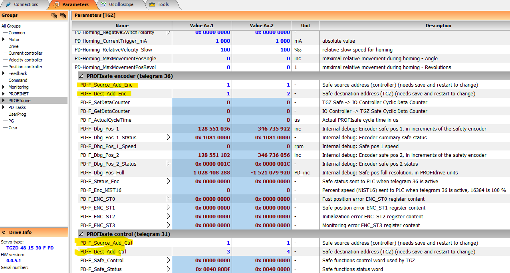
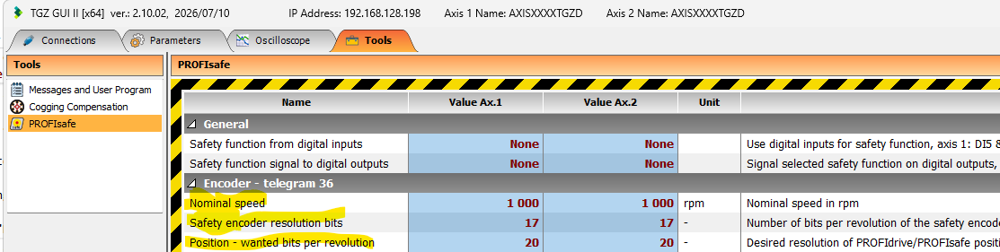
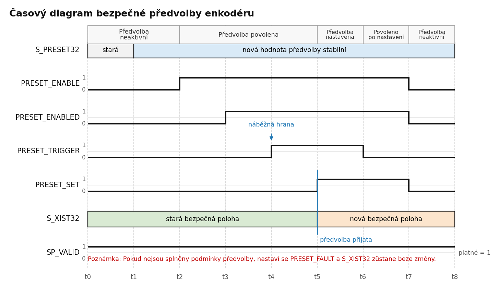

## Obecné informace
 
Pro TGZ je k dispozici volitelný PROFIsafe firmware. Umožňuje používat protokol PROFIsafe pro bezpečnostní komunikaci mezi TGZ a řídicím PLC. Protokol PROFIsafe se používá k aktivaci bezpečnostních funkcí TGZ a ke sledování jejich stavu. Bezpečnostní funkce jsou implementovány bezpečným způsobem pomocí dvou nezávislých procesorů a dvou nezávislých FPGA vypínačů zapojených v sérii. Bezpečnostní funkce lze aktivovat pomocí PROFIsafe, digitálních vstupů nebo trvale pomocí bezpečnostních parametrů. Bezpečnostní funkce jsou definovány podle normy EN 61800-5-2.

PROFIsafe firmware je k dispozici pro všechny varianty TGZD (dvouosé) a pro novou jednoosou variantu TGZ. Existuje pouze jeden soubor firmwaru označený **TGZU5_yymmdd_DSL_PSAFE_hh-mm.tgzfw**, kde písmeno U znamená universal, tedy že stejný soubor firmwaru se používá pro jednoosé i dvouosé varianty. yymmdd je datum vydání firmwaru a hh-mm je čas vydání firmwaru. Soubor firmwaru lze stáhnout z webu TGZ. Aktualizace firmwaru se provádí pomocí servisního programu TGZ GUI II.

Jednoosá varianta TGZ má k dispozici stejné bezpečnostní funkce jako dvouosá varianta, protože obsahuje dva vstupy pro bezpečnostní enkodéry. Existuje také pouze jeden soubor GSDML, **GSDML-V2.44-TGDrives-TGZ-F-yyyymmdd.xml**, používaný pro jednoosé i dvouosé varianty, kde yyyymmdd je datum vydání souboru GSDML. Soubor GSDML lze stáhnout z webu TGZ a musí být importován do programovacího prostředí PLC, aby bylo možné používat funkce PROFIsafe.

!!! warning "Varování"
	**TGZ poskytuje bezpečnostní funkce a bezpečnostně relevantní data, ale výsledný bezpečnostní koncept stroje musí vyhodnotit a validovat výrobce stroje. Bezpečnostní program PLC, zapojení, parametrizace, výběr enkodéru, mechanický systém a doběhové dráhy musí být posouzeny jako součást kompletní bezpečnostní funkce.**

!!! warning "Varování"
	**Bezpečnostní funkce potřebují bezpečnostní enkodér.**

!!! warning "Varování"
	**Normální (non-safety) enkodéry lze použít, ale bezpečnostní funkce nebudou fungovat bezpečným způsobem. Je odpovědností uživatele použít správný enkodér a nastavit správné bezpečnostní parametry.**

!!! warning "Varování"
	**Bezpečnostní funkce jsou aktivní pouze tehdy, pokud jsou správně nakonfigurovány. Musí být nastaveny podle požadavků konkrétní aplikace a zvolených bezpečnostních funkcí. Doporučuje se začít s konzervativními hodnotami a poté je upravit podle testování a validace.**

### Omezení
 
PROFIsafe firmware nepodporuje externí IRC enkodér (konektor X5) a neimplementuje sběrnici CAN (konektor X10).

### Přiřazení telegramů
 
PROFIsafe firmware podporuje následující telegramy pro komunikaci PROFIdrive:

<table>
<tr>
<th> 
Číslo telegramu
</th>
<th> 
Popis
</th>
</tr>
<tr>
<td> 
1
</td>
<td> 
Režim řízení rychlosti (16bitový)
</td>
</tr>
<tr>
<td> 
7
</td>
<td> 
Režim řízení polohy (pouze úlohy)
</td>
</tr>
<tr>
<td> 
9
</td>
<td> 
Režim řízení polohy (úlohy a přímé řízení MDI)
</td>
</tr>
<tr>
<td> 
102
</td>
<td> 
Režim řízení rychlosti s rozšířenými funkcemi
</td>
</tr>
<tr>
<td> 
111
</td>
<td> 
Režim řízení polohy s rozšířenými funkcemi (řízení MDI)
</td>
</tr>
<tr>
<td> 
352
</td>
<td> 
Režim řízení rychlosti s rozšířenými funkcemi
</td>
</tr>
</table>
 
!!! warning "Varování"
	**Telegramy PROFIdrive musí být vybrány pomocí aplikace TGZ_GUI. Po změně musí být TGZ restartováno. Je důležité, aby PLC již mělo v projektu vybrané správné telegramy a bylo spuštěné před restartem TGZ, jinak pohon nebude schopen navázat komunikaci s PLC a nebude pracovat. Toto chování je důležité pouze při změně telegramů, jinak na pořadí zapnutí PLC a TGZ nezáleží.**

PROFIsafe firmware podporuje následující telegramy pro komunikaci PROFIsafe:
<table>
<tr>
<th> 
Číslo telegramu
</th>
<th> 
Popis
</th>
</tr>
<tr>
<td> 
31
</td>
<td> 
Bezpečnostní řídicí a stavový telegram
</td>
</tr>
<tr>
<td> 
36
</td>
<td> 
Telegram bezpečnostního enkodéru
</td>
</tr>
</table>
 
Telegramy PROFIsafe mají své subsloty vyhrazené pro řízení a stav bezpečnostních funkcí, proto je nelze použít pro jiné účely. Telegram 31 se používá pro řízení bezpečnostních funkcí a sledování jejich stavu. Telegram 36 se používá pro sledování hodnot bezpečnostního enkodéru, které jsou využívány funkcemi bezpečného sledování rychlosti a polohy.

Podporovány jsou verze PROFIsafe V2.4 i V2.6. Verze je automaticky detekována TGZ a komunikace je navázána odpovídajícím způsobem.

!!! warning "Varování"
	**V jednom systému nekombinujte různé verze PROFIsafe.**

!!! warning "Varování"
	**Při změně verze PROFIsafe musí být TGZ restartováno.**


#### Zdrojové a cílové adresy PROFIsafe
 
Kromě správného výběru PROFIsafe telegramů musí být pro každý bezpečnostní komunikační vztah správně nakonfigurovány také zdrojové a cílové adresy PROFIsafe.

TGZ podporuje **Address Type 2** podle specifikace PROFIsafe. To znamená, že jako součást identifikace komunikačního vztahu (codename) je kontrolována jak adresa **F_SourceAdd**, tak adresa **F_DestAdd**. Komunikace nebude navázána, pokud nakonfigurované adresy neodpovídají hodnotám očekávaným F-Hostem a TGZ. Ve specifikaci PROFIsafe znamená Address Type 2, že **F_SourceAdd** je kontrolována společně s **F_DestAdd**. Tím je zajištěna dodatečná ochrana proti chybám adresování a záměně komunikačních vztahů.

Adresy musí být v servisním programu **TGZ GUI II** nakonfigurovány samostatně pro každý PROFIsafe telegram:

- **Telegram 31** (bezpečnostní řízení a stav)
- **Telegram 36** (bezpečnostní enkodér)

Pro každý telegram platí:

- **F_SourceAdd** musí obsahovat adresu PROFIsafe kontroleru (F-Host).
- **F_DestAdd** musí obsahovat cílovou adresu přiřazenou odpovídajícímu PROFIsafe telegramu TGZ v projektu PLC.

Nakonfigurované hodnoty musí přesně odpovídat adresám nastaveným v programovacím prostředí PLC. Nesprávné přiřazení adres zabrání komunikaci PROFIsafe přejít do provozního stavu.

!!! warning "Varování"
	Každá změna **F_SourceAdd** nebo **F_DestAdd** vyžaduje uložení konfigurace a restart TGZ, aby se nové hodnoty projevily.



#### Pravidla pro reset a restart
 
Některé změny vyžadují restart TGZ, než se projeví:

<table>
<tr>
<th> 
Změna
</th>
<th> 
Restart vyžadován
</th>
<th> 
Komentář
</th>
</tr>
<tr>
<td> 
Výběr telegramu PROFIdrive
</td>
<td> 
Ano
</td>
<td> 
řídicí jednotka musí být před restartem TGZ již nakonfigurována se správnými telegramy a spuštěna
</td>
</tr>
<tr>
<td> 
Změna verze PROFIsafe
</td>
<td> 
Ano
</td>
<td> 
řídicí jednotka musí být před restartem TGZ již nakonfigurována se správnou verzí PROFIsafe a spuštěna
</td>
</tr>
<tr>
<td> 
Změna F_Source_Add_Enc
</td>
<td> 
Ano
</td>
<td> 
řídicí jednotka musí být nakonfigurována se správnou hodnotou F_Source_Add pro telegram 36
</td>
</tr>
<tr>
<td> 
Změna F_Dest_Add_Enc
</td>
<td> 
Ano
</td>
<td> 
řídicí jednotka musí být nakonfigurována se správnou hodnotou F_Dest_Add pro telegram 36
</td>
</tr>
<tr>
<td> 
Změna F_Source_Add_Ctrl
</td>
<td> 
Ano
</td>
<td> 
řídicí jednotka musí být nakonfigurována se správnou hodnotou F_Source_Add pro telegram 31
</td>
</tr>
<tr>
<td> 
Změna F_Dest_Add_Ctrl
</td>
<td> 
Ano
</td>
<td> 
řídicí jednotka musí být nakonfigurována se správnou hodnotou F_Dest_Add pro telegram 31
</td>
</tr>
<tr>
<td> 
Aktualizace firmwaru
</td>
<td> 
Ano
</td>
<td> 
</td>
</tr>
<tr>
<td> 
Změna bezpečnostních parametrů
</td>
<td> 
Ano
</td>
<td> 
</td>
</tr>
<tr>
<td> 
Potvrzení bezpečnostní události
</td>
<td> 
Ne
</td>
<td> 
</td>
</tr>
</table>

### Který telegram PROFIsafe použít?

<table>
<tr>
<th> 
Požadavek
</th>
<th> 
Telegram 31
</th>
<th> 
Telegram 36
</th>
</tr>
<tr>
<td> 
Aktivace STO, SS1, SS2, SOS, SLS, SLP, SDI, SSM
</td>
<td> 
Ano
</td>
<td> 
Ne
</td>
</tr>
<tr>
<td> 
Sledování aktivních bezpečnostních funkcí
</td>
<td> 
Ano
</td>
<td> 
Ne
</td>
</tr>
<tr>
<td> 
Čtení bezpečné aktuální polohy
</td>
<td> 
Ne
</td>
<td> 
Ano
</td>
</tr>
<tr>
<td> 
Čtení bezpečné aktuální rychlosti
</td>
<td> 
Ne
</td>
<td> 
Ano
</td>
</tr>
<tr>
<td> 
Nastavení předvolby polohy bezpečnostního enkodéru
</td>
<td> 
Ne
</td>
<td> 
Ano
</td>
</tr>
<tr>
<td> 
Potvrzení bezpečnostní události enkodéru
</td>
<td> 
Ne
</td>
<td> 
Ano
</td>
</tr>
</table>
 
!!! note "Poznámka"
	Telegramy 31 a 36 lze používat současně.

## Kontrolní seznam uvedení PROFIsafe do provozu

- Nainstalujte správný PROFIsafe firmware pro TGZ.
- Importujte správný soubor GSDML do programovacího prostředí PLC.
- Vyberte požadovaný telegram PROFIdrive.
- Vyberte PROFIsafe telegram 31 a/nebo telegram 36.
- Nakonfigurujte adresy PROFIsafe a ověřte, že odpovídají projektu PLC:
<table>
<tr>
<th> 
</th>
</tr>
<tr>
<td> 
F_SourceAdd = adresa PROFIsafe kontroleru (F-Host).
</td>
</tr>
<tr>
<td> 
F_DestAdd = cílová adresa odpovídajícího PROFIsafe telegramu TGZ.
</td>
</tr>
<tr>
<td> 
Pokud jsou použity oba telegramy, nakonfigurujte telegram 31 a telegram 36 nezávisle.
</td>
</tr>
<tr>
<td> 
Ověřte, že TGZ GUI II a projekt PLC používají přesně stejné přiřazení adres.
</td>
</tr>
</table>
- Nakonfigurujte bezpečnostní parametry v TGZ GUI II. To je důležité, protože bez správné konfigurace bezpečnostních parametrů nebudou bezpečnostní funkce pracovat očekávaným způsobem a mohou způsobit neočekávané chování, případně TGZ nebude pracovat vůbec. Bezpečnostní parametry musí být nastaveny podle požadavků konkrétní aplikace a zvolených bezpečnostních funkcí. Doporučuje se začít s konzervativními hodnotami a poté je upravit podle testování a validace.
- Ověřte konfiguraci a směr enkodéru.
- Před povolením pohybu otestujte STO.
- Otestujte každou nakonfigurovanou bezpečnostní funkci.
- Uložte a zdokumentujte finální sadu bezpečnostních parametrů.

!!! warning "Varování"
	**Všechny bezpečnostní funkce jsou ve výchozím stavu povoleny. To znamená, že nelze zahájit žádný pohyb, dokud nejsou bezpečnostní funkce správně nakonfigurovány a F-Host není připojen a nepracuje správně.**

### Doporučené validační testy

Po uvedení do provozu by měly být provedeny následující testy:

- Ověřte aktivaci STO přes PROFIsafe.
- Ověřte aktivaci STO z digitálních vstupů, pokud jsou použity.
- Ověřte čas zastavení SS1.
- Ověřte sledování klidu SOS.
- Ověřte reakci na překročení rychlosti SLS.
- Ověřte reakci na překročení mezí SLP.
- Ověřte sledování směru SDI+ a SDI-.
- Ověřte chování stavu SSM.
- Ověřte platnost bezpečné polohy z telegramu 36.
- Ověřte platnost bezpečné rychlosti z telegramu 36.
- Ověřte sekvenci bezpečné předvolby.
- Ověřte chování potvrzení bezpečnostní události.

## Přehled bezpečnostních funkcí

<table>
<tr>
<th> 
Funkce
</th>
<th> 
Sledovaná veličina
</th>
<th> 
Reakce při porušení
</th>
</tr>
<tr>
<td> 
STO
</td>
<td> 
Výstupní moment
</td>
<td> 
Výkonový stupeň je vypnut
</td>
</tr>
<tr>
<td> 
SS1
</td>
<td> 
Časově řízené zastavení
</td>
<td> 
STO po nastaveném zpoždění
</td>
</tr>
<tr>
<td> 
SOS
</td>
<td> 
Poloha v klidu
</td>
<td> 
STO při porušení klidu
</td>
</tr>
<tr>
<td> 
SS2
</td>
<td> 
Řízené zastavení + SOS
</td>
<td> 
STO při porušení klidu
</td>
</tr>
<tr>
<td> 
SLS
</td>
<td> 
Mez rychlosti
</td>
<td> 
Sekvence SS2, SS1, STO
</td>
</tr>
<tr>
<td> 
SLP
</td>
<td> 
Meze polohy
</td>
<td> 
STO nebo SS1 podle bezpečnostních parametrů
</td>
</tr>
<tr>
<td> 
SDI
</td>
<td> 
Směr
</td>
<td> 
SS2
</td>
</tr>
<tr>
<td> 
SSM
</td>
<td> 
Rozsah rychlosti
</td>
<td> 
Pouze monitorování, bez automatické reakce
</td>
</tr>
</table>
 
!!! warning "Varování"
	**Funkce SLP je plně funkční pouze s absolutním víceotáčkovým enkodérem nebo po úspěšném homingu či po nastavení hodnoty enkodéru pomocí předvolby.**

### Způsoby aktivace bezpečnostních funkcí
 
Některé bezpečnostní funkce lze aktivovat pomocí PROFIsafe, digitálních vstupů (DI) nebo oběma způsoby (viz tabulka). Funkce SLS a SLP lze také aktivovat trvale pomocí bezpečnostních parametrů.
<table>
<tr>
<th> 
</th>
<th> 
Funkce
</th>
<th> 
Kategorie
</th>
<th> 
PROFIsafe
</th>
<th> 
DI
</th>
<th> 
Trvale
</th>
</tr>
<tr>
<td> 
STO
</td>
<td> 
Bezpečné vypnutí točivého momentu
</td>
<td> 
Bezpečné zastavení
</td>
<td> 
Ano
</td>
<td> 
Ano
</td>
<td> 
Ne
</td>
</tr>
<tr>
<td> 
SS1
</td>
<td> 
Bezpečné zastavení 1
</td>
<td> 
Bezpečné zastavení
</td>
<td> 
Ano
</td>
<td> 
Ano
</td>
<td> 
Ne
</td>
</tr>
<tr>
<td> 
SOS
</td>
<td> 
Bezpečné zastavení provozu
</td>
<td> 
Bezpečné zastavení
</td>
<td> 
Ano
</td>
<td> 
Ano
</td>
<td> 
Ne
</td>
</tr>
<tr>
<td> 
SS2
</td>
<td> 
Bezpečné zastavení 2
</td>
<td> 
Bezpečné zastavení
</td>
<td> 
Ano
</td>
<td> 
Ano
</td>
<td> 
Ne
</td>
</tr>
<tr>
<td> 
SLS
</td>
<td> 
Bezpečně omezená rychlost
</td>
<td> 
Bezpečná rychlost
</td>
<td> 
Ano
</td>
<td> 
Ano
</td>
<td> 
Ano
</td>
</tr>
<tr>
<td> 
SLP
</td>
<td> 
Bezpečně omezená poloha
</td>
<td> 
Bezpečná poloha
</td>
<td> 
Ano
</td>
<td> 
Ano
</td>
<td> 
Ano
</td>
</tr>
<tr>
<td> 
SDI
</td>
<td> 
Bezpečný směr
</td>
<td> 
Bezpečná rychlost
</td>
<td> 
Ano
</td>
<td> 
Ne
</td>
<td> 
Ne
</td>
</tr>
<tr>
<td> 
SSM
</td>
<td> 
Bezpečné monitorování rychlosti
</td>
<td> 
Bezpečná rychlost
</td>
<td> 
Ano
</td>
<td> 
Ne
</td>
<td> 
Ano
</td>
</tr>
</table>

#### Aktivace pomocí PROFIsafe

Lze aktivovat jednu nebo více bezpečnostních funkcí. Používá se standardní PROFIsafe telegram 31. K dispozici je standardní knihovna LdrvSafe_SinaTlg31. Telegram 31 umožňuje detailní řízení jednotlivých bezpečnostních funkcí pomocí doplňkových parametrů a vrací bezpečnostní stav aktuálně aktivních funkcí.

#### Aktivace pomocí digitálních vstupů

Každá osa může používat dva vyhrazené piny digitálních vstupů pro vyvolání bezpečnostní funkce. V jeden okamžik lze aktivovat pouze **jednu** funkci. Výběr se provádí pomocí bezpečnostních parametrů nezávisle pro každou osu. První osa používá piny digitálních vstupů DI 5 a DI 7, druhá osa používá piny DI6 a DI8. Funkce je aktivní při nastavení uvedených pinů do logické nuly. Oba vstupy (DI5 a DI7 nebo DI6 a DI8) se musí změnit současně do 10 ms. Pokud je tento čas překročen, bezpečnostní funkce zůstane aktivována trvale až do restartu TGZ.

#### Trvalý výběr bezpečnostní funkce

Dvě bezpečnostní funkce lze zvolit také trvale pomocí bezpečnostních parametrů: Bezpečně omezená rychlost (SLS) a Bezpečně omezená poloha (SLP). Funkce SLS může pracovat současně s řízením přes PROFIsafe – pomocí telegramu 31 lze vybírat až čtyři různé procentní hodnoty omezené rychlosti. Naproti tomu trvale aktivovaná SLP aktivovaná přes DI vždy používá pouze bezpečnou polohu 1.

#### Signalizace aktivní bezpečnostní funkce pomocí digitálních výstupů

Piny digitálních výstupů 3 a 5 pro první osu nebo 4 a 6 pro druhou osu lze zvolit pro signalizaci vybrané bezpečnostní funkce. Pro signalizaci lze zvolit pouze **jednu** funkci. Funkce běžných digitálních výstupů pak není k dispozici. Aktivní bezpečnostní funkce je signalizována nastavením obou výstupů do logické nuly.

### Princip činnosti

Všechny bezpečnostní funkce předpokládají, že řídicí PLC vyvolá požadovanou akci. TGZ sleduje rychlost a/nebo polohu a v případě nesplnění podmínek vyvolá příslušnou bezpečnostní reakci. Kromě toho při zvolení bezpečnostní funkce TGZ interně aktivuje i požadovanou stop akci. TGZ může navíc aktivovat omezení rychlosti a/nebo polohy, tato funkčnost však nespadá do bezpečnostního rozsahu.

Monitorování bezpečnostních funkcí se provádí bezpečným způsobem pomocí dvou nezávislých procesorů.

Odpojení výkonového výstupu motoru se provádí bezpečným způsobem pomocí dvou nezávislých FPGA vypínačů zapojených v sérii.

> Jakákoli bezpečnostní událost je signalizována bitem `INTERNAL_EVENT` ve stavovém slově PROFIsafe. Konkrétní událost je signalizována stavovými bity PROFIsafe a/nebo digitálními výstupy (pokud jsou namapovány). Bezpečnostní událost musí být potvrzena přepnutím bitu `INTERNAL_EVENT_ACK` v řídicím slově do logické 1 a poté zpět do logické 0.

### Polarita signálů

Mnoho požadavkových bitů bezpečnostních funkcí je aktivních v logické nule. To znamená, že bezpečnostní funkce je zvolena, když je odpovídající řídicí bit PROFIsafe nastaven na logickou 0.

Toto chování je záměrné a odpovídá principu fail-safe: pokud dojde ke ztrátě komunikace nebo se bezpečná výstupní data stanou neplatnými, pohon přejde do bezpečného stavu.

## Bezpečné vypnutí točivého momentu – STO

Kromě již dostupné hardwarové bezpečnostní funkce STO, která má své vyhrazené vstupní piny, je k dispozici další STO. Funkce STO vypne výstup pohonu, který napájí motor.

### Aktivace STO

Funkci STO lze aktivovat kterýmkoli z následujících vstupů nebo událostí:

- bit STO v řídicím slově PROFIsafe nastavený na logickou nulu
- SS1
- SS2 v případě selhání sledování nulové rychlosti
- SOS v případě selhání sledování nulové rychlosti
- SLS v případě překročení prahové rychlosti
- SLP v případě překročení horní/dolní meze polohy a pokud je stop funkce SLP nastavena na STO
- SDI v případě porušení směru
- digitální vstupy (5 a 7 – osa 1, 6 a 8 – osa 2) nastavené na logickou nulu, pokud jsou tak namapovány v bezpečnostních parametrech

### Signalizace STO

Aktivní stav STO lze vyhodnotit pomocí:

- stavového bitu PROFIsafe STO nastaveného na logickou jedničku
- digitálních výstupů (3 a 5 – osa 1, 4 a 6 – osa 2) nastavených na logickou nulu, pokud jsou tak namapovány v bezpečnostních parametrech

### Sekvence STO

Při aktivaci STO se současně provedou následující akce:

- výstupní výkonový stupeň je nastaven na nulu
- osa je zakázána (software disable) a její stav PROFIdrive přejde do S1 – **Switching On Inhibited**
- rychlost motoru klesne na nulu a motor nelze náhodně spustit

!!! warning "Varování"
	**Po odpojení energetického přívodu (STO aktivní) se může motor nežádoucím způsobem pohybovat (např. doběhnout setrvačností), a tím představovat riziko pro osoby.**

### Restart STO (deaktivace)

- Zrušte volbu funkce nastavením bitu STO v řídicím slově PROFIsafe do logické 1 a/nebo nastavením obou namapovaných digitálních vstupů do logické 1.
- Potvrďte bezpečnostní událost přepnutím bitu `INTERNAL_EVENT_ACK` v řídicím slově PROFIsafe do logické 1 a poté zpět do logické 0.
- Povolte osu pomocí řídicího slova PROFIdrive (tj. projděte stavový diagram PROFIdrive ze stavu S1 do S4).

### Časový diagram STO


## SS1 – časově řízené bezpečné zastavení

Definice podle EN 61800-5-2:

> "Funkce SS1 zabrzdí motor a po uplynutí doby zpoždění aktivuje funkci STO."

Jinými slovy, pohon po zvolení SS1 začne zpomalovat a po uplynutí zpoždění přejde do stavu STO. Stav STO je zvolen vždy po uplynutí časového limitu bez ohledu na to, zda se osa ještě pohybuje, nebo ne. Zpomalení je určeno registrem TGZ D-EmerDecRamp.

### Aktivace SS1

Funkci SS1 lze aktivovat kteroukoli z následujících událostí:

- bit SS1 v řídicím slově PROFIsafe nastavený na logickou nulu
- SLP v případě překročení horní/dolní meze polohy a pokud je stop funkce SLP nastavena na SS1
- digitální vstupy (5 a 7 – osa 1, 6 a 8 – osa 2) nastavené na logickou nulu, pokud jsou tak namapovány v bezpečnostních parametrech

### Signalizace SS1

Aktivní stav SS1 lze vyhodnotit pomocí:

- stavového bitu PROFIsafe SS1 nastaveného na logickou jedničku
- digitálních výstupů (3 a 5 – osa 1, 4 a 6 – osa 2) nastavených na logickou nulu, pokud jsou tak namapovány v bezpečnostních parametrech

### Sekvence SS1

1. Funkce SS1 je zvolena buď nastavením bitu SS1 v řídicím slově PROFIsafe do logické nuly, nebo nastavením digitálních vstupů (jsou-li namapovány) do logické nuly.
2. TGZ zastaví pohyb se zpomalením zadaným v bezpečnostních parametrech.
3. Po uplynutí pevně daného času (rovněž zadaného v bezpečnostních parametrech) se aktivuje STO, i když se osa stále pohybuje.

!!! warning "Varování"
    **Po odpojení energetického přívodu (STO aktivní) se může motor nežádoucím způsobem pohybovat (např. doběhnout setrvačností), a tím představovat riziko pro osoby.**

### Restart SS1 (deaktivace)

- Zrušte volbu funkce nastavením bitu SS1 v řídicím slově PROFIsafe do logické 1 a/nebo nastavením obou namapovaných digitálních vstupů do logické 1.
- Potvrďte bezpečnostní událost přepnutím bitu `INTERNAL_EVENT_ACK` v řídicím slově PROFIsafe do logické 1 a poté zpět do logické 0.
- Povolte osu pomocí řídicího slova PROFIdrive (tj. projděte stavový diagram PROFIdrive ze stavu S1 do S4).

### Časový diagram SS1
 


## SOS – bezpečné zastavení provozu

Definice podle EN 61800-5-2:

> "Funkce SOS slouží k bezpečnému sledování polohy pohonu v klidu."

!!! note "Poznámka"
	Na rozdíl od funkcí SS1 a SS2 funkce SOS pohon automaticky nebrzdí. Pouze monitoruje polohu v klidu. To znamená, že PLC musí před aktivací funkce SOS zajistit zastavení pohonu.

Motor zůstává napájený a pohon je ve stavu povoleno. Funkce SOS vyvolá reakci, pokud motor po uplynutí časového limitu není v klidu. Kontrola klidu se provádí pomocí **bezpečnostního parametru okno tolerance klidu**.

### Aktivace SOS

Funkci SOS lze aktivovat kteroukoli z následujících událostí:

- bit SOS v řídicím slově PROFIsafe nastavený na logickou nulu
- SLP v případě překročení horní/dolní meze polohy a pokud je stop funkce SLP nastavena na SOS
- digitální vstupy (5 a 7 – osa 1, 6 a 8 – osa 2) nastavené na logickou nulu, pokud jsou tak namapovány v bezpečnostních parametrech

### Signalizace SOS
 
Aktivní stav SOS lze vyhodnotit pomocí:

- stavového bitu PROFIsafe SOS nastaveného na logickou jedničku
- digitálních výstupů (3 a 5 – osa 1, 4 a 6 – osa 2) nastavených na logickou nulu, pokud jsou tak namapovány v bezpečnostních parametrech

### Sekvence SOS

1. Funkce SOS je zvolena buď nastavením bitu SOS v řídicím slově PROFIsafe do logické nuly, nebo nastavením digitálních vstupů (jsou-li namapovány) do logické nuly.
2. TGZ čeká na uplynutí nastaveného časového limitu. Během této doby musí PLC motor zastavit.
3. Po uplynutí časového limitu TGZ zkontroluje, zda je motor v klidu. Pokud ne, aktivuje se funkce **STO**.

### Restart SOS (deaktivace)

- Zrušte volbu funkce nastavením bitu SOS v řídicím slově PROFIsafe do logické 1 a/nebo nastavením obou namapovaných digitálních vstupů do logické 1.
- Potvrďte bezpečnostní událost přepnutím bitu `INTERNAL_EVENT_ACK` v řídicím slově PROFIsafe do logické 1 a poté zpět do logické 0.
- Pokud byla aktivována funkce STO, musí být osa znovu povolena pomocí řídicího slova PROFIdrive (tj. projděte stavový diagram PROFIdrive ze stavu S1 do S4).

### Časový diagram SOS


## SS2 – bezpečné zastavení 2

Definice podle EN 61800-5-2:

> "Funkce SS2 zabrzdí motor a po uplynutí doby zpoždění aktivuje funkci SOS."

Jinými slovy, pohon po zvolení SS2 začne zpomalovat a po uplynutí časového limitu zkontroluje, zda je motor v klidu (SOS). Zpomalení je určeno registrem TGZ D-EmerDecRamp. Pokud se nepodaří dosáhnout klidu v požadovaném čase, TGZ vyvolá bezpečnostní reakci **SS1**.

### Aktivace SS2

Funkci SS2 lze aktivovat kteroukoli z následujících událostí:

- bit SS2 v řídicím slově PROFIsafe nastavený na logickou nulu
- SLP v případě překročení horní/dolní meze polohy a pokud je stop funkce SLP nastavena na SS2
- digitální vstupy (5 a 7 – osa 1, 6 a 8 – osa 2) nastavené na logickou nulu, pokud jsou tak namapovány v bezpečnostních parametrech

### Signalizace SS2

Aktivní stav SS2 lze vyhodnotit pomocí:

- stavového bitu PROFIsafe SS2 nastaveného na logickou jedničku
- digitálních výstupů (3 a 5 – osa 1, 4 a 6 – osa 2) nastavených na logickou nulu, pokud jsou tak namapovány v bezpečnostních parametrech

### Sekvence SS2

1. Funkce SS2 je zvolena buď nastavením bitu SS2 v řídicím slově PROFIsafe do logické nuly, nebo nastavením digitálních vstupů (jsou-li namapovány) do logické nuly.
2. TGZ zastaví pohyb se zpomalením zadaným v bezpečnostních parametrech.
3. Když uplyne časový limit nebo je motor v klidu, aktivuje se trvalá kontrola nulové rychlosti (funkce SOS).
4. Pokud motor není v klidu, aktivuje se funkce **STO**.

### Restart SS2 (deaktivace)

- Zrušte volbu funkce nastavením bitu SS2 v řídicím slově PROFIsafe do logické 1 a/nebo nastavením obou namapovaných digitálních vstupů do logické 1.
- Potvrďte bezpečnostní událost přepnutím bitu `INTERNAL_EVENT_ACK` v řídicím slově PROFIsafe do logické 1 a poté zpět do logické 0.
- Pokud byla aktivována funkce STO, musí být osa znovu povolena pomocí řídicího slova PROFIdrive (tj. projděte stavový diagram PROFIdrive ze stavu S1 do S4).

### Časový diagram SS2


## SLS – Bezpečně omezená rychlost

Definice podle EN 61800-5-2:

> "Funkce SLS zabrání tomu, aby motor překročil stanovenou mez rychlosti."

### Aktivace SLS
 
Funkci SLS lze aktivovat kteroukoli z následujících událostí:

- bit SLS v řídicím slově PROFIsafe nastavený na logickou nulu
- digitální vstupy (5 a 7 – osa 1, 6 a 8 – osa 2) nastavené na logickou nulu, pokud jsou tak namapovány v bezpečnostních parametrech
- trvalá aktivace pomocí bezpečnostních parametrů

### Signalizace SLS
 
Aktivní stav SLS lze vyhodnotit pomocí:

- stavového bitu PROFIsafe SLS nastaveného na logickou jedničku
- digitálních výstupů (3 a 5 – osa 1, 4 a 6 – osa 2) nastavených na logickou nulu, pokud jsou tak namapovány v bezpečnostních parametrech

### Sekvence SLS

1. Funkce SLS je zvolena buď řídicím slovem PROFIsafe, nebo digitálními vstupy (jsou-li namapovány), případně trvale pomocí bezpečnostních parametrů.
2. TGZ sleduje rychlost motoru po uplynutí definované doby zpoždění.
3. Pokud rychlost překročí základní mezní rychlost (definovanou v pd_inc/s), TGZ zahájí bezpečnostní reakci.
4. Reakcí je sekvence **SS2**, **SS1**, **STO**.
5. PROFIsafe telegram 31 umožňuje výběr druhé, třetí nebo čtvrté úrovně rychlosti.
6. Pokud je zvolena nižší úroveň rychlosti, použije se před kontrolou rychlosti další doba zpoždění.
7. Pokud je zvolena vyšší úroveň rychlosti, kontrola se provede okamžitě bez dalšího zpoždění.

**Použité bezpečnostní parametry:**

- Doba zpoždění \[ms\]
- Základní mezní rychlost \[pd_inc/s\]
- Zpomalení \[pd_inc²/s\]
- Druhá, třetí a čtvrtá úroveň rychlosti (výběr pouze přes PROFIsafe)

### Restart SLS (deaktivace)

- Zrušte volbu funkce nastavením bitu SLS v řídicím slově PROFIsafe do logické 1 a/nebo nastavením obou namapovaných digitálních vstupů do logické 1.
- Potvrďte bezpečnostní událost přepnutím bitu `INTERNAL_EVENT_ACK` v řídicím slově PROFIsafe do logické 1 a poté zpět do logické 0.
- Pokud bylo aktivováno STO, povolte osu pomocí řídicího slova PROFIdrive (tj. projděte stavový diagram PROFIdrive ze stavu S1 do S4).

### Časový diagram SLS


## SLP – Bezpečně omezená poloha

Definice podle EN 61800-5-2:

> "Funkce SLP zabrání tomu, aby motor překročil stanovené meze polohy."

### Aktivace SLP

Funkci SLP lze aktivovat kteroukoli z následujících událostí:

- bit SLP v řídicím slově PROFIsafe nastavený na logickou nulu
- digitální vstupy (5 a 7 – osa 1, 6 a 8 – osa 2) nastavené na logickou nulu, pokud jsou tak namapovány v bezpečnostních parametrech
- trvalá aktivace pomocí bezpečnostních parametrů

### Signalizace SLP

Aktivní stav SLP lze vyhodnotit pomocí:

- stavového bitu PROFIsafe SLP nastaveného na logickou jedničku
- digitálních výstupů (3 a 5 – osa 1, 4 a 6 – osa 2) nastavených na logickou nulu, pokud jsou tak namapovány v bezpečnostních parametrech

### Sekvence SLP

1. Funkce SLP je zvolena buď řídicím slovem PROFIsafe, nebo digitálními vstupy (jsou-li namapovány), případně trvale pomocí bezpečnostních parametrů.
2. TGZ sleduje polohu motoru.
3. Pokud poloha překročí nakonfigurované meze, je vyvolána zvolená bezpečnostní reakce.
4. Posloupnost reakce je definována bezpečnostními parametry a může být buď **SS1**, nebo **STO**.

**Použité bezpečnostní parametry:**

- Doba zpoždění \[ms\]
- Horní a dolní meze pro bezpečnou polohu 1 \[pd_inc\]
- Horní a dolní meze pro bezpečnou polohu 2 \[pd_inc\]
- Volba stop funkce: STO nebo SS1

### Restart SLP (deaktivace)

- Zrušte volbu funkce nastavením bitu SLP v řídicím slově PROFIsafe do logické 1 a/nebo nastavením obou namapovaných digitálních vstupů do logické 1.
- Potvrďte bezpečnostní událost přepnutím bitu `INTERNAL_EVENT_ACK` v řídicím slově PROFIsafe do logické 1 a poté zpět do logické 0.
- Pokud bylo aktivováno STO, povolte osu pomocí řídicího slova PROFIdrive (tj. projděte stavový diagram PROFIdrive ze stavu S1 do S4).

### Časový diagram SLP

[SLP img](../../../../source/img/SLP_timing_diagram_CZ.png)

> **Reakce SS2 zatím není implementována**

## SDI – Bezpečný směr

> "Funkce SDI sleduje směr otáčení motoru a zabraňuje jeho otáčení v zakázaném směru."

### Aktivace SDI

Funkci SDI lze aktivovat pouze pomocí řídicího slova PROFIsafe. Existují dvě možnosti sledování směru: SDI+ a SDI-. Pokud je zvoleno SDI+, je povolen kladný směr a zakázán záporný směr. Pokud je zvoleno SDI-, je povolen záporný směr a zakázán kladný směr.

### Signalizace SDI

Aktivní stav SDI lze vyhodnotit pomocí stavového bitu PROFIsafe SDI+ / SDI- nastaveného na logickou jedničku. Digitální výstupy nelze pro signalizaci SDI použít.

### Sekvence SDI

1. Funkce SDI je zvolena nastavením bitu SDI+ nebo SDI- v řídicím slově PROFIsafe do logické nuly.
2. TGZ sleduje směr motoru po uplynutí definované doby zpoždění. Směr je vyhodnocován ze znaménka bezpečně zjištěné rychlosti; malé odchylky kolem nuly jsou tolerovány v rámci okna klidu (viz časový diagram).
3. Pokud se motor otáčí v zakázaném směru, TGZ zahájí bezpečnostní reakci **SS2**.
4. V jeden okamžik může být aktivní pouze jedno sledování směru (SDI+ nebo SDI-). Pokud jsou zvoleny obě funkce, je to považováno za chybu a okamžitě se aktivuje **STO**.

**Použité bezpečnostní parametry:**

- Doba zpoždění \[ms\]

### Restart SDI (deaktivace)

- Zrušte volbu funkce nastavením bitu SDI+ nebo SDI- v řídicím slově PROFIsafe do logické 1.
- Potvrďte bezpečnostní událost přepnutím bitu `INTERNAL_EVENT_ACK` v řídicím slově PROFIsafe do logické 1 a poté zpět do logické 0.
- Pokud bylo aktivováno STO (v důsledku SS2), povolte osu pomocí řídicího slova PROFIdrive (tj. projděte stavový diagram PROFIdrive ze stavu S1 do S4).

### Časový diagram SDI


## SSM – Bezpečné monitorování rychlosti

> "Funkce SSM sleduje rychlost motoru a signalizuje, zda je mimo stanovený rozsah rychlosti."

To znamená, že SSM je čistě monitorovací funkce bez jakékoli automatické bezpečnostní reakce. Pokud funkce SSM signalizuje porušení limitu, musí PLC zajistit snížení rychlosti pod nastavenou mez.

### Aktivace SSM

Funkci SSM lze aktivovat nastavením bitu SSM v řídicím slově PROFIsafe do logické nuly. Digitální vstupy nelze pro aktivaci SSM použít. Je možná také trvalá aktivace pomocí bezpečnostních parametrů.

### Signalizace SSM

Aktivní stav SSM lze vyhodnotit pomocí stavového bitu PROFIsafe SSM nastaveného na logickou jedničku. Digitální výstupy nelze pro signalizaci SSM použít.

### Sekvence SSM

1. Funkce SSM je zvolena nastavením bitu SSM v řídicím slově PROFIsafe do logické nuly nebo trvale pomocí bezpečnostních parametrů.
2. TGZ sleduje rychlost motoru okamžitě bez jakékoli doby zpoždění.
3. Stav SSM = **1**, pokud je rychlost **nižší** než nakonfigurovaný dolní limit.
4. Stav SSM = **0**, pokud je rychlost **vyšší** než nakonfigurovaný horní limit.

**Použité bezpečnostní parametry:**

- Horní mezní rychlost \[rpm\]
- Dolní mezní rychlost \[rpm\]

Dolní limit musí být menší nebo roven hornímu limitu.

### Restart SSM (deaktivace)

- Zrušte volbu funkce nastavením bitu SSM v řídicím slově PROFIsafe do logické 1.
- Není nutné potvrzovat bezpečnostní událost, protože SSM je čistě monitorovací funkce bez bezpečnostní reakce. Při překročení rozsahu rychlosti se nespouští žádná bezpečnostní událost; pouze je stavový bit SSM nastaven na nulu.

### Časový diagram SSM


## Bezpečnostní parametry

Všechny bezpečnostní parametry lze nastavit pomocí servisního programu TGZ GUI II.


Před nastavením bezpečnostních parametrů je nutné se k servopohonu přihlásit heslem (záložka **Tools**, položka **PROFIsafe**, tlačítko **Login** vpravo dole). Výchozí heslo je **tgzsafe** a uživatel jej může změnit. Při změně hesla je důležité si heslo zapamatovat, protože bez něj nelze k bezpečnostním parametrům přistupovat a bezpečnostní funkce nelze správně nakonfigurovat.

!!! warning "Varování"
	**Pokud je heslo ztraceno, musí být TGZ zasláno výrobci k resetování hesla, což znamená dodatečné náklady a čas. Lokální reset hesla není možný.**

## Bezpečnostní enkodéry (telegram 36)

Telegram 36 se používá pro výměnu dat bezpečnostního enkodéru přes PROFIsafe. Poskytuje bezpečnou aktuální polohu, bezpečnou aktuální rychlost, stavové slovo bezpečnostního enkodéru a řídicí slovo bezpečnostního enkodéru. Umožňuje také PLC nastavit novou bezpečnou aktuální polohu pomocí mechanismu bezpečné předvolby.

!!! warning "Varování"
	Je nutné správně nastavit rozlišení bezpečnostního enkodéru v bezpečnostních parametrech pomocí programu TGZ GUI II, aby se zajistilo správné fungování telegramu 36. Program zobrazuje doporučené hodnoty, ale je odpovědností uživatele nastavit hodnotu ručně. Pokud je rozlišení nastaveno nesprávně, vede to k neplatným hodnotám polohy a rychlosti, což může způsobit nečekané chování pohonu a představovat riziko.

!!! note "Poznámka"
	Pro telegram 36 v současné době neexistuje standardní knihovní blok Siemens TIA Portal. Programátor F-PLC proto musí data telegramu 36 namapovat a vyhodnocovat přímo v bezpečnostním programu.

### Struktura telegramu 36

Telegram 36 obsahuje následující signály bezpečnostního enkodéru:
<table>
<tr>
<th> 
Směr
</th>
<th> 
Signál
</th>
<th> 
Velikost
</th>
<th> 
Popis
</th>
</tr>
<tr>
<td> 
PLC → TGZ
</td>
<td> 
S_STW1_ENC
</td>
<td> 
16 bitů
</td>
<td> 
Řídicí slovo bezpečnostního enkodéru
</td>
</tr>
<tr>
<td> 
PLC → TGZ
</td>
<td> 
S_PRESET32
</td>
<td> 
32 bitů
</td>
<td> 
Hodnota bezpečné předvolby polohy
</td>
</tr>
<tr>
<td> 
TGZ → PLC
</td>
<td> 
S_ZSW1_ENC
</td>
<td> 
16 bitů
</td>
<td> 
Stavové slovo bezpečnostního enkodéru
</td>
</tr>
<tr>
<td> 
TGZ → PLC
</td>
<td> 
S_XIST32
</td>
<td> 
32 bitů
</td>
<td> 
Bezpečná aktuální poloha
</td>
</tr>
<tr>
<td> 
TGZ → PLC
</td>
<td> 
S_NIST16
</td>
<td> 
16 bitů
</td>
<td> 
Bezpečná aktuální rychlost
</td>
</tr>
</table>
 
Celková velikost procesních dat PROFIsafe telegramu 36 je:
<table>
<tr>
<th> 
Směr
</th>
<th> 
Velikost uživatelských dat
</th>
<th> 
Obsah
</th>
</tr>
<tr>
<td> 
PLC → TGZ
</td>
<td> 
6 bajtů
</td>
<td> 
S_STW1_ENC + S_PRESET32
</td>
</tr>
<tr>
<td> 
TGZ → PLC
</td>
<td> 
8 bajtů
</td>
<td> 
S_ZSW1_ENC + S_XIST32 + S_NIST16
</td>
</tr>
</table>

#### Řídicí slovo bezpečnostního enkodéru – S_STW1_ENC

Řídicí slovo bezpečnostního enkodéru je odesíláno z F-PLC do TGZ. Používá se zejména k řízení funkce bezpečné předvolby a k potvrzování bezpečnostních událostí enkodéru.
<table>
<tr>
<th> 
Bit
</th>
<th> 
Název
</th>
<th> 
Popis
</th>
</tr>
<tr>
<td> 
0
</td>
<td> 
PRESET_ENABLE
</td>
<td> 
Povoluje funkci bezpečné předvolby. Spouštěcí bit předvolby je akceptován pouze tehdy, když je tento bit nastaven.
</td>
</tr>
<tr>
<td> 
1..5
</td>
<td> 
Rezervováno
</td>
<td> 
Rezervováno pro budoucí použití profilu. Nastavte na 0.
</td>
</tr>
<tr>
<td> 
6
</td>
<td> 
PRESET_TRIGGER
</td>
<td> 
Náběžná hrana spustí nastavení nové bezpečné aktuální polohy z hodnoty S_PRESET32.
</td>
</tr>
<tr>
<td> 
7
</td>
<td> 
INTERNAL_EVENT_ACK
</td>
<td> 
Potvrzuje bezpečnostní události enkodéru. Potvrzení je vyhodnoceno na sestupné hraně.
</td>
</tr>
<tr>
<td> 
8..11
</td>
<td> 
Rezervováno
</td>
<td> 
Rezervováno pro budoucí použití profilu. Nastavte na 0.
</td>
</tr>
<tr>
<td> 
12..15
</td>
<td> 
Specifické pro zařízení
</td>
<td> 
Rezervováno pro rozšíření specifická pro TGZ.
</td>
</tr>
</table>
 
!!! note "Poznámka"
	Rezervované bity by měly být bezpečnostním programem PLC vždy zapisovány jako 0.

#### Stavové slovo bezpečnostního enkodéru – S_ZSW1_ENC

Stavové slovo bezpečnostního enkodéru je odesíláno z TGZ do F-PLC. Udává, zda jsou hodnoty bezpečné polohy a rychlosti platné, zda je aktivní logika předvolby a zda je přítomna bezpečnostní událost enkodéru.
<table>
<tr>
<th> 
Bit
</th>
<th> 
Název
</th>
<th> 
Popis
</th>
</tr>
<tr>
<td> 
0
</td>
<td> 
SP_VALID
</td>
<td> 
Hodnota bezpečné polohy S_XIST32 je platná.
</td>
</tr>
<tr>
<td> 
1
</td>
<td> 
SS_VALID
</td>
<td> 
Hodnota bezpečné rychlosti S_NIST16 je platná.
</td>
</tr>
<tr>
<td> 
2
</td>
<td> 
PRESET_ENABLED
</td>
<td> 
Handshake bit potvrzující, že je logika předvolby povolena.
</td>
</tr>
<tr>
<td> 
3..4
</td>
<td> 
Rezervováno
</td>
<td> 
Rezervováno pro budoucí použití profilu.
</td>
</tr>
<tr>
<td> 
5
</td>
<td> 
PRESET_FAULT
</td>
<td> 
Požadavek na předvolbu byl odmítnut, například protože rychlost byla příliš vysoká nebo hodnota předvolby byla neplatná.
</td>
</tr>
<tr>
<td> 
6
</td>
<td> 
PRESET_SET
</td>
<td> 
Handshake bit. Náběžná hrana indikuje, že hodnota předvolby byla přijata a nastavena jako nová bezpečná aktuální poloha.
</td>
</tr>
<tr>
<td> 
7
</td>
<td> 
INTERNAL_EVENT
</td>
<td> 
Je přítomna bezpečnostní událost enkodéru a musí být potvrzena. Bit je nastaven, pokud je SP_VALID nebo SS_VALID rovno 0.
</td>
</tr>
<tr>
<td> 
8..11
</td>
<td> 
Rezervováno
</td>
<td> 
Rezervováno pro budoucí použití profilu.
</td>
</tr>
<tr>
<td> 
12..15
</td>
<td> 
Specifické pro zařízení
</td>
<td> 
Rezervováno pro rozšíření specifická pro TGZ.
</td>
</tr>
</table>
 
!!! note "Poznámka"
	Další informace o stavu enkodéru jsou k dispozici v servisním programu TGZ GUI II a lze je použít pro diagnostiku a odstraňování problémů. K tomuto účelu použijte registry **PD-F_Dbg_Pos_1_Status** a **PD-F_Dbg_Pos_2_Status**. Další informace o stavu enkodéru jsou k dispozici také v registrech **PD-F_ENC_ST0**, **PD-F_ENC_ST1**, **PD-F_ENC_ST2**, **PD-F_ENC_ST3**.

### Bezpečnostní událost enkodéru a reakce PROFIsafe
 
Sestupná hrana bitu INTERNAL_EVENT_ACK provede vymazání události (chyby) enkodéru. Pokud je událost stále přítomna, bit INTERNAL_EVENT bude bezprostředně po potvrzení znovu nastaven. Pokud je událost odstraněna, bit INTERNAL_EVENT je resetován až do výskytu nové události.

Pomocí servisního programu TGZ GUI II je možné bezpečnostní události enkodéru (bit INTERNAL_EVENT) přiřadit bezpečnostní funkci. V takovém případě se při výskytu bezpečnostní události (chyby) enkodéru automaticky aktivuje přiřazená bezpečnostní funkce (např. STO). PLC může událost enkodéru potvrdit sestupnou hranou bitu INTERNAL_EVENT_ACK v řídicím slově, ale samotná bezpečnostní funkce musí být potvrzena PLC samostatně pomocí telegramu 31 (viz výše).

Dostupné bezpečnostní funkce pro události enkodéru jsou: **None**, **STO**, **SS1**, **SS2**, **SLS**.

#### Bezpečná aktuální poloha – S_XIST32
 
S_XIST32 obsahuje bezpečnou aktuální polohu. Hodnota je přenášena jako 32bitové celé číslo se znaménkem.

Měřítko S_XIST32 je stejné jako měřítko aktuální polohy PROFIsafe. Aktuální poloha PROFIsafe je definována rozlišením enkodéru a bezpečnostními parametry.

!!! note "Poznámka"
	Je důležité nastavit **encoder bits resolution** a **position - wanted bits per revolution** na správné hodnoty, jinak může být hodnota bezpečné polohy nesprávná.

Hodnota je platná pouze tehdy, když je bit SP_VALID v S_ZSW1_ENC nastaven na logickou 1.

!!! warning "Varování"
	Bezpečnostní program PLC nesmí používat S_XIST32 pro bezpečnostní vyhodnocení, pokud je SP_VALID rovno 0.

!!! note "Poznámka"
	Bezpečná aktuální poloha je bezpečnostním enkodérem vracena i v případě chybové události, takže ji PLC může použít pro diagnostické účely.



#### Bezpečná aktuální rychlost – S_NIST16
 
S_NIST16 (v TGZ GUI zobrazeno jako **PD-F_Enc_NIST16**) obsahuje bezpečnou aktuální rychlost. Hodnota je přenášena jako 16bitové celé číslo se znaménkem.

Hodnota S_NIST16 je vyjádřena jako procento jmenovité rychlosti nastavené v bezpečnostních parametrech (jmenovitá rychlost v rpm). Rozsah S_NIST16 je od -32768 do 32767, kde 16384 představuje 100 % jmenovité rychlosti v kladném směru a -16384 představuje 100 % jmenovité rychlosti v záporném směru.

Měřítko S_NIST16 je pevné a nelze jej změnit bezpečnostními parametry. TGZ převede aktuální hodnotu otáček v rpm na procento jmenovité rychlosti a odešle ji do PLC jako S_NIST16. Změna bezpečnostní jmenovité rychlosti proto přímo ovlivňuje hodnotu vracenou v S_NIST16.

Například pokud je aktuální rychlost 500 rpm a jmenovitá rychlost je 1000 rpm, S_NIST16 bude 8192, což představuje 50 % jmenovité rychlosti. Pokud se jmenovitá rychlost změní na 2000 rpm, S_NIST16 bude 4096, což představuje 25 % jmenovité rychlosti pro stejnou aktuální rychlost 500 rpm.

!!! note "Poznámka"
	Je důležité nastavit **encoder bits resolution** a **position - wanted bits per revolution** na správné hodnoty, jinak může být hodnota bezpečné rychlosti nesprávná nebo nulová.

TGZ používá následující vzorec pro převod aktuální rychlosti v rpm na S_NIST16:

```text
S_NIST16 = actual_speed_rpm / nominal_speed_rpm * 16384
```

Pro převod S_NIST16 zpět na aktuální rychlost v rpm v PLC lze použít následující vzorec:

```text
actual_speed_rpm = S_NIST16 / 16384 * nominal_speed_rpm
```

Hodnota je platná pouze tehdy, když je bit SS_VALID v S_ZSW1_ENC nastaven na logickou 1.

!!! warning "Varování"
	Bezpečnostní program PLC nesmí používat S_NIST16 pro bezpečnostní vyhodnocení, pokud je SS_VALID rovno 0.

#### Bezpečná předvolba polohy
 
Telegram 36 umožňuje F-PLC nastavit novou bezpečnou aktuální polohu. To se provádí zápisem požadované polohy do S_PRESET32 a použitím handshake mechanismu povolení/spuštění předvolby v S_STW1_ENC a S_ZSW1_ENC.

S_PRESET32 má stejné měřítko jako S_XIST32.

!!! warning "Varování"
	Funkce bezpečné předvolby by měla být provedena pouze tehdy, když je osa v klidu. V opačném případě nelze zaručit správné provedení funkce předvolby. Bezpečnostní program PLC musí před provedením sekvence předvolby zajistit, že osa je v klidu.

!!! note "Poznámka"
	Hodnota předvolby je v servopohonu uložena pouze dočasně a po resetu TGZ nebo vypnutí napájení se ztratí.

#### Sekvence bezpečné předvolby
 
Doporučená sekvence v PLC je:

1. Zapište požadovanou novou hodnotu bezpečné polohy do S_PRESET32.
2. Nastavte PRESET_ENABLE v S_STW1_ENC na logickou 1.
3. Vyčkejte, dokud PRESET_ENABLED v S_ZSW1_ENC nebude logická 1.
4. Vygenerujte náběžnou hranu na PRESET_TRIGGER v S_STW1_ENC.
5. Vyčkejte na náběžnou hranu PRESET_SET v S_ZSW1_ENC.
6. Resetujte PRESET_TRIGGER na logickou 0.
7. Resetujte PRESET_ENABLE na logickou 0.
8. Zkontrolujte, že PRESET_ENABLED se vrátí na logickou 0.
9. Zkontrolujte, že nová hodnota je viditelná v S_XIST32 a že SP_VALID je logická 1.

Pokud je nastaven PRESET_FAULT, poloha nebyla přijata. PLC musí resetovat PRESET_ENABLE a PRESET_TRIGGER, odstranit příčinu chyby a sekvenci předvolby zopakovat.

!!! note "Poznámka"
	Pro diagnostické účely nebo uvedení do provozu je možné vynulovat aktuální polohu. Provádí se to nebezpečným způsobem a nemělo by se používat v běžném provozu. Použijte servisní program TGZ GUI II a nastavte **PD-DebugFunctions** na 2 (první osa) nebo 3 (druhá osa), čímž provedete nulovou předvolbu.



#### Potvrzení bezpečnostní události enkodéru
 
Bezpečnostní události enkodéru jsou signalizovány bitem INTERNAL_EVENT v S_ZSW1_ENC.

Pokud je INTERNAL_EVENT logická 1, F-PLC by mělo:

1. Vyhodnotit diagnostické informace.
2. Odstranit příčinu bezpečnostní události.
3. Potvrdit událost přepnutím INTERNAL_EVENT_ACK v S_STW1_ENC.

Potvrzení je vyhodnoceno na sestupné hraně INTERNAL_EVENT_ACK.

Doporučená sekvence potvrzení:

1. Nastavte INTERNAL_EVENT_ACK na logickou 1.
2. Ponechte jej nastavený alespoň jeden cyklus PROFIsafe.
3. Nastavte INTERNAL_EVENT_ACK zpět na logickou 0.
4. Zkontrolujte, zda byl INTERNAL_EVENT zrušen.

Pokud je příčina události stále přítomna, bit INTERNAL_EVENT zůstane nastaven nebo se znovu nastaví.

!!! note "Poznámka"
	INTERNAL_EVENT_ACK potvrzuje bezpečnostní události enkodéru hlášené telegramem 36. Tímto způsobem lze zpracovat také nebezpečnostní chyby enkodéru. Stále je však nutné resetovat chybu servopohonu TGZ pomocí standardního potvrzení chyby PROFIdrive.

#### Příklad mapování telegramu 36 v PLC
 
Přesné názvy tagů závisí na programovacím prostředí PLC a na importovaném souboru GSDML. V F-programu může být telegram 36 reprezentován například následující strukturou.

PLC do TGZ:
<table>
<tr>
<th> 
Offset
</th>
<th> 
Signál
</th>
<th> 
Datový typ
</th>
</tr>
<tr>
<td> 
0
</td>
<td> 
S_STW1_ENC
</td>
<td> 
WORD
</td>
</tr>
<tr>
<td> 
2
</td>
<td> 
S_PRESET32
</td>
<td> 
DINT
</td>
</tr>
</table>
 
TGZ do PLC:
<table>
<tr>
<th> 
Offset
</th>
<th> 
Signál
</th>
<th> 
Datový typ
</th>
</tr>
<tr>
<td> 
0
</td>
<td> 
S_ZSW1_ENC
</td>
<td> 
WORD
</td>
</tr>
<tr>
<td> 
2
</td>
<td> 
S_XIST32
</td>
<td> 
DINT
</td>
</tr>
<tr>
<td> 
6
</td>
<td> 
S_NIST16
</td>
<td> 
INT
</td>
</tr>
</table>
 
Příklad vyhodnocení bitů:

```text
SafePositionValid := S_ZSW1_ENC.bit0
SafeSpeedValid := S_ZSW1_ENC.bit1
PresetEnabled := S_ZSW1_ENC.bit2
PresetFault := S_ZSW1_ENC.bit5
PresetSet := S_ZSW1_ENC.bit6
InternalEvent := S_ZSW1_ENC.bit7
```

Příklad řídicích bitů:

```text
S_STW1_ENC.bit0 := PresetEnable
S_STW1_ENC.bit6 := PresetTrigger
S_STW1_ENC.bit7 := InternalEventAck
```

## Odstraňování problémů

<table>
<tr>
<th> 
Příznak
</th>
<th> 
Možná příčina
</th>
<th> 
Doporučená akce
</th>
</tr>
<tr>
<td> 
Komunikace PROFIsafe se nespustí
</td>
<td> 
Nesprávná F-adresa, nesprávný GSDML, nesprávná verze PROFIsafe
</td>
<td> 
Zkontrolujte hardwarovou konfiguraci PLC a nastavení TGZ, v případě potřeby TGZ restartujte. Pro reset komunikace PROFIsafe použijte v bezpečnostním PLC blok ACK_GL.
</td>
</tr>
<tr>
<td> 
Pohon nelze povolit
</td>
<td> 
Bezpečnostní funkce jsou ve výchozím stavu aktivní
</td>
<td> 
Zkontrolujte stav telegramu 31 a připojení F-Hostu
</td>
</tr>
<tr>
<td> 
STO zůstává aktivní
</td>
<td> 
Požadavek STO je stále aktivní nebo událost nebyla potvrzena
</td>
<td> 
Zkontrolujte řídicí bity telegramu 31 a potvrďte událost
</td>
</tr>
<tr>
<td> 
S_XIST32 je neplatné
</td>
<td> 
Bezpečnostní poloha enkodéru není platná
</td>
<td> 
Zkontrolujte S_ZSW1_ENC.SP_VALID a diagnostiku enkodéru
</td>
</tr>
<tr>
<td> 
S_NIST16 je neplatné
</td>
<td> 
Bezpečnostní rychlost enkodéru není platná
</td>
<td> 
Zkontrolujte S_ZSW1_ENC.SS_VALID a diagnostiku enkodéru
</td>
</tr>
<tr>
<td> 
S_NIST16 je nulové
</td>
<td> 
Nesprávné bezpečnostní parametry: jmenovitá rychlost, bity rozlišení enkodéru nebo počet bitů polohy na otáčku
</td>
<td> 
Zkontrolujte bezpečnostní parametry
</td>
</tr>
<tr>
<td> 
Předvolba nefunguje
</td>
<td> 
Osa není v klidu nebo je sekvence předvolby nesprávná
</td>
<td> 
Zkontrolujte PRESET_FAULT a zopakujte sekvenci předvolby
</td>
</tr>
<tr>
<td> 
Hodnota S_NIST16 se po aktualizaci parametrů změnila
</td>
<td> 
Změnila se bezpečnostní jmenovitá rychlost
</td>
<td> 
Přepočítejte měřítko podle nakonfigurované jmenovité rychlosti
</td>
</tr>
</table>
 
!!! note "Poznámka"
	Pro podrobnější odstraňování problémů použijte servisní program TGZ GUI II ke sledování bezpečnostních parametrů, bezpečnostních stavových bitů a diagnostiky enkodéru. Zkontrolujte také výstupní okno Messages (v záložce Tools), zda neobsahuje zprávy nebo chyby související s PROFIsafe. Podrobnost výstupních zpráv lze nastavit registrem **PD-AuxiliarySettings**.
