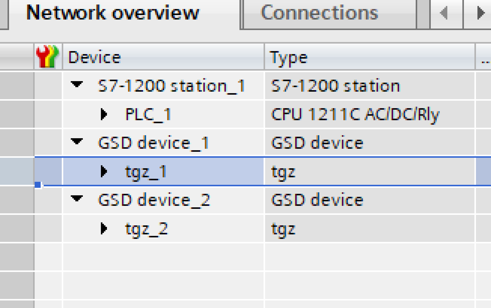
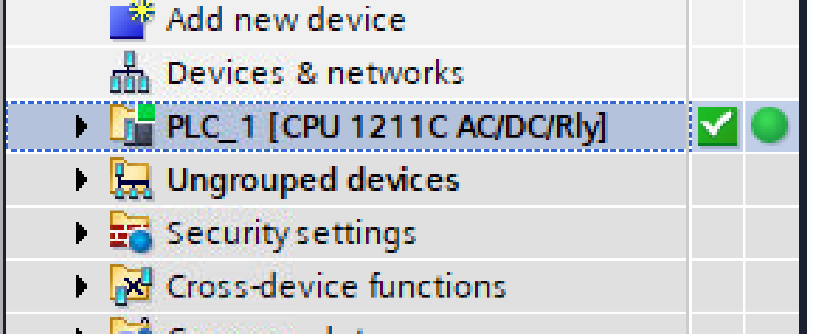
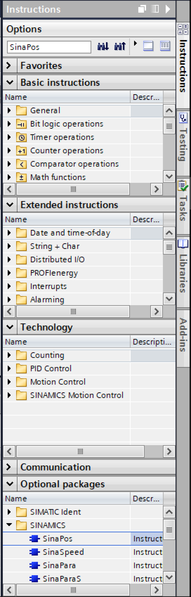

##Použití TGZ v TIA portálu
- Buďte opatrní, aby se pohon nezačal pohybovat bez předchozího varování.
- Přijměte příslušná opatření, aby obsluha a servisní pracovníci byli o tomto nebezpečí informováni.
- Zaveďte vhodná ochranná opatření, která zajistí, že jakýkoli neúmyslný pohyb pohonů nemůže vést k nebezpečným situacím.
- Uživatel je zodpovědný za to, že v případě poruchy pohonu bude celý systém nastaven do stavu, který je bezpečný pro zařízení i personál.

##Režim polohování s telegramem 111
Nejpoužívanějším provozním režimem je režim polohování pomocí základního polohování TGZ a funkčního bloku SinaPos TIA portálu s telegramem 111.
Následují možné kroky pro vytvoření nového projektu se dvěma servozesilovači TGZ, a to ve variantě se dvěma osami.

- Vytvořte nový projekt.

{: style="width:90%;" }

- Otevřete projekt.

{: style="width:90%;" }

- Nainstalujte soubory XML GSD popisující zařízení TGZ v síti PROFINET.
  Existují dva typy souborů, jeden pro jednoosou variantu s názvem `GSDML-V2.4-TGDrives-TGZ-S-xxxxx.xml` a druhý pro dvouosou variantu TGZ `GSDML-V2.4-TGDrives-TGZ-D-xxxxx.xml` (kde `xxxxx` znamená datum vytvoření souboru).

<!--vložit placeholdery na GSDML-V2.4-TGDrives-TGZ-S-xxxxx.xml a GSDML-V2.4-TGDrives-TGZ-D-xxxxx.xml - linky pro přímé stažení z webu-->

  Soubory lze stáhnout z webových stránek TG Drives.

- Zvolte položku nabídky `Options|Manage general station description files (GSD)`.

{: style="width:90%;" }

- Zadejte zdrojovou cestu, kde jsou uloženy soubory GSDML, vyberte příslušný soubor a klikněte na tlačítko **Install**.

!!! note "Poznámka"
	Oba soubory lze instalovat současně.
	
{: style="width:50%;" }

- Ve stromu projektů vlevo nahoře dvojklikem zvolte položku **Add new device item**.

{: style="width:30%;" }

- Vyberte PLC controller použitý v hardwarovém projektu.
  V tomto výukovém programu je použit PLC S7-1200.
  
{: style="width:50%;" }

!!! warning "Pozor"
	Dbejte na výběr správné verze firmwaru (zde V4.1).
	
- Na portálu TIA by se mělo otevřít okno **Devices & networks**.
  Pokud ne, použijte položku stromového zobrazení **Devices & networks** v zobrazení projektu a otevřete okno dvojklikem.

{: style="width:90%;" }

- Nyní je čas přidat do projektu jednotky TGZ.
  V podokně **Catalog pane** otevřete položku **Other field devices** a přejděte na `PROFINET IO|Pohony|TGPohony|tgz-d|tgz-d`.
  Zařízení přidejte do projektu dvojklikem.

{: style="width:50%;" }

- Chcete-li přidat dva servopohony TGZ, proveďte to dvakrát.
  Pro práci s jednoosou variantou TGZ použijte položku tgz-s.
  Okno **Devices & network** by mělo vypadat následovně:

{: style="width:90%;" }

- Přejmenujte jednotky v podokně **Network overview** podle projektu hardwaru.
  Názvy musí být stejné jako při [přípravě zařízení](network.md#ProfinetIPsettings).

{: style="width:30%;" }

- Připojte pohony k PLC.
  Klikněte na modrý text **Not assigned** a zvolte **PROFINET interface_1**.
  
{: style="width:70%;" }

- Totéž proveďte u druhého TGZ.

{: style="width:70%;" }

- Volitelně použijte zobrazení **Topology** a spojte zařízení PLC s TGZ pomocí myši stejným způsobem jako ve skutečnosti.
  Tento krok není nutný.

{: style="width:70%;" }
{: style="width:70%;" }

- Přiřaďte všem zařízením v projektu správné IP adresy.
  IP adresy a názvy zařízení PROFINET musí odpovídat hodnotám zadaným v [Název a IP adresa zařízení](network.md#ProfinetIPsettings).
  Aktivujte připojení v poli PLC (zelený obdélník) a v podokně **Properties** níže použijte položku **Ethernet addresses**.
  Do textového pole zadejte správnou IP adresu spolu s maskou podsítě (obvykle 255.255.255.0).
  
{: style="width:70%;" }

- Podobným způsobem přiřaďte IP adresy dalším zařízením.

{: style="width:70%;" }

- Přepněte se do zobrazení **Device view** (vpravo nahoře) a v kombo boxu vyberte první zařízení TGZ (tgz_1).
  V katalogu hardwaru vpravo dvakrát klikněte na **Siemens telegram 111**.
  To proveďte dvakrát pro obě osy (slot 1 a slot 2).
  
{: style="width:90%;" }

- Výsledek by měl vypadat takto:

{: style="width:60%;" }

- Přejmenujte osy (sloty 1 a 2) podle skutečného hardwarového projektu.

{: style="width:60%;" }

- Totéž proveďte pro druhou jednotku TGZ a získáte něco jako:

{: style="width:90%;" }

- Stáhněte projekt do PLC pomocí ikony **Download** do zařízení nebo pomocí příkazu nabídky `Online|Download to device`.

{: style="width:60%;" }

- Je nutné najít PLC.
  V následujícím dialogovém okně klikněte na tlačítko **Start search**.
  
{: style="width:70%;" }

- Po chvíli by se měl PLC objevit v seznamu **Select target device**.
  Vyberte jej a klikněte na tlačítko **Load**.

{: style="width:70%;" }

- Dialogové okno **Load preview** ukazuje stav načtení.

{: style="width:70%;" }

- Klikněte na tlačítko **Load** a poté na tlačítko **Finish**.

{: style="width:70%;" }

- Zkontrolujte konfiguraci hardwaru.
  Klikněte na ikonu **Go online** v nástrojové liště.
  
{: style="width:70%;" }

- Vyčkejte na stav zelené značky v zobrazení projektu.

{: style="width:30%;" }

- Příkazem **Go offline** se přepněte zpět do režimu offline.

{: style="width:70%;" }

- Rozbalte položku **Project view to Program blocks|Main [OB1]** a otevřete ji dvojklikem.

{: style="width:30%;" }

- Otevře se nové okno s bloky PLC.

{: style="width:90%;" }

- Vpravo v podokně **Instructions** vyhledejte funkční blok **SinaPos** (FB).
  K tomu lze použít pole pro úpravu vyhledávání.

{: style="width:30%;" }

- Přetáhněte blok SinaPos na řádek **Network 1** a přiřaďte název bloku Data.
  Použijte nejlépe stejný název jako pro osy (sloty) přiřazené v předchozích krocích.
  
{: style="width:90%;" }

- Připojte telegram ke vstupům HWIDSTW a HWIDZSW funkčního bloku.

{: style="width:50%;" }

- Výsledek by měl vypadat asi takto:

{: style="width:40%;" }

- Zopakujte přetažení SinaPos FB a přiřazení osy pro **Network 2** společně s osou **Axis_2**.

{: style="width:40%;" }

- Stejný postup platí pro pohon tgz_2 a osy Axis_3 a Axis_4.

{: style="width:40%;" }
{: style="width:40%;" }

- Zkompilujte a stáhněte upravený projekt do PLC příkazem `Online|Download to device`  a přepněte TIA Portal zpět do online režimu.
- Funkční blok lze ovládat pomocí tabulky hlídání.
  Vytvořte novou tabulku pomocí položky `Project view item PLC_1|Watch and force tables|Add new watch table` a přejmenujte ji na **Axis_1_Control**.
  
{: style="width:30%;" }

- Přidejte následující vstupy a výstupy funkčního bloku SinaPos:

{: style="width:90%;" }

- Pokud jsou hodnoty správně nastaveny (ModePos, Position, Velocity, EnableAxis), přepnutím **ExecuteMode** z FALSE na TRUE by se měl spustit požadovaný pohyb.
  Pro správné chování funkčního bloku musí být Status `16#7002`.
  Další informace o ovládání tohoto FB naleznete v online [dokumentaci k SinaPos](https://cache.industry.siemens.com/dl/files/845/109736845/att_928039/v1/109736845_G120_CU250S2PN_at_S7_1200_SINA_POS_v10_DOCU_en.pdf).
- Volitelně můžete vytvořit další sledovací tabulky pro práci s dalšími osami.

{: style="width:90%;" }

##Podporované řídicí bity v ConfigEPos

V hodnotě **ConfigEPos** lze použít další bity pro přesné řízení chování TGZ.
Při nastavení na `16#0000_0103` (nastaven je také bit 8) je aktivován přenos konstantní žádané hodnoty.
Když je aktivní úloha posunu, je možné změnit cílovou polohu nebo rychlost a pohon reaguje okamžitě, aniž by bylo nutné přepínat bit ExecuteMode.
Po ukončení úlohy se pohon vrátí do stavu `S41` (viz. dokumentace PROFIdrive) a čeká na vzestupnou hranu bitu ExecuteMode.   

Je také možné nastavit **ConfigEPos** na `16#0010_0103` (nastavte bit 8 a 20).
Pak pohon udržuje stav `S451`, i když je úloha ukončena, a nová úloha se spustí okamžitě, jakmile přijde nová pozice.
Pro opuštění stavu `S451` je třeba změnit hodnotu **ConfigEPos** na `16#0000_0103`.

!!! note "Poznámka"

	Všimněte si, že hodnotu `16#0000_0103` nebo `16#0010_010`3 lze použít pouze pro absolutní polohování, tj. když ModePos = 2.
	Protože minimální doba cyklu je 1 ms, je možné dosáhnout konstantního polohování pomocí PLC.
	Je nutné správně nastavit hodnoty zrychlení a rychlosti.
	Doporučuje se také lichoběžníkový rychlostní profil (profil generátor typ 3).

Bit 8 ConfigEPos je interně mapován na bit 12 řídicího slova POS_STW1 v telegramu (MdiTrTyp).
Bit 20 je mapován na bit 11 řídicího slova POS_STW1.
	
##Použití PLC S7-300 nebo S7-400 s telegramem 111
Chcete-li používat starší PLC, stáhněte si z internetu knihovnu `DriveLib`.
V době psaní této příručky byl název souboru [Drive_Lib_V62_S7_300_400.zip](https://support.industry.siemens.com/cs/document/109475044/sinamics-communication-blocks-drivelib-for-reading-and-writing-drive-data-within-tia-portal-context?dti=0&lc=en-CZ).
Rozbalte jej a nainstalujte do TIA portálu.
Poté bude postup při vytváření projektu stejný jako výše, pouze použijte záložku **Libraries** a tam najděte funkci **SINA_POS** a přidejte ji do řádku **Main's Network**.

{: style="width:30%;" }

Servopohon TGZ nyní podporuje režimy spuštění Advanced a Legacy.
Režim Legacy se používá pro S7-300 nebo S7-400.
Upravené soubory GSDML (PNIO verze 2.4) jsou k dispozici na [webových stránkách TGDrives](https://www.tgdrives.cz/ke-stazeni/digitalni-servozesilovace-ke-stazeni/#c425).
K dispozici jsou také soubory GSDML verze V2.2 pro použití ve starších softwarových balíčcích.

##Rychlostní režim pomocí standardního telegramu 3
- Vytvořte nový projekt a pojmenujte jej *TGZ-S-Tele3*.

{: style="width:90%;" }

- Otevřete zobrazení projektu.

{: style="width:90%;" }

- Dvakrát klikněte na možnost **Add new device**.

{: style="width:30%;" }

- Zvolte správnou řídicí jednotku PLC a její verzi.

{: style="width:50%;" }

- Vyberte možnost **Network view** a rozbalte strom v `Hardware catalog to item Other field devices|PROFINET IO|Drives|TGDrives|tgz-s|tgz-s`.

{: style="width:70%;" }

- Dvakrát klikněte na tgz-s, zařízení bude přidáno do projektu v **Network view**.

{: style="width:70%;" }

- Přejmenujte zařízení TGZ a dejte mu název zařízení - stejný, který byl nastaven při uvedení do provozu, jak je popsáno v [Název a IP adresa zařízení](network.md#ProfinetIPsettings)

{: style="width:70%;" }

- Pro tento příklad použijeme název tgz_2.

{: style="width:70%;" }

- Připojte pohon TGZ k PLC kliknutím na modrý text **Not assigned** a výběrem PLC_1 PROFINET interface_1.

{: style="width:70%;" }

- Výsledek by měl vypadat takto:

{: style="width:70%;" }

- Přiřaďte PLC IP adresu.
  Použijte stejnou adresu jako je popsáno v sekci [Název a IP adresa zařízení](network.md#ProfinetIPsettings).
  
{: style="width:70%;" }
 
- Přiřaďte servopohonu TGZ IP adresu. Opět použijte adresu již uloženou v zařízení TGZ.

{: style="width:70%;" }

- Zvolte telegram 3 do slotu 1 TGZ.

{: style="width:70%;" }

- Dvojklikem na položku **Standard telegram 3** se telegram nastaví automaticky.

{: style="width:70%;" }

- Stáhněte konfiguraci hardwaru do PLC:

{: style="width:70%;" }

- Klikněte na tlačítko **Start search**.

{: style="width:70%;" }

- V seznamu by se mělo objevit PLC.

{: style="width:70%;" }

- Klikněte na tlačítko **Load**, počkejte na dokončení kompilace a v následujícím dialogovém okně vyberte možnost **Stop all modules** a znovu klikněte na tlačítko **Load**.

{: style="width:70%;" }

- Načítání dokončíte kliknutím na tlačítko **Finish**.

{: style="width:70%;" }

- Pokud ještě není vybrán, zvolte v servisním programu TGZ GUI telegram číslo 3: Speed.

{: style="width:70%;" }

- Uložte parametry a restartujte jednotku TGZ.

{: style="width:70%;" }

- Přepněte portál TIA do režimu **Online mode**, v zobrazení projektu by měla být zelená zaškrtávací políčka.

{: style="width:30%;" }

- Pokud se vyskytnou nějaké chyby, zastavte a spusťte PLC.
  Zkontrolujte také, zda se v servisním programu TGZ GUI zvyšuje parametr `PD_SetDataCounter`.
  
{: style="width:30%;" }

- Rozbalte položku `PLC_1|Technology object|Add new object` a dvakrát na ni klikněte.

{: style="width:30%;" }

- Vyberte možnost **Motion control** a **TO_PositioningAxis**. Volitelně můžete zadat vhodný název objektu.

{: style="width:30%;" }

- V okně Axis_1 v části `Basic parameters|General` zvolte přepínač **PROFIdrive**.

{: style="width:70%;" }

- Přepněte na `Basic parameters|Drive` a vyberte správný pohon.

{: style="width:70%;" }

- V případě potřeby upravte **Reference speed** a **Maximum speed** s ohledem limity pohonu.

{: style="width:70%;" }

- Vyberte `Basic parameters|Encoder` a přepněte na **Encoder on drive**.

{: style="width:50%;" }

- Volitelně nastavte další parametry v položkách **Extended parameters** podle hardwarového projektu.
- Po dokončení přepněte do offline režimu a stáhněte upravený projekt do PLC příkazem z nabídky `Online|Download to device` do zařízení.
  Postup je stejný, jak je popsáno výše.
- Přepněte se zpět do režimu online a dvakrát klikněte na položku **Commissioning** v zobrazení projektu.

{: style="width:70%;" }

- Klikněte na tlačítko **Activate** v horní části okna.

{: style="width:30%;" }

- Povolte osu tlačítkem **Enable**.

{: style="width:70%;" }

- Nyní je možné v závislosti na zvoleném příkazu provádět Jog osy, Homing a/nebo Positioning.

{: style="width:70%;" }

  Podrobný popis technologického objektu naleznete v online dokumentaci.
