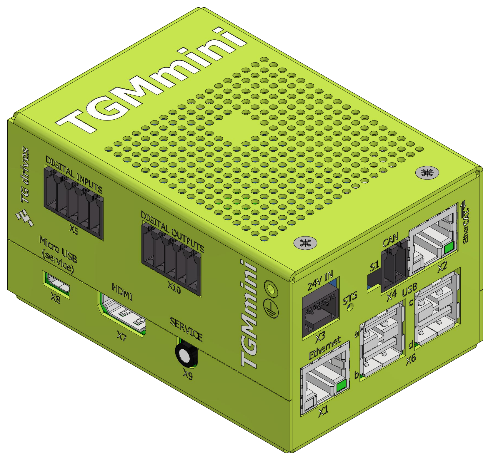

##Introduction
 

{: style="width:35%;" }

 

**TGMmini** is a complete computer with dual core ARM processor.
Both cores are used for Linux operating system (with Xenomai real-time kernel extension and Debian 10 distribution) with graphics desktop Xfce4.
The real-time **TG Motion** system, which controls servo drives and I/O modules by using EtherCAT, runs partially in Linux environment and partially in FPGA (with hardware EtherCAT accelerator).
Administration of TG Motion (start, stop, reset) can be performed from Linux desktop or command line.
There are libraries available for all necessary operations, whose API is compatible with Windows DLL.
Virtual PLC programs can be coded and cross-compiled on Windows (e.g. by Visual Studio), and are source code compatible with PLC programs running on PC.
The resulting PLC binary file is then transferred to **TGMmini** and run there.
Shared memory access is done by library TGM_Comm_Int_5, also compatible with the Windows version.

##Differences to TG Motion on PC
TGMmini uses TG Motion version 501 or higher. Both versions (PC and TGMmini) are compatible.
The TG Motion operation manual covers the version 501 and is available at [TG Drives website](https://www.tgdrives.cz/en/download/control-systems-pc-and-panels-download/#c471). 
Supported
are up to 64 servo drives and up to 16 I/O units on EtherCAT bus. TGMmini contains two CNC modules
together with two interpolators. There are 8 fast digital inputs (usable for IRC encoder as well), 8 fast
digital outputs (configurable also as PWM outputs) and CAN bus directly controlled by PLC programs.   

!!! note "Linux naming"
	The file names on Linux operating system are case sensitive (in contrast to Windows system, where the file names are case insensitive).
	For example TG Motion uses config file `TgMotion5xx.ini`. If it was renamed to `TGMotion5xx.INI`, system will ignore it.

It is recommended to read [TG Motion operation manuals](../../TGMotion/md/PLC.md#MotionPLC) before working with TGMmini.