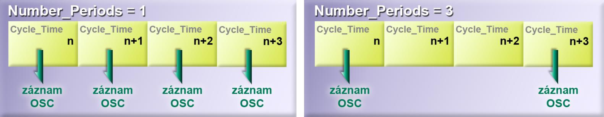

##Function description of the Oscilloscope structure

Oscilloscope is a sophisticated tool for recording up to 32 channels - the values of up to 32 different registers depending on time.
It detects and stores the values of the selected registers in the shared memory `TGM_Oscilloscope` at a certain time interval.
The data can then be worked with in other parts of the PLC or in Windows applications.
The `TGM_Oscilloscope` shared memory is typically 1 048 576 bytes in size. 
The actual size must be found from the value of the `TGM_System.HEADER.Mem_Size_OSC` register.
The `TGM_Oscilloscope` memory is common to the data of all recorded channels.
When recording the values of one channel, the entire memory is dedicated to it, when recording data of multiple channels, the memory is evenly divided between the individual channels.
The layout of the recorded data in the `TGM_Oscilloscope` memory and their offsets are determined by TG Motion; these parameters are stored in the appropriate registers.

!!! info "Note"
	The uniformity of the TGM_Oscilloscope memory distribution is related to the number of bytes needed to record the values of each register.
	For example, when recording two registers, one of type Long Integer (4 bytes) and the other of type Double (8 bytes), TG Motion divides the shared memory `TGM_Oscilloscope` in a 1:2 ratio so that the same number of samples can be recorded for both channels.
	
!!! warning "Warning"
	Recording time decreases as the number of recorded channels increases
	
At the TG Motion level, the data is read and recorded by the **Oscilloscope** utility into the shared memory `TGM_Oscilloscope` after executing *Program_04*.
This ensures time synchronisation of the recorded values.
However, a read and write does not have to occur every Cycle_Time; the number of Cycle_Time during which a write occurs is determined by the `Number_Periods` register.

{: style="width:60%;" }

!!! info "Note"
	At the Windows level, Control Observer offers the **Oscilloscope** utility, in which the recorded data can be displayed in the form of a graph, saved to a file, read back, change the recording and display parameters, or perform your own recording.
	
!!! warning "Warning"
	Oscilloscope works as one instance that can be used from both PLC and Control Observer.
	However, it cannot be used simultaneously from PLC, Control Observer or other applications.
	
{: style="width:60%;" }

!!! note "Note"
	For a detailed description of the Oscilloscope Control Observer utility, see the Control Observer chapter.
	
##Oscilloscope registers and their meaning

The registers that the Oscilloscope utility uses to control or store its settings are located in the `TGM_System` shared memory starting at offset `4736`.
For clarity, they can be divided into three groups:

- **general registers** - refer to the settings of the Oscilloscope utility as a whole
- **channel registries** - only valid for specific channels
- **auxiliary registers** - contain information about the record

###General registers Oscilloscope
The general registers are used for general setup and control of the **Oscilloscope** utility.   

| Parameter | Description |
|---------------------|-------------------------------------------------------------------------------------------------|
| Control | Used to control the Oscilloscope structure.
| | - 0: Not recording or used to stop recording.
| | - >0: Activate a record; triggers a record or wait for a Trigger (depending on the Status register).
| Status | Displays the status of the Oscilloscope structure.
| | - 0: No recording or waiting for Trigger.
| | - 1: Recording in progress. |
| | - 2: Waiting for Trigger. |
| Number_Periods | Number of servotics per sample. Specifies the number of Cycle_Time for which one Oscilloscope data record is made. |
| Number_Channels | Number of recorded or logged channels. |
| Memory_Type_Trigger | Type of shared memory where the trigger register is located. |
| | - 0: TGM_System |
| | - 1: TGM_Data |
| | - 2: TGM_Cam_Profile |
| | - 3: TGM_Oscilloscope |
| | - 4: TGM_Servo |
| | - 5: TGM_Dio |
| - 6: TGM_Interpolator |
| | - 7: InterpolatorWriteMemory |
| | - 8: InterpolatorReadMemory |
| | - 9: TGM_ODS |
| | - 10: TGM_CNCEX |
| | - 11: TGM_GCODE |
| Offset_Trigger | Offset of the trigger register in the memory given by the Memory_Type_Trigger register. |
| Mode_Trigger | Trigger algorithm mode.
| | - 0: Triggering inactive.
| | - 1: Triggering on the leading edge.
| | - 2: Triggering on the descending edge.
| Type_Trigger | Trigger register data type.
| Level_Trigger | Trigger register value at which the record is triggered.

!!! note "Note"
	The trigger register can be any shared memory register.
	
!!! warning "Warning"
	Although the read trigger register values may not be continuous, the trigger algorithm assumes continuity.
	E.g. with `Level_Trigger = 20`, `Mode_Trigger = 1` and consecutive trigger register values 17 and 22 loaded, it is assumed that the value 20 has already been reached and the Oscilloscope record is triggered.
	
###Principle of operation of utility Oscilloscope

If Mode_Trigger = 0, then when the Control > 0 register is set, the Oscilloscope utility starts recording data.
The record can be terminated by setting the Control register = 0.
If Mode_Trigger > 0, then when the Control register is set to Control > 0, the Oscilloscope utility activates a trigger algorithm that tests and evaluates the trigger register values every Cycle_Time.
When the trigger condition is met, data recording is started.
The Oscilloscope record can be terminated by setting the Control = 0 register.

!!! info "Note"
	If the dedicated TGM_Oscilloscope memory becomes full during Oscilloscope recording, recording stops automatically and the Control and Status registers are set to 0.
	
!!! info "Note"
	For a complete list of all Oscilloscope registers, including descriptions, see. Appendix.
	
###Channel registers

These registers determine the parameters related to each channel.
This is the location of the recorded data in the `TGM_Oscilloscope` memory, the determination of the data source (memory type and offset) and the data type of the recorded register.
Each channel has the following quartet of registers.

| Parameter r | Description |
|---------------------|-------------------------------------------------------------------------------------------------|
| Offset | Offset of recorded channel data in TGM_Oscilloscope memory (allocated by TG Motion).
| Memory_Type_Value | Type of shared memory where the register is located. |
| | - 0: TGM_System |
| | - 1: TGM_Data |
| | - 2: TGM_Cam_Profile |
| | - 3: TGM_Oscilloscope |
| | - 4: TGM_Servo |
| | - 5: TGM_Dio |
| - 6: TGM_Interpolator |
| | - 7: InterpolatorWriteMemory |
| | - 8: InterpolatorReadMemory |
| | - 9: TGM_ODS |
| | - 10: TGM_CNCEX |
| | - 11: TGM_GCODE |
| Offset_Value | Offset of the recorded register in memory given by the Memory_Type_Value value. |
| Type_Value | Data type of the logged register. |
| | - 0-3: Integer 32 bits |
| | - 4-7: Integer 64 bits |
| | - 8: Double (floating point number of 64 bits) |
| | - 9: Float (floating point number of 32 bits) |

###Helpful registers

Auxiliary registers inform about the recording parameters of the Oscilloscope utility.

- **Number_Samples** - number of samples available
- **Actual_Samples** - current number of recorded samples
- **Sample_Time** - sampling time interval `(Sample_Time = Cycle_Time × Number_Periods) [μs]`

!!! note "Note"
	The Actual_Samples register is incremented by 1 with each sample while a record is in progress.
	When sampling is stopped (e.g. when the `Control = 0` register is set), the value of the `Actual_Samples` register indicates the last sample performed.
	
##Oscilloscope registers overview and description

**General registers Oscilloscope**
<table>
	<tr>
		<td data-sheets-value="{ &quot;1&quot;: 2, &quot;2&quot;: &quot;name&quot;}"><b>name</b></td>
		<td data-sheets-value="{ &quot;1&quot;: 2, &quot;2&quot;: &quot;access&quot;}"><b>access</b></td>
		<td data-sheets-value="{ &quot;1&quot;: 2, &quot;2&quot;: &quot;offset&quot;}"><b>offset</b></td>
		<td colspan="2" data-sheets-value="{ &quot;1&quot;: 2, &quot;2&quot;: &quot;description&quot;}"><b>description</b></td>
	</tr>
	<tr>
		<td data-sheets-value="{ &quot;1&quot;: 2, &quot;2&quot;: &quot;Control&quot;}">Control</td>
		<td data-sheets-value="{ &quot;1&quot;: 2, &quot;2&quot;: &quot;RW&quot;}">RW</td>
		<td sdval="4736" sdnum="1029;0;0" data-sheets-value="{ &quot;1&quot;: 3, &quot;3&quot;: 4736}" data-sheets-numberformat="{ &quot;1&quot;: 2, &quot;2&quot;: &quot;0&quot;, &quot;3&quot;: 1}">4736</td>
		<td colspan="2" data-sheets-value="{ &quot;1&quot;: 2, &quot;2&quot;: &quot;used to control the Oscilloscope structure&yen;u000a0 - not recording or stopping recording&yen;u000a>0 - activating Oscilloscope recording (starting recording or waiting for Trigger)&&yen;u000a>0 - activating Oscilloscope recording (starting recording or waiting for Trigger)&quot;}">used to control the Oscilloscope structure 0 - no recording or stopping recording &gt;0 - activating the Oscilloscope record (starts recording or waiting for Trigger)</td>
	</tr>
	<tr>
		<td data-sheets-value="{ &quot;1&quot;: 2, &quot;2&quot;: &quot;Status&quot;}">Status</td>
		<td data-sheets-value="{ &quot;1&quot;: 2, &quot;2&quot;: &quot;R&quot;}">R</td>
		<td sdval="4740" sdnum="1029;0;0" data-sheets-value="{ &quot;1&quot;: 3, &quot;3&quot;: 4740}" data-sheets-numberformat="{ &quot;1&quot;: 2, &quot;2&quot;: &quot;0&quot;, &quot;3&quot;: 1}">4740</td>
		<td colspan="2" data-sheets-value="{ &quot;1&quot;: 2, &quot;2&quot;: &quot;Oscilloscope structure state 0 - not recording&yen;u000a1 - recording&yen;u000a2 - waiting for trigger&quot;}">Oscilloscope structure state 0 - not recording 1 - recording 2 - waiting for trigger</td>
	</tr>
	<tr>
		<td data-sheets-value="{ &quot;1&quot;: 2, &quot;2&quot;: &quot;Number_Periods&quot;}">Number_Periods</td>
		<td data-sheets-value="{ &quot;1&quot;: 2, &quot;2&quot;: &quot;RW&quot;}">RW</td>
		<td sdval="4744" sdnum="1029;0;0" data-sheets-value="{ &quot;1&quot;: 3, &quot;3&quot;: 4744}" data-sheets-numberformat="{ &quot;1&quot;: 2, &quot;2&quot;: &quot;0&quot;, &quot;3&quot;: 1}">4744</td>
		<td colspan="2" data-sheets-value="{ &quot;1&quot;: 2, &quot;2&quot;: &quot;number of servotics per sample. Specifies the number of Cycle_Time for which one record is made&yen;u000adat Oscilloscope&quot;}">number of servotics per sample. Specifies the number of Cycle_Time for which one record is made data Oscilloscope</td>.
	</tr>
	<tr>
		<td data-sheets-value="{ &quot;1&quot;: 2, &quot;2&quot;: &quot;Number_Channels&quot;}">Number_Channels</td>
		<td data-sheets-value="{ &quot;1&quot;: 2, &quot;2&quot;: &quot;RW&quot;}">RW</td>
		<td sdval="4748" sdnum="1029;0;0" data-sheets-value="{ &quot;1&quot;: 3, &quot;3&quot;: 4748}" data-sheets-numberformat="{ &quot;1&quot;: 2, &quot;2&quot;: &quot;0&quot;, &quot;3&quot;: 1}">4748</td>
		<td colspan="2" data-sheets-value="{ &quot;1&quot;: 2, &quot;2&quot;: &quot;number of recorded channels&quot;}">number of recorded channels</td>
	</tr>
	<tr>
		<td data-sheets-value="{ &quot;1&quot;: 2, &quot;2&quot;: &quot;Memory_Type_Trigger&quot;}">Memory_Type_Trigger</td>
		<td data-sheets-value="{ &quot;1&quot;: 2, &quot;2&quot;: &quot;RW&quot;}">RW</td>
		<td sdval="4752" sdnum="1029;0;0" data-sheets-value="{ &quot;1&quot;: 3, &quot;3&quot;: 4752}" data-sheets-numberformat="{ &quot;1&quot;: 2, &quot;2&quot;: &quot;0&quot;, &quot;3&quot;: 1}">4752</td>
		<td colspan="2" data-sheets-value="{ &quot;1&quot;: 2, &quot;2&quot;: &quot;type of shared memory that contains the trigger register&quot;}">type of shared memory that contains the trigger register</td>
	</tr>
	<tr>
		<td data-sheets-value="{ &quot;1&quot;: 2, &quot;2&quot;: &quot;Offset_Trigger&quot;}">Offset_Trigger</td>
		<td data-sheets-value="{ &quot;1&quot;: 2, &quot;2&quot;: &quot;RW&quot;}">RW</td>
		<td sdval="4756" sdnum="1029;0;0" data-sheets-value="{ &quot;1&quot;: 3, &quot;3&quot;: 4756}" data-sheets-numberformat="{ &quot;1&quot;: 2, &quot;2&quot;: &quot;0&quot;, &quot;3&quot;: 1}">4756</td>
		<td colspan="2" data-sheets-value="{ &quot;1&quot;: 2, &quot;2&quot;: &quot;offset of trigger register in memory given by Memory_Type_Trigger register&quot;}">offset of trigger register in memory given by Memory_Type_Trigger register</td>
	</tr>
	<tr>
		<td data-sheets-value="{ &quot;1&quot;: 2, &quot;2&quot;: &quot;Mode_Trigger&quot;}">Mode_Trigger</td>
		<td data-sheets-value="{ &quot;1&quot;: 2, &quot;2&quot;: &quot;RW&quot;}">RW</td>
		<td sdval="4760" sdnum="1029;0;0" data-sheets-value="{ &quot;1&quot;: 3, &quot;3&quot;: 4760}" data-sheets-numberformat="{ &quot;1&quot;: 2, &quot;2&quot;: &quot;0&quot;, &quot;3&quot;: 1}">4760</td>
		<td colspan="2" data-sheets-value="{ &quot;1&quot;: 2, &quot;2&quot;: &quot;trigger algorithm mode 0 - trigger inactive&yen;u000a1 - leading edge 2 - trailing edge&quot;}">trigger algorithm mode 0 - trigger inactive 1 - leading edge 2 - trailing edge</td>
	</tr>
	<tr>
		<td data-sheets-value="{ &quot;1&quot;: 2, &quot;2&quot;: &quot;Type_Trigger&quot;}">Type_Trigger</td>
		<td data-sheets-value="{ &quot;1&quot;: 2, &quot;2&quot;: &quot;RW&quot;}">RW</td>
		<td sdval="4764" sdnum="1029;0;0" data-sheets-value="{ &quot;1&quot;: 3, &quot;3&quot;: 4764}" data-sheets-numberformat="{ &quot;1&quot;: 2, &quot;2&quot;: &quot;0&quot;, &quot;3&quot;: 1}">4764</td>
		<td colspan="2" data-sheets-value="{ &quot;1&quot;: 2, &quot;2&quot;: &quot;data type of trigger register variable&quot;}">data type of trigger register variable</td>
	</tr>
	<tr>
		<td data-sheets-value="{ &quot;1&quot;: 2, &quot;2&quot;: &quot;Level_Trigger&quot;}">Level_Trigger</td>
		<td data-sheets-value="{ &quot;1&quot;: 2, &quot;2&quot;: &quot;RW&quot;}">RW</td>
		<td sdval="4768" sdnum="1029;0;0" data-sheets-value="{ &quot;1&quot;: 3, &quot;3&quot;: 4768}" data-sheets-numberformat="{ &quot;1&quot;: 2, &quot;2&quot;: &quot;0&quot;, &quot;3&quot;: 1}">4768</td>
		<td colspan="2" data-sheets-value="{ &quot;1&quot;: 2, &quot;2&quot;: &quot;trigger register value at which the record is triggered&quot;}">trigger register value at which the record is triggered</td>
	</tr>
</table>

**OSC channel registers -> CHANNEL_00**

<table>
	<tr>
		<td data-sheets-value="{ &quot;1&quot;: 2, &quot;2&quot;: &quot;name&quot;}"><b>name</b></td>
		<td data-sheets-value="{ &quot;1&quot;: 2, &quot;2&quot;: &quot;access&quot;}"><b>access</b></td>
		<td data-sheets-value="{ &quot;1&quot;: 2, &quot;2&quot;: &quot;offset&quot;}"><b>offset</b></td>
		<td colspan="2" data-sheets-value="{ &quot;1&quot;: 2, &quot;2&quot;: &quot;description&quot;}"><b>description</b></td>
	</tr>
	<tr>
		<td data-sheets-value="{ &quot;1&quot;: 2, &quot;2&quot;: &quot;Offset&quot;}">Offset</td>
		<td data-sheets-value="{ &quot;1&quot;: 2, &quot;2&quot;: &quot;R&quot;}">R</td>
		<td sdval="4776" sdnum="1029;0;0" data-sheets-value="{ &quot;1&quot;: 3, &quot;3&quot;: 4776}" data-sheets-numberformat="{ &quot;1&quot;: 2, &quot;2&quot;: &quot;0&quot;, &quot;3&quot;: 1}">4776</td>
		<td colspan="2" data-sheets-value="{ &quot;1&quot;: 2, &quot;2&quot;: &quot;offset of recorded channel data in TGM_Oscilloscope memory&quot;}">offset of recorded channel data in TGM_Oscilloscope memory</td>
	</tr>
	<tr>
		<td data-sheets-value="{ &quot;1&quot;: 2, &quot;2&quot;: &quot;Memory_Type_Value&quot;}">Memory_Type_Value</td>
		<td data-sheets-value="{ &quot;1&quot;: 2, &quot;2&quot;: &quot;RW&quot;}">RW</td>
		<td sdval="4780" sdnum="1029;0;0" data-sheets-value="{ &quot;1&quot;: 3, &quot;3&quot;: 4780}" data-sheets-numberformat="{ &quot;1&quot;: 2, &quot;2&quot;: &quot;0&quot;, &quot;3&quot;: 1}">4780</td>
		<td colspan="2" data-sheets-value="{ &quot;1&quot;: 2, &quot;2&quot;: &quot;type of shared memory in which the register being recorded is located 0 - TGM_System&yen;u000a1 - TGM_Data&yen;u000a2 - TGM_Cam_Profile&yen;u000a3 - TGM_Oscilloscope&yen;u000a4 - TGM_Servo&yen.yen;u000a5 - TGM_Dio&yen;u000a6 - TGM_Interpolator&yen;u000a7 - InterpolatorWriteMemory&yen;u000a8 - InterpolatorReadMemory&yen;u000a9 - TGM_ODS&yen;u000a10 - TGM_CNCEX&yen;u000a11 - TGM_GCODE&quot;}">type of shared memory in which the register being recorded is located 0 - TGM_System 1 - TGM_Data 2 - TGM_Cam_Profile 3 - TGM_Oscilloscope 4 - TGM_Servo 5 - TGM_Dio 6 - TGM_Interpolator 7 - InterpolatorWriteMemory 8 - InterpolatorReadMemory 9 - TGM_ODS 10 - TGM_CNCEX 11 - TGM_GCODE</td>
	</tr>
	<tr>
		<td data-sheets-value="{ &quot;1&quot;: 2, &quot;2&quot;: &quot;Offset_Value&quot;}">Offset_Value</td>
		<td data-sheets-value="{ &quot;1&quot;: 2, &quot;2&quot;: &quot;RW&quot;}">RW</td>
		<td sdval="4784" sdnum="1029;0;0" data-sheets-value="{ &quot;1&quot;: 3, &quot;3&quot;: 4784}" data-sheets-numberformat="{ &quot;1&quot;: 2, &quot;2&quot;: &quot;0&quot;, &quot;3&quot;: 1}">4784</td>
		<td colspan="2" data-sheets-value="{ &quot;1&quot;: 2, &quot;2&quot;: &quot;offset of the recorded register in the memory given by the value of Memory_Type_Value&quot;}">offset of the recorded register in the memory given by the value of Memory_Type_Value</td>
	</tr>
	<tr>
		<td data-sheets-value="{ &quot;1&quot;: 2, &quot;2&quot;: &quot;Type_Value&quot;}">Type_Value</td>
		<td data-sheets-value="{ &quot;1&quot;: 2, &quot;2&quot;: &quot;RW&quot;}">RW</td>
		<td sdval="4788" sdnum="1029;0;0" data-sheets-value="{ &quot;1&quot;: 3, &quot;3&quot;: 4788}" data-sheets-numberformat="{ &quot;1&quot;: 2, &quot;2&quot;: &quot;0&quot;, &quot;3&quot;: 1}">4788</td>
		<td colspan="2" data-sheets-value="{ &quot;1&quot;: 2, &quot;2&quot;: &quot;data type of the register being recorded 0-3 - integer 32 bits&yen;u000a4-7 - integer 64 bits&yen;u000a8 - double (floating point number of 64 bits) 9 - float (floating point number of 32 bits)&quot;}">data type of the register being recorded 0-3 - integer 32 bits 4-7 - integer 64 bits 8 - double (floating point number of 64 bits) 9 - float (floating point number of 32 bits)</td>
	</tr>
</table>

**registers of other OSC channels -> CHANNEL_01 - CHANNEL_31**

<table>
	<tr>
		<td colspan="2" data-sheets-value="{ &quot;1&quot;: 2, &quot;2&quot;: &quot;name&quot;}"><b>name</b></td>
		<td data-sheets-value="{ &quot;1&quot;: 2, &quot;2&quot;: &quot;offset&quot;}"><b>offset</b></td>
		<td colspan="2" data-sheets-value="{ &quot;1&quot;: 2, &quot;2&quot;: &quot;description&quot;}"><b>description</b></td>
	</tr>
	<tr>
		<td colspan="2" data-sheets-value="{ &quot;1&quot;: 2, &quot;2&quot;: &quot;CHANNEL_01&quot;}">CHANNEL_01</td>
		<td sdval="4792" sdnum="1029;0;0" data-sheets-value="{ &quot;1&quot;: 3, &quot;3&quot;: 4792}" data-sheets-numberformat="{ &quot;1&quot;: 2, &quot;2&quot;: &quot;0&quot;, &quot;3&quot;: 1}">4792</td>
		<td colspan="2" data-sheets-value="{ &quot;1&quot;: 2, &quot;2&quot;: &quot;registers belonging to channel 01&quot;}">registers belonging to channel 01</td>
	</tr>
	<tr>
		<td colspan="2" data-sheets-value="{ &quot;1&quot;: 2, &quot;2&quot;: &quot;CHANNEL_02&quot;}">CHANNEL_02</td>
		<td sdval="4808" sdnum="1029;0;0" data-sheets-value="{ &quot;1&quot;: 3, &quot;3&quot;: 4808}" data-sheets-numberformat="{ &quot;1&quot;: 2, &quot;2&quot;: &quot;0&quot;, &quot;3&quot;: 1}">4808</td>
		<td colspan="2" data-sheets-value="{ &quot;1&quot;: 2, &quot;2&quot;: &quot;registers belonging to channel 02&quot;}">registers belonging to channel 02</td>
	</tr>
	<tr>
		<td colspan="2" data-sheets-value="{ &quot;1&quot;: 2, &quot;2&quot;: &quot;}"></td>
		<td data-sheets-value="{ &quot;1&quot;: 2, &quot;2&quot;: &quot;}">׀</td>
		<td colspan="2" data-sheets-value="{ &quot;1&quot;: 2, &quot;2&quot;: &quot;}"></td>
	</tr>
	<tr>
		<td colspan="2" data-sheets-value="{ &quot;1&quot;: 2, &quot;2&quot;: &quot;CHANNEL_31&quot;}">CHANNEL_31</td>
		<td sdval="5272" sdnum="1029;0;0" data-sheets-value="{ &quot;1&quot;: 3, &quot;3&quot;: 5272}" data-sheets-numberformat="{ &quot;1&quot;: 2, &quot;2&quot;: &quot;0&quot;, &quot;3&quot;: 1}">5272</td>
		<td colspan="2" data-sheets-value="{ &quot;1&quot;: 2, &quot;2&quot;: &quot;registers belonging to channel 31&quot;}">registers belonging to channel 31</td>
	</tr>
</table>

**helpful registers**

<table>
	<tr>
		<td data-sheets-value="{ &quot;1&quot;: 2, &quot;2&quot;: &quot;name&quot;}"><b>name</b></td>
		<td data-sheets-value="{ &quot;1&quot;: 2, &quot;2&quot;: &quot;access&quot;}"><b>access</b></td>
		<td data-sheets-value="{ &quot;1&quot;: 2, &quot;2&quot;: &quot;offset&quot;}"><b>offset</b></td>
		<td colspan="2" data-sheets-value="{ &quot;1&quot;: 2, &quot;2&quot;: &quot;description&quot;}"><b>description</b></td>
	</tr>
	<tr>
		<td data-sheets-value="{ &quot;1&quot;: 2, &quot;2&quot;: &quot;Number_Samples&quot;}">Number_Samples</td>
		<td data-sheets-value="{ &quot;1&quot;: 2, &quot;2&quot;: &quot;R&quot;}">R</td>
		<td sdval="5288" sdnum="1029;0;0" data-sheets-value="{ &quot;1&quot;: 3, &quot;3&quot;: 5288}" data-sheets-numberformat="{ &quot;1&quot;: 2, &quot;2&quot;: &quot;0&quot;, &quot;3&quot;: 1}">5288</td>
		<td colspan="2" data-sheets-value="{ &quot;1&quot;: 2, &quot;2&quot;: &quot;number of samples available&quot;}">number of samples available</td>
	</tr>
	<tr>
		<td data-sheets-value="{ &quot;1&quot;: 2, &quot;2&quot;: &quot;Actual_Samples&quot;}">Actual_Samples</td>
		<td data-sheets-value="{ &quot;1&quot;: 2, &quot;2&quot;: &quot;R&quot;}">R</td>
		<td sdval="5292" sdnum="1029;0;0" data-sheets-value="{ &quot;1&quot;: 3, &quot;3&quot;: 5292}" data-sheets-numberformat="{ &quot;1&quot;: 2, &quot;2&quot;: &quot;0&quot;, &quot;3&quot;: 1}">5292</td>
		<td colspan="2" data-sheets-value="{ &quot;1&quot;: 2, &quot;2&quot;: &quot;current number of recorded samples&quot;}">current number of recorded samples</td>
	</tr>
	<tr>
		<td data-sheets-value="{ &quot;1&quot;: 2, &quot;2&quot;: &quot;Sample_Time&quot;}">Sample_Time</td>
		<td data-sheets-value="{ &quot;1&quot;: 2, &quot;2&quot;: &quot;R&quot;}">R</td>
		<td sdval="5296" sdnum="1029;0;0" data-sheets-value="{ &quot;1&quot;: 3, &quot;3&quot;: 5296}" data-sheets-numberformat="{ &quot;1&quot;: 2, &quot;2&quot;: &quot;0&quot;, &quot;3&quot;: 1}">5296</td>
		<td colspan="2" data-sheets-value="{ &quot;1&quot;: 2, &quot;2&quot;: &quot;sampling time interval (Sample_Time = Cycle_Time × Number_Periods) [μs]&quot;}">sampling time interval (Sample_Time = Cycle_Time × Number_Periods) [μs]</td>
	</tr>
</table>