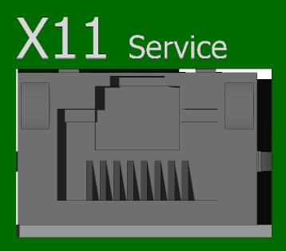
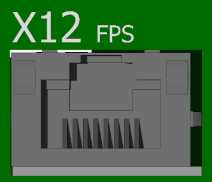

___
### View of the ENET/ECAT side
___

{: style="width:50%;" }

-   **X11 - TGMotion system connector**

    ---
	<!-- {: style="width:60%;" } -->

-   RJ45

	---

	Ethernet service port is used for connection of TGZ GUI through UDP protocol.
	It is also used for connecting the TGMotion (TCP or UDP protocol) by Control Observer and other user applications.
	Additional supported protocols are Modbus/TCP and Profinet IO.
		
-   **X12 - FSP port**

    ---
	<!-- {: style="width:60%;" } -->

-   RJ45

	---

	This port is used for so called Fast Service Port.
	Serves for very fast peer-to-peer connection between TGZ+Motion and PC.
	Special custom raw protocol is used.
	The PC must install the [Winpcap](https://www.winpcap.org/) or [Npcap](https://npcap.com/) driver.
	No setting is necessary, the communication DLL finds the correct PC network adapter.
	For best performance, use the built-in or PCIe NIC adapters.
	The USB-Ethernet adapters can be also used, but suffer of worse performance.
	Some low cost USB to Ethernet adapters don’t work at all with the FSP protocol.
	The adapter must have space for at least 32 packets at one time.
	
-   **X13 - EtherCAT master**

    ---
	<!-- {: style="width:60%;" } -->

-   RJ45

	---

	EtherCAT master connector – use this port for connecting the EtherCAT devices in the EtherCAT fieldbus.
	No setting is necessary.
	The port is capable of 100 Mbit or 1 Gbit speeds, depending of the first connected device.
	There are a few 1 Gbit EtherCAT devices available, e.g.
	the TGZ servo drive itself.
	If using the 1 Gbit fieldbus, all the devices must be using the 1 Gbit speed.
	

	