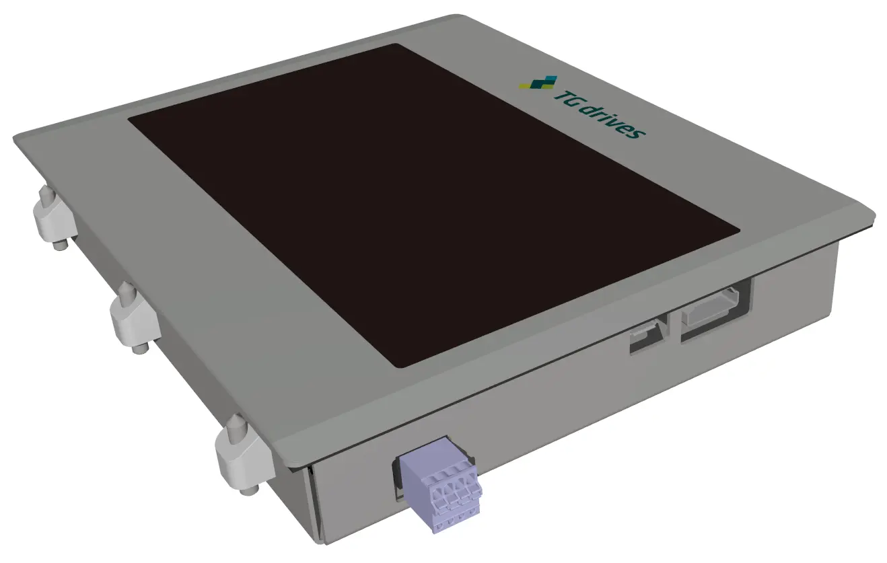

 

{: style="width:50%;" }

 

Touch display panel provides easy control of industrial processes and is ideal HMI.
It is characterized by small energy consumption and large viewing angle.
Thanks to high IP rating it can be used in almost every environment.
Touch display is connected through HDMI and USB cable to the host computer.
HDMI provides image transfer and USB enables touch data transfer.
The display chassis is made of galvanized sheet metal and its small depth allows installation of the display even in the narrow spaces.