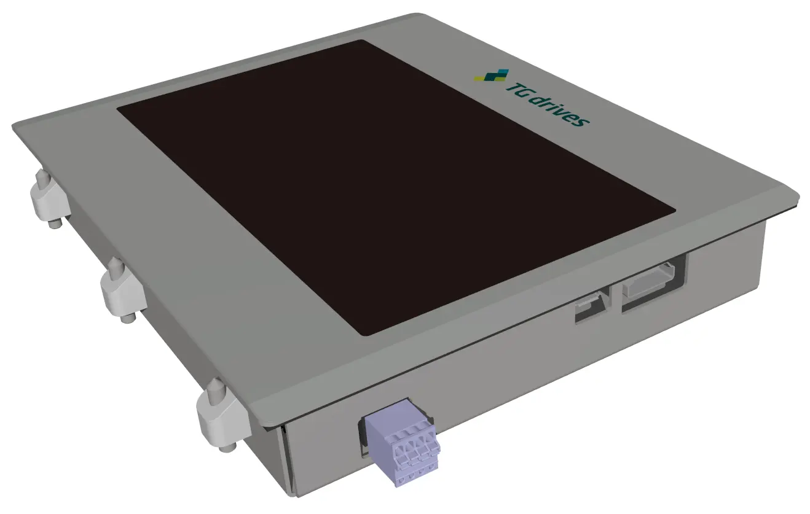

 

{: style="width:50%;" }

 

Dotykový displej umožňuje snadné ovládání a řízení výrobních procesů a je ideálním HMI.
Vyznačuje se malou spotřebou elektrické energie a velkým pozorovacím úhlem.
Díky vysokému stupni krytí je umožněno jeho nasazení téměř v jakýchkoliv podmínkách.

Dotykový displej je připojen prostřednictvím HDMI a USB kabelu.
HDMI rozhraní zajišťuje přenos obrazu a USB umožňuje přenos informace o dotyku.
Šasi displeje je vyrobeno z pozinkovaného plechu a díky jeho malé hloubce je možná instalace displeje i v úzkých prostorách.