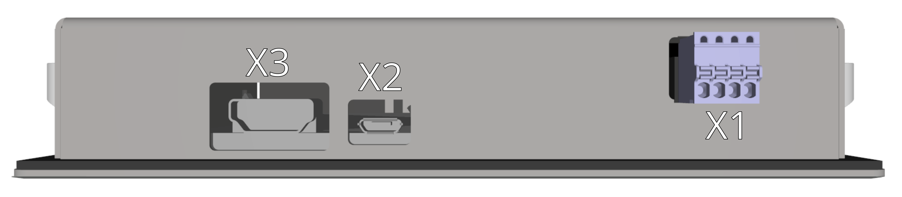
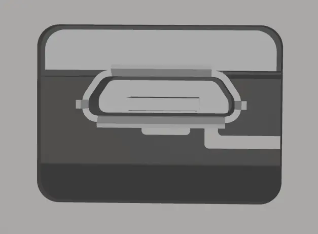
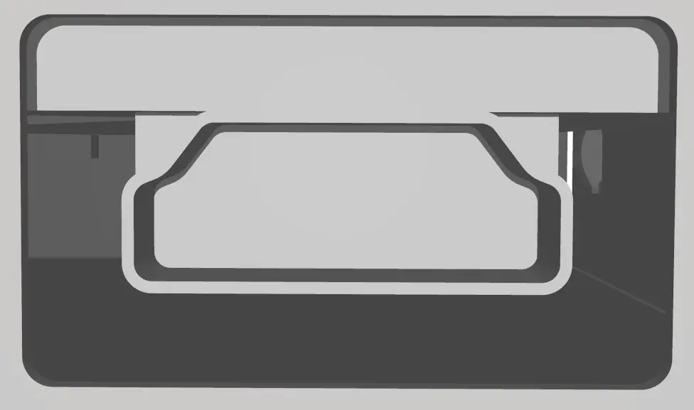

{: style="width:70%;" }

-   **X1 - 24V power**

    ---
	{: style="width:60%;" }

-    Weidmüller BLF 2.50/04/180 SN OR BX

	---

	--8<-- "md/X3_24V_BLF_2_5.en.md"
	
	!!! warning "USB power"	
	
		Although this is an auxiliary power supply, it is strongly recommended to connect it. 
		The device can be powered solely through the X2 - USB connector directly from the TGMmini; however, this unnecessarily loads its internal power supply.
		When using additional external USB devices connected to the TGMmini, powering the display via the X1 (24VDC) connector is mandatory!

-   **X2 - microUSB**

    ---
	
	{: style="width:50%;" }

-   Standard microUSB

    ---

	Mandatory connection to the standard USB X6 connector of the [TGMmini](../../TGMmini/md/connectors.md#TGMmini_IOside) device to enable LCD touch function.
	
-   **X3 - HDMI**

    ---
	
	{: style="width:50%;" }

-    Standard HDMI

    ---

	Mandatory connection to the standard HDMI type A X7 connector of the [TGMmini](../../TGMmini/md/connectors.md#TGMmini_IOside) device to enable the display.
	Due to EMI resistance, please use the shortest possible length of HDMI cable necessary. The use of flat HDMI cables is not recommended.
	

	
