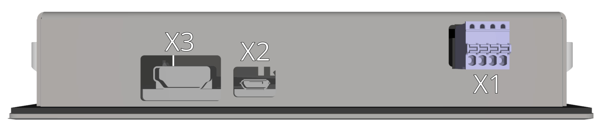
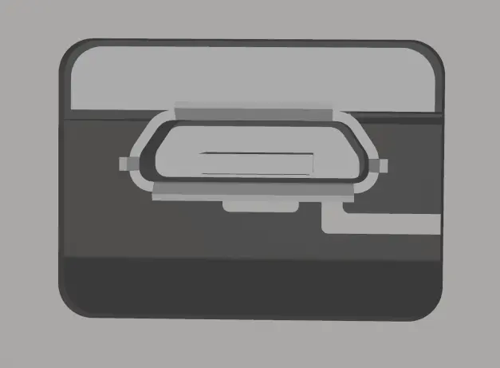

{: style="width:70%;" }

-   **X1 - Napájení 24V**

    ---
	{: style="width:60%;" }

-    Weidmüller BLF 2.50/04/180 SN OR BX

	---

	--8<-- "md/X3_24V_BLF_2_5.md"
	
	!!! warning "Napájení z USB"	
	
		Ačkoliv se jedná o přídavné napájení, je výrazně doporučeno jej zapojit.
		Zařízení je sice možné napájet jen pomocí konektoru X2 - USB přímo z [TGMmini](../../TGMmini/md/connectors.md#TGMmini_IOside), to ovšem zbytečně přetěžuje jeho interní napájecí zdroj.
		Při použití dalších externích USB zařízení připojených do [TGMmini](../../TGMmini/md/connectors.md#TGMmini_IOside) je napájení displeje pomocí konektoru X1 (24VDC) povinné!

-   **X2 - microUSB**

    ---
	
	{: style="width:50%;" }

-    Standard microUSB

    ---

	Nutné propojení s konektorem USB X6 [TGMmini](../../TGMmini/md/connectors.md#TGMmini_IOside) pro správnou funkci dotykového displeje.
	
-   **X3 - HDMI**

    ---
	
	{: style="width:50%;" }

-    Standard HDMI

    ---

	Nutné propojení s konektorem X7 [TGMmini](../../TGMmini/md/connectors.md#TGMmini_IOside) pro správnou funkci displeje.
	Z důvodu odolnosti proti rušení použijte prosím nejmenší možnou délku kabelu HDMI. Použití plochých HDMI kabelů se nedoporučuje.
	

	
