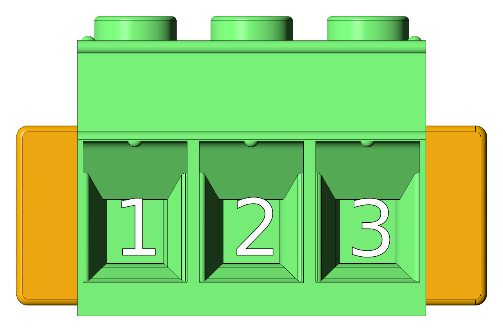
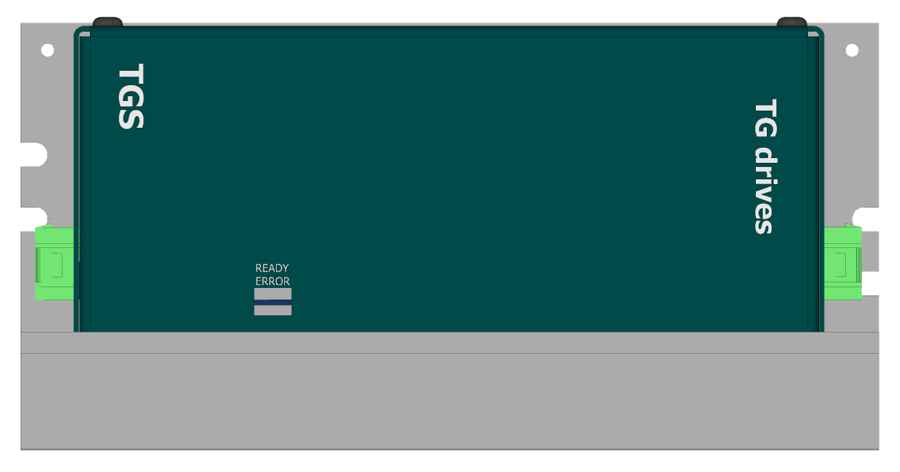
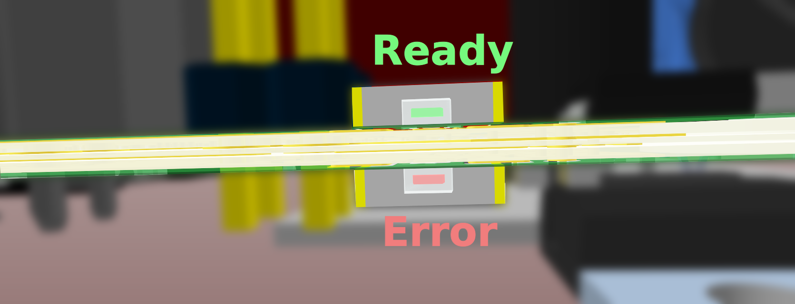
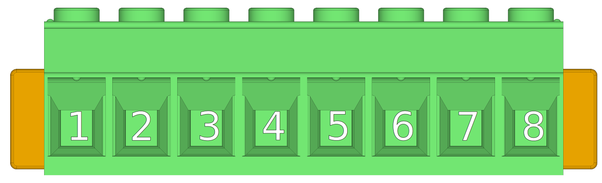
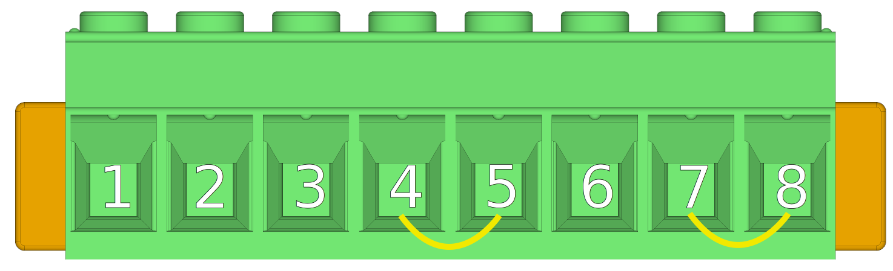

<!--
# Popis zařízení   

## Konektory
-->
##3D view
{: style="width:70%;" }
 
 
{: style="width:70%;" }

##Connectors
___
### AC IN side view
___

{: style="width:70%;" }

-   **X1 - Network connector**

    ---
	
	{: style="width:60%;" }

-    Phoenix PC 5/ 3-STCL1-7,62

	---
	
	--8<-- "md/X1_ACIN_PC5.en.md"

___
### Status LEDs side view
___

{: style="width:70%;" }

-	**status LEDs**

	---
	
	{: style="width:100%;" }
	
-	LED diodes

	---
	
	LED diodes are mirroring status of the control output contacts.
	When the TGS is ready, and has no error status (overtemperature, overvoltage, undervoltage) the green LED is on.
	Otherwise the red LED is on.

   
___
### DC bus, control output side
___

{: style="width:70%;" }

-   **X2 - DCbus out connector**

    ---
	
	{: style="width:85%;" }
	
	The X2 connector comes with jumper wires prepared for use with the internal chopper resistor.
	
	{: style="width:100%;" }   
	
	If an external chopper (brake) resistor is used, the jumper wires must be removed and the resistor connected according to the [schematic](schematic.en.md).		
	
	{: style="width:85%;" }	

-    Phoenix PC 5/ 8-STCL1-7,62

	---

	--8<-- "md/X2_DC_8pin_PC5.en.md"

-   **X3 - Control output connector**

    ---
	
	{: style="width:50%;" }

-    Weidmüller BCZ 3.81/04/180 SN BK BX

    ---

	--8<-- "md/X3_DO_4pin_BCZ.en.md"
	
	The RDY and ERR outputs behave similar to relay contacts with a maximum allowable external power supply voltage of 28 VDC and a maximum load of 700 mA. 
	They are most commonly used for signaling a power module fault to a higher-level system.
	
	| **Contact closed** | **Status** | **Description** |
	| :---: | :---: | :---: |
	| RDY | TGS OK | The TGS module has not detected an error; voltage and temperatures are within acceptable limits. |
	| ERR | TGS error | The TGS module has detected one or more errors. |
	

