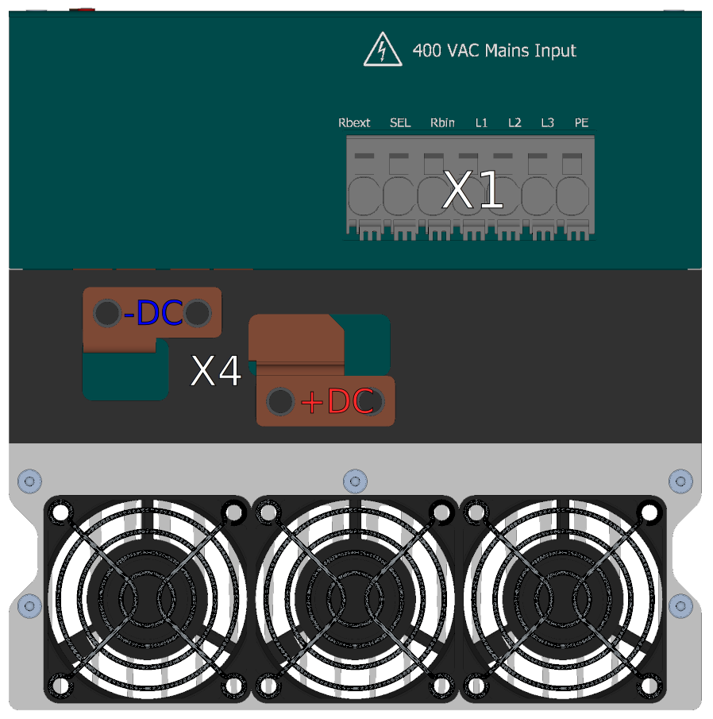

##3D náhled
{: style="width: 70%;" }
 
 
{: style="width: 70%;" }

##Konektory
___
### Strana silových konektorů
___

{: style="width: 70%;" }

-   **X1 - Vstupní fázové napětí**

    ---
	
    {: style="width: 60%;" }

-    Phoenix PC 5/ 3-STCL1-7,62

	---
	
	--8<-- "CZ/md/X1_ACIN_PC5.md"

  
___
### Strana napájení řízení, kontrolních výstupů, term.
___

{: style="width: 70%;" }

-   **X2 - Výstup DC silového napájení**

    ---
	
    {: style="width: 85%;" }

-    Phoenix PC 5/ 8-STCL1-7,62

	---

	--8<-- "CZ/md/X2_DC_8pin_PC5.md"

-   **X3 - Kontrolní výstupy**

    ---
	
    {: style="width: 50%;" }

-    Weidmüller BCZ 3.81/04/180 SN BK BX

    ---

	--8<-- "CZ/md/X3_DO_4pin_BCZ.md"
	

