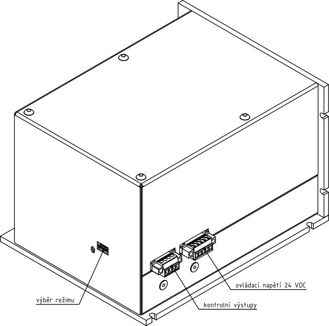
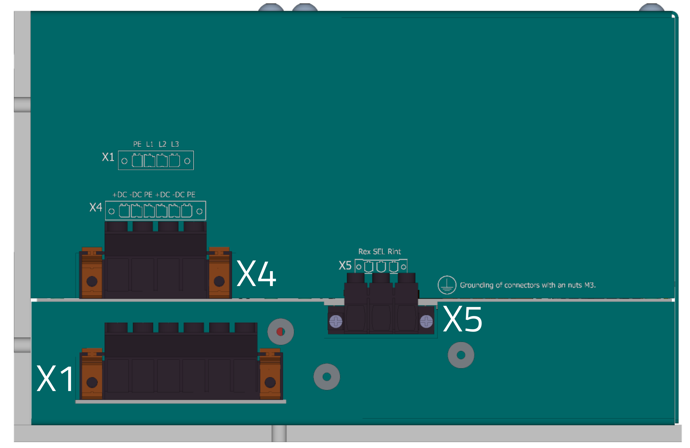
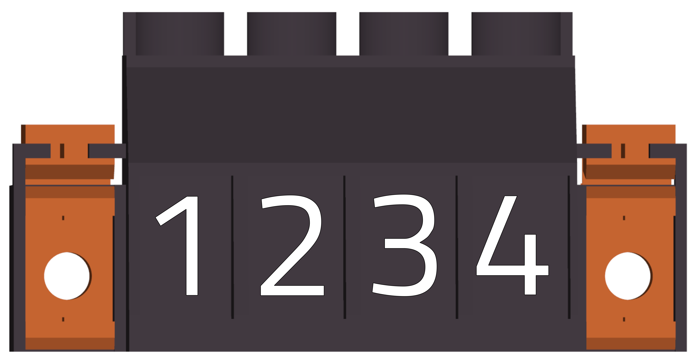
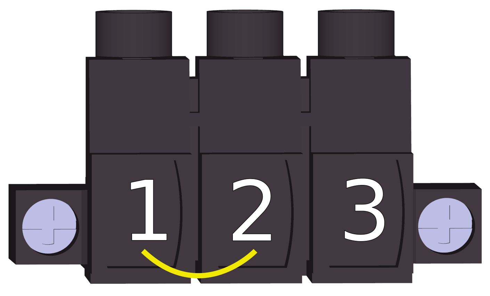
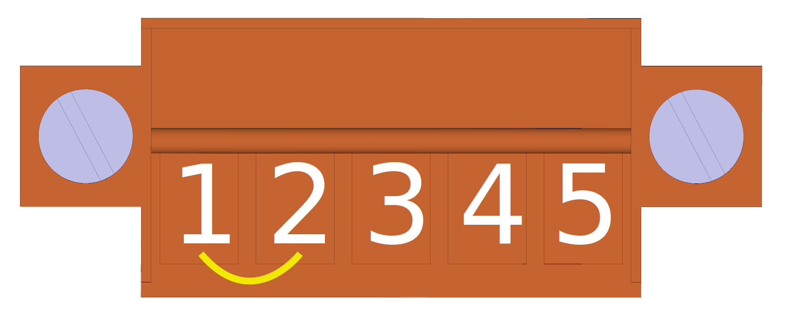

##3D náhled
{: style="width:60%;" }
 
 
{: style="width:80%;" }

##Konektory
___
### Strana silových konektorů
___

{: style="width:70%;" }

-   **X1 - Vstupní fázové napětí**

    ---
	
	Pohled na konektor zezadu (strana vodičů)
	
	{: style="width:70%;" }

-    WEIDMÜLLER BVZ 7.62HP/04/180F

	---
	
	--8<-- "md/X4_ACIN_4pin_TGS560_25.md"
	
-   **X4 - Výstup DC bus**

    ---
	
	Pohled na konektor zezadu (strana vodičů)
	
	{: style="width:80%;" }

-    WEIDMÜLLER BVZ 7.62HP/06/180F

	---
	
	--8<-- "md/X1_DC_6pin_TGS560_25.md"
	
	
-   **X5 - Brzdný odpor**

    ---
		
	Pohled na konektor zezadu (strana vodičů)
	
	{: style="width:60%;" }   
	
	Konektor X5 je standardně dodáván včetně propojovacího vodiče v konfiguraci pro použítí interního brzdného odporu.
	
	{: style="width:60%;" }   
	
	V případě použití externího brzdného rezistoru je nutné odstranit propojovací vodiče z konektorů X5 a X3 (TERM) a rezistor připojit dle [schématu](schematic.md).	

-   WEIDMÜLLER BLZ 7.62HP/03/180F

	---
	
	--8<-- "md/X5_RBR_3pin_TGS560_25.md"

  
___
### Strana napájení řízení a kontrolních výstupů
___

{: style="width:70%;" }

-   **X3 - Napájení řídicí části**

    ---
	Pohled zezadu (strana vodičů)   
	
	{: style="width:60%;" }   
	
	{: style="width:60%;" }	
	
	Konektor X3 je standardně dodáván včetně propojovacího vodiče v konfiguraci pro použítí interního brzdného odporu.
	
	{: style="width:60%;" }   
	
	V případě použití externího brzdného rezistoru je nutné odstranit propojovací vodiče z konektorů X3 a X5 a rezistor připojit dle [schématu](schematic.md).		

-    Weidmüller BCZ 3.81/05/180F SN OR BX

	---

	--8<-- "md/X4_TGS560_24V_5pin_BCZ.md"

-   **X2 - Kontrolní výstupy**

    ---
		
	Pohled na konektor zezadu (strana vodičů)
	
	{: style="width:60%;" }
	{: style="width:60%;" }
		
	Pohled na konektor zepředu (z pohledu TGS)
	
	{: style="width:60%;" }
	
-    Weidmüller BCZ 3.81/04/180 SN BK BX

    ---

	--8<-- "md/X2_DO_4pin_BCZ.md"
	

___
### Strana LED výstupů a voliče DIP
___

{: style="width:70%;" }

-   **S1 - Výběr režimu zařízení**

    ---
	
	{: style="width:70%;" }

-    DIP switch 4 pozice

    ---

	--8<-- "md/S1_TGS560_DIP.md"

-   **LED signalizace**

    ---
	
	{: style="width:90%;" }

-   LED 

    ---

	--8<-- "md/LED_TGS560.md"
	

