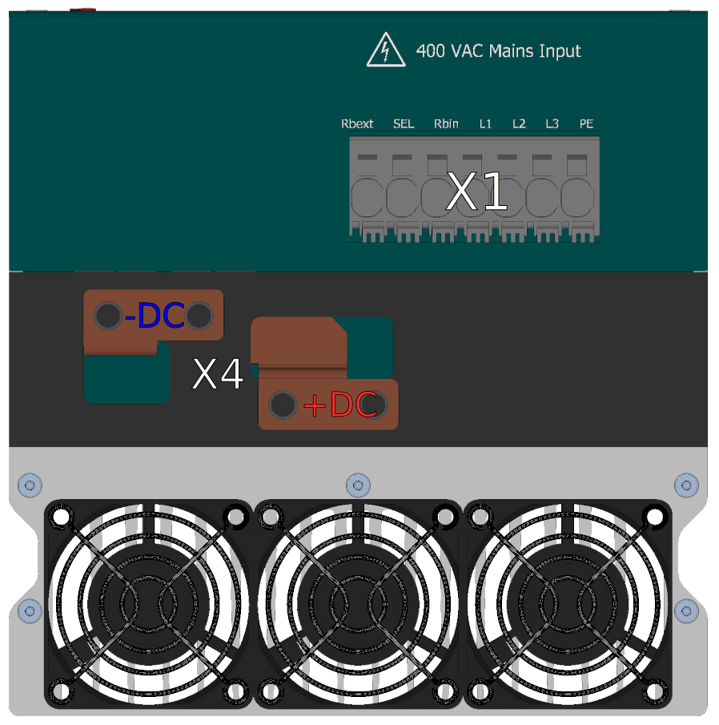

##3D view
{: style="width:70%;" }
 
 
{: style="width:70%;" }

##Connectors
___
###Power connectors side
___

{: style="width:70%;" }

-   **X1 - Network connector**

    ---
	
	{: style="width:60%;" }

-    Phoenix PC 5/ 3-STCL1-7,62

	---
	
	--8<-- "md/X1_ACIN_PC5.en.md"

  
___
### Strana napájení řízení, kontrolních výstupů, term.
___

{: style="width:70%;" }

-   **X2 - DCbus out connector**

    ---
	
	{: style="width:85%;" }

-    Phoenix PC 5/ 8-STCL1-7,62

	---

	--8<-- "md/X2_DC_8pin_PC5.en.md"

-   **X3 - Control output connector**

    ---
	
	{: style="width:50%;" }

-    Weidmüller BCZ 3.81/04/180 SN BK BX

    ---

	--8<-- "md/X3_DO_4pin_BCZ.en.md"
	

