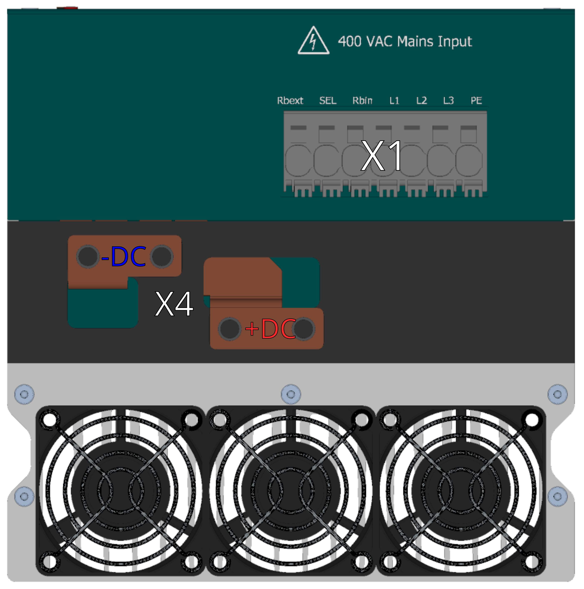
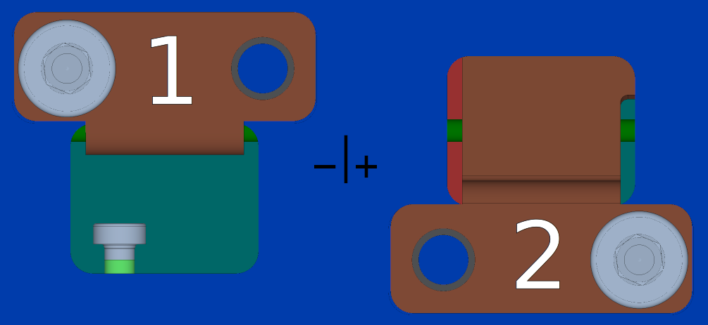
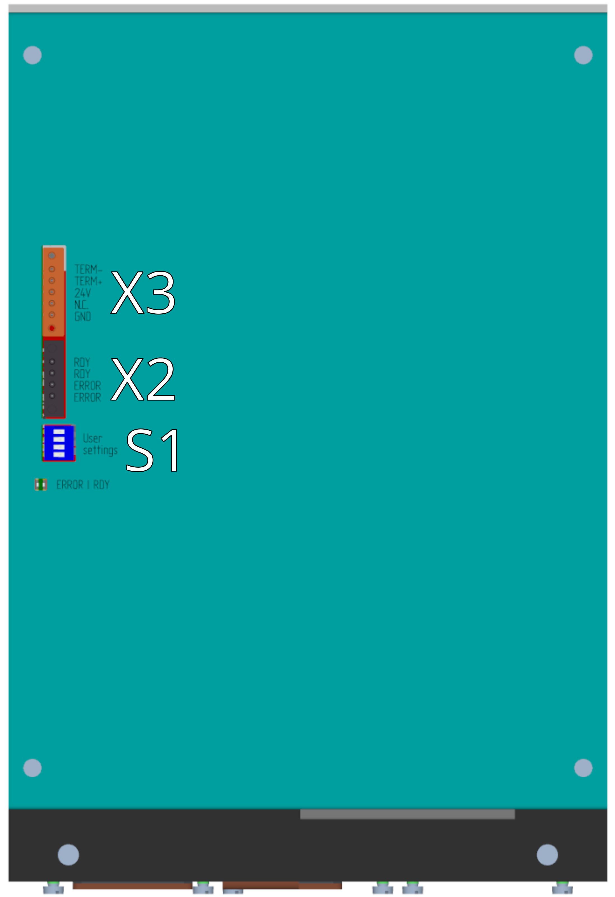
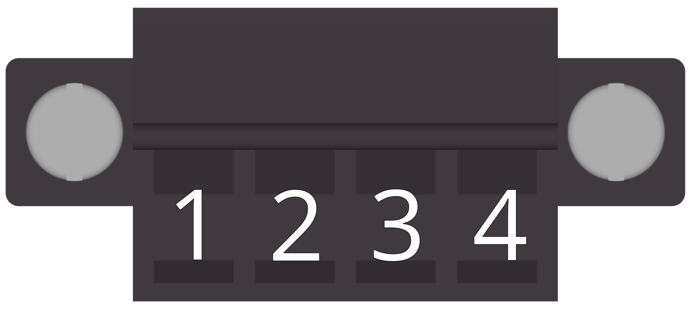
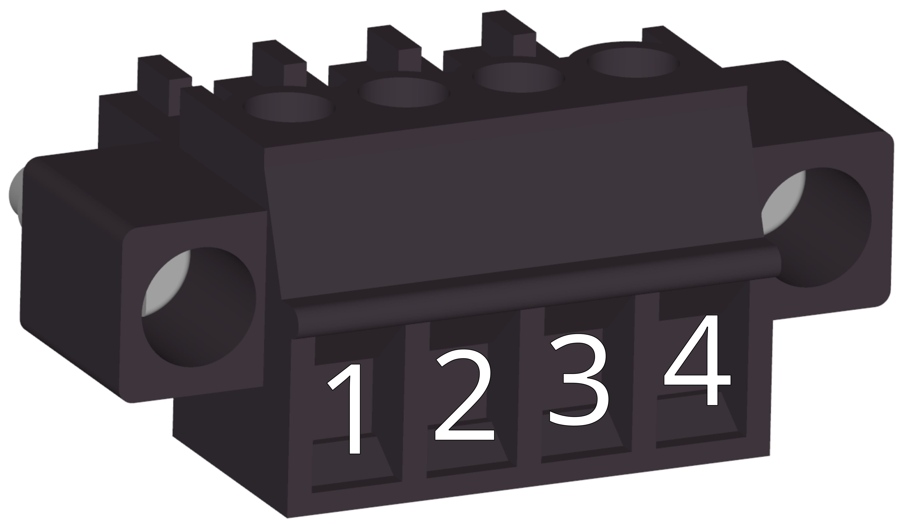
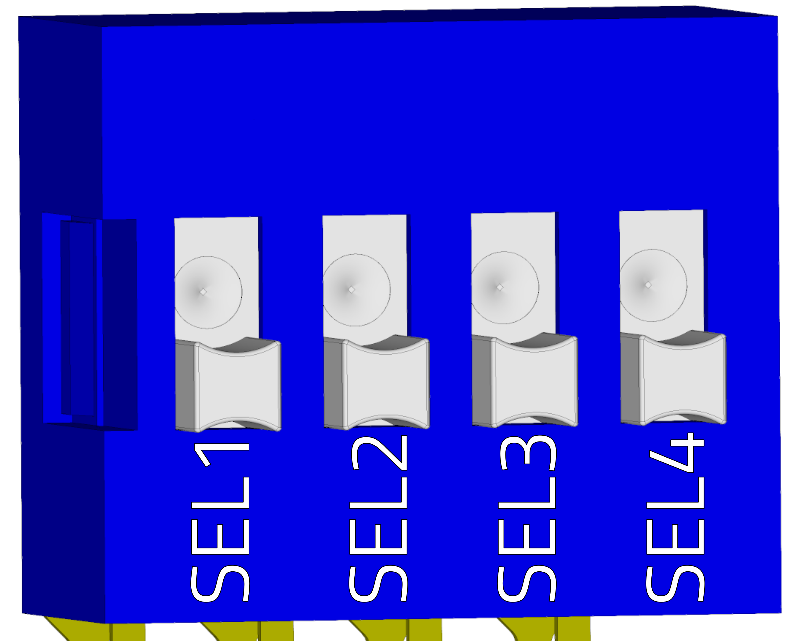
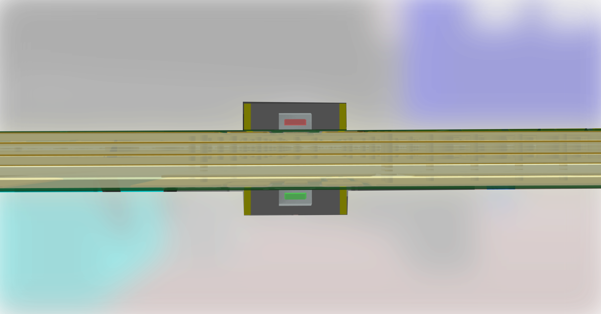

##3D náhled
{: style="width:70%;" }
 
 
{: style="width:70%;" }

##Konektory
___
### Strana silových konektorů
___

{: style="width:70%;" }

-   **X1 - Vstupní fázové napětí**

    ---
	
	{: style="width:80%;" }

-   Wago 2636-1107

	---
	
	--8<-- "md/X1_ACIN_7pin_2636.md"
	
-   **X4 - DC bus konektor**

    ---
	{: style="width:70%;" }

-    Šroubovací svorky M8

	---

	--8<-- "md/X4_D560DCbus.md"

  
___
### Strana napájení řízení, kontrolních výstupů, term.
___

{: style="width:70%;" }

-   **X3 - Napájení řídicí části 24V**

    ---
	
	{: style="width:50%;" }

-    Weidmüller BCZ 3.81/05/180F SN OR BX

    ---

	--8<-- "md/X3_TGS560_24V_5pin_BCZ.md"

-   **X2 - Kontrolní výstupy**

    ---
		
	Pohled na konektor zezadu (strana vodičů)
	
	{: style="width:60%;" }
	{: style="width:60%;" }
		
	Pohled na konektor zepředu (z pohledu TGS)
	
	{: style="width:60%;" }
	
-    Weidmüller BCZ 3.81/04/180 SN BK BX

    ---

	--8<-- "md/X2_DO_4pin_BCZ.md"
	
-   **S1 - Výběr režimu zařízení**

    ---
	
	{: style="width:40%;" }

-    DIP switch 4 pozice

    ---

	--8<-- "md/S1_TGS560_DIP.md"
	
-   **LED signalizace**

    ---
	
	{: style="width:90%;" }

-   LED 

    ---

	--8<-- "md/LED_TGS560.md"
	

