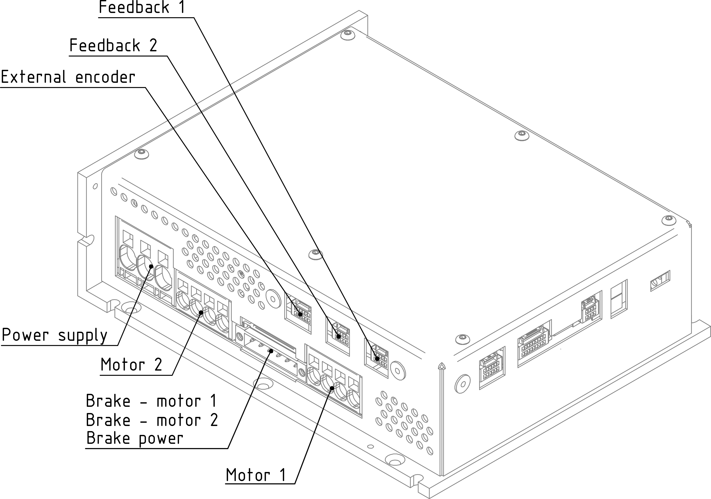
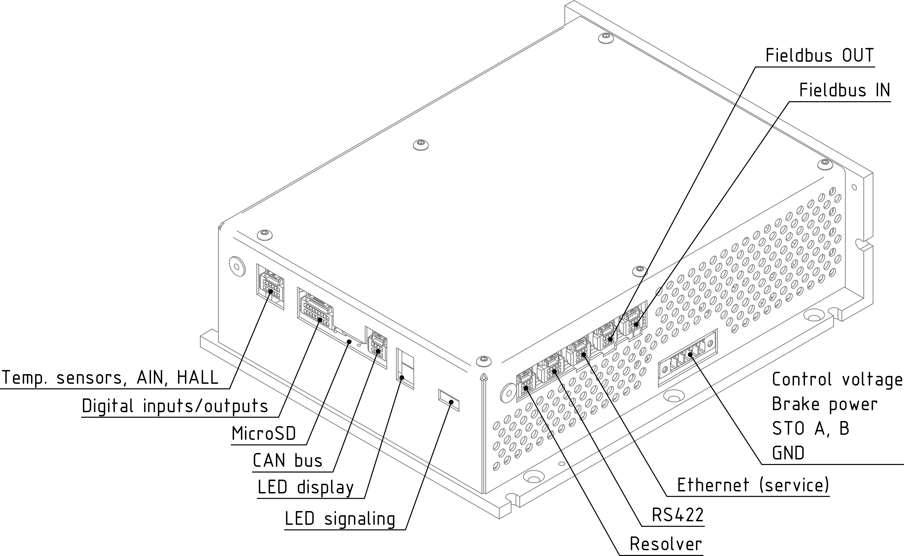

##3D view
{: style="width:70%;" }   
 
 
{: style="width:70%;" }   
	
##Description of communication, input/output and control
###Communication interfaces
- Ethernet 100/1000 Mb/s with UDP protocol, designed for parameter recording, monitoring, testing, but also online control;
- CAN bus protocol can be modified according to customer requirements;
- Ethernet 100/1000 Mb/s with optional protocol, programmed in the gate array and designed for connection of fast industrial buses for real-time control.
  Currently, this interface is equipped with the EtherCAT protocol (only for standard firmware); according to customer requirements it can be modified to another type of protocol.
- RS422 or RS485, data transfer via unused servomotor feedback interface.
  It can be used for communication with devices based on RS422 or RS485 standard (encoder, gyro, master controller, other system, etc.).
  This interface enables high-speed communication up to 20Mbit/s.
  
###Inputs / outputs
The built-in TGZ servo amplifiers have 8 isolated digital inputs, 6 isolated digital outputs, 1 analog input 0-10V, 2 PT1000 thermistor inputs and 3 special Hall sensor inputs implemented.
It is possible to read/control these inputs/outputs using a user program (C language):

| I/O    | Type              | Count | Value                                               |
|--------|--------------------|-------|-----------------------------------------------------|
| input  | analog             | 1     | 0-10 V                                              |
| input  | thermistor         | 2     | standard PT1000                                     |
| input  | Hall               | 3     | 5-30 V						            	         |
| input  | isolated digital   | 8     | 0-24 V (0-10 V low / 13-24 V high), 10 mA         |
| output | isolated digital   | 6     | 5-24 V, 300 mA / max. output                      |

The servo amplifier has four feedback connectors, which have a wide range of uses.
In addition to motor feedback, they can be used to connect devices operating on the principle of the RS422 or RS485 standard.

| Type   | Standard              | Interface                         | Examples of Possible Connected Devices                                                                                          |
|--------|-----------------------|-----------------------------------|---------------------------------------------------------------------------------------------------------------------------------|
| FB1    | RS422/RS485           | Hiperface DSL, EnDat 2.2, SSI, BISS | Absolute magnetic/optical encoder, incremental magnetic/optical encoder with Hall sensors [^2], gyroscope                       |
| FB2    | RS422/RS485           | Hiperface DSL, EnDat 2.2, SSI, BISS | Absolute magnetic/optical encoder, incremental magnetic/optical encoder with Hall sensors [^2], gyroscope                       |
| FE[^1] | RS422/RS485           | Hiperface DSL, EnDat 2.2, SSI, BISS | Absolute magnetic/optical encoder, incremental magnetic/optical encoder with Hall sensors [^2], gyroscope                       |
| FB3[^1]| 2 × full-duplex RS422 | -                                   | Control system                                                                                                                  |
| FB4    | Resolver				 | Analog                              | Various resolver position sensors                                                                                          |

[^1]: These types work with modified firmware. It is recommended to always consult with  manufacturer about their use.
[^2]: Hall sensors must be connected to the digital inputs using a special level shifter. For more information see. [Hall converter](../../../ETC/TGHall/md/description.md#TGhall_1).

- Hiperface DSL – digital communication, sensors are manufactured with a resolution of 15 to 24 bits per revolution (multi-speed design – 4,096 revolutions).
  This type of feedback is used for motors with a single connector or cable.
- EnDat 2.2 – digital communication, sensors are manufactured with a resolution of 18 to 25 bits per revolution (multi-speed design – 4,096 revolutions).
- SSI – encoders with synchronous system interface.
- BISS – sensors with BISS-C protocol.

###Control
TGZ servoamplifiers can be controlled:

- digital control via EtherCAT, CAN-bus (torque, speed, position profiles, etc.) and via Ethernet UDP protocol;
- via user program (language C) – digital inputs, analog voltage, etc.

##Connectors
___
### View of the ENET/ECAT side
___

{: style="width:80%;" }

-   **X1 - Control supply voltage**

    ---
	Housing back side view (wire side):  
	
	{: style="width:60%;" }   
	
	{: style="width:60%;" }	

-    Weidmüller BCZ 3.81/05/180F SN OR BX

	---

	--8<-- "md/X1_24V_5pin_BCZ_D4850.en.md"
	
	!!! warning "EMI suppression"
	
		Please pay attention to the installation of the suppression toroidal core according to the [instructions](../../../../source/md/logicPWR.en.md#LogicPWR_EMI).

-   **X16 - Feedback 4 - resolver**

    ---
    {: style="width:70%;" }
	
-    Molex ClikMate 5031490800 - recommended crimping contacts [Molex 502579](https://www.molex.com/en-us/part-list/502579) [^3]

    --8<-- "md/X16_RES_8pin_ClikMate.en.md"
	
-   **X11 - Feedback 3 - RS422**

    ---
    {: style="width:70%;" }
	
-    Molex ClikMate 5031491000 - recommended crimping contacts [Molex 502579](https://www.molex.com/en-us/part-list/502579) [^3]

    --8<-- "md/X11_FB3_10pin_ClikMate.en.md"
	
	!!! warning "Warning"	
		When using this type of feedback, make sure you are using the appropriate TGZ firmware that supports these features.

-   **X12 - Ethernet UDP - service**

    ---
    {: style="width:70%;" }
	
-    Molex ClikMate 5031490800 - recommended crimping contacts [Molex 502579](https://www.molex.com/en-us/part-list/502579) [^3]

    --8<-- "md/X12_UDP_8pin_ClikMate.en.md"

-   **X13 - EtherCAT 2 - Fieldbus out**

    ---
    {: style="width:70%;" }
	
-    Molex ClikMate 5031490800 - recommended crimping contacts [Molex 502579](https://www.molex.com/en-us/part-list/502579) [^3]

    --8<-- "md/X12_UDP_8pin_ClikMate.en.md"

-   **X14 - EtherCAT 1 - Fieldbus in**

    ---
    {: style="width:70%;" }
	
-    Molex ClikMate 5031490800 - recommended crimping contacts [Molex 502579](https://www.molex.com/en-us/part-list/502579) [^3]

    --8<-- "md/X12_UDP_8pin_ClikMate.en.md"

___
### View of the CAN/IO/SD Side
___

-   **X7 - Hall + Analog inputs**

    ---
	{: style="width:70%;" }

-    Molex ClikMate 5031491200 - recommended crimping contacts [Molex 502579](https://www.molex.com/en-us/part-list/502579) [^3]

	---

	--8<-- "md/X7_AIN_HALL_12pin_ClikMate.en.md"
	
	For details about [Hall inputs](../../../../source/md/commonHW_UNIR_HALL.en.md#common_UNIR_HALL_usage) please see [Common HW section](../../../../source/md/commonHW_UNIR_HALL.en.md#common_UNIR_HALL_desc).	
	
-   **X8 - Digital I/O**

    ---
	{: style="width:100%;" }

-    Molex ClikMate 5031491800 - recommended crimping contacts [Molex 502579](https://www.molex.com/en-us/part-list/502579) [^3]

	---

	--8<-- "md/X8_DIO_18pin_ClikMate.en.md"
	
	Please see details about
	[digital inputs DI1-8](../../../../source/md/commonHW_DI_RI.md#commonDI1-8_RI) and 
	[digital outputs DO1-6](../../../../source/md/commonHW_DO.md#commonDO1-6) 
	in the [Common hardware section](../../../../source/md/commonHW_DI_RI.md#commonDI1-8_RI).
		
-   **X9 - MicroSD slot**

    ---
	{: style="width:40%;" }

-   It is not primarily recommended to use the microSD slot in devices where significant vibrations are expected.
	SD card is not included with the "RI" version of servoamplifiers.
	For more information, see [SD cards](../../TGZ_SW/SD/md/SD.md#SDparams).

-   **X10 - CAN**

    ---
	
	{: style="width:70%;" }

-    Molex ClikMate 5031490800 - recommended crimping contacts [Molex 502579](https://www.molex.com/en-us/part-list/502579) [^3]

    ---

	--8<-- "md/X10_CAN_8pin_ClikMate.en.md"
	
-	**LED display**

	---
	
	{: style="width:60%;" }
	
-	LED display indicates the status of the servoamplifier. See [TGZ status indicators](../../TGZ_SW/LED/md/description.md#LED_sigs) for detailed description.

-	**status LEDs**

	---
	
	{: style="width:100%;" }
	
-	LED diodes

	---
	
	--8<-- "md/LEDsigAx12.en.md"
	
	A complete description of the meaning of the status LEDs can be found here: [TGZ status indicators](../../TGZ_SW/LED/md/description.md#LED_sigs)

   
___
### Feedback/motor side view
___

{: style="width:80%;" }

-   **X4 - External encoder (FBE)**

    ---
	
	{: style="width:80%;" }

-    Molex ClikMate 5031491200 - recommended crimping contacts [Molex 502579](https://www.molex.com/en-us/part-list/502579) [^3]

	---

	--8<-- "md/X4_FBE_12pin_ClikMate.en.md"
	
	For more information on external feedback, see [FBE Feedback](../../../../source/md/commonHW_FBE.en.md#commonFBE).

-   **X5 - Feedback axis 1**

    ---
	
	{: style="width:80%;" }

-    Molex ClikMate 5031491000 - recommended crimping contacts [Molex 502579](https://www.molex.com/en-us/part-list/502579) [^3]

    ---

	--8<-- "md/X5_FB1_10pin_ClikMate.en.md"
	
	For more information regarding Feedback 1, please see [Feedback FB1, FB2](../../../../source/md/commonHW_FB12.en.md#commonFB12).
	
	!!! warning "Warning"
		In order to use Hiperface DSL feedback user must tie pins 5-7 and 6-8 together of the FB1 (and FB2 respectively) connector or assembly appropriate shorting resistors to the control PCB.
		Also check whether you have correct firmware uploaded in the device.
	
-   **X6 - Feedback axis 2**

    ---
	
	{: style="width:80%;" }

-    Molex ClikMate 5031491000 - recommended crimping contacts [Molex 502579](https://www.molex.com/en-us/part-list/502579) [^3]

    ---

	--8<-- "md/X6_FB2_10pin_ClikMate.en.md"
	
	For more information regarding Feedback 1, please see [Feedback FB1, FB2](../../../../source/md/commonHW_FB12.en.md#commonFB12).
	
	!!! warning "Warning"
		In order to use Hiperface DSL feedback user must tie pins 5-7 and 6-8 together of the FB1 (and FB2 respectively) connector or assembly appropriate shorting resistors to the control PCB.
		Also check whether you have correct firmware uploaded in the device.
		
-   **X2 - Power supply voltage (DC bus)**

    ---
	{: style="width:60%;" }

-    Wago push-in CAGE CLAMP®

    ---

	--8<-- "md/X2_DCbus_3pin_wago_2636.en.md"
	
	!!! info "Max. AWG"
		Maximum wire cross section possible can be up to 4 AWG when using fine stranded wire without a ferrule.
		
	!!! warning "Regenerative braking"
	
		In cases when the drive is not powered by a battery (e.g., a Li-ion battery pack), 
		it is necessary for machines with greater kinetic energy to ensure its dissipation, for example, in a resistive element using a chopper unit.
	
-   **X3.1 - Motor connector - axis 1**

    ---
	
	{: style="width:70%;" }

-    Wago push-in CAGE CLAMP®

    ---

	--8<-- "md/X3_M1_4pin_wago_2626.en.md"
	
	!!! info "Max. AWG"
		Maximum wire cross section possible can be up to 8 AWG when using fine stranded wire without a ferrule.
	
-   **X3.2 - Motor connector - axis 2**

    ---
	
	{: style="width:70%;" }

-    Wago push-in CAGE CLAMP®

    ---

	--8<-- "md/X4_M2_4pin_wago_2626.en.md"
	
	!!! info "Max. AWG"
		Maximum wire cross section possible can be up to 8 AWG when using fine stranded wire without a ferrule.
		
-   **XBR - Static brake connector - axis 1 and 2**

    ---
	
	{: style="width:70%;" }
	
	!!! info "Holding motor brake"

		For additional information on using the motor brake with the TGZ servo drive, see the [Standard Brake](../../../../source/md/commonHW_StandardBrake.en.md#StandardBrakeDesc) section.	

-    Weidmüller BLF 5.00HC/06/180F SN OR BX

    ---

	--8<-- "md/XBR_BR_6pin_BLF.en.md"
		

[^3]: When crimping and connecting the Molex Clik-Mate connectors, follow the [Molex Clik-Mate Application Guide](https://www.molex.com/content/dam/molex/molex-dot-com/products/automated/en-us/applicationspecificationspdf/503/503149/AS-503149-001-001.pdf) and use the recommended crimping tool [2002187400](https://www.molex.com/en-us/products/part-detail/2002187400)