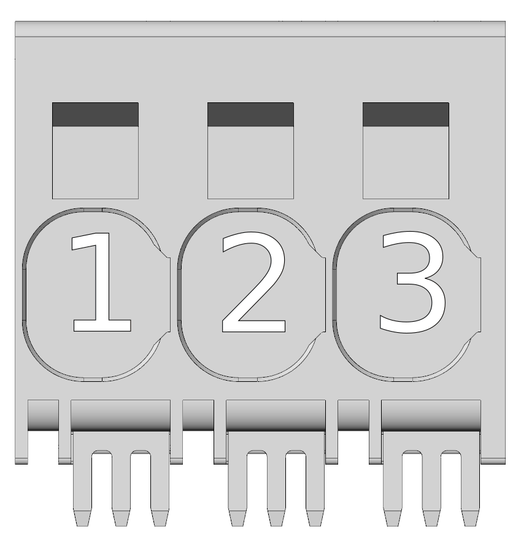
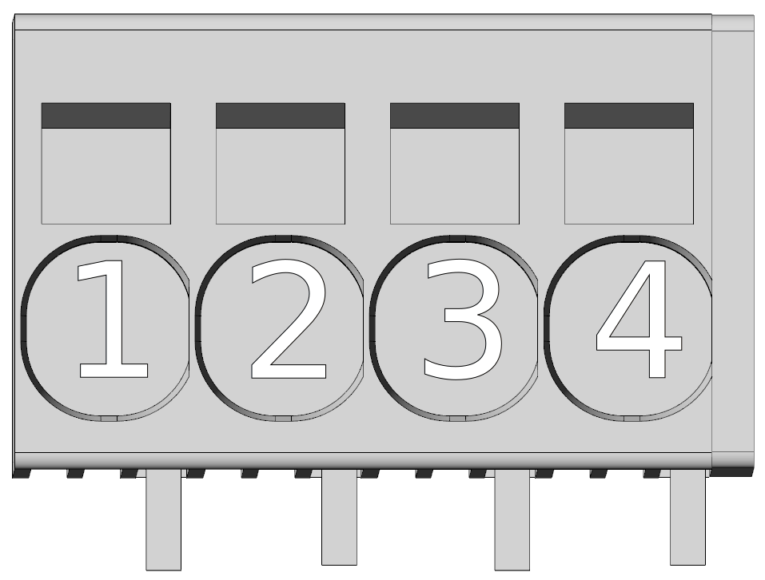

<!--
# Popis zařízení   

## Konektory
-->
##3D náhled
{: style="width:80%;" }
 
 
{: style="width:80%;" }

##Konektory
___
### Strana komunikace/ethernet/ethercat
___

{: style="width:60%;" }

-   **X1 - Napájení řídicí části**

    ---
	{: style="width:70%;" }

-    Weidmüller BCZ 3.81/05/180 SN OR BX

	---

	--8<-- "md/X1_24V_5pin_BCZ.md"

___
### Strana CAN/IO/SD
___

{: style="width:60%;" }

-   **X8 - Digitální I/O, analogové vstupy**

    ---
	Pohled zezadu (strana kabelu)   
	
	{: style="width:100%;" }
	3D pohled zezadu   
	
	{: style="width:100%;" }
	Pohled zepředu (strana TGZ)   
	
	{: style="width:100%;" }

	Detailní soupis parametrů 
	[digitálních vstupů DI1-8](../../../../source/md/commonHW_DI.md#commonDI1-8), 
	[digitálních výstupů DO1-6](../../../../source/md/commonHW_DO.md#commonDO1-6) a 
	[analogových vstupů AI1-2](../../../../source/md/commonHW_AI.md#commonAI1-2) 
	naleznete v sekci [Společný HW](../../../../source/md/commonHW_DI.md#commonDI1-8).
	

-    Weidmüller B2CF 3.50/22/180 SN OR BX

	---

	--8<-- "md/X8_IO_22pin_B2CF.md"
	
	!!! warning "Pozor"	
	
		Pro správnou funkci DI(1-6) je potřeba připojit alespoň jedno z VCC DO (pin 11 a 12). Vstupy DI7,8 jsou nezávislé na napájecím napětí DO VCC a fungují korektně i bez něj.
	
-   **X9 - MicroSD karta**

    ---
{: style="width:60%;" }

-    Použijte standardní microSD kartu. Karta je součástí dodávky servozesilovače TGZ. Více informací naleznete v sekci [SD karty](../../TGZ_SW/SD/md/SD.md#SDparams).

-   **X10 - CAN**

    ---
	Pohled zezadu (strana kabelu)   
	{: style="width:25%;" }
	
	3D pohled zezadu   
	{: style="width:45%;" }
	
	Pohled zepředu (strana TGZ)   
	{: style="width:35%;" }

-    Weidmüller B2CF 3.50/04/180 SN OR BX

    ---

	--8<-- "md/X10_CAN_4pin_B2CF.md"
	
	Další informace o HW provedení sběrnice CAN naleznete v sekci [Sběrnice CAN](../../../../source/md/commonHW_CAN.md#commonCAN).
	
-	**LED displej**

	---
	
	{: style="width:60%;" }
	
-	LED displej signalizuje stavy viz. [Význam stavových indikátorů TGZ](../../TGZ_SW/LED/md/description.md#LED_sigs)

-	**LED signalizace**

	---
	
	{: style="width:80%;" }
	
-	LED diody

	---
	
	--8<-- "md/LEDsigAx12.md"
	
	Kompletní popis významu stavových LED diod naleznete zde: [Význam stavových indikátorů TGZ](../../TGZ_SW/LED/md/description.md#LED_sigs)

   
___
### Strana FB/motor/DCbus/brzda
___

{: style="width:60%;" }

-   **X5 - Externí enkodér (FBE)**

    ---
	Pohled zezadu (strana kabelu) 	
	{: style="width:60%;" }
	
	3D pohled zezadu   
	{: style="width:60%;" }
	
	Pohled zepředu (strana TGZ)   
	{: style="width:60%;" }	

-    Weidmüller B2CF 3.50/12/180 SN OR BX

	---

	--8<-- "md/X5_FBE_12pin_B2CF.md"
	
	Další informace ohledně externí zpětné vazby naleznete v sekci [Zpětná vazba FBE](../../../../source/md/commonHW_FBE.md#commonFBE).

-   **X6 - Zpětná vazba - osa 1**

    ---
	
	Pohled zezadu (strana kabelu) 	
	{: style="width:50%;" }
	
	3D pohled zezadu   
	{: style="width:50%;" }
	
	Pohled zepředu (strana TGZ)   
	{: style="width:50%;" }

-    Weidmüller B2CF 3.50/08/180 SN OR BX

    ---

	--8<-- "md/X6_FB1_8pin_B2CF.md"
	
	Další informace ohledně zpětné vazby 1 naleznete v sekci [Zpětná vazba FB1, FB2](../../../../source/md/commonHW_FB12.md#commonFB12).
	
-   **X7 - Zpětná vazba - osa 2**

    ---
	
	Pohled zezadu (strana kabelu) 	
	{: style="width:50%;" }
	
	3D pohled zezadu   
	{: style="width:50%;" }
	
	Pohled zepředu (strana TGZ)   
	{: style="width:50%;" }

-    Weidmüller B2CF 3.50/08/180 SN OR BX

    ---

	--8<-- "md/X7_FB2_8pin_B2CF.md"
	
	Další informace ohledně zpětné vazby 2 naleznete v sekci [Zpětná vazba FB1, FB2](../../../../source/md/commonHW_FB12.md#commonFB12).
	
-   **X2 - Napájení výkonové části (DC bus)**

    ---
	{: style="width:60%;" }

-    Wago push-in svorky

    ---

	--8<-- "md/X2_DCbus_3pin_wago_2636.md"
	
	!!! info "Poznámka"
	
		Při použití jemně laněného vodiče (licna) lze použít průřez až&nbsp;25&nbsp;mm2
	
-   **X3 - Motorový konektor - osa 1**

    ---
	
	{: style="width:70%;" }

-    Wago push-in svorky

    ---

	--8<-- "md/X3_M1_4pin_wago_2626.md"
	
	!!! note "Doporučený průřez"
		V případě pevného vodiče je možné použití průřezu až 10 mm2
	
-   **X4 - Motorový konektor - osa 2**

    ---
	
	{: style="width:70%;" }

-    Wago push-in svorky

    ---

	--8<-- "md/X4_M2_4pin_wago_2626.md"
	
	!!! note "Doporučený průřez"
		V případě pevného vodiče je možné použití průřezu až 10 mm2
		
-   **XBR - Připojení brzdy - osa 1 a 2**

    ---
	
	{: style="width:70%;" }

-    Weidmüller BLF 5.00HC/06/180F SN OR BX

    ---

	--8<-- "md/XBR_BR_6pin_BLF.md"
	

