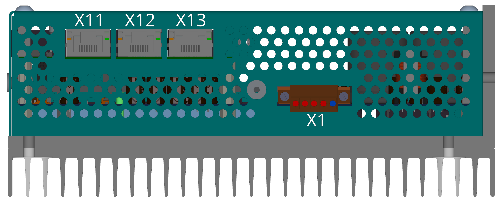
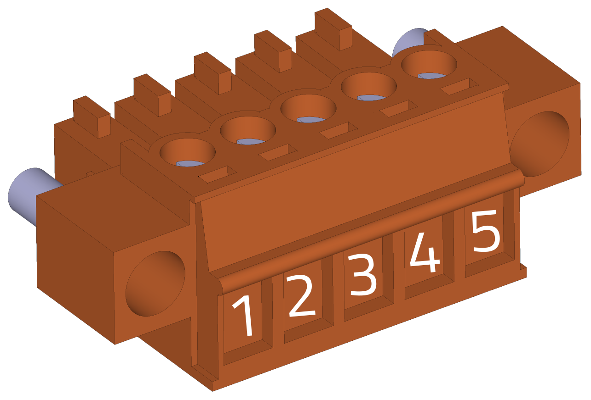
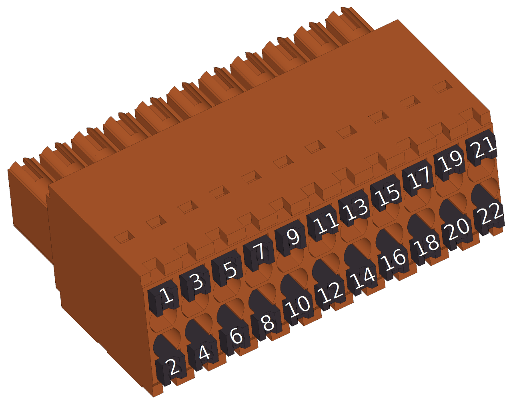
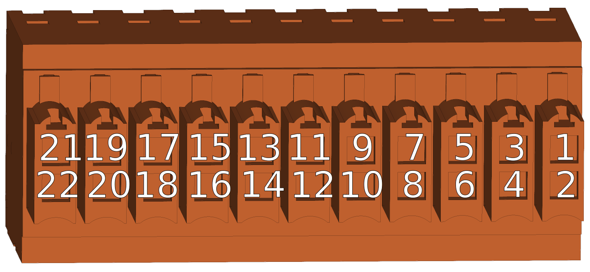
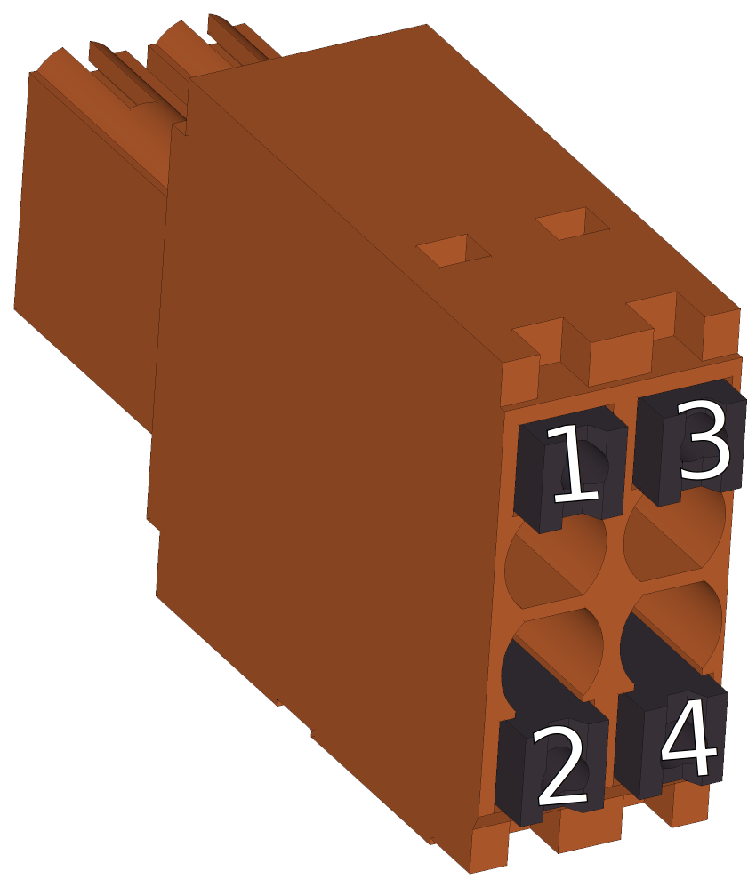
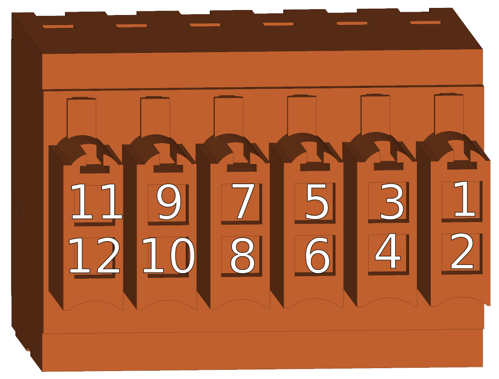
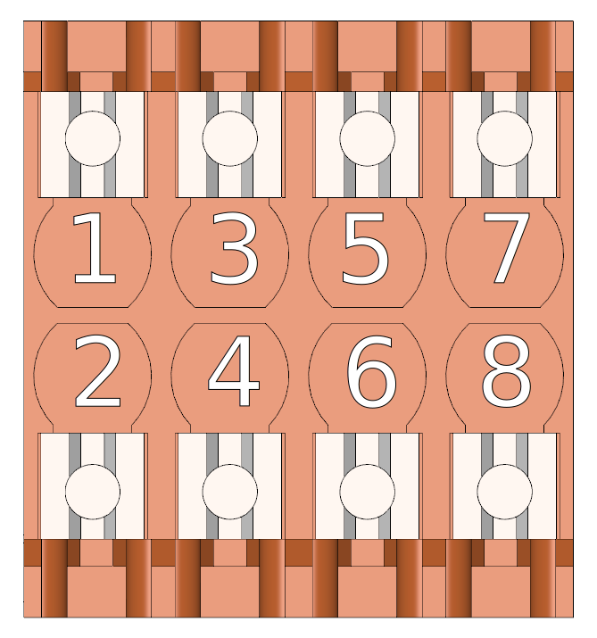
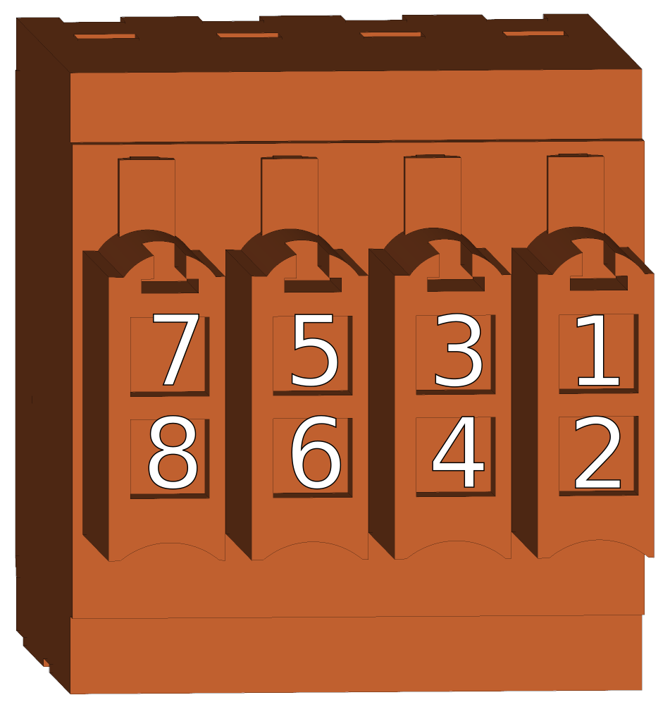
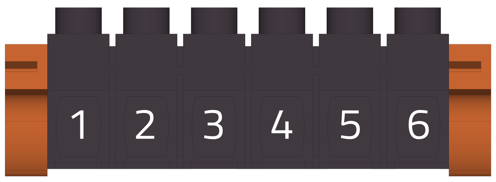

##3D náhled
{: style="width:75%;" }
 
 
{: style="width:60%;" }

##Konektory
___
### Strana komunikace/ethernet/ethercat a 24V napájení
___

{: style="width:80%;" }

-   **X1 - Napájení řídicí části**

    ---
	Pohled zezadu (strana vodičů)   
	
	{: style="width:60%;" }   
	
	{: style="width:60%;" }	

-    Weidmüller BCZ 3.81/05/180F SN OR BX

	---

	--8<-- "md/X1_24V_5pin_BCZ.md"
	
	!!! warning "Odrušení přívodu"
	
		Věnujte prosím pozornost instalaci odrušovacího toroidu dle [návodu](../../../../source/md/logicPWR.md#LogicPWR_EMI).

___
### Strana CAN/IO/SD
___

{: style="width:80%;" }

-   **X8 - Digitální I/O, analogové vstupy**

    ---
	Pohled zezadu (strana kabelu)   
	
	{: style="width:100%;" }
	3D pohled zezadu   
	
	{: style="width:100%;" }
	Pohled zepředu (strana TGZ)   
	
	{: style="width:100%;" }

	Detailní soupis parametrů 
	[digitálních vstupů DI1-8](../../../../source/md/commonHW_DI.md#commonDI1-8), 
	[digitálních výstupů DO1-6](../../../../source/md/commonHW_DO.md#commonDO1-6) a 
	[analogových vstupů AI1-2](../../../../source/md/commonHW_AI.md#commonAI1-2) 
	naleznete v sekci [Společný HW](../../../../source/md/commonHW_DI.md#commonDI1-8).
	

-    Weidmüller B2CF 3.50/22/180 SN OR BX

	---

	--8<-- "md/X8_IO_22pin_B2CF.md"
	
	!!! warning "Pozor"	
	
		Pro správnou funkci DI(1-6) je potřeba připojit alespoň jedno z VCC DO (pin 11 a 12). Vstupy DI7,8 jsou nezávislé na napájecím napětí DO VCC a fungují korektně i bez něj.
	
-   **X9 - MicroSD karta**

    ---
{: style="width:60%;" }

-    Použijte standardní microSD kartu. Karta je součástí dodávky servozesilovače TGZ. Více informací naleznete v sekci [SD karty](../../TGZ_SW/SD/md/SD.md#SDparams).

-   **X10 - CAN**

    ---
	Pohled zezadu (strana kabelu)   
	{: style="width:25%;" }
	
	3D pohled zezadu   
	{: style="width:45%;" }
	
	Pohled zepředu (strana TGZ)   
	{: style="width:35%;" }

-    Weidmüller B2CF 3.50/04/180 SN OR BX

    ---

	--8<-- "md/X10_CAN_4pin_B2CF.md"
	
	Další informace o HW provedení sběrnice CAN naleznete v sekci [Sběrnice CAN](../../../../source/md/commonHW_CAN.md#commonCAN).
	
-	**LED displej**

	---
	
	{: style="width:60%;" }
	
-	LED displej signalizuje stavy viz. [Význam stavových indikátorů TGZ](../../TGZ_SW/LED/md/description.md#LED_sigs)

-	**LED signalizace**

	---
	
	{: style="width:100%;" }
	
-	LED diody

	---
	
	--8<-- "md/LEDsigAx12.md"
	
	Kompletní popis významu stavových LED diod naleznete zde: [Význam stavových indikátorů TGZ](../../TGZ_SW/LED/md/description.md#LED_sigs)

   
___
### Strana FB/motor
___

{: style="width:80%;" }

-   **X5 - Externí enkodér (FBE)**

    ---
	Pohled zezadu (strana kabelu) 	
	{: style="width:60%;" }
	
	3D pohled zezadu   
	{: style="width:60%;" }
	
	Pohled zepředu (strana TGZ)   
	{: style="width:60%;" }	

-    Weidmüller B2CF 3.50/12/180 SN OR BX

	---

	--8<-- "md/X5_FBE_12pin_B2CF.md"
	
	Další informace ohledně externí zpětné vazby naleznete v sekci [Zpětná vazba FBE](../../../../source/md/commonHW_FBE.md#commonFBE).

-   **X6 - Zpětná vazba - osa 1**

    ---
	
	Pohled zezadu (strana kabelu) 	
	{: style="width:50%;" }
	
	3D pohled zezadu   
	{: style="width:50%;" }
	
	Pohled zepředu (strana TGZ)   
	{: style="width:50%;" }

-    Weidmüller B2CF 3.50/08/180 SN OR BX

    ---

	--8<-- "md/X6_FB1_8pin_B2CF.md"
	
	Další informace ohledně zpětné vazby 1 naleznete v sekci [Zpětná vazba FB1, FB2](../../../../source/md/commonHW_FB12.md#commonFB12).
	
-   **X7 - Zpětná vazba - osa 2**

    ---
	
	Pohled zezadu (strana kabelu) 	
	{: style="width:50%;" }
	
	3D pohled zezadu   
	{: style="width:50%;" }
	
	Pohled zepředu (strana TGZ)   
	{: style="width:50%;" }

-    Weidmüller B2CF 3.50/08/180 SN OR BX

    ---

	--8<-- "md/X7_FB2_8pin_B2CF.md"
	
	Další informace ohledně zpětné vazby 2 naleznete v sekci [Zpětná vazba FB1, FB2](../../../../source/md/commonHW_FB12.md#commonFB12).
		
-   **X3 - Motorový konektor osa 1**

    ---
	Pohled ze strany vodičů:
	
	{: style="width:70%;" }   
	
	{: style="width:70%;" } 	
	
	
-    Weidmüller BLZ 7.62HP/06/180LR SN BK BX

    ---

	--8<-- "md/X3_M1_6pin_BLZ__7_62.md"

	!!! warning "Orientace konektorů"
	
		Pozor na správnou orientaci konektoru při zapojování kabeláže.	
		
-   **X4 - Motorový konektor osa 2**

    ---
	Pohled ze strany vodičů:
	
	{: style="width:70%;" }   
	
	{: style="width:70%;" } 	
	
	
-    Weidmüller BLZ 7.62HP/06/180LR SN BK BX

    ---

	--8<-- "md/X4_M2_6pin_BLZ__7_62.md"

	!!! warning "Orientace konektoru"
	
		Pozor na správnou orientaci konektoru při zapojování kabeláže.			
	
-   **X2 - Napájení silové části**

    ---
	Pohled na konektor ze strany vodičů:
	{: style="width:50%;" }   
	
	{: style="width:50%;" }	

-    Weidmüller BLZ 7.62HP/03/180LR SN BK BX

    ---

	--8<-- "md/X2_560_DC_3pin_BLZ__7_62.md"
	
	!!! warning "Orientace konektorů"
	
		Pozor na správnou orientaci konektoru při zapojování kabeláže.		
	

