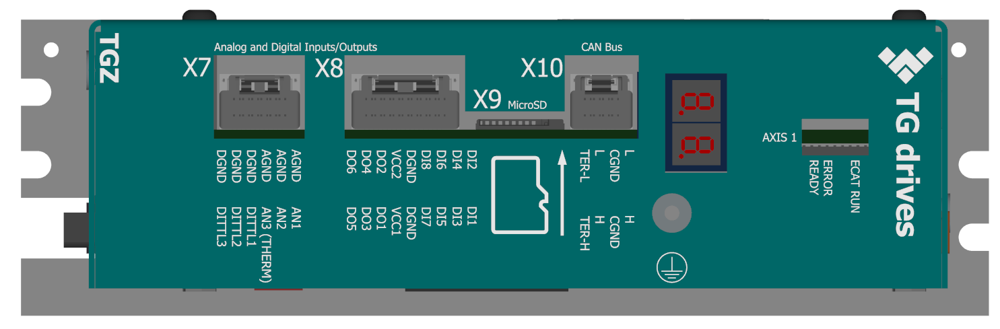
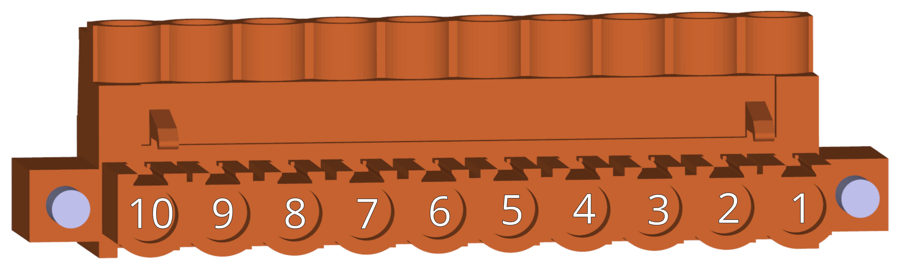

##3D náhled
{: style="width:70%;" }
 
 
{: style="width:70%;" }

##Konektory
___
### Strana komunikace/ethernet/ethercat
___

{: style="width:60%;" }

-   **X1 - Napájení řídicí části**

    ---
	Pohled zezadu (strana vodičů)   
	
	{: style="width:60%;" }   
	
	{: style="width:60%;" }	

-    Weidmüller BCZ 3.81/05/180F SN OR BX

	---

	--8<-- "md/X1_24V_5pin_BCZ.md"
	
	!!! warning "Odrušení přívodu"
	
		Věnujte prosím pozornost instalaci odrušovacího toroidu dle [návodu](../../../../source/md/logicPWR.md#LogicPWR_EMI).

-   **X11 - Zpětná vazba 3 - RS422**

    ---
    {: style="width:70%;" }
	
-    Molex ClikMate 5031491000 - doporučené krimpovací kontakty [Molex 502579](https://www.molex.com/en-us/part-list/502579) [^1]

    --8<-- "md/X11_FB3_10pin_ClikMate.md"
	
	!!! warning "Pozor"	
		Při použití tohoto typu zpětné vazby se ujistěte, že používáte vhodný TGZ firmware, který tyto funkce podporuje.

-   **X12 - Ethernet UDP - servisní**

    ---
    {: style="width:70%;" }
	
-    Molex ClikMate 5031490800 - doporučené krimpovací kontakty [Molex 502579](https://www.molex.com/en-us/part-list/502579) [^1]

    --8<-- "md/X12_UDP_8pin_ClikMate.md"

-   **X13 - EtherCAT 2 - Fieldbus out**

    ---
    {: style="width:70%;" }
	
-    Molex ClikMate 5031490800 - doporučené krimpovací kontakty [Molex 502579](https://www.molex.com/en-us/part-list/502579) [^1]

    --8<-- "md/X12_UDP_8pin_ClikMate.md"

-   **X14 - EtherCAT 1 - Fieldbus in**

    ---
    {: style="width:70%;" }
	
-    Molex ClikMate 5031490800 - doporučené krimpovací kontakty [Molex 502579](https://www.molex.com/en-us/part-list/502579) [^1]

    --8<-- "md/X12_UDP_8pin_ClikMate.md"

___
### Strana CAN/IO/SD
___

{: style="width:60%;" }

-   **X7 - Digitální vstupy + Analogové vstupy**

    ---
	{: style="width:70%;" }

-    Molex ClikMate 5031491200 - doporučené krimpovací kontakty [Molex 502579](https://www.molex.com/en-us/part-list/502579) [^1]

	---

	--8<-- "md/X7_AIN_12pin_ClikMate.md"
	
	!!! warning "Varování"
		Přímé vstupy PT1000 na pinech 3-6 konektoru X7 jsou dostupné pouze na řídicí desce z dodávek po 06-2024.
		Starší verze zařízení mají standardní AIN1, AIN2 a AIN3 na pinech 1-6 konektoru X7.
		Pro další podrobnosti o vlastnostech předchozího zařízení prosím nahlédněte do starší (PDF) verze tohoto manuálu.

-   **X8 - Digitální I/O**

    ---
	{: style="width:100%;" }

-    Molex ClikMate 5031491800 - doporučené krimpovací kontakty [Molex 502579](https://www.molex.com/en-us/part-list/502579) [^1]

	---

	--8<-- "md/X8_DIO_18pin_ClikMate.md"
		
-   **X9 - MicroSD slot**

    ---
	{: style="width:40%;" }

-   V servozesilovačích typu "RI" není primárně doporučeno používat microSD slot u zařízení, kde se předpokládají velké vibrace.
	SD karta není u těchto verzí součástí dodávky.
	Pro více informací ohledně SD karet navštivte sekci [SD karty](../../TGZ_SW/SD/md/SD.md#SDparams).

-   **X10 - CAN**

    ---
	
	{: style="width:70%;" }

-    Molex ClikMate 5031490800 - doporučené krimpovací kontakty [Molex 502579](https://www.molex.com/en-us/part-list/502579) [^1]

    ---

	--8<-- "md/X10_CAN_8pin_ClikMate.md"
	
-	**LED displej**

	---
	
	{: style="width:60%;" }
	
-	LED displej signalizuje stavy viz. [Význam stavových indikátorů TGZ](../../TGZ_SW/LED/md/description.md#LED_sigs)

-	**LED signalizace**

	---
	
	{: style="width:100%;" }
	
-	LED diody

	---
	
	--8<-- "md/LEDsigAx12.md"
	
	Kompletní popis významu stavových LED diod naleznete zde: [Význam stavových indikátorů TGZ](../../TGZ_SW/LED/md/description.md#LED_sigs)

   
___
### Strana FB/motor
___

{: style="width:60%;" }

-   **X4 - Externí enkodér (FBE)**

    ---
	
	{: style="width:80%;" }

-    Molex ClikMate 5031491200 - doporučené krimpovací kontakty [Molex 502579](https://www.molex.com/en-us/part-list/502579) [^1]

	---

	--8<-- "md/X4_FBE_12pin_ClikMate.md"

-   **X5 - Zpětná vazba - osa 1**

    ---
	
	{: style="width:80%;" }

-    Molex ClikMate 5031491000 - doporučené krimpovací kontakty [Molex 502579](https://www.molex.com/en-us/part-list/502579) [^1]

    ---

	--8<-- "md/X5_FB1_10pin_ClikMate.md"
	
	!!! warning "Upozornění"
		Aby bylo možné použít typ zpětné vazby Hiperface DSL, uživatel musí propojit piny 5-7 a 6-8 konektoru FB1 nebo naletovat odpovídající propojky (rezistory) na řídicí desku TGZcontrol.
		Toto platí pro dodávky po 06-2024, kde není provedeno žádné interní spojení.
		Ověřte také, zda máte v zařízení nahrán správný firmware podporující zvolený typ zpětné vazby.
	
-   **X6 - Zpětná vazba - osa 2**

    ---
	
	{: style="width:80%;" }

-    Molex ClikMate 5031491000 - doporučené krimpovací kontakty [Molex 502579](https://www.molex.com/en-us/part-list/502579) [^1]

    ---

	--8<-- "md/X6_FB2_10pin_ClikMate.md"
	
	!!! warning "Upozornění"
		Aby bylo možné použít typ zpětné vazby Hiperface DSL, uživatel musí propojit piny 5-7 a 6-8 konektoru FB2 nebo naletovat odpovídající propojky (rezistory) na řídicí desku TGZcontrol.
		Toto platí pro dodávky po 06-2024, kde není provedeno žádné interní spojení.
		Ověřte také, zda máte v zařízení nahrán správný firmware podporující zvolený typ zpětné vazby.

	!!! note "Poznámka"
	
		Servozesilovač TGZ-S-230-5/15-UNI-RI je jednoosý. Konektor X6 se běžně nezapojuje.
	
-   **X3.1 - Motorový konektor**

    ---
	
	{: style="width:70%;" }

-    Weidmüller SLS 5.08/06/180FI SN OR BX

    ---

	--8<-- "md/X4_M1_6pin_SLS.md"
	
-   **X2 - Napájení silové části**

    ---
	Pohled ze strany vodičů
	{: style="width:100%;" }
	Pohled zepředu - strana TGZ
	{: style="width:100%;" }	

	Konektor X2 je standardně dodáván včetně propojovaho vodiče v konfiguraci pro použítí bez brzdného odporu.
	
	{: style="width:100%;" }   
	
	V případě použití externího brzdného rezistoru je nutné odstranit propojovací vodič a rezistor připojit dle [schématu](schematic.md).
	

-    Weidmüller BLZP 5.08HC/10/180F SN OR BX

    ---

	--8<-- "md/X2_PWR_10pin_BLZP.md"
	

[^1]: Při krimpování a zapojování konektorů systému Molex Clik-Mate postupujte dle [Aplikačního návodu Molex Clik-Mate](https://www.molex.com/content/dam/molex/molex-dot-com/products/automated/en-us/applicationspecificationspdf/503/503149/AS-503149-001-001.pdf)
