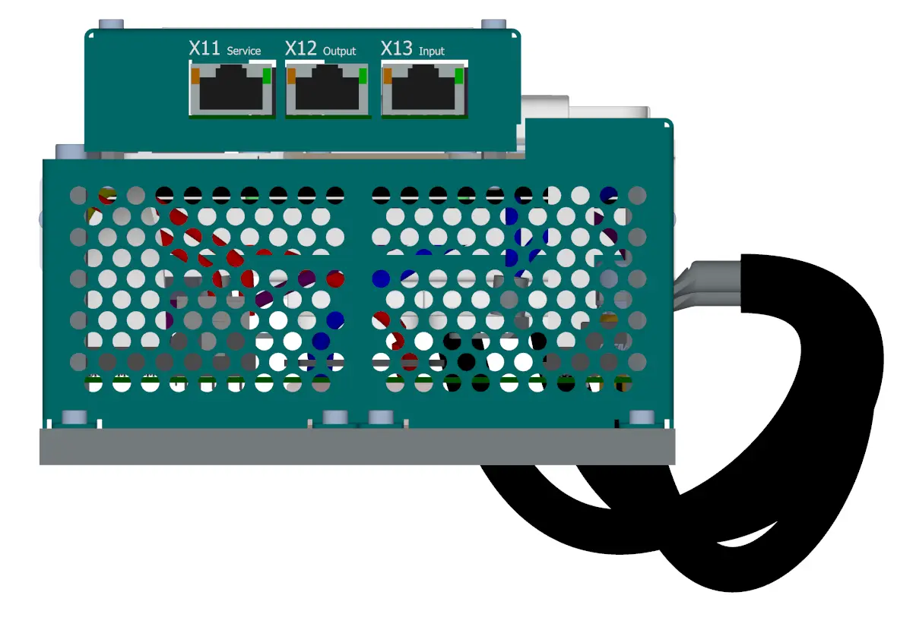
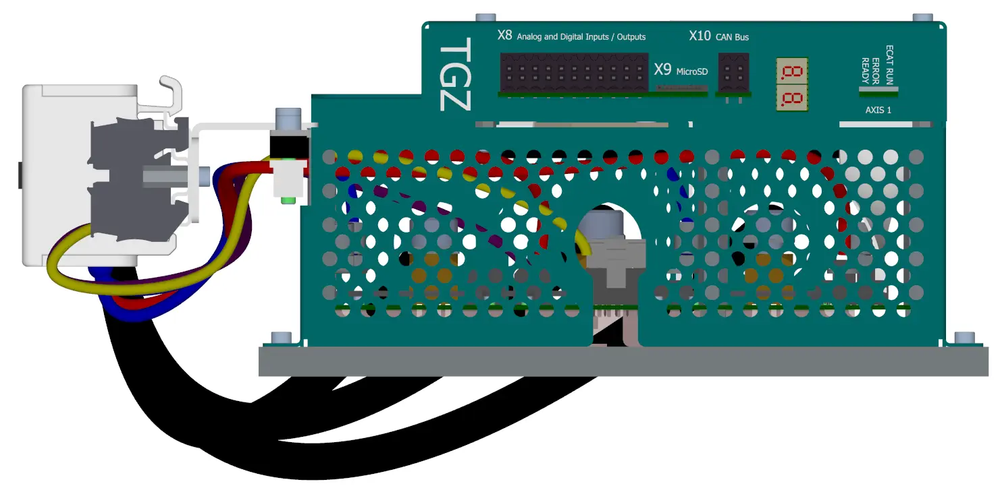
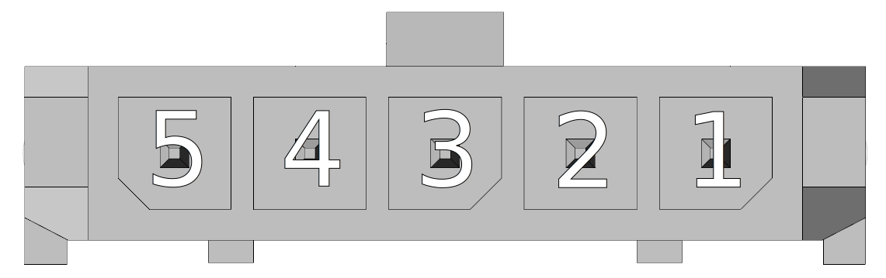
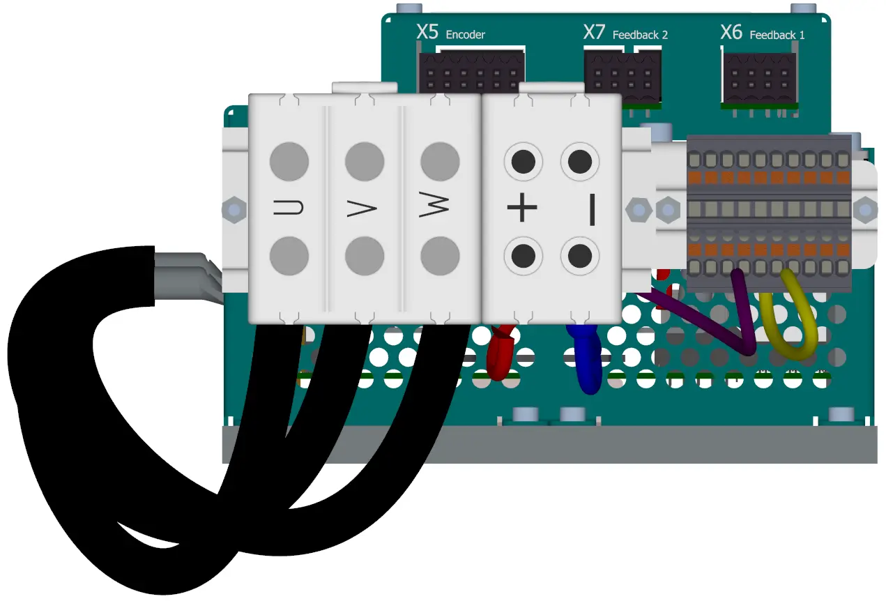
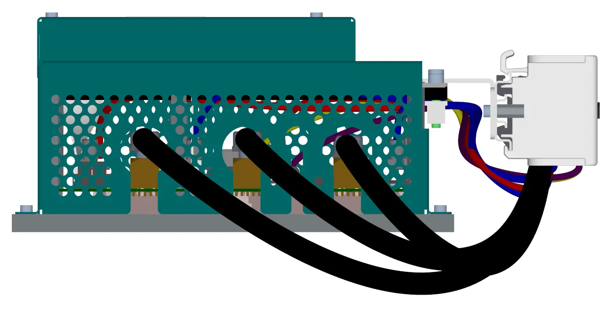

##3D view
{: style="width:80%;" }
 
 
{: style="width:80%;" }

##Connectors
___
### EtherNET/EtherCAT side view
___

{: style="width:60%;" }

___
### View of the CAN/IO/SD Side
___

{: style="width:60%;" }

-   **X1 - Control supply voltage**

    ---
	{: style="width:90%;" }

-    Molex Micro-Fit 3.0 - 436450500

	---

	--8<-- "md/X1_24V_5pin_Microfit.en.md"
	
	!!! warning "Warning"
		
		Pin 2 of connector X1 - "+24 VDC output" must be connected externally to pin 2 of connector P7 (power supply for static brake diagnostics).
		
		Note the orientation of the connector - locking lever on top = pin 1 on the right.
		
	!!! info "Connector crimps"
	
		Match the type of crimps to the selected wire cross section.
		
-   **X8 - Digital I/O, analog inputs**

    ---
	Cable side view   
	
	{: style="width:100%;" }
	3D view - cable side   
	
	{: style="width:100%;" }
	Front view (TGZ side)   
	
	{: style="width:100%;" }

	Please see details about
	[digital inputs DI1-8](../../../../source/md/commonHW_DI.md#commonDI1-8), 
	[digital outputs DO1-6](../../../../source/md/commonHW_DO.md#commonDO1-6) and
	[analog inputs AI1-2](../../../../source/md/commonHW_AI.md#commonAI1-2) 
	in the [Common hardware section](../../../../source/md/commonHW_DI.md#commonDI1-8).
	

-    Weidmüller B2CF 3.50/22/180 SN OR BX

	---

	--8<-- "md/X8_IO_22pin_B2CF.en.md"
	
	!!! warning "Warning"	
	
		For proper operation of the DI(1-6) it is necessary to supply at least one of the VCC DO (pin 11 and 12).
		Inputs DI7,8 are independent of the DO VCC supply voltage and work correctly even without it.
	
-   **X9 - MicroSD card**

    ---
	{: style="width:60%;" }

-    Use a standard microSD card. The card is included with the TGZ servo amplifier. For more information, see [SD cards](../../TGZ_SW/SD/md/SD.md#SDparams).

-   **X10 - CAN**

    ---
	Cable side view   
	{: style="width:25%;" }
	
	3D view - cable side   
	{: style="width:45%;" }
	
	Front view (TGZ side)   
	{: style="width:35%;" }

-    Weidmüller B2CF 3.50/04/180 SN OR BX

    ---

	--8<-- "md/X10_CAN_4pin_B2CF.en.md"
	
	For more information on the HW version of the CAN bus, see [CAN bus](../../../../source/md/commonHW_CAN.md#commonCAN).
	
-	**LED display**

	---
	
	{: style="width:60%;" }
	
-	LED display indicates the status of the servoamplifier. See [TGZ status indicators](../../TGZ_SW/LED/md/description.md#LED_sigs) for detailed description.

-	**status LEDs**

	---
	
	{: style="width:100%;" }
	
-	LED diodes

	---
	
	--8<-- "md/LEDsigAx12.en.md"
	
	A complete description of the meaning of the status LEDs can be found here: [TGZ status indicators](../../TGZ_SW/LED/md/description.md#LED_sigs)

   
___
### Feedback side view
___

{: style="width:60%;" }

-   **X5 - External encoder (FBE)**

    ---
	
	{: style="width:80%;" }

-    Weidmüller B2CF 3.50/12/180 SN OR BX

	---

	--8<-- "md/X5_FBE_12pin_B2CF.en.md"
	
	For more information on external feedback, see [FBE Feedback](../../../../source/md/commonHW_FBE.md#commonFBE).

-   **X6 - Feedback axis 1**

    ---
	
	Cable side view 	
	{: style="width:50%;" }
	
	3D view - cable side   
	{: style="width:50%;" }
	
	Front view (TGZ side)   
	{: style="width:50%;" }

-    Weidmüller B2CF 3.50/08/180 SN OR BX

    ---

	--8<-- "md/X6_FB1_8pin_B2CF.en.md"
	
	For more information regarding Feedback 1, please see [Feedback FB1, FB2](../../../../source/md/commonHW_FB12.md#commonFB12).
	
-   **X7 - Feedback axis 2**

    ---
	
	Cable side view 	
	{: style="width:50%;" }
	
	3D view - cable side   
	{: style="width:50%;" }
	
	Front view (TGZ side)   
	{: style="width:50%;" }

-    Weidmüller B2CF 3.50/08/180 SN OR BX

    ---

	--8<-- "md/X7_FB2_8pin_B2CF.en.md"
	
	For more information regarding Feedback 2, please see [Feedback FB1, FB2](../../../../source/md/commonHW_FB12.md#commonFB12).
	
-   **X0 - Main terminal block**

    ---
	
	Front view
	{: style="width:50%; transform: rotate(270deg);" }
	

-    Main screw terminal

    ---

	--8<-- "md/X6_FB1_8pin_B2CF.en.md"
	

___
### Motor output view
___

{: style="width:60%;" }