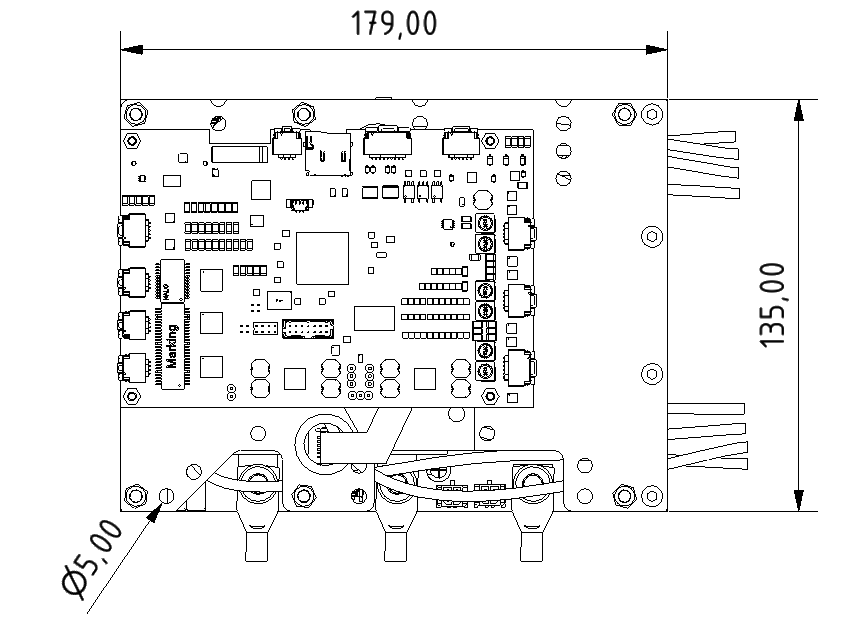
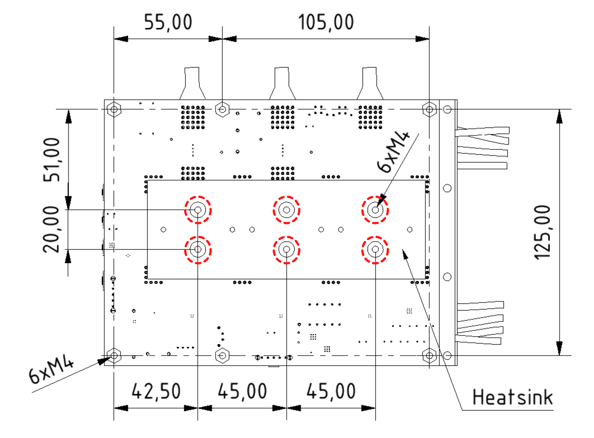
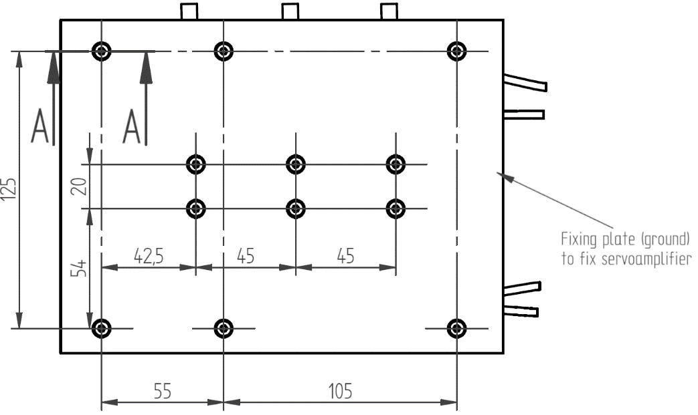
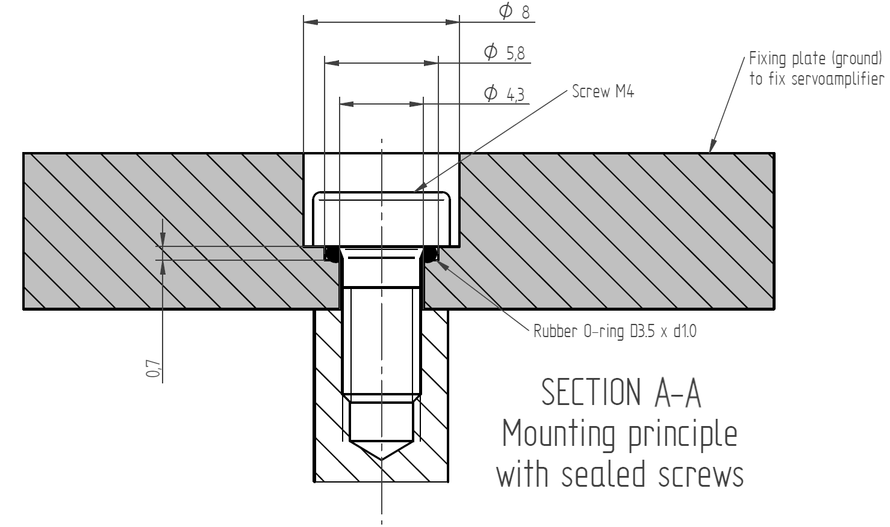

##Mounting
The L-profile allows variable mounting of the servoamplifier in the control cabinet or directly on the machine.
Below are the dimensions and position of the individual mounting elements.   

Top view
{: style="width:70%;" }   

Bottom view
{: style="width:70%;" }

!!! warning "Important"
	The screws (6 x M4 - marked in red) for mounting the heat sink must not be longer than 7 mm, otherwise there is a risk of mechanical damage to the servo amplifier.
   
Detailed view of the TGZ-S-48-100/250 and TGZ-S-48-100/300 servo amplifiers:
{: style="width:70%;" }
{: style="width:70%;" }

##Mounting procedure

1. Prepare the site, the necessary tools and protective equipment. Install the servoamplifier in the desired location. 
   There must be no materials at the installation site that could cause short circuits or corrosion.
2. Check that nothing is blocking the ventilation and ensure that the permissible ambient temperature is observed.
3. If a cooling system is used in the cabinet, position it so that condensed water cannot drip onto the servoamplifier or accessories. 
4. Mount the servoamplifier and power supply close to each other on a conductive grounded fixing plate. 
5. Ground the servoamplifier.

!!! Note "Cooling"
	To achieve the declared parameter values, it is necessary to ensure sufficient heat dissipation and cooling of the servoamplifier.