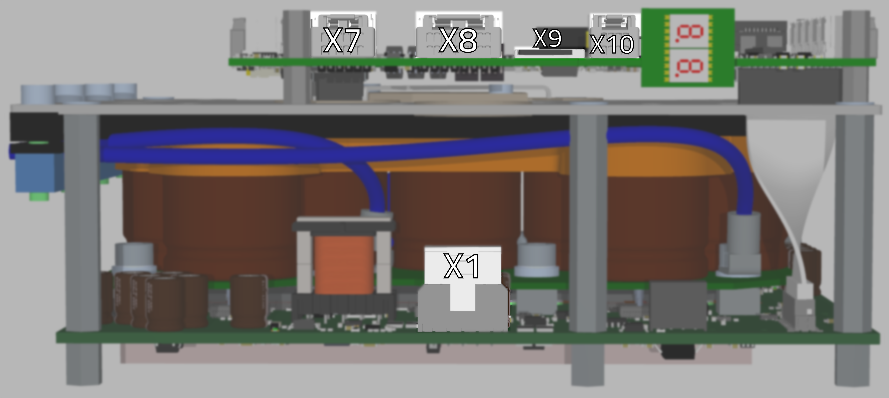
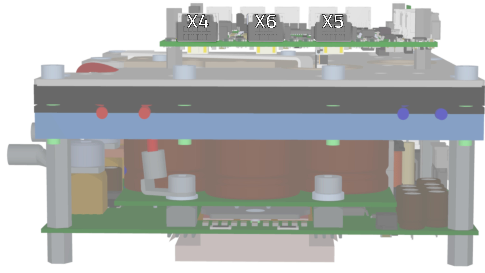
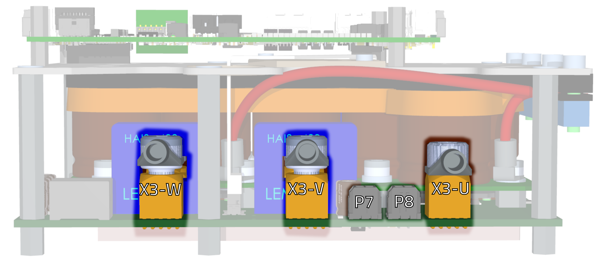
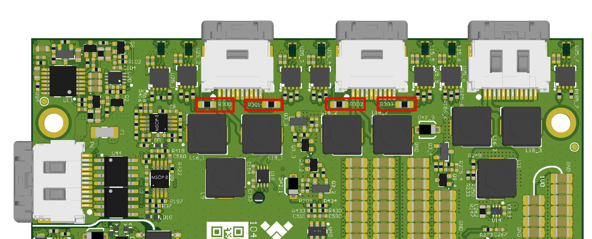

##3D náhled
{: style="width:70%;" }   
 
 
{: style="width:70%;" }   

##Blokové schéma s připojením hlavních rozhraní
{: style="width:70%;" }

!!! note "Poznámka"
	Externí teplotní čidlo PT1000 se používá k měření teploty motoru.
	
##Popis komunikace, vstupů/výstupů a ovládání
###Komunikační rozhraní
- Ethernet 100/1000 Mb/s s UDP protokolem, určen pro záznam parametrů, monitorování, testování, ale také online ovládání.
- CAN bus protokol lze upravit podle požadavků zákazníka.
- Ethernet 100/1000 Mb/s s volitelným protokolem, naprogramovaný v hradlovém poli a určený pro připojení rychlých průmyslových sběrnic pro řízení v reálném čase.
  V současné době je toto rozhraní vybaveno protokolem EtherCAT (pouze pro standardní firmware); podle požadavků zákazníka lze upravit na jiný typ protokolu.
- RS422 / RS485, přenos dat přes nepoužívané rozhraní zpětné vazby servomotoru.
  Může být použit pro komunikaci se zařízeními založenými na standardu RS422 nebo RS485 (enkodér, gyroskop, nadřazené řízení, jiný systém atd.).
  Toto rozhraní umožňuje vysokorychlostní komunikaci až 20 Mbit/s.
  
###Vstupy / výstupy
Vestavné servozesilovače TGZ v tomto provedení mají 8 digitálních vstupů, 6 digitálních výstupů, 2 vstupy pro teplotní čidlo PT1000, jeden obecný analogový vstup 0-10 V a 3 vstupy pro připojení Hall čidel (1 osa).
Tyto vstupy/výstupy je možné číst/ovládat pomocí uživatelského programu (jazyk C).
Digitální výstupy lze ovládat i přes ovládací servisní software TGZ GUI.

| I/O     | Typ              | Počet | Hodnota                                             |
|---------|------------------|--------|----------------------------------------------------|
| vstup   | analogový        | 1      | 0-10 V                                             |
| vstup   | termistor        | 2      | standard PT1000                                    |
| vstup   | Hall             | 3      | 5-30 V 										   |
| vstup   | izolovaný digitální | 8   | 0-24 V (0-10 V low/13-24 V high), 10 mA          |
| výstup  | izolovaný digitální | 6   | 5-24 V, 300 mA / max. výstup                     |

Servozesilovač má čtyři zpětnovazební rozhraní, které mají široké využití.
Kromě zpětné vazby motoru je lze použít k připojení zařízení pracujících na principu standardu RS422 nebo RS485.

| Typ   | Standard              | Rozhraní                         | Příklady připojení možných zařízení                                                                                               |
|-------|-----------------------|----------------------------------|-----------------------------------------------------------------------------------------------------------------------------------|
| FB1   | RS422/RS485           | Hiperface DSL, EnDat 2.2, SSI, BISS | Absolutní magnetický / optický enkodér, inkrementální magnetický / optický enkodér s Hallovými senzory [^2], gyroskop              |
| FB2   | RS422/RS485           | Hiperface DSL, EnDat 2.2, SSI, BISS | Absolutní magnetický / optický enkodér, inkrementální magnetický / optický enkodér s Hallovými senzory [^2], gyroskop              |
| FE[^1]   | RS422/RS485           | Hiperface DSL, EnDat 2.2, SSI, BISS | Absolutní magnetický / optický enkodér, inkrementální magnetický / optický enkodér s Hallovými senzory [^2], gyroskop              |
| FB3[^1]  | 2 × full-duplex RS422 | -                                | Řídicí systém                                                                                                                     |
| FB4    | Resolver				 | Analogový                              | Možnost připojení různých typů resolverů                                                                                     |

[^1]: Tento typ pracuje pouze s upraveným firmwarem. Jeho použití se doporučuje vždy konzultovat s výrobcem.
[^2]: Hallovy senzory musí být připojeny k digitálním vstupům pomocí speciálního převodníku úrovní, viz. [Převodník Hall-TGZ](../../../ETC/TGHall/md/description.md#TGhall_1).

- Hiperface DSL - digitální komunikace, senzory jsou vyráběny s rozlišením 15 až 24 bitů na otáčku (vícerychlostní provedení - 4 096 otáček).
  Tento typ zpětné vazby se používá pro motory s jediným konektorem nebo kabelem.
- EnDat 2.2 - digitální komunikace, senzory jsou vyráběny s rozlišením 18 až 25 bitů na otáčku (vícerychlostní provedení - 4 096 otáček).
- SSI - enkodéry se synchronním systémovým rozhraním.
- BISS - senzory s protokolem BISS-C.

###Řízení
Servozesilovače TGZ je možno řídit:

- digitální ovládání přes EtherCAT, CAN-bus (točivý moment, otáčky, polohové profily atd.) A přes Ethernet UDP protokol;
- uživatelský program (jazyk C) - digitální vstupy, analogové napětí atd.

##Konektory
___
### Strana komunikace/ethernet/ethercat
___

{: style="width:80%;" }

-   **X16 - Zpětná vazba 4 - resolver**

    ---
    {: style="width:70%;" }
	
-    Molex ClikMate 5031490800 - doporučené krimpovací kontakty [Molex 502579](https://www.molex.com/en-us/part-list/502579) [^3]

    --8<-- "md/X16_RES_8pin_ClikMate.md"

-   **X11 - Zpětná vazba 3 - RS422**

    ---
    {: style="width:70%;" }
	
-    Molex ClikMate 5031491000 - doporučené krimpovací kontakty [Molex 502579](https://www.molex.com/en-us/part-list/502579) [^3]

    --8<-- "md/X11_FB3_10pin_ClikMate.md"
	
	!!! warning "Pozor"	
		Při použití tohoto typu zpětné vazby se ujistěte, že používáte vhodný TGZ firmware, který tyto funkce podporuje.

-   **X12 - Ethernet UDP - servisní**

    ---
    {: style="width:70%;" }
	
-    Molex ClikMate 5031490800 - doporučené krimpovací kontakty [Molex 502579](https://www.molex.com/en-us/part-list/502579) [^3]

    --8<-- "md/X12_UDP_8pin_ClikMate.md"

-   **X13 - EtherCAT 2 - Fieldbus out**

    ---
    {: style="width:70%;" }
	
-    Molex ClikMate 5031490800 - doporučené krimpovací kontakty [Molex 502579](https://www.molex.com/en-us/part-list/502579) [^3]

    --8<-- "md/X12_UDP_8pin_ClikMate.md"

-   **X14 - EtherCAT 1 - Fieldbus in**

    ---
    {: style="width:70%;" }
	
-    Molex ClikMate 5031490800 - doporučené krimpovací kontakty [Molex 502579](https://www.molex.com/en-us/part-list/502579) [^3]

    --8<-- "md/X12_UDP_8pin_ClikMate.md"

___
### Strana CAN/IO/SD
___

{: style="width:80%;" }

-   **X1 - Napájení řídicí části**

    ---
	{: style="width:90%;" }
	
	Pohled na protikus ze strany PCB:
	
	{: style="width:90%;" }
	
	Pohled na protikus ze strany vodičů:
	
	{: style="width:90%;" }	
	
-    Molex Micro-Fit 3.0 - 436450500. Doporučené krimpovací kontakty [Molex 43030](https://www.molex.com/en-us/part-list/43030). [^4]

	---

	--8<-- "md/X1_24V_5pin_Microfit.md"
	
	!!! warning "Upozornění"
		
		Pin č. 2 konektoru X1 - "Výstup +24 VDC" je nutné externě propojit s pinem č. 2 na konektoru P7 (napájení diagnostiky statické brzdy).
		
		Pozor na orientaci konektoru - zajišťovací páčka nahoře = pin č. 1 vpravo. Konektor je orientován zajišťovací páčkou ven z PCB.
		
	!!! info "Konektorové krimpy"
	
		Přizpůsobte typ krimpů zvolenému průřezu vodiče.

-   **X7 - Hall + Analogové vstupy**

    ---
	{: style="width:70%;" }

-    Molex ClikMate 5031491200 - doporučené krimpovací kontakty [Molex 502579](https://www.molex.com/en-us/part-list/502579) [^3]

	---

	--8<-- "md/X7_AIN_HALL_12pin_ClikMate.md"
	
-   **X8 - Digitální I/O**

    ---
	{: style="width:100%;" }

-    Molex ClikMate 5031491800 - doporučené krimpovací kontakty [Molex 502579](https://www.molex.com/en-us/part-list/502579) [^3]

	---

	--8<-- "md/X8_DIO_18pin_ClikMate.md"
	
	Detailní soupis parametrů 
	[digitálních vstupů DI1-8](../../../../source/md/commonHW_DI_RI.md#commonDI1-8_RI) a
	[digitálních výstupů DO1-6](../../../../source/md/commonHW_DO.md#commonDO1-6) 
	naleznete v sekci [Společný HW](../../../../source/md/commonHW_DI_RI.md#commonDI1-8_RI).
		
-   **X9 - MicroSD slot**

    ---
	{: style="width:40%;" }

-   V servozesilovačích typu "RI" není primárně doporučeno používat microSD slot u zařízení, kde se předpokládají velké vibrace.
	SD karta není u těchto verzí součástí dodávky.
	Pro více informací ohledně SD karet navštivte sekci [SD karty](../../TGZ_SW/SD/md/SD.md#SDparams).

-   **X10 - CAN**

    ---
	
	{: style="width:70%;" }

-    Molex ClikMate 5031490800 - doporučené krimpovací kontakty [Molex 502579](https://www.molex.com/en-us/part-list/502579) [^3]

    ---

	--8<-- "md/X10_CAN_8pin_ClikMate.md"
	
-	**LED displej**

	---
	
	{: style="width:60%;" }
	
-	LED displej signalizuje stavy viz. [Význam stavových indikátorů TGZ](../../TGZ_SW/LED/md/description.md#LED_sigs)

-	**LED signalizace**

	---
	
	{: style="width:100%;" }
	
-	LED diody

	---
	
	--8<-- "md/LEDsigAx12.md"
	
	Kompletní popis významu stavových LED diod naleznete zde: [Význam stavových indikátorů TGZ](../../TGZ_SW/LED/md/description.md#LED_sigs)

   
___
### Strana feedback
___

{: style="width:80%;" }

-   **X4 - Externí enkodér (FBE)**

    ---
	
	{: style="width:80%;" }

-    Molex ClikMate 5031491200 - doporučené krimpovací kontakty [Molex 502579](https://www.molex.com/en-us/part-list/502579) [^3]

	---

	--8<-- "md/X4_FBE_12pin_ClikMate.md"
	
	Další informace ohledně externí zpětné vazby naleznete v sekci [Zpětná vazba FBE](../../../../source/md/commonHW_FBE.md#commonFBE).

-   **X5 - Zpětná vazba - osa 1**

    ---
	
	{: style="width:80%;" }

-    Molex ClikMate 5031491000 - doporučené krimpovací kontakty [Molex 502579](https://www.molex.com/en-us/part-list/502579) [^3]

    ---

	--8<-- "md/X5_FB1_10pin_ClikMate.md"
	
	Další informace ohledně zpětné vazby 1 naleznete v sekci [Zpětná vazba FB1, FB2](../../../../source/md/commonHW_FB12.md#commonFB12).
	
	!!! warning "Upozornění"
		Aby bylo možné použít typ zpětné vazby Hiperface DSL, uživatel musí propojit piny 5-7 a 6-8 konektoru FB1 nebo naletovat odpovídající propojky (rezistory) na řídicí desku TGZcontrol.
		Ověřte také, zda máte v zařízení nahrán správný firmware podporující zvolený typ zpětné vazby.
	
-   **X6 - Zpětná vazba - osa 2**

    ---
	
	{: style="width:80%;" }

-    Molex ClikMate 5031491000 - doporučené krimpovací kontakty [Molex 502579](https://www.molex.com/en-us/part-list/502579) [^3]

    ---

	--8<-- "md/X6_FB2_10pin_ClikMate.md"
	
	Další informace ohledně zpětné vazby 1 naleznete v sekci [Zpětná vazba FB1, FB2](../../../../source/md/commonHW_FB12.md#commonFB12).
	
	!!! warning "Upozornění"
		Aby bylo možné použít typ zpětné vazby Hiperface DSL, uživatel musí propojit piny 5-7 a 6-8 konektoru FB2 nebo naletovat odpovídající propojky (rezistory) na řídicí desku TGZcontrol.
		Ověřte také, zda máte v zařízení nahrán správný firmware podporující zvolený typ zpětné vazby.

 
___
### Strana motor
___

{: style="width:80%;" }

-   **X3 - Připojení motoru**

    ---
	
	{: style="width:30%;" }

-    Pressfit M8

    ---

	Doporučený průřez kabelu 25-35 mm2 (3 - 2 AWG), lisovací oko M8.
	Doporučené kabelové oko [BM 01737](https://www.tme.eu/cz/details/bm01737/konektory-neizolovane/bm-group/bm-01737/).

	!!! info "Průřez"
		Průřez a délka kabelu závisí na typu servomotoru, kabelu a provozu pohonu.
		Pro přesný výpočet odpovídající vašemu projektu kontaktujte výrobce.

-   **P7 - Statická brzda**

    ---
	
	Pohled na PCB konektor:
	
	{: style="width:60%;" }
	
	Pohled na protikus ze strany PCB:
	
	{: style="width:60%;" }
	
	Pohled na protikus ze strany vodičů:
	
	{: style="width:60%;" }
	
-    Molex Micro-Fit 3.0 - 430250400. Doporučené krimpovací kontakty [Molex 43030](https://www.molex.com/en-us/part-list/43030). [^4]

	---

	--8<-- "md/P7_BR_4pin_Microfit.md"
	
	!!! warning "připojení P8"
	
		Pro správné fungování statické motorové brzdy připojte prosím pin 4 konektoru P8 dle [doporučeného schématu zapojení](schematic.md).		
	
	!!! info "Konektorové krimpy"
	
		Přizpůsobte typ krimpů zvolenému průřezu vodiče.
		
-   **P8 - Statická brzda - doplňkový konektor**

    ---
	
	Pohled na konektor na PCB:	
	
	{: style="width:60%;" }
	
	Pohled na protikus ze strany PCB:
	
	{: style="width:60%;" }
	
	Pohled na protikus ze strany vodičů:
	
	{: style="width:60%;" }	

-    Molex Micro-Fit 3.0 - 430250400. Doporučené krimpovací kontakty [Molex 43030](https://www.molex.com/en-us/part-list/43030). [^4]

	---

	--8<-- "md/P8_BR_4pin_Microfit.md"
	
	!!! warning "připojení P8"
	
		Pro správné fungování statické motorové brzdy připojte prosím pin 4 konektoru P8 dle [doporučeného schématu zapojení](schematic.md).		
	
	!!! info "Konektorové krimpy"
	
		Přizpůsobte typ krimpů zvolenému průřezu vodiče.	

___
### Pohled shora
___

{: style="width:80%;" }

\* +DC je označeno jako VCC a -DC je označeno jako GND v potisku PCB.   

\** Věnujte pozornost správnému zapojení konektoru P8 viz. [příklad zapojení](schematic.md).

**X2 - Napájení silové části (DCbus)**   

| Označení / typ                  | Průřez kabelů (mm2) |           | Typ a rozměry koncovky                              | Doporučený typ oka |
|---------------------------------|----------------------|-----------|-----------------------------------------------------|--------------------|
|                                 | min                  | max       |                                                     |                    |
| DC bus (-DC, +DC) – 4 kabely [^5]  | 8                    | 10        | Krimpovací oko M5, 6 – 10 mm2 (8 AWG)               | [GS5-10JST](https://www.tme.eu/cz/details/gs5-10/konektory-neizolovane/jst/)          |
| DC bus (-DC, +DC) – 8 kabelů [^5]  | 4                    | 6         | Krimpovací oko M5, 4 – 6 mm2 (10–9 AWG)             | [BM 01325](https://www.tme.eu/cz/details/bm01325/konektory-neizolovane/bm-group/bm-01325/)           |

!!! info "délka přívodních vodičů"
	Výchozí dodávaná délka přívodních (DC) vodičů je 1 m.
	
!!! warning "Regenerativní brzdění"
	
	V případě, že pohon není napájen z akumulátoru (např. Li-ion bateriový pack) 
	je u strojů s větší kinetickou energií nutné zajistit její zmaření např. v odporovém tělese pomocí brzdné jednotky.

		
-   **P3 - Externí termistor PT1000**

    ---
	
	Pohled na PCB konektor:
	
	{: style="width:60%;" }
	
	Pohled na protikus ze strany PCB:
	
	{: style="width:60%;" }
	
	Pohled na protikus ze strany vodičů:	

	{: style="width:60%;" }	
	

-    Molex Micro-Fit 3.0 - 436500215. Doporučené krimpovací kontakty [Molex 43030](https://www.molex.com/en-us/part-list/43030). [^4]

	---

	--8<-- "md/P3_Term_2pin_Microfit.md"
	
	!!! note "Polarita"
	
		Teplotní čidlo PT1000 nemá určenou polaritu napájení.
	
	!!! info "Konektorové krimpy"
	
		Přizpůsobte typ krimpů zvolenému průřezu vodiče.		

[^3]: Při krimpování a zapojování konektorů systému Molex Clik-Mate postupujte dle [Aplikačního návodu Molex Clik-Mate](https://www.molex.com/content/dam/molex/molex-dot-com/products/automated/en-us/applicationspecificationspdf/503/503149/AS-503149-001-001.pdf) a použijte krimpovací nástroj [2002187400](https://www.molex.com/en-us/products/part-detail/2002187400).
[^4]: Při krimpování a zapojování konektorů systému Molex Micro-Fit postupujte dle [Aplikačního návodu Molex Micro-Fit](https://www.molex.com/content/dam/molex/molex-dot-com/products/automated/en-us/applicationtoolingspecificationpdf/638/63819/ATS-638190000-001.pdf) a použijte krimpovací nástroj [638190000](https://www.molex.com/en-us/products/part-detail/638190000).
[^5]: Standardně jsou dodávány přívodní vodiče (DC) délky 1 m.

###Postup pro změnu typu zpětné vazby DSL FB1 a FB2:
Na řídicí desce jsou čtyři pozice (R300-R303) pro SMD rezistory 0R/0603, které mohou být použity k nahrazení externího propojení FBSEL (piny 5-7 a 6-8 konektoru FB1 a FB2).
Ve výchozím nastavení nejsou tyto rezistory od dodávek po 06/2024 osazeny, pokud není uvedeno jinak.
Uživatel je může osadit, aby se předešlo nutnosti používat externí propojku DSL, avšak mějte na paměti, že jakmile jsou rezistory na desce osazeny, může být použita pouze zpětná vazba typu Hiperface DSL.
Pokud je nutné použít jiný typ zpětné vazby než Hiperface DSL, je nutné je z PCB odpájet.
Další použitelné standardy jsou EnDat 2.2, SSI, BISS nebo inkrementální enkodér.
Funkce zpětné vazby také závisí na nahraném firmwaru.

{: style="width:70%;" }