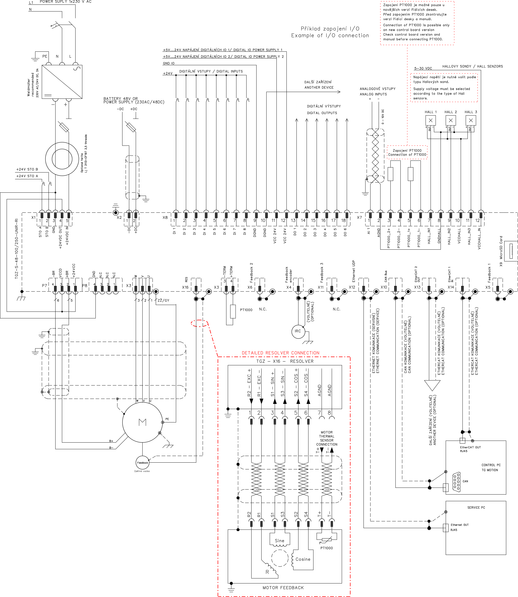

	

Příklad zapojení servozesilovače se zpětnou vazbout typu resolver.

	

Příklad zapojení motorových kabelů s různými typy konektorů naleznete v sekci `Ostatní | Schémata kabelů` [zapojení Z27](../../../ETC/TGcable/md/description.md#Z27) až [Z32](../../../ETC/TGcable/md/description.md#Z32)