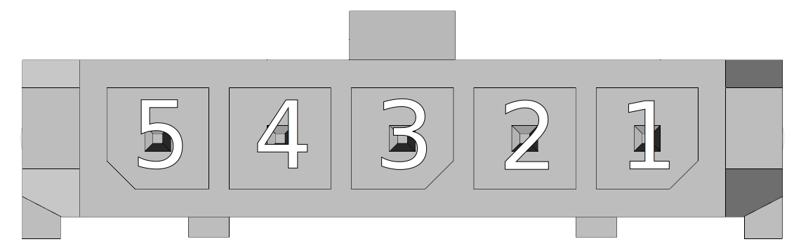
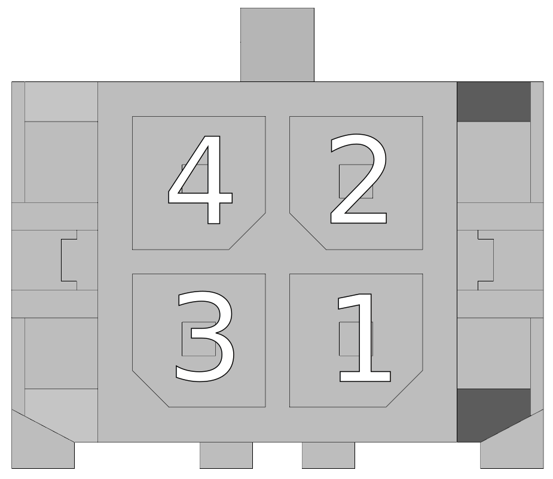
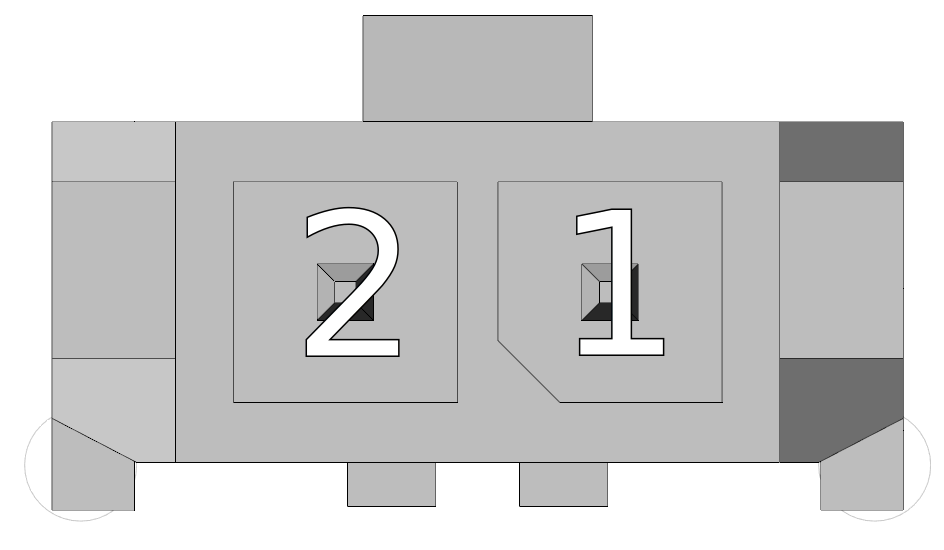

##3D náhled
{: style="width:75%;" }
 
 
{: style="width:75%;" }

##Konektory
___
### Strana ethernet/ethercat
___

{: style="width:60%;" }

___
### View of the CAN/IO/SD Side
___

{: style="width:60%;" }

-   **X1 - Napájení řídicí části**

    ---
	{: style="width:90%;" }

-    Molex Micro-Fit 3.0 - 436450500

	---

	--8<-- "md/X1_24V_5pin_Microfit.en.md"
	
	!!! warning "Upozornění"
		
		Pin č. 2 konektoru X1 - "Výstup +24 VDC" je nutné externě propojit s pinem č. 2 na konektoru P7 (napájení diagnostiky statické brzdy).
		
		Pozor na orientaci konektoru - zajišťovací páčka nahoře = pin č. 1 vpravo.
		
	!!! info "Konektorové krimpy"
	
		Přizpůsobte typ krimpů zvolenému průřezu vodiče.

-   **X8 - Digital I/O, analog inputs**

    ---
	Cable side view   
	
	{: style="width:100%;" }
	3D view - cable side   
	
	{: style="width:100%;" }
	Front view (TGZ side)   
	
	{: style="width:100%;" }

	Please see details about
	[digital inputs DI1-8](../../../../source/md/commonHW_DI.md#commonDI1-8), 
	[digital outputs DO1-6](../../../../source/md/commonHW_DO.md#commonDO1-6) and
	[analog inputs AI1-2](../../../../source/md/commonHW_AI.md#commonAI1-2) 
	in the [Common hardware section](../../../../source/md/commonHW_DI.md#commonDI1-8).
	

-    Weidmüller B2CF 3.50/22/180 SN OR BX

	---

	--8<-- "md/X8_IO_22pin_B2CF.en.md"
	
	!!! warning "Warning"	
	
		For proper operation of the DI(1-6) it is necessary to supply at least one of the VCC DO (pin 11 and 12).
		Inputs DI7,8 are independent of the DO VCC supply voltage and work correctly even without it.
	
-   **X9 - MicroSD card**

    ---
{: style="width:60%;" }

-    Use a standard microSD card. The card is included with the TGZ servo amplifier. For more information, see [SD cards](../../TGZ_SW/SD/md/SD.md#SDparams).

-   **X10 - CAN**

    ---
	Cable side view   
	{: style="width:25%;" }
	
	3D view - cable side   
	{: style="width:45%;" }
	
	Front view (TGZ side)   
	{: style="width:35%;" }

-    Weidmüller B2CF 3.50/04/180 SN OR BX

    ---

	--8<-- "md/X10_CAN_4pin_B2CF.en.md"
	
	For more information on the HW version of the CAN bus, see [CAN bus](../../../../source/md/commonHW_CAN.md#commonCAN).
	
-	**LED display**

	---
	
	{: style="width:60%;" }
	
-	LED display indicates the status of the servoamplifier. See [TGZ status indicators](../../TGZ_SW/LED/md/description.md#LED_sigs) for detailed description.

-	**status LEDs**

	---
	
	{: style="width:80%;" }
	
-	LED diodes

	---
	
	--8<-- "md/LEDsigAx12.en.md"
	
	A complete description of the meaning of the status LEDs can be found here: [TGZ status indicators](../../TGZ_SW/LED/md/description.md#LED_sigs)

   
___
### Strana feedback
___

{: style="width:60%;" }

-   **X5 - External encoder (FBE)**

    ---
	
	{: style="width:80%;" }

-    Weidmüller B2CF 3.50/12/180 SN OR BX

	---

	--8<-- "md/X5_FBE_12pin_B2CF.en.md"
	
	For more information on external feedback, see [FBE Feedback](../../../../source/md/commonHW_FBE.md#commonFBE).

-   **X6 - Feedback axis 1**

    ---
	
	Cable side view 	
	{: style="width:50%;" }
	
	3D view - cable side   
	{: style="width:50%;" }
	
	Front view (TGZ side)   
	{: style="width:50%;" }

-    Weidmüller B2CF 3.50/08/180 SN OR BX

    ---

	--8<-- "md/X6_FB1_8pin_B2CF.en.md"
	
	For more information regarding Feedback 1, please see [Feedback FB1, FB2](../../../../source/md/commonHW_FB12.md#commonFB12).
	
-   **X7 - Feedback axis 2**

    ---
	
	Cable side view 	
	{: style="width:50%;" }
	
	3D view - cable side   
	{: style="width:50%;" }
	
	Front view (TGZ side)   
	{: style="width:50%;" }

-    Weidmüller B2CF 3.50/08/180 SN OR BX

    ---

	--8<-- "md/X7_FB2_8pin_B2CF.en.md"
	
	For more information regarding Feedback 2, please see [Feedback FB1, FB2](../../../../source/md/commonHW_FB12.md#commonFB12).
	

___
### Pohled na PCB
___

{: style="width:70%;" }

-   **P7 - Statická brzda**

    ---
	
	{: style="width:60%;" }

-    Molex Micro-Fit 3.0 - 430250400

	---

	--8<-- "md/P7_BR_4pin_Microfit.en.md"
	
	!!! info "Konektorové krimpy"
	
		Přizpůsobte typ krimpů zvolenému průřezu vodiče.
		
-   **P8 - Statická brzda - doplňkový konektor**

    ---
	
	{: style="width:60%;" }

-    Molex Micro-Fit 3.0 - 430250400

	---

	--8<-- "md/P8_BR_4pin_Microfit.en.md"
	
	!!! note "Konektor P8"
	
		Tento konektor se pro standardní použití jednoosého servozesilovače <nobr>TGZ-S-48-100/250</nobr> nezapojuje
	
	!!! info "Konektorové krimpy"
	
		Přizpůsobte typ krimpů zvolenému průřezu vodiče.
		
-   **P3 - Externí termistor PT1000**

    ---
	
	{: style="width:60%;" }

-    Molex Micro-Fit 3.0 - 436500215

	---

	--8<-- "md/P3_Term_2pin_Microfit.en.md"
	
	!!! note "Polarita"
	
		Teplotní čidlo PT1000 nemá určenou polaritu napájení.
	
	!!! info "Konektorové krimpy"
	
		Přizpůsobte typ krimpů zvolenému průřezu vodiče.		

