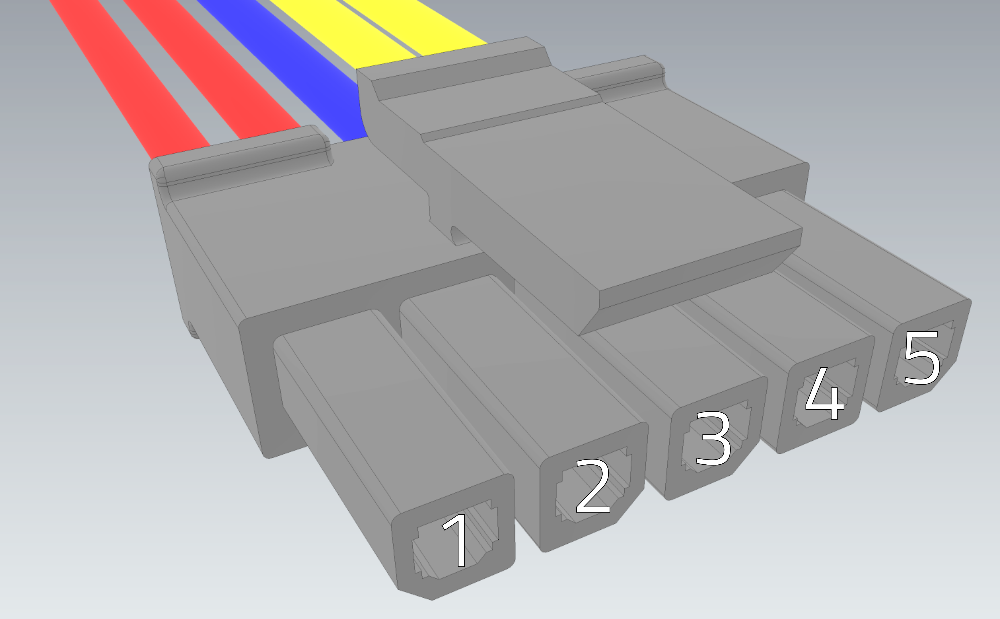
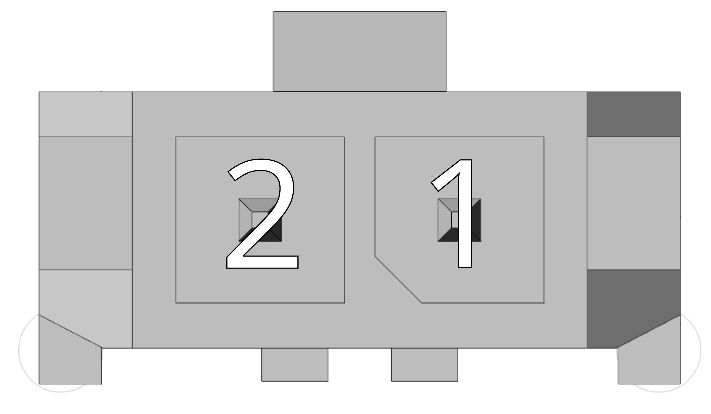
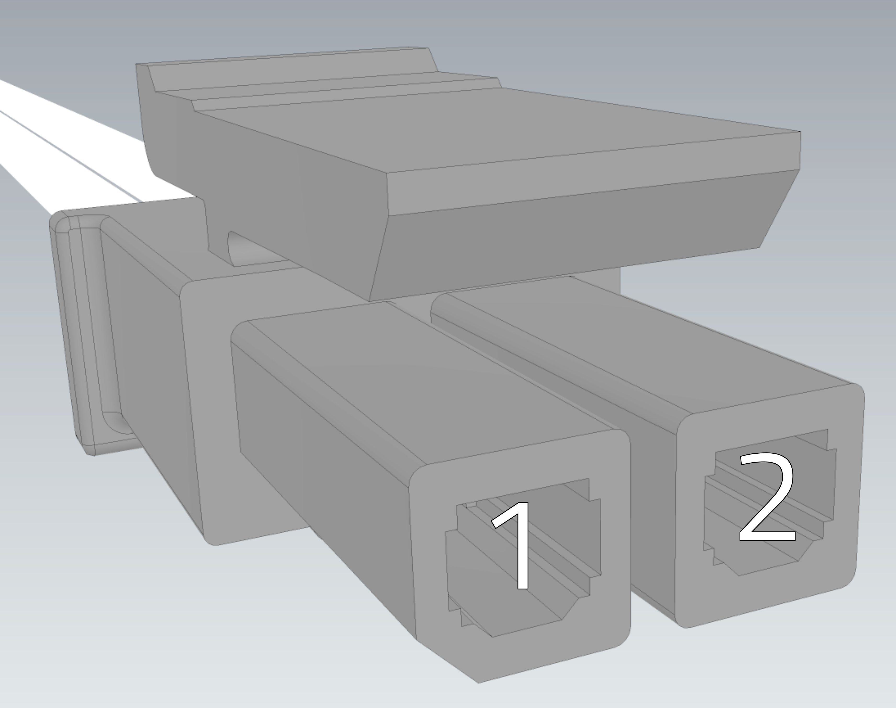

##3D náhled
{: style="width:65%;" }
 
 
{: style="width:80%;" }

##Konektory
___
### Strana ethernet/ethercat
___

{: style="width:60%;" }

___
### Strana CAN/IO/SD
___

{: style="width:60%;" }

-   **X1 - Napájení řídicí části**

    ---
	{: style="width:90%;" }
	
	Pohled na protikus ze strany PCB:
	
	{: style="width:90%;" }
	
	Pohled na protikus ze strany vodičů:
	
	{: style="width:90%;" }

-    Molex Micro-Fit 3.0 - 436450500

	---

	--8<-- "md/X1_24V_5pin_Microfit.md"
	
	!!! warning "Upozornění"
		
		Pin č. 2 konektoru X1 - "Výstup +24 VDC" je nutné externě propojit s pinem č. 2 na konektoru P7 (napájení diagnostiky statické brzdy).
		
		Pozor na orientaci konektoru - zajišťovací páčka nahoře = pin č. 1 vpravo. Konektor je orientován zajišťovací páčkou ven z PCB.
		
	!!! info "Konektorové krimpy"
	
		Přizpůsobte typ krimpů zvolenému průřezu vodiče.

-   **X8 - Digitální I/O, analogové vstupy**

    ---
	Pohled zezadu (strana kabelu)   
	
	{: style="width:100%;" }
	3D pohled zezadu   
	
	{: style="width:100%;" }
	Pohled zepředu (strana TGZ)   
	
	{: style="width:100%;" }

	Detailní soupis parametrů 
	[digitálních vstupů DI1-8](../../../../source/md/commonHW_DI.md#commonDI1-8), 
	[digitálních výstupů DO1-6](../../../../source/md/commonHW_DO.md#commonDO1-6) a 
	[analogových vstupů AI1-2](../../../../source/md/commonHW_AI.md#commonAI1-2) 
	naleznete v sekci [Společný HW](../../../../source/md/commonHW_DI.md#commonDI1-8).
	

-    Weidmüller B2CF 3.50/22/180 SN OR BX

	---

	--8<-- "md/X8_IO_22pin_B2CF.md"
	
	!!! warning "Pozor"	
	
		Pro správnou funkci DI(1-6) je potřeba připojit alespoň jedno z VCC DO (pin 11 a 12). Vstupy DI7,8 jsou nezávislé na napájecím napětí DO VCC a fungují korektně i bez něj.
	
-   **X9 - MicroSD karta**

    ---
{: style="width:60%;" }

-    Použijte standardní microSD kartu. Karta je součástí dodávky servozesilovače TGZ. Více informací naleznete v sekci [SD karty](../../TGZ_SW/SD/md/SD.md#SDparams).

-   **X10 - CAN**

    ---
	Pohled zezadu (strana kabelu)   
	{: style="width:25%;" }
	
	3D pohled zezadu   
	{: style="width:45%;" }
	
	Pohled zepředu (strana TGZ)   
	{: style="width:35%;" }

-    Weidmüller B2CF 3.50/04/180 SN OR BX

    ---

	--8<-- "md/X10_CAN_4pin_B2CF.md"
	
	Další informace o HW provedení sběrnice CAN naleznete v sekci [Sběrnice CAN](../../../../source/md/commonHW_CAN.md#commonCAN).
	
-	**LED displej**

	---
	
	{: style="width:60%;" }
	
-	LED displej signalizuje stavy viz. [Význam stavových indikátorů TGZ](../../TGZ_SW/LED/md/description.md#LED_sigs)

-	**LED signalizace**

	---
	
	{: style="width:100%;" }
	
-	LED diody

	---
	
	--8<-- "md/LEDsigAx12.md"
	
	Kompletní popis významu stavových LED diod naleznete zde: [Význam stavových indikátorů TGZ](../../TGZ_SW/LED/md/description.md#LED_sigs)

   
___
### Strana feedback
___

{: style="width:60%;" }

-   **X5 - Externí enkodér (FBE)**

    ---
	Pohled zezadu (strana kabelu) 	
	{: style="width:60%;" }
	
	3D pohled zezadu   
	{: style="width:60%;" }
	
	Pohled zepředu (strana TGZ)   
	{: style="width:60%;" }	

-    Weidmüller B2CF 3.50/12/180 SN OR BX

	---

	--8<-- "md/X5_FBE_12pin_B2CF.md"
	
	Další informace ohledně externí zpětné vazby naleznete v sekci [Zpětná vazba FBE](../../../../source/md/commonHW_FBE.md#commonFBE).

-   **X6 - Zpětná vazba - osa 1**

    ---
	
	Pohled zezadu (strana kabelu) 	
	{: style="width:50%;" }
	
	3D pohled zezadu   
	{: style="width:50%;" }
	
	Pohled zepředu (strana TGZ)   
	{: style="width:50%;" }

-    Weidmüller B2CF 3.50/08/180 SN OR BX

    ---

	--8<-- "md/X6_FB1_8pin_B2CF.md"
	
	Další informace ohledně zpětné vazby 1 naleznete v sekci [Zpětná vazba FB1, FB2](../../../../source/md/commonHW_FB12.md#commonFB12).
	
-   **X7 - Zpětná vazba - osa 2**

    ---
	
	Pohled zezadu (strana kabelu) 	
	{: style="width:50%;" }
	
	3D pohled zezadu   
	{: style="width:50%;" }
	
	Pohled zepředu (strana TGZ)   
	{: style="width:50%;" }

-    Weidmüller B2CF 3.50/08/180 SN OR BX

    ---

	--8<-- "md/X7_FB2_8pin_B2CF.md"
	
	Další informace ohledně zpětné vazby 2 naleznete v sekci [Zpětná vazba FB1, FB2](../../../../source/md/commonHW_FB12.md#commonFB12).
	

___
### Pohled na PCB
___

{: style="width:70%;" }

!!! warning "Regenerativní brzdění"

	V případě, že pohon není napájen z akumulátoru (např. Li-ion bateriový pack) 
	je u strojů s větší kinetickou energií nutné zajistit její zmaření např. v odporovém tělese pomocí brzdné jednotky.

-   **P7 - Statická brzda**

    ---
	
	Pohled na PCB konektor:
	
	{: style="width:60%;" }
	
	Pohled na protikus ze strany PCB:
	
	{: style="width:60%;" }
	
	Pohled na protikus ze strany vodičů:
	
	{: style="width:60%;" }

-    Molex Micro-Fit 3.0 - 430250400

	---

	--8<-- "md/P7_BR_4pin_Microfit.md"
	
	!!! info "Konektorové krimpy"
	
		Přizpůsobte typ krimpů zvolenému průřezu vodiče.
		
-   **P8 - Statická brzda - doplňkový konektor**

    ---
	
	Pohled na konektor na PCB:	
	
	{: style="width:60%;" }
	
	Pohled na protikus ze strany PCB:
	
	{: style="width:60%;" }
	
	Pohled na protikus ze strany vodičů:
	
	{: style="width:60%;" }

-    Molex Micro-Fit 3.0 - 430250400

	---

	--8<-- "md/P8_BR_4pin_Microfit.md"
	
	!!! note "Konektor P8"
	
		Tento konektor se pro standardní použití jednoosého servozesilovače <nobr>TGZ-S-48-100/250</nobr> nezapojuje
	
	!!! info "Konektorové krimpy"
	
		Přizpůsobte typ krimpů zvolenému průřezu vodiče.
		
-   **P3 - Externí termistor PT1000**

    ---
	
	Pohled na PCB konektor:
	
	{: style="width:60%;" }
	
	Pohled na protikus ze strany PCB:
	
	{: style="width:60%;" }
	
	Pohled na protikus ze strany vodičů:	

	{: style="width:60%;" }	

-    Molex Micro-Fit 3.0 - 436500215

	---

	--8<-- "md/P3_Term_2pin_Microfit.md"
	
	!!! note "Polarita"
	
		Teplotní čidlo PT1000 nemá určenou polaritu napájení.
	
	!!! info "Konektorové krimpy"
	
		Přizpůsobte typ krimpů zvolenému průřezu vodiče.		

