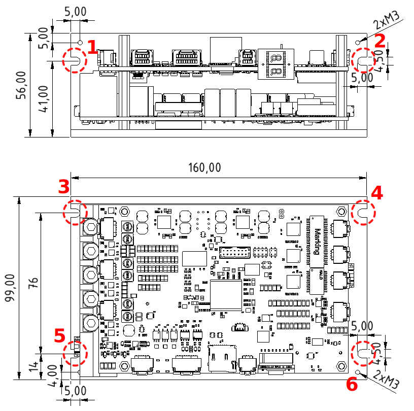

##Mounting
The L-profile allows variable mounting of the servoamplifier in the control cabinet or directly on the machine.
Below are the dimensions and position of the individual mounting elements.

##Mounting procedure

1. The servo amplifier can be mounted using the L profile in two ways. Either with the holes marked with red circles and numbers 1 and 2, or the second way with the holes 3, 4, 5 and 6.
2. Use M4 screws with a head diameter greater than 5 mm.

--8<-- "md/mechMounting.en.md"

