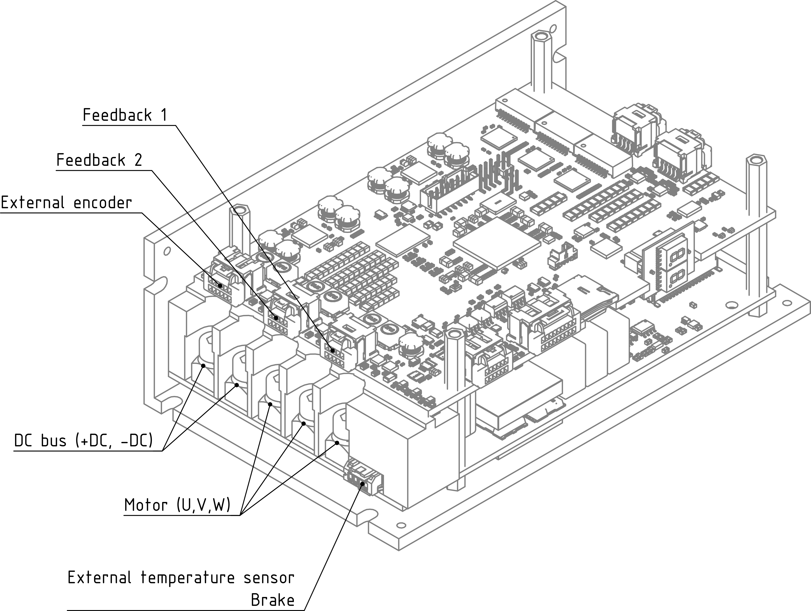
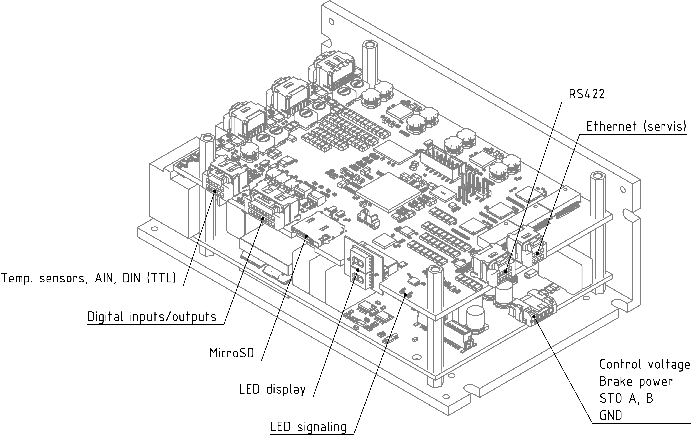
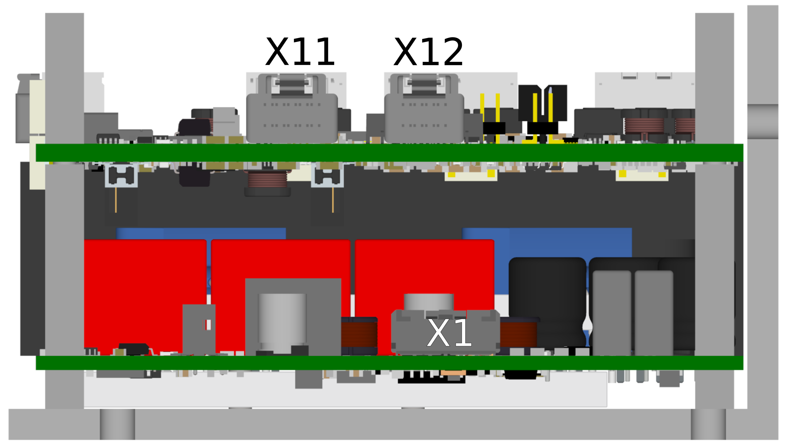

##3D view
{: style="width:80%;" }
{: style="width:90%;" }
##Block diagram with connection of main interfaces
{: style="width:70%;" }

!!! note "Note"
	The external temperature sensor PT1000 is used to measure the motor temperature.
	
##Description of communication, input/output and control:
###Communication interfaces
- Ethernet 100/1000 Mb/s with UDP protocol, designed for parameter recording, monitoring, testing, but also online control;
- RS422 or RS485, data transfer via unused servomotor feedback interface.
  It can be used for communication with devices based on RS422 or RS485 standard (encoder, gyro, master controller, other system, etc.).
  This interface enables high-speed communication up to 20Mbit/s.
  
###Inputs / outputs:
The built-in TGZ servo amplifiers have 8 isolated digital inputs, 3 digital inputs, 6 isolated digital outputs, 1 analog input and 2 PT1000 thermistor inputs implemented. It is possible to control these inputs and outputs using a user program (C language):

| I/O    | Type              | Count | Value                                               |
|--------|--------------------|-------|-----------------------------------------------------|
| input  | analog             | 1     | 0-10 V                                              |
| input  | thermistor         | 2     | standard PT1000                                     |
| input  | digital            | 3     | 0-30 VDC (0-0.8 V low / 2.4-30 V high)         |
| input  | isolated digital   | 8     | 0-24 VDC (0-10 V low / 13-24 V high), 20 mA         |
| output | isolated digital   | 6     | 5-24 VDC, 300 mA / max. output                      |

The servo amplifier has four feedback connectors, which have a wide range of uses.
In addition to motor feedback, they can be used to connect devices operating on the principle of the RS422 or RS485 standard.

| Type   | Standard              | Interface                         | Examples of Possible Connected Devices                                                                                          |
|--------|-----------------------|-----------------------------------|---------------------------------------------------------------------------------------------------------------------------------|
| FB1    | RS422/RS485           | Hiperface DSL, EnDat 2.2, SSI, BISS | Absolute magnetic/optical encoder, incremental magnetic/optical encoder with Hall sensors [^2], gyroscope                       |
| FB2    | RS422/RS485           | Hiperface DSL, EnDat 2.2, SSI, BISS | Absolute magnetic/optical encoder, incremental magnetic/optical encoder with Hall sensors [^2], gyroscope                       |
| FE[^1] | RS422/RS485           | Hiperface DSL, EnDat 2.2, SSI, BISS | Absolute magnetic/optical encoder, incremental magnetic/optical encoder with Hall sensors [^2], gyroscope                       |
| FB3[^1]| 2 × full-duplex RS422 | -                                 | Control system                                                                                                                  |

[^1]: These types work with modified firmware. It is recommended to always consult with  manufacturer about their use.
[^2]: Hall sensors must be connected to the digital inputs using a special level shifter. For more information see. [Hall converter](../../../ETC/TGHall/md/description.md#TGhall_1).

- Hiperface DSL – digital communication, sensors are manufactured with a resolution of 15 to 24 bits per revolution (multi-speed design – 4,096 revolutions).
  This type of feedback is used for motors with a single connector or cable.
- EnDat 2.2 – digital communication, sensors are manufactured with a resolution of 18 to 25 bits per revolution (multi-speed design – 4,096 revolutions).
- SSI – encoders with synchronous system interface.
- BISS – sensors with BISS-C protocol.

###Control
TGZ servoamplifiers in "RI" version can be controlled:

- via Ethernet UDP protocol;
- via user program (language C) – digital inputs, analog voltage, etc.

##Connectors
___
### View of the ENET/ECAT side
___

{: style="width:80%;" }

-   **X1 - Control supply voltage**

    ---
    {: style="width:70%;" }
	
-    Molex Microlock 5055700501 - recommended crimping contacts [Molex 505572](https://www.molex.com/en-us/part-list/505572) [^3]

    --8<-- "md/X1_24V_5pin_Microlock.en.md"

-   **X11 - Feedback 3 - RS422**

    ---
    {: style="width:70%;" }
	
-    Molex ClikMate 5031491000 - recommended crimping contacts [Molex 502579](https://www.molex.com/en-us/part-list/502579) [^4]

    --8<-- "md/X11_FB3_10pin_ClikMate.en.md"
	
	!!! warning "Warning"	
		When using this type of feedback, make sure you are using the appropriate TGZ firmware that supports these features.

-   **X12 - Ethernet UDP - service**

    ---
    {: style="width:70%;" }
	
-    Molex ClikMate 5031490800 - recommended crimping contacts [Molex 502579](https://www.molex.com/en-us/part-list/502579) [^4]

    --8<-- "md/X12_UDP_8pin_ClikMate.en.md"

___
### View of the CAN/IO/SD Side
___

{: style="width:80%;" }

-   **X7 - Digital inputs + Analog inputs**

    ---
	{: style="width:70%;" }

-    Molex ClikMate 5031491200 - recommended crimping contacts [Molex 502579](https://www.molex.com/en-us/part-list/502579) [^4]

	---

	--8<-- "md/X7_AIN_12pin_ClikMate.en.md"
	
	!!! warning "Warning"
		Direct PT1000 inputs of X7 pins 3-6 are only available on control board from batch supplied after 06-2024 onwards.
		Older versions of the device have standard AIN1, AIN2 and AIN3 on pins 1-6 of X7.
		For further details of the previous device properties please see older version of this manual.

-   **X8 - Digital I/O**

    ---
	{: style="width:100%;" }

-    Molex ClikMate 5031491800 - recommended crimping contacts [Molex 502579](https://www.molex.com/en-us/part-list/502579) [^4]

	---

	--8<-- "md/X8_DIO_18pin_ClikMate.en.md"
		
-   **X9 - MicroSD slot**

    ---
	{: style="width:40%;" }

-   It is not primarily recommended to use the microSD slot in devices where significant vibrations are expected.
	SD card is not included with the "RI" version of servoamplifiers.
	For more information, see [SD cards](../../TGZ_SW/SD/md/SD.md#SDparams).
	
-	**LED display**

	---
	
	{: style="width:60%;" }
	
-	LED display indicates the status of the servoamplifier. See [TGZ status indicators](../../TGZ_SW/LED/md/description.md#LED_sigs) for detailed description.

-	**status LEDs**

	---
	
	{: style="width:100%;" }
	
-	LED diodes

	---
	
	--8<-- "md/LEDsigAx12.en.md"
	
	A complete description of the meaning of the status LEDs can be found here: [TGZ status indicators](../../TGZ_SW/LED/md/description.md#LED_sigs)

   
___
### View of the FB/motor side
___

{: style="width:80%;" }

-   **X4 - External encoder (FBE)**

    ---
	
	{: style="width:80%;" }

-    Molex ClikMate 5031491200 - recommended crimping contacts [Molex 502579](https://www.molex.com/en-us/part-list/502579) [^4]

	---

	--8<-- "md/X4_FBE_12pin_ClikMate.en.md"

-   **X5 - Feedback axis 1**

    ---
	
	{: style="width:80%;" }

-    Molex ClikMate 5031491000 - recommended crimping contacts [Molex 502579](https://www.molex.com/en-us/part-list/502579) [^4]

    ---

	--8<-- "md/X5_FB1_10pin_ClikMate.en.md"
	
	!!! warning "Warning"
		In order to use Hiperface DSL feedback user must tie pins 5-7 and 6-8 together of the FB1 (and FB2 respectively) connector or assembly appropriate shorting resistors to the control PCB.
		This applies from batch supplied after 06-2024 onwards, where no internal connection is done on DSL as a standard.
		Also check whether you have correct firmware uploaded in the device.
	
-   **X6 - Feedback axis 2**

    ---
	
	{: style="width:80%;" }

-    Molex ClikMate 5031491000 - recommended crimping contacts [Molex 502579](https://www.molex.com/en-us/part-list/502579) [^4]

    ---

	--8<-- "md/X6_FB2_10pin_ClikMate.en.md"
	
	!!! warning "Warning"
		In order to use Hiperface DSL feedback user must tie pins 5-7 and 6-8 together of the FB1 (and FB2 respectively) connector or assembly appropriate shorting resistors to the control PCB.
		This applies from batch supplied after 06-2024 onwards, where no internal connection is done on DSL as a standard.
		Also check whether you have correct firmware uploaded in the device.
		
	!!! note "Note"
		Servoamplifier TGZ-S-48-50/100-RI is single axis version.
		The X6 connector is not normally connected.		

-   **X3 - Power supply voltage**

    ---
	
	{: style="width:70%;" }

-    Pressfit M5 - recommended cable ring [JST GS5-10](https://www.tme.eu/cz/en/details/gs5-10/non-insulated-terminals/jst/)

    ---

	--8<-- "md/X3_DCbus_2pin_pressfit.en.md"
	
	!!! warning "Regenerative braking"
	
		In cases when the drive is not powered by a battery (e.g., a Li-ion battery pack), 
		it is necessary for machines with greater kinetic energy to ensure its dissipation, for example, in a resistive element using a chopper unit.
		
-   **X3 - Motor connector**

    ---
	
	{: style="width:70%;" }

-    Pressfit M5 - recommended cable ring [JST GS5-10](https://www.tme.eu/cz/en/details/gs5-10/non-insulated-terminals/jst/)

    ---
	
	--8<-- "md/X3_M1_3pin_pressfit.en.md"

-   **X4 - Static brake connector**

    ---
	
	{: style="width:70%;" }

-    Molex Micro-lock 5055700401 - recommended crimping contacts [Molex 505572](https://www.molex.com/en-us/part-list/505572)  [^3]

    ---

	--8<-- "md/X4_BR_4pin_Microlock.en.md"

[^3]: When crimping and connecting the Molex Micro-Lock connectors, follow the [Molex Micro-Lock Application Guide](https://www.molex.com/content/dam/molex/molex-dot-com/products/automated/en-us/applicationspecificationspdf/505/505570/5055700001-A03.pdf)
[^4]: When crimping and connecting the Molex Clik-Mate connectors, follow the [Molex Clik-Mate Application Guide](https://www.molex.com/content/dam/molex/molex-dot-com/products/automated/en-us/applicationspecificationspdf/503/503149/AS-503149-001-001.pdf)

###Procedure for changing feedback type of FB1 and FB2
There are 4 positions (R118-R121) for a 0R/0603 resistors that may be used to replace the external connection of FBSEL (pins 5-7 and 6-8 of the FB1 and FB2) on the control board.
By default, it is not assembled from batch 06—2024 onwards unless noted otherwise.
User can assemble it in order to prevent the need for use the external connections, however keep in mind that once assembled the boards can be used for HiperfaceDSL feedback only. 
If it is necessary to use a different type of feedback than Hiperface DSL, it is necessary to desolder them from the PCB.
Other usable standards are EnDat 2.2, SSI, BISS or Incremental encoder.
The feedback function also depends on the uploaded firmware.

{: style="width:70%;" }   

