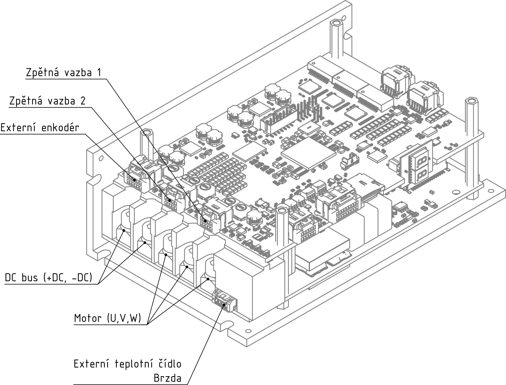
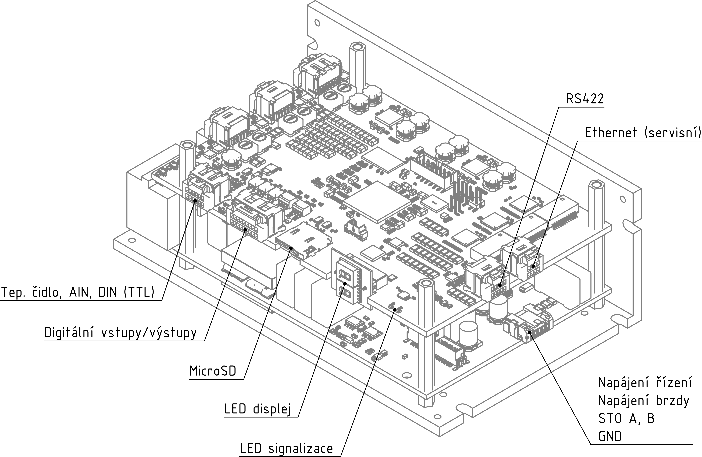
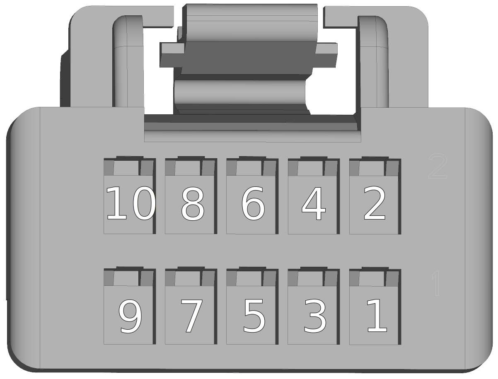
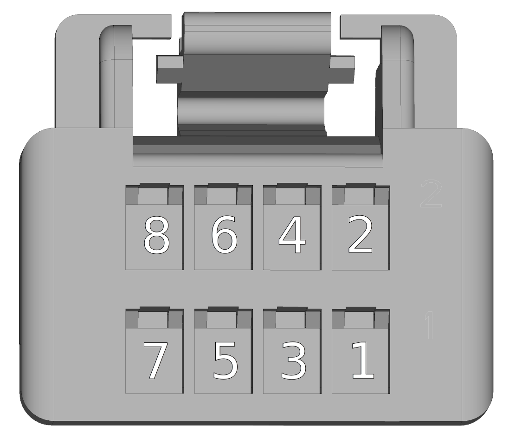
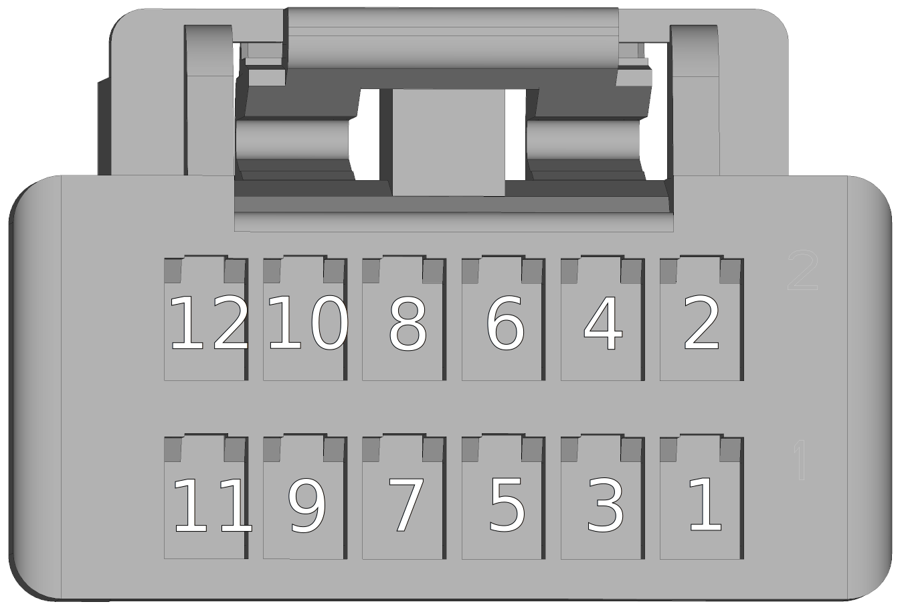
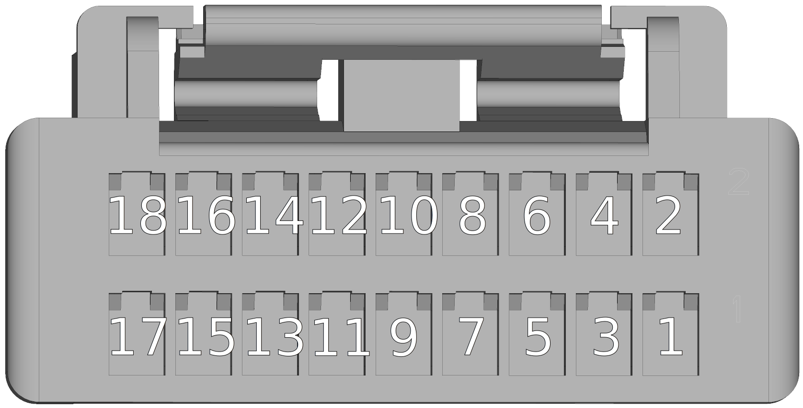
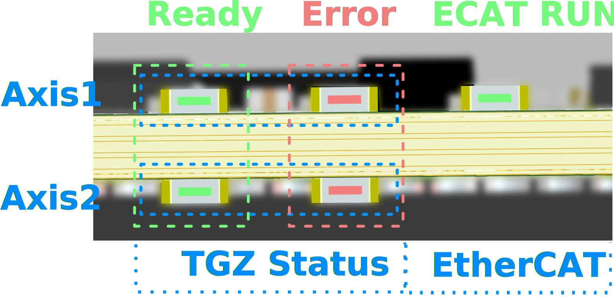
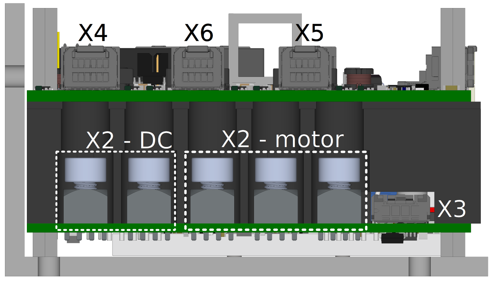
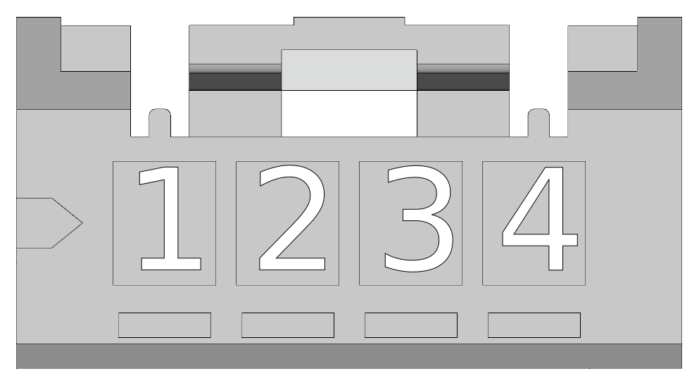

##3D náhled
{: style="width:80%;" }
{: style="width:90%;" }
##Blokové schéma s připojením hlavních rozhraní
{: style="width:70%;" }

!!! note "Poznámka"
	Externí teplotní čidlo PT1000 se používá k měření teploty motoru.
	
##Popis komunikace, vstupů/výstupů a ovládání:
###Komunikační rozhraní
- Ethernet 100/1000 Mb/s s UDP protokolem, určen pro záznam parametrů, monitorování, testování, ale také online ovládání.
- CAN bus protokol lze upravit podle požadavků zákazníka.
- Ethernet 100/1000 Mb/s s volitelným protokolem, naprogramovaný v hradlovém poli a určený pro připojení rychlých průmyslových sběrnic pro řízení v reálném čase.
  V současné době je toto rozhraní vybaveno protokolem EtherCAT (pouze pro standardní firmware); podle požadavků zákazníka lze upravit na jiný typ protokolu.
- RS422 / RS485, přenos dat přes nepoužívané rozhraní zpětné vazby servomotoru.
  Může být použit pro komunikaci se zařízeními založenými na standardu RS422 nebo RS485 (enkodér, gyroskop, nadřazené řízení, jiný systém atd.).
  Toto rozhraní umožňuje vysokorychlostní komunikaci až 20 Mbit/s.
  
###Vstupy / výstupy:
Vestavné servozesilovače TGZ mají 8 digitálních vstupů, 3 digitální vstupy TTL, 6 digitálních výstupů a 2 vstupy pro teplotní čidlo PT1000 a jeden analogový vstup.
Tyto vstupy a výstupy je možné ovládat pomocí uživatelského programu (jazyk C).
Digitální výstupy lze ovládat i přes ovládací servisní software TGZ GUI.

| I/O     | Typ              | Počet | Hodnota                                            |
|---------|------------------|--------|----------------------------------------------------|
| vstup   | analogový        | 1      | 0-10 V                                             |
| vstup   | termistor        | 2      | standard PT1000                                    |
| vstup   | digitální        | 3      | 0-30 VDC (0-0,8 V low/2,4-30 V high), TTL      |
| vstup   | izolovaný digitální | 8   | 0-24 VDC (0-10 V low/13-24 V high), 20 mA      |
| výstup  | izolovaný digitální | 6   | 5-24 VDC, 300 mA / max. výstup                     |

Servozesilovač má čtyři zpětnovazební rozhraní, které mají široké využití.
Kromě zpětné vazby motoru je lze použít k připojení zařízení pracujících na principu standardu RS422 nebo RS485.

| Typ   | Standard              | Rozhraní                         | Příklady připojení možných zařízení                                                                                               |
|-------|-----------------------|----------------------------------|-----------------------------------------------------------------------------------------------------------------------------------|
| FB1   | RS422/RS485           | Hiperface DSL, EnDat 2.2, SSI, BISS | Absolutní magnetický / optický enkodér, inkrementální magnetický / optický enkodér s Hallovými senzory [^2], gyroskop              |
| FB2   | RS422/RS485           | Hiperface DSL, EnDat 2.2, SSI, BISS | Absolutní magnetický / optický enkodér, inkrementální magnetický / optický enkodér s Hallovými senzory [^2], gyroskop              |
| FE[^1]   | RS422/RS485           | Hiperface DSL, EnDat 2.2, SSI, BISS | Absolutní magnetický / optický enkodér, inkrementální magnetický / optický enkodér s Hallovými senzory [^2], gyroskop              |
| FB3[^1]  | 2 × full-duplex RS422 | -                                | Řídicí systém                                                                                                                     |

[^1]: Tento typ pracuje pouze s upraveným firmwarem. Jeho použití se doporučuje vždy konzultovat s výrobcem.
[^2]: Hallovy senzory musí být připojeny k digitálním vstupům pomocí speciálního převodníku úrovní, viz. [Převodník Hall-TGZ](../../../ETC/TGHall/md/description.md#TGhall_1).

- Hiperface DSL - digitální komunikace, senzory jsou vyráběny s rozlišením 15 až 24 bitů na otáčku (vícerychlostní provedení - 4 096 otáček).
  Tento typ zpětné vazby se používá pro motory s jediným konektorem nebo kabelem.
- EnDat 2.2 - digitální komunikace, senzory jsou vyráběny s rozlišením 18 až 25 bitů na otáčku (vícerychlostní provedení - 4 096 otáček).
- SSI - enkodéry se synchronním systémovým rozhraním.
- BISS - senzory s protokolem BISS-C.

###Řízení
Servozesilovače TGZ je možno řídit:

- digitální ovládání přes EtherCAT, CAN-bus (točivý moment, otáčky, polohové profily atd.) A přes Ethernet UDP protokol;
- uživatelský program (jazyk C) - digitální vstupy, analogové napětí atd.

##Konektory
___
### Strana komunikace/ethernet/ethercat
___

{: style="width:80%;" }

-   **X1 - Napájení řídicí části**

    ---
    {: style="width:70%;" }
	
-    Molex Microlock 5055700501 - doporučené krimpovací kontakty [Molex 505572](https://www.molex.com/en-us/part-list/505572) [^3]

    --8<-- "md/X1_24V_5pin_Microlock.md"

-   **X11 - Zpětná vazba 3 - RS422**

    ---
    {: style="width:70%;" }
	
-    Molex ClikMate 5031491000 - doporučené krimpovací kontakty [Molex 502579](https://www.molex.com/en-us/part-list/502579) [^4]

    --8<-- "md/X11_FB3_10pin_ClikMate.md"
	
	!!! warning "Pozor"	
		Při použití tohoto typu zpětné vazby se ujistěte, že používáte vhodný TGZ firmware, který tyto funkce podporuje.

-   **X12 - Ethernet UDP - servisní**

    ---
    {: style="width:70%;" }
	
-    Molex ClikMate 5031490800 - doporučené krimpovací kontakty [Molex 502579](https://www.molex.com/en-us/part-list/502579) [^4]

    --8<-- "md/X12_UDP_8pin_ClikMate.md"

-   **X13 - EtherCAT 2 - Fieldbus out**

    ---
    {: style="width:70%;" }
	
-    Molex ClikMate 5031490800 - doporučené krimpovací kontakty [Molex 502579](https://www.molex.com/en-us/part-list/502579) [^4]

    --8<-- "md/X12_UDP_8pin_ClikMate.md"

-   **X14 - EtherCAT 1 - Fieldbus in**

    ---
    {: style="width:70%;" }
	
-    Molex ClikMate 5031490800 - doporučené krimpovací kontakty [Molex 502579](https://www.molex.com/en-us/part-list/502579) [^4]

    --8<-- "md/X12_UDP_8pin_ClikMate.md"

___
### Strana CAN/IO/SD
___

{: style="width:80%;" }

-   **X7 - Digitální vstupy TTL + Analogové vstupy**

    ---
	{: style="width:70%;" }

-    Molex ClikMate 5031491200 - doporučené krimpovací kontakty [Molex 502579](https://www.molex.com/en-us/part-list/502579) [^4]

	---

	--8<-- "md/X7_AIN_12pin_ClikMate.md"
	
	!!! warning "Varování"
		Přímé vstupy PT1000 na pinech 3-6 konektoru X7 jsou dostupné pouze na řídicí desce z dodávek po 06-2024.
		Starší verze zařízení mají standardní AIN1, AIN2 a AIN3 na pinech 1-6 konektoru X7.
		Pro další podrobnosti o vlastnostech předchozího zařízení prosím nahlédněte do starší (PDF) verze tohoto manuálu.

-   **X8 - Digitální I/O**

    ---
	{: style="width:100%;" }

-    Molex ClikMate 5031491800 - doporučené krimpovací kontakty [Molex 502579](https://www.molex.com/en-us/part-list/502579) [^4]

	---

	--8<-- "md/X8_DIO_18pin_ClikMate.md"
		
-   **X9 - MicroSD slot**

    ---
	{: style="width:40%;" }

-   Použijte microSD kartu. Vhodná karta je součástí dodávky servozesilovače TGZ.

-   **X10 - CAN**

    ---
	
	{: style="width:70%;" }

-    Molex ClikMate 5031490800 - doporučené krimpovací kontakty [Molex 502579](https://www.molex.com/en-us/part-list/502579) [^4]

    ---

	--8<-- "md/X10_CAN_8pin_ClikMate.md"
	
-	**LED displej**

	---
	
	{: style="width:60%;" }
	
-	LED displej signalizuje stavy viz. [Význam stavových indikátorů TGZ](../../TGZ_SW/LED/md/description.md#LED_sigs)

-	**LED signalizace**

	---
	
	{: style="width:100%;" }
	
-	LED diody

	---
	
	--8<-- "md/LEDsigAx12.md"
	
	Kompletní popis významu stavových LED diod naleznete zde: [Význam stavových indikátorů TGZ](../../TGZ_SW/LED/md/description.md#LED_sigs)

   
___
### Strana FB/motor
___

{: style="width:80%;" }

-   **X4 - Externí enkodér (FBE)**

    ---
	
	{: style="width:80%;" }

-    Molex ClikMate 5031491200 - doporučené krimpovací kontakty [Molex 502579](https://www.molex.com/en-us/part-list/502579) [^4]

	---

	--8<-- "md/X4_FBE_12pin_ClikMate.md"

-   **X5 - Zpětná vazba - osa 1**

    ---
	
	{: style="width:80%;" }

-    Molex ClikMate 5031491000 - doporučené krimpovací kontakty [Molex 502579](https://www.molex.com/en-us/part-list/502579) [^4]

    ---

	--8<-- "md/X5_FB1_10pin_ClikMate.md"
	
	!!! warning "Upozornění"
		Aby bylo možné použít typ zpětné vazby Hiperface DSL, uživatel musí propojit piny 5-7 a 6-8 konektoru FB1 nebo naletovat odpovídající propojky (rezistory) na řídicí desku TGZcontrol.
		Toto platí pro dodávky po 06-2024, kde není provedeno žádné interní spojení.
		Ověřte také, zda máte v zařízení nahrán správný firmware podporující zvolený typ zpětné vazby.
	
-   **X6 - Zpětná vazba - osa 2**

    ---
	
	{: style="width:80%;" }

-    Molex ClikMate 5031491000 - doporučené krimpovací kontakty [Molex 502579](https://www.molex.com/en-us/part-list/502579) [^4]

    ---

	--8<-- "md/X6_FB2_10pin_ClikMate.md"
	
	!!! warning "Upozornění"
		Aby bylo možné použít typ zpětné vazby Hiperface DSL, uživatel musí propojit piny 5-7 a 6-8 konektoru FB2 nebo naletovat odpovídající propojky (rezistory) na řídicí desku TGZcontrol.
		Toto platí pro dodávky po 06-2024, kde není provedeno žádné interní spojení.
		Ověřte také, zda máte v zařízení nahrán správný firmware podporující zvolený typ zpětné vazby.

-   **X3 - Napájení silové části**

    ---
	
	{: style="width:70%;" }

-    Pressfit M5 - doporučené kabelové oko [JST GS5-10](https://www.tme.eu/cz/details/gs5-10/konektory-neizolovane/jst/)

    ---

	--8<-- "md/X3_DCbus_2pin_pressfit.md"
	
-   **X3 - Připojení motoru**

    ---
	
	{: style="width:70%;" }

-    Pressfit M5 - doporučené kabelové oko [JST GS5-10](https://www.tme.eu/cz/details/gs5-10/konektory-neizolovane/jst/)

    ---
	
	--8<-- "md/X3_M1_3pin_pressfit.md"

-   **X4 - Připojení brzdy**

    ---
	
	{: style="width:70%;" }

-    Molex Micro-lock 5055700401 - doporučené krimpovací kontakty [Molex 505572](https://www.molex.com/en-us/part-list/505572)  [^3]

    ---

	--8<-- "md/X4_BR_4pin_Microlock.md"

[^3]: Při krimpování a zapojování konektorů systému Molex Micro-Lock postupujte dle [Aplikačního návodu Molex Micro-Lock](https://www.molex.com/content/dam/molex/molex-dot-com/products/automated/en-us/applicationspecificationspdf/505/505570/5055700001-A03.pdf)
[^4]: Při krimpování a zapojování konektorů systému Molex Clik-Mate postupujte dle [Aplikačního návodu Molex Clik-Mate](https://www.molex.com/content/dam/molex/molex-dot-com/products/automated/en-us/applicationspecificationspdf/503/503149/AS-503149-001-001.pdf)

###Postup pro změnu typu zpětné vazby DSL FB1 a FB2:
Na řídicí desce jsou čtyři pozice (R118-R121) pro SMD rezistory 0R/0603, které mohou být použity k nahrazení externího propojení FBSEL (piny 5-7 a 6-8 konektoru FB1 a FB2).
Ve výchozím nastavení nejsou tyto rezistory od dodávek po 06/2024 osazeny, pokud není uvedeno jinak.
Uživatel je může osadit, aby se předešlo nutnosti používat externí propojku DSL, avšak mějte na paměti, že jakmile jsou rezistory na desce osazeny, může být použita pouze zpětná vazba typu Hiperface DSL.
Pokud je nutné použít jiný typ zpětné vazby než Hiperface DSL, je nutné je z PCB odpájet.
Další použitelné standardy jsou EnDat 2.2, SSI, BISS nebo inkrementální enkodér.
Funkce zpětné vazby také závisí na nahraném firmwaru.

{: style="width:70%;" }   

