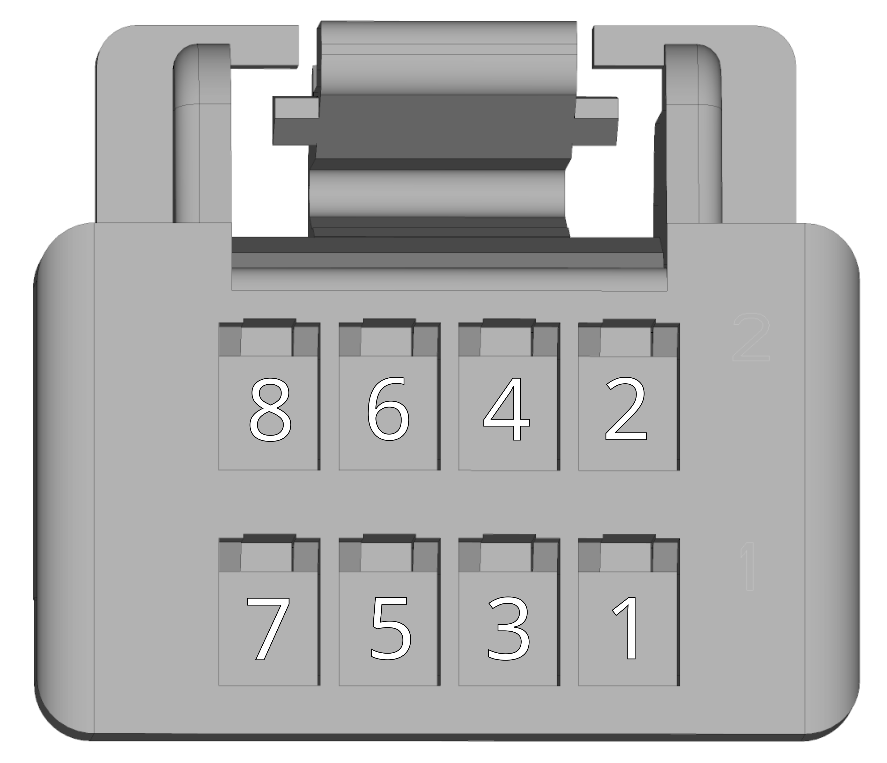

##3D náhled
{: style="width:70%;" }
 
 
{: style="width:70%;" }

##Popis komunikace, vstupů/výstupů a ovládání:
###Komunikační rozhraní
- Ethernet 100/1000 Mb/s s UDP protokolem, určen pro záznam parametrů, monitorování, testování, ale také online ovládání.
- CAN bus protokol lze upravit podle požadavků zákazníka.
- Ethernet 100/1000 Mb/s s volitelným protokolem, naprogramovaný v hradlovém poli a určený pro připojení rychlých průmyslových sběrnic pro řízení v reálném čase.
  V současné době je toto rozhraní vybaveno protokolem EtherCAT (pouze pro standardní firmware); podle požadavků zákazníka lze upravit na jiný typ protokolu.
- RS422 / RS485, přenos dat přes nepoužívané rozhraní zpětné vazby servomotoru.
  Může být použit pro komunikaci se zařízeními založenými na standardu RS422 nebo RS485 (enkodér, gyroskop, nadřazené řízení, jiný systém atd.).
  Toto rozhraní umožňuje vysokorychlostní komunikaci až 20 Mbit/s.
  
###Vstupy / výstupy
Vestavné servozesilovače TGZ v tomto provedení mají 8 digitálních vstupů, 6 digitálních výstupů, 2 vstupy pro teplotní čidlo PT1000, jeden obecný analogový vstup 0-10 V a 3 vstupy pro připojení Hall čidel (1 osa).
Tyto vstupy/výstupy je možné číst/ovládat pomocí uživatelského programu (jazyk C).
Digitální výstupy lze ovládat i přes ovládací servisní software TGZ GUI.

| I/O     | Typ              | Počet | Hodnota                                             |
|---------|------------------|--------|----------------------------------------------------|
| vstup   | analogový        | 1      | 0-10 V                                             |
| vstup   | termistor        | 2      | standard PT1000                                    |
| vstup   | Hall             | 3      | 5-30 V 										   |
| vstup   | izolovaný digitální | 8   | 0-24 V (0-10 V low/13-24 V high), 10 mA          |
| výstup  | izolovaný digitální | 6   | 5-24 V, 300 mA / max. výstup                     |

Servozesilovač má čtyři zpětnovazební rozhraní, které mají široké využití.
Kromě zpětné vazby motoru je lze použít k připojení zařízení pracujících na principu standardu RS422 nebo RS485.

| Typ   | Standard              | Rozhraní                         | Příklady připojení možných zařízení                                                                                               |
|-------|-----------------------|----------------------------------|-----------------------------------------------------------------------------------------------------------------------------------|
| FB1   | RS422/RS485           | Hiperface DSL, EnDat 2.2, SSI, BISS | Absolutní magnetický / optický enkodér, inkrementální magnetický / optický enkodér s Hallovými senzory [^2], gyroskop              |
| FB2   | RS422/RS485           | Hiperface DSL, EnDat 2.2, SSI, BISS | Absolutní magnetický / optický enkodér, inkrementální magnetický / optický enkodér s Hallovými senzory [^2], gyroskop              |
| FE[^1]   | RS422/RS485           | Hiperface DSL, EnDat 2.2, SSI, BISS | Absolutní magnetický / optický enkodér, inkrementální magnetický / optický enkodér s Hallovými senzory [^2], gyroskop              |
| FB3[^1]  | 2 × full-duplex RS422 | -                                | Řídicí systém                                                                                                                     |
| FB4    | Resolver				 | Analogový                              | Možnost připojení různých typů resolverů                                                                                     |

[^1]: Tento typ pracuje pouze s upraveným firmwarem. Jeho použití se doporučuje vždy konzultovat s výrobcem.
[^2]: Hallovy senzory musí být připojeny k digitálním vstupům pomocí speciálního převodníku úrovní, viz. [Převodník Hall-TGZ](../../../ETC/TGHall/md/description.md#TGhall_1).

- Hiperface DSL - digitální komunikace, senzory jsou vyráběny s rozlišením 15 až 24 bitů na otáčku (vícerychlostní provedení - 4 096 otáček).
  Tento typ zpětné vazby se používá pro motory s jediným konektorem nebo kabelem.
- EnDat 2.2 - digitální komunikace, senzory jsou vyráběny s rozlišením 18 až 25 bitů na otáčku (vícerychlostní provedení - 4 096 otáček).
- SSI - enkodéry se synchronním systémovým rozhraním.
- BISS - senzory s protokolem BISS-C.

###Řízení
Servozesilovače TGZ je možno řídit:

- digitální ovládání přes EtherCAT, CAN-bus (točivý moment, otáčky, polohové profily atd.) A přes Ethernet UDP protokol;
- uživatelský program (jazyk C) - digitální vstupy, analogové napětí atd.

##Konektory
___
### Strana komunikace/ethernet/ethercat
___

{: style="width:60%;" }

-   **X1 - Napájení řídicí části**

    ---
	Pohled zezadu (strana vodičů)   
	
	{: style="width:60%;" }   
	
	{: style="width:60%;" }	

-    Weidmüller BCZ 3.81/05/180F SN OR BX

	---

	--8<-- "md/X1_24V_5pin_BCZ.md"
	
	!!! warning "Odrušení přívodu"
	
		Věnujte prosím pozornost instalaci odrušovacího toroidu dle [návodu](../../../../source/md/logicPWR.md#LogicPWR_EMI).
		
-   **X16 - Zpětná vazba 4 - resolver**

    ---
    {: style="width:70%;" }
	
-   Molex ClikMate 5031490800 - doporučené krimpovací kontakty [Molex 502579](https://www.molex.com/en-us/part-list/502579) [^1]

	--8<-- "md/X16_RES_8pin_ClikMate.md"

-   **X11 - Zpětná vazba 3 - RS422**

    ---
    {: style="width:70%;" }
	
-   Molex ClikMate 5031491000 - doporučené krimpovací kontakty [Molex 502579](https://www.molex.com/en-us/part-list/502579) [^1]

    --8<-- "md/X11_FB3_10pin_ClikMate.md"
	
	!!! warning "Pozor"	
		Při použití tohoto typu zpětné vazby se ujistěte, že používáte vhodný TGZ firmware, který tyto funkce podporuje.

-   **X12 - Ethernet UDP - servisní**

    ---
    {: style="width:70%;" }
	
-   Molex ClikMate 5031490800 - doporučené krimpovací kontakty [Molex 502579](https://www.molex.com/en-us/part-list/502579) [^1]

    --8<-- "md/X12_UDP_8pin_ClikMate.md"

-   **X13 - EtherCAT 2 - Fieldbus out**

    ---
    {: style="width:70%;" }
	
-    Molex ClikMate 5031490800 - doporučené krimpovací kontakty [Molex 502579](https://www.molex.com/en-us/part-list/502579) [^1]

    --8<-- "md/X12_UDP_8pin_ClikMate.md"

-   **X14 - EtherCAT 1 - Fieldbus in**

    ---
    {: style="width:70%;" }
	
-    Molex ClikMate 5031490800 - doporučené krimpovací kontakty [Molex 502579](https://www.molex.com/en-us/part-list/502579) [^1]

    --8<-- "md/X12_UDP_8pin_ClikMate.md"

___
### Strana CAN/IO/SD
___

{: style="width:60%;" }

-   **X7 - Hall + Analogové vstupy**

    ---
	{: style="width:70%;" }

-    Molex ClikMate 5031491200 - doporučené krimpovací kontakty [Molex 502579](https://www.molex.com/en-us/part-list/502579) [^3]

	---

	--8<-- "md/X7_AIN_HALL_12pin_ClikMate.md"
	
	Popis funkce [Hallových vstupů](../../../../source/md/commonHW_UNIR_HALL.md#common_UNIR_HALL_usage) naleznete v sekci [Společný HW](../../../../source/md/commonHW_UNIR_HALL.md#common_UNIR_HALL_desc).	

-   **X8 - Digitální I/O**

    ---
	{: style="width:100%;" }

-    Molex ClikMate 5031491800 - doporučené krimpovací kontakty [Molex 502579](https://www.molex.com/en-us/part-list/502579) [^1]

	---

	--8<-- "md/X8_DIO_18pin_ClikMate.md"
	
	Detailní soupis parametrů 
	[digitálních vstupů DI1-8](../../../../source/md/commonHW_DI_RI.md#commonDI1-8_RI) a
	[digitálních výstupů DO1-6](../../../../source/md/commonHW_DO.md#commonDO1-6) 
	naleznete v sekci [Společný HW](../../../../source/md/commonHW_DI_RI.md#commonDI1-8_RI).
		
-   **X9 - MicroSD slot**

    ---
	{: style="width:40%;" }

-   V servozesilovačích typu "RI" není primárně doporučeno používat microSD slot u zařízení, kde se předpokládají velké vibrace.
	SD karta není u těchto verzí součástí dodávky.
	Pro více informací ohledně SD karet navštivte sekci [SD karty](../../TGZ_SW/SD/md/SD.md#SDparams).

-   **X10 - CAN**

    ---
	
	{: style="width:70%;" }

-    Molex ClikMate 5031490800 - doporučené krimpovací kontakty [Molex 502579](https://www.molex.com/en-us/part-list/502579) [^1]

    ---

	--8<-- "md/X10_CAN_8pin_ClikMate.md"
	
-	**LED displej**

	---
	
	{: style="width:60%;" }
	
-	LED displej signalizuje stavy viz. [Význam stavových indikátorů TGZ](../../TGZ_SW/LED/md/description.md#LED_sigs)

-	**LED signalizace**

	---
	
	{: style="width:100%;" }
	
-	LED diody

	---
	
	--8<-- "md/LEDsigAx12.md"
	
	Kompletní popis významu stavových LED diod naleznete zde: [Význam stavových indikátorů TGZ](../../TGZ_SW/LED/md/description.md#LED_sigs)

   
___
### Strana FB/motor
___

{: style="width:60%;" }

-   **X4 - Externí enkodér (FBE)**

    ---
	
	{: style="width:80%;" }

-    Molex ClikMate 5031491200 - doporučené krimpovací kontakty [Molex 502579](https://www.molex.com/en-us/part-list/502579) [^1]

	---

	--8<-- "md/X4_FBE_12pin_ClikMate.md"
	
	Další informace ohledně externí zpětné vazby naleznete v sekci [Zpětná vazba FBE](../../../../source/md/commonHW_FBE.md#commonFBE).

-   **X5 - Zpětná vazba - osa 1**

    ---
	
	{: style="width:80%;" }

-    Molex ClikMate 5031491000 - doporučené krimpovací kontakty [Molex 502579](https://www.molex.com/en-us/part-list/502579) [^1]

    ---

	--8<-- "md/X5_FB1_10pin_ClikMate.md"
	
	Další informace ohledně zpětné vazby 1 naleznete v sekci [Zpětná vazba FB1, FB2](../../../../source/md/commonHW_FB12.md#commonFB12).
	
	!!! warning "Upozornění"
		Aby bylo možné použít typ zpětné vazby Hiperface DSL, uživatel musí propojit piny 5-7 a 6-8 konektoru FB1 nebo naletovat odpovídající propojky (rezistory) na řídicí desku TGZcontrol.
		Toto platí pro dodávky po 06-2024, kde není provedeno žádné interní spojení.
		Ověřte také, zda máte v zařízení nahrán správný firmware podporující zvolený typ zpětné vazby.
	
-   **X6 - Zpětná vazba - osa 2**

    ---
	
	{: style="width:80%;" }

-    Molex ClikMate 5031491000 - doporučené krimpovací kontakty [Molex 502579](https://www.molex.com/en-us/part-list/502579) [^1]

    ---

	--8<-- "md/X6_FB2_10pin_ClikMate.md"
	
	Další informace ohledně zpětné vazby 1 naleznete v sekci [Zpětná vazba FB1, FB2](../../../../source/md/commonHW_FB12.md#commonFB12).
	
	!!! warning "Upozornění"
		Aby bylo možné použít typ zpětné vazby Hiperface DSL, uživatel musí propojit piny 5-7 a 6-8 konektoru FB2 nebo naletovat odpovídající propojky (rezistory) na řídicí desku TGZcontrol.
		Toto platí pro dodávky po 06-2024, kde není provedeno žádné interní spojení.
		Ověřte také, zda máte v zařízení nahrán správný firmware podporující zvolený typ zpětné vazby.

	!!! note "Poznámka"
	
		Servozesilovač TGZ-400 je jednoosý. Konektor X6 se běžně nezapojuje.
	
-   **X3.1 - Motorový konektor**

    ---
	
	{: style="width:70%;" }
	
	Servozesilovač je vybaven vylepšeným obvodem ovládání statické motorové brzdy.
	Více informací ohledně nastavení důležitých parametrů naleznete v sekci [Chytrá brzda](../../../../source/md/commonHW_SmartBrake.md#SmartBrakeDesc).

-   Weidmüller BLZ 7.62HP/06/180F

    ---

	--8<-- "md/X4_M1_6pin_SLS.md"

	!!! warning "Orientace konektoru"
	
		Pozor na správnou orientaci konektoru při zapojování kabeláže.	
	
-   **X2 - Napájení silové části**

    ---
	
	{: style="width:100%;" }
	
	Konektor X2 je standardně dodáván včetně propojovacích vodičů v konfiguraci pro použítí interního brzdného odporu.
	
	{: style="width:100%;" }   
	
	V případě použití externího brzdného rezistoru je nutné odstranit propojovací vodiče a rezistor připojit dle [schématu](schematic.md).

	Piny 2, 3 a 4 konektoru X2 (na krytu značeno DCin) jsou rovnocenné vstupy pro + pól silového napájení servozesilovače. Stačí použít pouze jeden z nich.
	Napájení silové části se ve většině případů nedoporučuje připojit na pin 8 (na krytu značeno +DC), protože se jedná o případný výstup +DC napájení za insterním modulem softstart. Zůstává tedy nezapojen.
	
	!!! warning "Napětí na nezapojených pinech"
	
		Na nezapojených pinech DCin a +DC je při provozu servozesilovače plné napájecí napětí.

-    Weidmüller  BLZ 7.62HP/12/180F

    ---

	--8<-- "md/X2_PWR_DC_12pin_BLZ.md"
	

[^1]: Při krimpování a zapojování konektorů systému Molex Clik-Mate postupujte dle [Aplikačního návodu Molex Clik-Mate](https://www.molex.com/content/dam/molex/molex-dot-com/products/automated/en-us/applicationspecificationspdf/503/503149/AS-503149-001-001.pdf) a použijte krimpovací nástroj [2002187400](https://www.molex.com/en-us/products/part-detail/2002187400).
