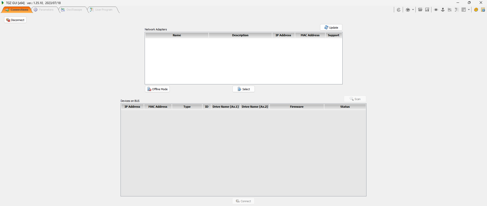

##Získání aplikace
Pro nastavení servozesilovače slouží ovládací a servisní software aplikace **TGZ GUI**.
Současně je zde umožněno monitorování parametrů servozesilovače TGZ.
Software **TGZ GUI** lze stáhnout [ZDE](https://www.tgdrives.cz/fileadmin/user_upload/download-TGZ/TGZ_GUI.zip)

##Instalace a spuštění {#GUIstart}
**Instalace TGZ GUI:**   
Ovládací software TGZ GUI nevyžaduje zvláštní instalaci, program stačí pouze nakopírovat na disk, je však nutno zachovat strukturu podadresářů.   

**Spuštění programu:**   
Spuštění TGZ GUI se provede dvojklikem na spouštěcí ikonu programu `TGZ_GUI.exe`. Spuštěné okno aplikace pak vypadá následovně:
{: style="width:100%;" }

Spuštěné okno ovládacího software TGZ GUI má tři základní záložky - **Connections, Parameters a Oscilloscope**, k jejichž aktivování dojde vždy kliknutím na příslušnou záložku.
V pravé horní části okna se pak nachází celkem 11 programových ikon   

{: style="width:40%;" }

, jejichž funkce jsou popsány níže:

-   **REFRESH PARAMETERS**

    ---
	{: style="width:10%;" }

-	Umožňuje znovunačtení uložených parametrů (např. z paměťové karty).

-   **DEVICE MEMORY**

    ---
	{: style="width:10%;" }

-    Umožňuje uložení a načtení parametrů z paměťové karty, výchozí nastavení, restart servozesilovače a přehrání firmware.

-   **LOAD PARAMETERS FROM FILE**

    ---
	{: style="width:10%;" }

-	Umožňuje načtení parametrů ze souboru.

-   **SAVE PARAMETERS TO FILE**

    ---
	{: style="width:10%;" }

-	Umožňuje uložení parametrů do souboru.

-   **MONITORING**

    ---
	{: style="width:10%;" }

-	Umožňuje vyvolání / skrytí nabídky v pravé části (základní informace o jednotlivých osách servozesilovače a sledování aktuálních hodnot vybraných parametrů).

-   **SERVICE MOTION**

    ---
	{: style="width:10%;" }

-	Umožňuje testovací ovládání servomotoru v různých řežimech přímo z TGZ GUI

-   **OSCILLOSCOPE**

    ---
	{: style="width:10%;" }

-	aktivuje záložku *Oscilloscope* jako samostatné okno.

-   **USER PROGRAM**

    ---
	{: style="width:10%;" }

-	Aktivuje záložku *External User Program* jako samostatné okno. Zde je možné spustit libovolný uživatelský testovací program.

-   **LAYOUT**

    ---
	{: style="width:10%;" }

-	Umožňuje načíst/uložit rozložení panelů a oken programu TGZ GUI.

-   **CONFIGURATION**

    ---
	{: style="width:10%;" }

-	Umožňuje nastavení TGZ GUI (komunikace, typ výstupních dat z osciloskopu, jazykové nastavení).

-   **SYSTEM MESSAGES**

    ---
	{: style="width:10%;" }

-	Zobrazí výpis systémových zpráv aplikace.

