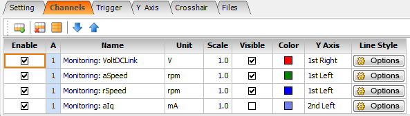
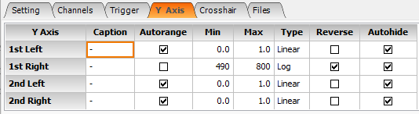
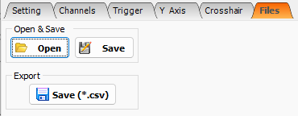
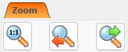

V záložce **Oscilloscope** je možné zaznamenávat průběhy vybraných parametrů servozesilovače TGZ v závislosti na čase.
Níže je znázorněno pracovní okno osciloskopu:

{: style="width: 100%;" }

V dolní části okna se pak nachází další záložky, které slouží k podrobnějšímu nastavení.

-   **SETTING**

    ---
    {: style="width: 85%;" }

-	Slouží k nastavení časové osy (počet period záznamu, druh záznamu - jednorázový, kontinuální, atd.).

-   **CHANNELS**

    ---
    {: style="width: 85%;" }

-	Výběr parametrů pro záznam na osciloskopu (u veličin umožňuje zvolit jednotky zvlášť pro pravou i levou osu Y, nastavit měřítko, barvu a tloušťku grafu, viditelnost atd.).

-   **TRIGGER**

    ---
    {: style="width: 85%;" }

-	Umožňuje nastavení spouštění záznamu grafického průběhu vybrané veličiny v požadovaném okamžiku nastavením očekávané hodnoty (VALUE) a poměru časového intervalu před spuštěním záznamu (PRETRIGGER) v procentech.

-   **Y AXIS**

    ---
    {: style="width: 85%;" }

-	Umožňuje nastavení parametrů pravé a levé osy Y (popisy os, rozsahy hodnot, typ).

-   **CROSSHAIR**

    ---
    {: style="width: 85%;" }

-	Zpřístupní funkci měření hodnot přímo v grafu včetně různých druhů výpočtů (např. efektivní hodnota dané veličiny a jiné).

-   **FILES**

    ---
    {: style="width: 85%;" }

-	Umožňuje umožňuje import a export dat osciloskopu.

-   **CONTROL**

    ---
    {: style="width: 50%;" }

-	Ovládání záznamu, tlačítkem RECORD dojde ke spuštění záznamu, tlačítkem STOP k zastavení záznamu.

-   **ZOOM**

    ---
    {: style="width: 50%;" }

-	Možnosti nastavení velikosti zobrazení

