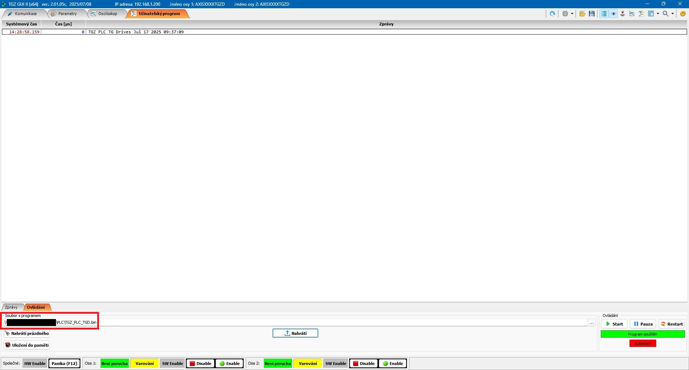
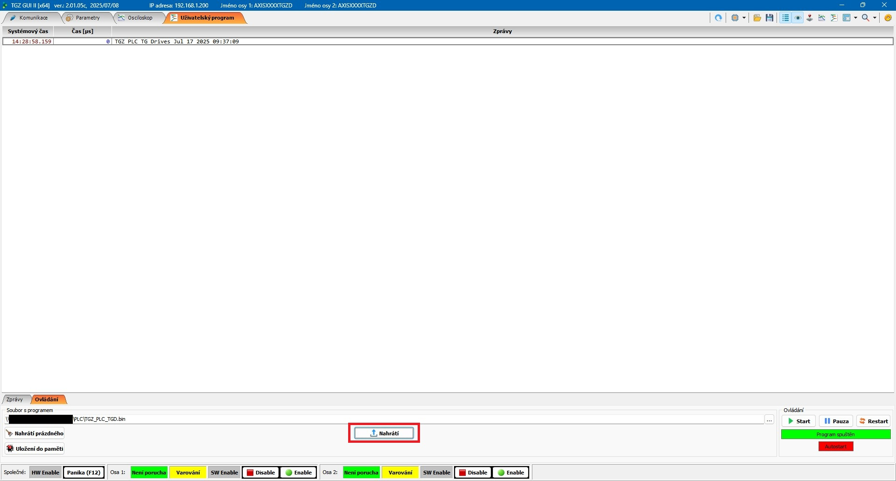
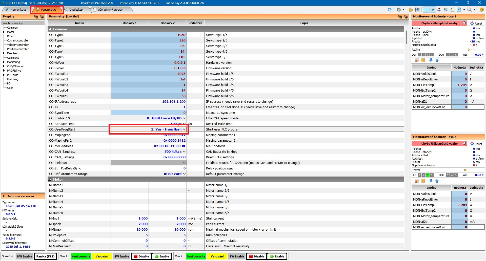

The TGZ GUI application allows for the execution of a user-defined test program. You can develop this program in environments such as **Visual Studio** or **Code::Blocks**.

---

## Running a User Program

To run a user program, follow these steps:

Connect to the **TGZ device** where you want to upload the PLC program using **TGZ GUI II**.
In the upper section of the application, navigate to the **User Program** tab.

{: style="width:100%;" }

In the lower section of the application, select the **Control** tab.

{: style="width:100%;" }

Under this tab, locate the **File with program** field.

{: style="width:100%;" }

Click the **"…"** button at the end of the line.

{: style="width:100%;" }

Select the desired **PLC file** and confirm your selection.
The path to the chosen PLC file will now appear in the **Program file** field.

{: style="width:100%;" }

Click the **Upload** button.

{: style="width:100%;" }

A message indicating the successful upload of the PLC will be displayed.

{: style="width:100%;" }

If the upload is successful and no issues occur, the text in the **Control** section at the bottom right corner will change from "Program is not loaded" to "**Program started**," and the buttons, along with the text background, will change colors.

{: style="width:100%;" }

Finally, click the **Save to Memory** button to save the PLC to the device's flash memory.

{: style="width:100%;" }

---

## Parameter Settings

To configure parameters for the user program:

In the upper section of the TGZ GUI, select the **Parameters** tab.

{: style="width:100%;" }

In the dropdown menu for the **`CO-UserProgStart`** parameter,

{: style="width:100%;" }

Select the option **"1: Yes – from flash"** if you want the PLC to start automatically when the device powers on.

{: style="width:100%;" }