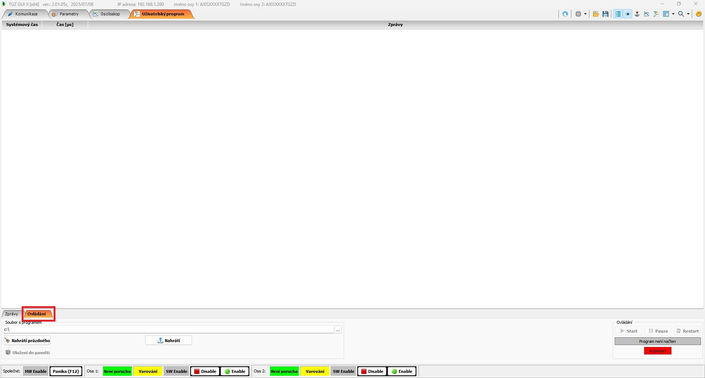
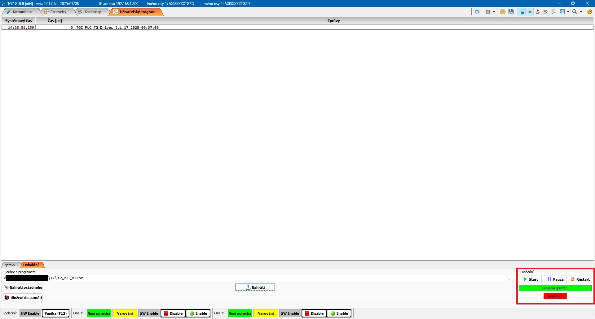
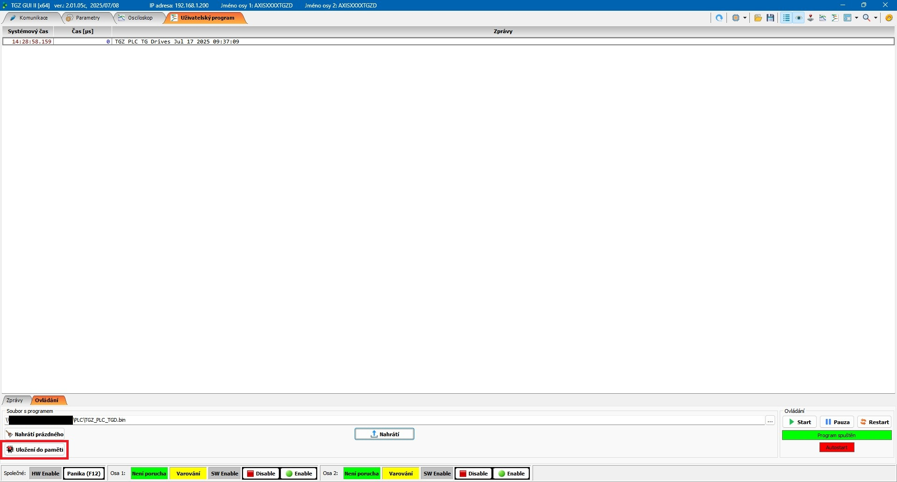
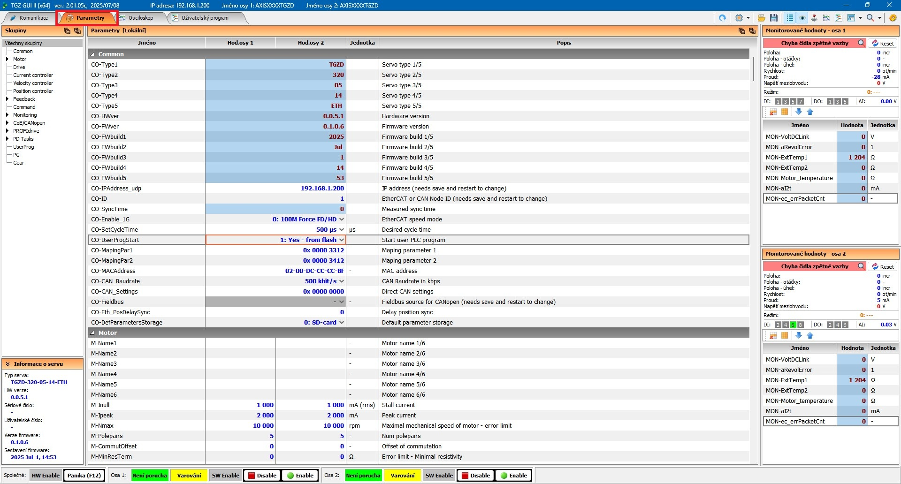
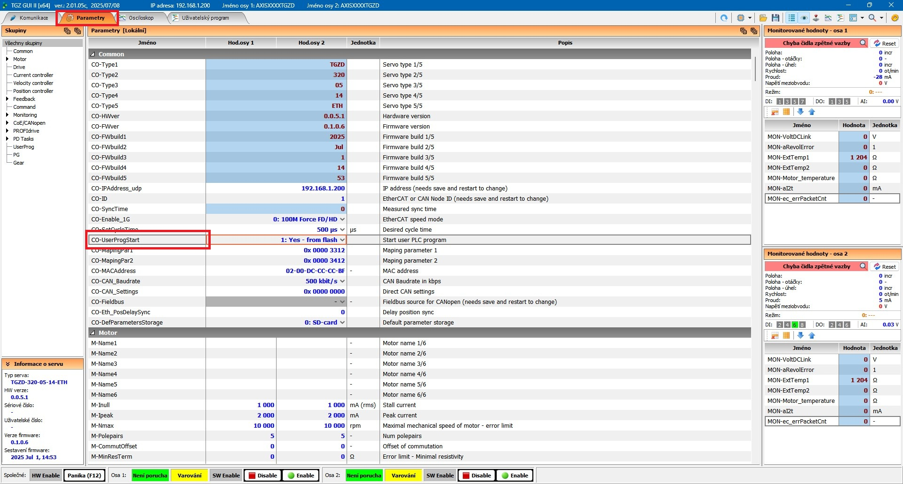

V programu **TGZ GUI** je možné spustit testovací uživatelský program. Jeho tvorba je možná například v prostředí **Visual Studio** či **Code::Blocks**.

---

## Popis spuštění uživatelského programu

Připojte se pomocí **TGZ GUI II** k zařízení **TGZ**, do kterého chcete nahrát **PLC**.

V horní části programu v záložkách zvolte záložku **`Uživatelský program`**.

{: style="width:100%;" }

V dolní části programu zvolte záložku **`Ovládání`**.

{: style="width:100%;" }

Pod touto záložkou v poli **`Soubor s programem`**

{: style="width:100%;" }

stiskněte na konci řádku tlačítko **`…`**.

{: style="width:100%;" }

Vyberte požadované **PLC** a volbu potvrďte. Nyní se v poli **`Soubor s programem`**

{: style="width:100%;" }

objeví cesta k vybranému **PLC**.

Stiskněte tlačítko **`Nahrátí`**.

{: style="width:100%;" }

Nyní se objeví zpráva nahraného **PLC**.

{: style="width:100%;" }

Pokud vše proběhlo v pořádku a nedošlo k žádnému problému, text v pravém dolním rohu v části **`Ovládání`**

{: style="width:100%;" }

se změní z **`Program není načten`** na **`Program spuštěn`** a tlačítka, včetně pozadí textu, změní barvy.

Nyní stiskem tlačítka **`Uložení do paměti`**

{: style="width:100%;" }

uložíte **PLC** do flash paměti zařízení.

---

## Nastavení parametrů

V horní části **TGZ GUI** zvolte záložku **`Parametry`**.

{: style="width:100%;" }

V rozbalovací nabídce parametru **`CO-UserProgStart`**

{: style="width:100%;" }

vyberte možnost **`1: Yes – from flash`**

{: style="width:100%;" }

, pokud chcete, aby se **PLC** automaticky spustilo při startu zařízení.