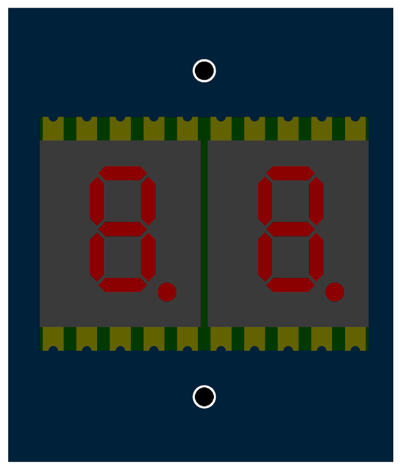

##Meaning of LED indicators and status display {#LED_sigs}
{: style="width:25%;" }

Integrated LED indicators and a two-digit seven-segment LED display show the status of the servo amplifier when the 24V power supply is switched on.
There are always two LED indicators on the servo amplifier (red LED and green LED) for each controlled axis, they detect the status of the individual controlled axes and if a fault or error occurs, the corresponding fault codes are displayed on the status display.
There is also a EtherCAT status LED common to both axes next to TGZ status LEDs.
Possible states of the LED indicators and their meaning, as well as error signaling and their description, are listed in the tables below.
**After restart of servo amplifier TGZ**

| Error code | Description |
|---|---|
| Bu | date and time of Firmware creation |
| iP | IP address of the TGZ servo amplifier for the UDP protocol |
| id | TGZ servo amplifier identification (“slave alias” for EtherCAT) |

**Error / fault indication**

| Chybový kód | Popis |
|---|---|
| F.1 | axis 1 error |
| F.2 | axis 2 error |

After code F.1 (or F.2), a sequence of numbers is displayed - these numbers are bit numbers in the error register.
Their description is given in chapter [Description of drive errors](description.md#errors)

** LED indicators**   

{: style="width:70%;" }

Possible servo amplifier states are indicated by the **Ready** and **Error** LED diodes:   

| Drive state                 | Red LED state | Green LED state     |
|-----------------------------|---------------|---------------------|
| Mode = 0 (off)              | Flashing      | Flashing            |
| Drive error                 | ON            | OFF                 |
| Drive ready, no HW ENABLE   | OFF           | Slow blinking       |
| Drive ready, HW ENABLE on   | OFF           | Blinking            |
| Drive ready and enabled     | OFF           | ON                  |

If the servo amplifier is loaded with suitable firmware with EtherCAT bus support, the bus status is indicated by the **ECAT RUN** LED.
A detailed description of the individual EtherCAT states can be found in the documentation [EtherCAT Indicator and Labeling - ETG.1300 S](https://www.ethercat.org/memberarea/download/ETG1300_V1i1i1_S_R_IndicatorLabelingSpecification.pdf).

| Indicator States | Device State       | Description                           |
|------------------|--------------------|---------------------------------------|
| Off              | INITIALISATION     | Device is in INIT state               |
| Blinking         | PRE-OPERATIONAL    | Device is in PRE-OPERATIONAL state    |
| Single flash     | SAFE-OPERATIONAL   | Device is in SAFE-OPERATIONAL state   |
| On               | OPERATIONAL        | Device is in OPERATIONAL state        |

##Description of drive errors {#errors}

| Error Type                  | `aDriveError` Register Value | Error Number on Display | Error Description / Possible Cause / Solution |
|-----------------------------|------------------------------|-------------------------|-----------------------------------------------|
| Internal Error              | 0x00000004                   | 02                      | **Cause**: Internal hardware error. **Solution**: Contact device supplier (service). |
| Overvoltage                 | 0x00000008                   | 03                      | DC link voltage (connector X2) is too high. **Cause 1**: Power supply (DC) is poorly sized, misconfigured, or faulty. **Solution 1**: Check the power supply and its parameters. **Cause 2**: Regenerative energy of the servo drive is higher than the power supply can absorb. **Solution 2a**: Increase the deceleration ramp value. **Solution 2b**: Connect a different power supply or connect appropriate braking resistors. **Cause 3**: Low value of parameter D - VoltDCLinkMaxErrLim. **Solution 3**: Adjust the value of D - VoltDCLinkMaxErrLim. |
| Undervoltage                | 0x00000010                   | 04                      | DC link voltage (connector X2) is too low. **Cause 1**: Power supply (DC) is not connected, faulty, switched off, or insufficiently powered. **Solution 1**: Check the power supply. **Cause 2**: High value of parameter D - VoltDCLinkMinErrLim. **Solution 2**: Adjust the value of D - VoltDCLinkMinErrLim. **Cause 3**: Short circuit in the DC link. **Solution 3**: Contact device supplier (service). |
| STO Diagnostic Error        | 0x00000020                   | 05                      | Diagnostics detected an error in the Safe Torque Off (STO) circuits. **Cause**: Internal hardware error. **Solution**: Contact service department. |
| Static Brake Error          | 0x00000040                   | 06                      | Diagnostics detected a static brake error. **Cause 1**: Brake is disconnected or parameter M-StaticBrake in TGZ GUI is incorrectly set. **Solution 1a**: Verify motor type and set parameter M-StaticBrake accordingly. **Solution 1b**: Check brake cable connections and brake power connections on the drive. |
| Current Measurement Error   | 0x00000100                   | 08                      | Motor current measurement circuits are faulty. **Cause**: Internal hardware error. **Solution**: Contact service department. |
| Motor Overheated            | 0x00000200                   | 09                      | Motor is overheated. **Cause 1**: Ambient temperature is too high or cooling conditions are inadequate. **Solution 1**: Consider improving cooling conditions. **Cause 2**: Motor is overloaded. **Solution 2**: Verify drive sizing and motor parameter settings according to motor manufacturer's data. **Cause 3**: Temperature sensor wiring error. **Solution 3**: If possible, check the temperature sensor wiring, or contact service department. **Cause 4**: Parameter settings error. **Solution 4**: Verify temperature limit settings and consult with service department. Check motor parameters according to manufacturer data. **Cause 5**: Mechanical or electrical fault in the motor. **Solution 5**: Contact service department. |
| Servo Amplifier Overheated  | 0x00000800                   | 11                      | TGZ servo amplifier is overheated. **Cause 1**: Ambient temperature is too high or cooling conditions are inadequate. **Solution 1**: Consider improving cooling conditions. **Cause 2**: Parameter settings error. **Solution 2**: Verify temperature limit settings. **Cause 3**: Servo amplifier fault. **Solution 3**: Contact service department. |
| Feedback Error              | 0x00001000                   | 12                      | Position feedback error. **Cause 1**: Wiring and connector error. **Solution 1**: Check and repair wiring and connectors X6, X7. **Cause 2**: Motor position sensor fault. **Solution 2**: Contact service department. **Cause 3**: Servo amplifier circuit error. **Solution 3**: Contact service department. |
| Speed Exceeded              | 0x00004000                   | 14                      | Speed measured by position sensor is greater than parameter M-Nmax. **Cause 1**: Incorrectly set parameter M-Nmax. **Solution 1**: Adjust parameter according to motor manufacturer's data. **Cause 2**: Misconfigured speed controller. **Solution 2**: Adjust speed and subsidiary controller settings to avoid oscillation. **Cause 3**: Position (speed) measurement error. **Solution 3**: Contact motor supplier's service department. |
| Position Error              | 0x00008000                   | 15                      | Deviation of the desired and actual position of the position controller exceeded the set limit. **Cause 1**: Improperly set control structure parameters. **Solution 1**: Review and adjust controller settings within the work cycle to minimize oscillation and position error. **Cause 2**: Servo amplifier cannot deliver the required torque to maintain the desired position. There may be a mechanical fault in the driven system. **Solution 2**: Verify drive sizing for dynamics and torque. Adjust system acceleration and deceleration if necessary. Check for mechanical faults in the driven system, such as excessive friction or mechanical stops. |
| Trajectory Error            | 0x00010000                   | 16                      | Deviation of the desired position from the master system (EtherCAT) exceeded the set limit. **Cause 1**: Discontinuity in position data sent by the master system. **Solution 1**: Contact the master system supplier. **Cause 2**: Related to position error. **Solution 2**: See **Solution** for position error. |
| Fieldbus Error              | 0x00020000                   | 17                      | Valid data did not arrive via the fieldbus within the specified time. **Cause 1**: Wiring fault. **Solution 1**: Check wiring and connectors. **Cause 2**: Master system fault. **Solution 2**: Contact the master system supplier. **Cause 3**: Servo amplifier hardware error. **Solution 3**: Contact service department. |
| Parameter Error             | 0x00040000                   | 18                      | Parameter set verification error. **Cause**: Incorrect parameter set. **Solution**: Contact device supplier. |
