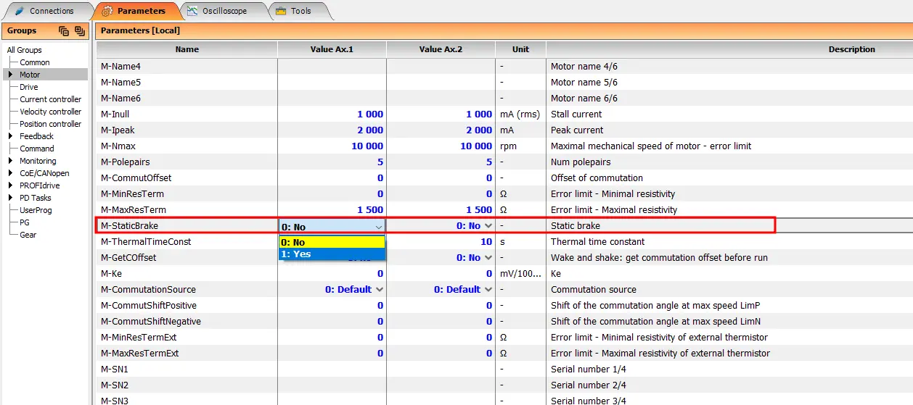

##Function Description {#StandardBrakeDesc}
If the TGZ servo drive is equipped with the standard static motor brake control function, it includes the brake activation/deactivation circuitry along with fault diagnostics.
This function does not reduce the static brake’s power consumption. Therefore, the brake excitation voltage remains equal to the supply voltage VCCBR for the entire time the brake is engaged.

##Configuration and Control {#StandardBrakeUsage}
The user can enable the static brake control function in the program [TGZ GUI](../../CZ/TGZ/TGZ_SW/GUI/md/intro.md#GUIstart).
This is the `M-StaticBrake` parameter in the `Motor` section.
{: style="width:100%;" }
Brake control can be enabled individually for each controlled axis.

Additionally, user can set the following brake delay parameters in the `Drive` section:

|  Parameter No. |  Name |  Label in TGZ GUI | Unit | Range | Description |
| :---: | :---: | :---: | :---: | :---: | :---: |
| 1 |  τDUE  | `D-DelayUnbrake_Enable` | 0.1 ms | 0.1 ~ 1e8 ms  | delay between enabling the servo drive and releasing the brake |
| 1 |  τDDB  | `D-DelayDisable_Brake` | 0.1 ms | 0.1 ~ 1e8 ms  | delay between engaging the brake and disabling the servo drive |

Before using the brake switching function, make sure that:

1.    The `M-StaticBrake` parameter is enabled (see above).
2.    The brake supply within the permitted range is present at terminal VCCBR.
3.    The power supply is sufficiently rated and meets or exceeds the brake power requirement, including a potential inrush peak at the moment the brake is energized (excited).
4.    The static brake is correctly connected to the servo drive at terminals BR+ and BR- (sometimes labeled B+ and B-); see the recommended wiring diagram for the specific TGZ servo drive. Observe the brake polarity.

If the brake cannot be actuated, or the servo drive reports **Holding brake error**, verify that:

1.    The power supply connected to VCCBR has the correct polarity, voltage level, and is stable.
2.    The wiring (from the supply to the power connector, the brake connection output, potential polarity reversal, etc.) is correct.
3.    The electrical resistance of the brake (excitation coil) is within tolerance for the given brake type.
4.    When the brake is connected directly to an independent voltage source of suitable level, it can be activated/deactivated and its current draw matches expectations.

##Parameters {#StandardBrakeParams}
The limiting parameters of the brake switch are listed in the table:

|  Parameter No. |  Name |  Unit | Range | Description |
| :---: | :---: | :---: | :---: | :---: |
| 1 |  VCCBR  | V | 12 ~ 30 | Brake circuit supply voltage |
| 2 |  IOUT,MAX @ 25°C  | A | 2.5 | Maximum brake output current |
| 3 |  IOUT,PK,MIN @ 25°C  | A | 3 | Output current under overload, above which the switch begins to internally limit overload/short-circuit current |

!!! warning "Maximum Brake Output Current"

    The maximum output current is not a fixed value and depends on many factors, e.g., servo drive temperature, brake winding resistance, etc.

##Fault Detection {#StandardBrakeErrors}
When all conditions for proper static brake operation are met, the TGZ servo drive signals two fault conditions:

1.    Detection of a disconnected load/brake even when the brake is not energized but the `M-StaticBrake = 1` parameter is enabled.
2.    Overload/overtemperature of the brake switching circuit.

In both cases, the **Holding brake error** appears for the respective axis in the program [TGZ GUI](../../CZ/TGZ/TGZ_SW/GUI/md/intro.md#GUIstart).