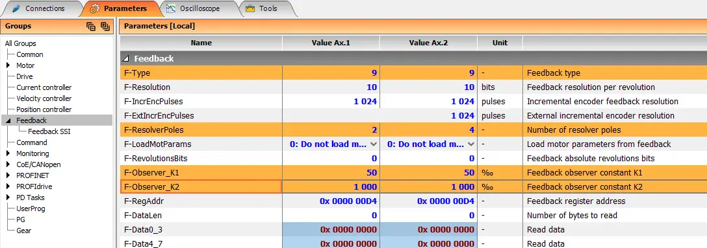
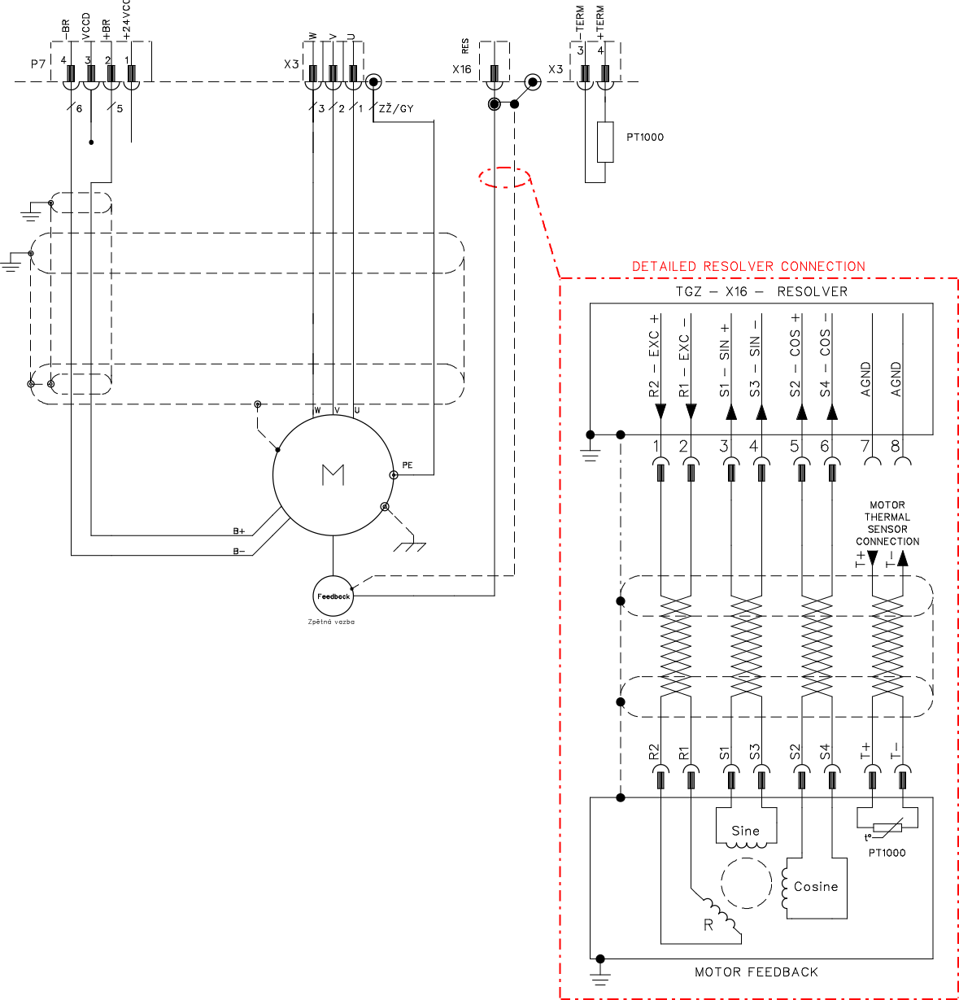

## General Description {#common_UNIR_RES_desc}
The TGZ servo drive in the **UNIR** variant provides a resolver feedback input on connector **X16**.
This is a non-isolated input intended for connection of a single resolver.

## Usage {#common_UNIR_RES_usage}
The servo drive automatically adjusts the resolver excitation voltage within a range of 1 ~ 7.5VRMS, as well as the excitation frequency within a range of 2 ~ 20 kHz.
In the TGZ_GUI configuration software, it is only necessary to correctly configure the highlighted parameters in the **Feedback** group.

{: style="width:80%;" }   

--8<-- "md/X16_commonHW_RES_tab.en.md"

## Connection Example {#common_UNIR_RES_schematic}
A connection example is provided in the "Connection Example" section of each applicable TGZ device supporting this functionality (UNIR variants).

{: style="width:80%;" }

Proper shielding of the resolver cable should be ensured over its entire length whenever possible.
On the motor side, the cable shield is terminated inside the motor connector.
On the TGZ servo drive side, the shield should be terminated by connecting it to the servo drive/control cabinet chassis using the shortest possible path.
Shield termination on the servo drive side can be implemented, for example, by crimping the exposed cable shield into a cable lug and fastening it to the servo drive mounting profile.

{: style="width:80%;" }

!!! warning "Firmware"
	Make sure that the correct firmware is used for the selected feedback type.