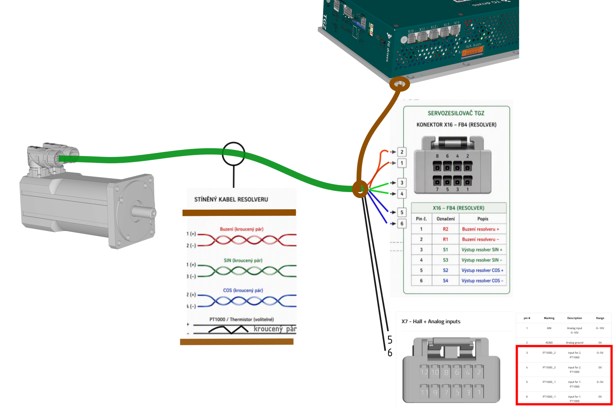

##Základní popis {#common_UNIR_RES_desc}
Servozesilovač TGZ má ve verzi **UNIR** na konektoru **X16** připraven vstup pro připojení polohové zpětné vazby typu resolver.
Jedná se o elektricky neoddělený vstup pro jeden resolver.

##Použití {#common_UNIR_RES_usage}
Úroveň buzení resolveru si servozesilovač nastaví automaticky v rozsahu 1 ~ 7,5VRMS, stejně jako frekvenci buzení v rozsahu 2~20 kHz.
V konfiguračním programu TGZ_GUI je pouze potřeba správně nastavit následující zvýrazněné parametry ve skupině **Feedback**.

{: style="width:80%;" }
   

--8<-- "md/X16_commonHW_RES_tab.md"

##Příklad zapojení {#common_UNIR_RES_schematic}
Příkad zapojení v sekci "Příklad zapojení" u každého odpovídajícího zařízeni TGZ, které tuto funkci podporuje (varianty UNIR).

{: style="width:80%;" }

Je důležité zajistit stínění kabelu resolveru pokud možno v celé jeho délce.
Na straně motoru je stínění zakončeno v motorovém konektoru, na straně servozesilovače TGZ je potřeba stínění zakončit připojením na šasi servozesilovače/rozváděče co nejkratší cestou.
Zakončení na straně servozesilovače lze provést např. zalisováním konce stínění do kabelového oka a jeho následního připojení na konstrukční profil zesilovače.

!!! warning "Firmware"
	Ujistěte se, že pro zvolený typ zpětné vazby používáte správný firmware.

