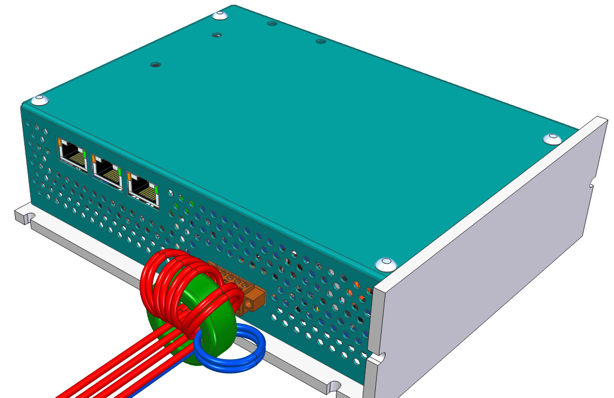
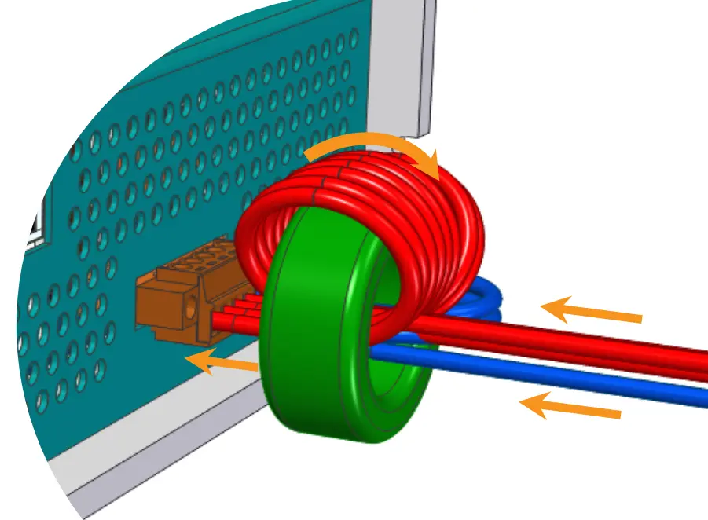
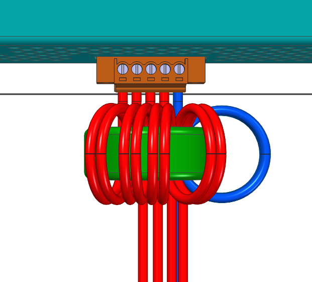

##EMI suppression {#LogicPWR_EMI}
From the perspective of reducing the emission of unwanted electromagnetic radiation 
and simultaneously increasing the device's resistance to this radiation coming to the servo amplifier 
from other sources of interference (such as other converters, contactors, regulators, etc.), 
it is advisable to install a common-mode choke in the form of a coil on a toroidal ferrite core on the 
power supply lines of the control power supply (typically at a level of 24 V). 
For TGZ servo amplifiers, where the toroidal core is part of the delivery, its use is strongly recommended, as shown in the image below:   

{: style="width:70%;" }
{: style="width:40%;" }   

All wires pass through the core in parallel. 
We recommend winding optimally 2-3 turns. 
Optional installation, where the STO wires do not pass through the core:   

{: style="width:40%;" }   

However, it is optimal to wind all wires, including STO&nbsp;A and STO&nbsp;B:   

{: style="width:40%;" }

!!! note "Turns count"

	In the example shown in the images above, 2 turns are wound. With precise work, it is usually possible to fit 3 turns onto the core, which further improves filtering.