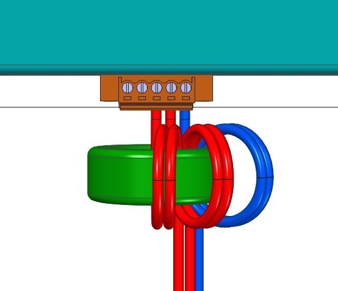
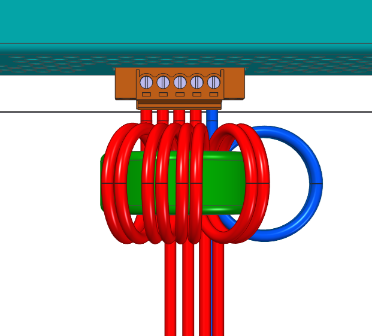

##Odrušení {#LogicPWR_EMI}
Z pozhledu snížení vyzařování nežádoucího elektromagnetického záření a zároveň zvýšení odolnosti zařízení proti tomuto záření přicházejícím k servozesilovači z jiných zdrojů rušení
(další měniče, stykače, regulátory atd.) je vhodné na vstup řídicího napájení (typicky úrovně 24&nbsp;V) instalovat na napájecí vodiče soufázovou tlumivku ve formě cívky na toroidním feritovém jádře.
U servozesilovačů TGZ, kde je toroidní jádro součástí dodávky je důrazně doporučeno jeho použití viz. obrázek níže:   

{: style="width:70%;" }
{: style="width:40%;" }   

Všechny vodiče procházejí jádrem souběžně. Doporučujeme navinout optimálně 2-3 závity. Volitelná instalace, kde jádrem neprochází vodiče STO:   

{: style="width:40%;" }   

Optimální je ale navinout všechny vodiče včetně STO&nbsp;A i STO&nbsp;B:   

{: style="width:40%;" }

!!! note "Počet závitů"

	Na příkladu viz. obrázky výše jsou namotány 2 závity. Při precizní práci se do jádra většinou vejdou i 3 závity, čímž se filtrace ještě zlepší.	